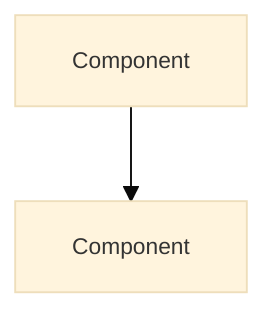

# Mermaid Diagrams

All diagrams **MUST** include theme config. No hardcoded colors. No ASCII art.

---

## Required Config Block



**Banned:** `style A fill:#hex` or any inline color styling.

**Exception:** `classDef` for layout only (no colors):

```mermaid
classDef cleanWide fill:none,stroke:none,text-align:left
```

---

## ASCII Art Ban

ESLint rule `no-ascii-art-diagrams` bans box-drawing: `┌┐└┘│─├┤┬┴┼`

Use Mermaid instead of ASCII diagrams.

- [ ] No `style X fill:#hex` statements
- [ ] No ASCII box-drawing characters
- [ ] `classDef` only for layout (no colors)
- [ ] Diagram type matches content purpose
