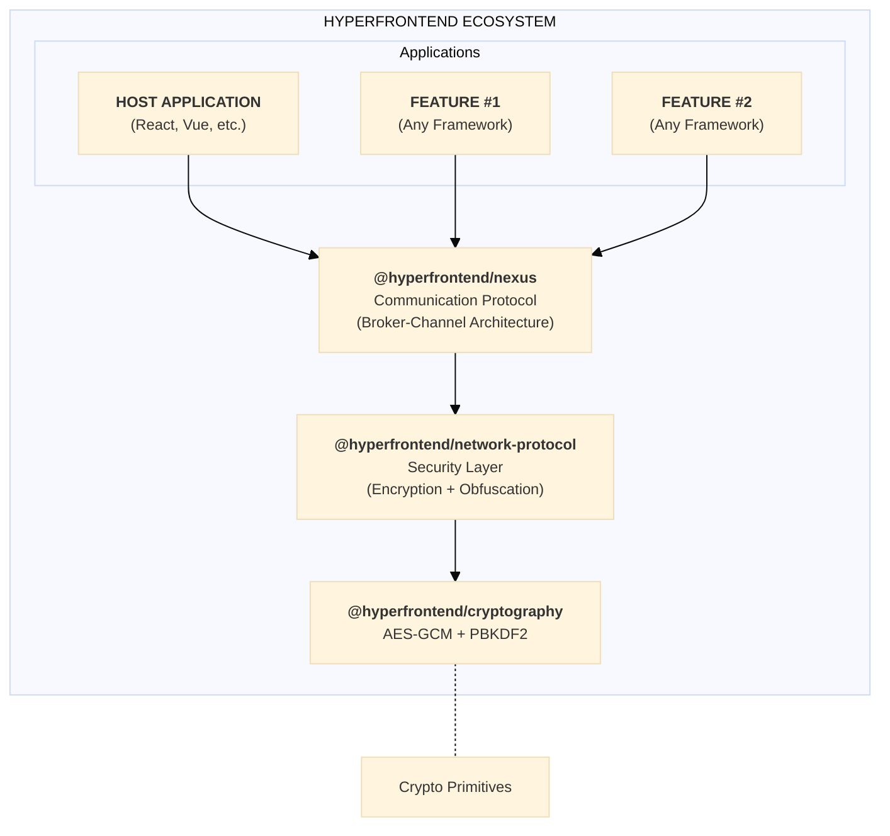
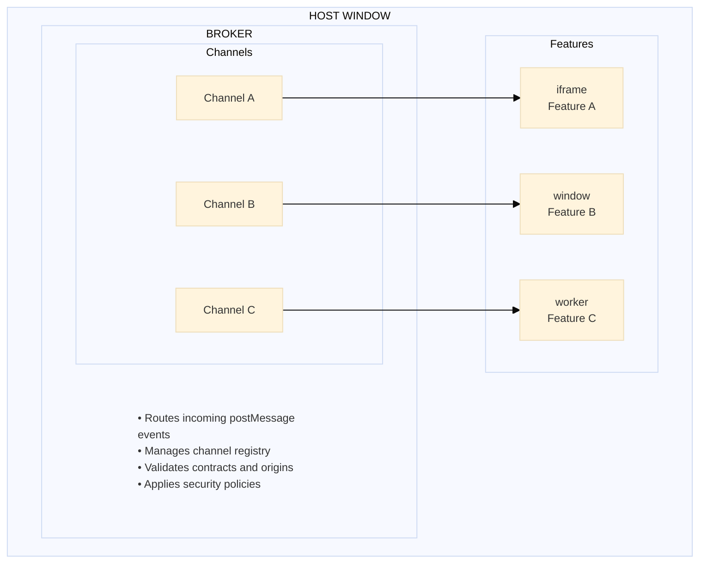
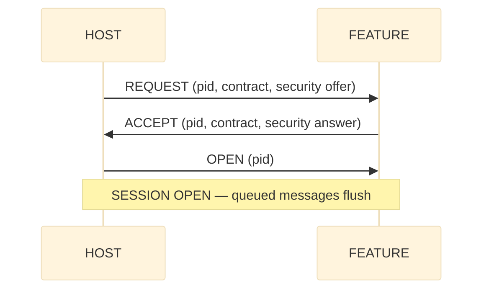
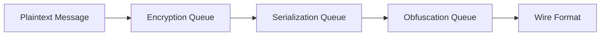
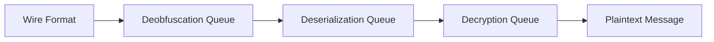
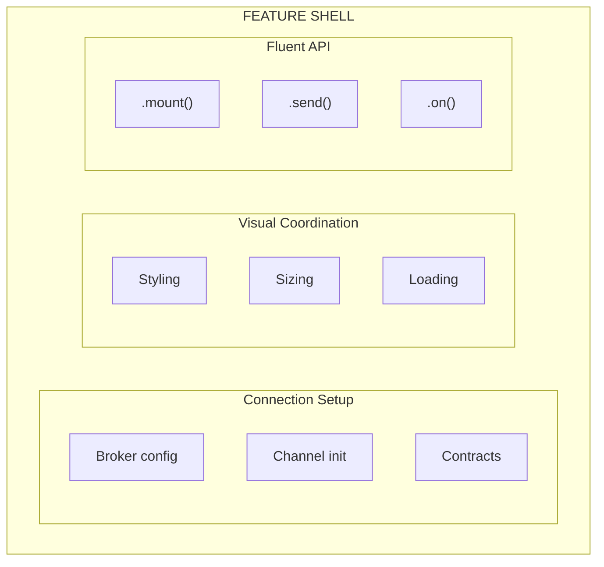
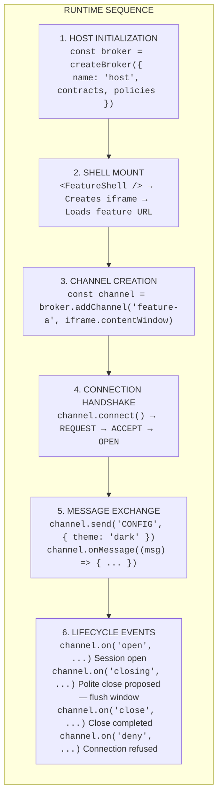
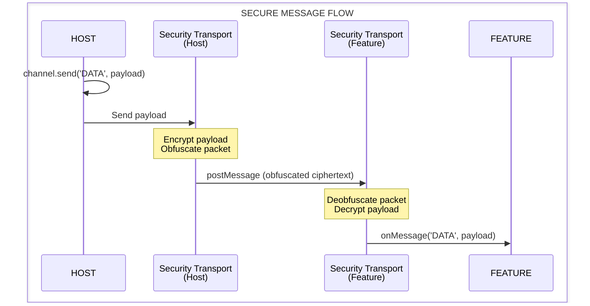

# Hyperfrontend Architecture

Hyperfrontend is a layered architecture designed for runtime micro-frontend integration. At its core, it enables independently deployed frontend applications ("features") to communicate through secure, contract-validated messaging—regardless of what framework they use.



---

## Library Stack

The architecture is composed of specialized libraries that layer on top of each other:

| Layer             | Package                           | Responsibility                                     |
| ----------------- | --------------------------------- | -------------------------------------------------- |
| **SDK**           | `@hyperfrontend/features`         | Host/hostee runtime SDK, shell generation, CLI     |
| **Communication** | `@hyperfrontend/nexus`            | Broker-channel messaging with contracts            |
| **Security**      | `@hyperfrontend/network-protocol` | Encryption pipelines and obfuscation               |
| **Crypto**        | `@hyperfrontend/cryptography`     | AES-GCM encryption, PBKDF2 key derivation, hashing |
| **Foundation**    | `@hyperfrontend/state-machine`    | State management patterns                          |
|                   | `@hyperfrontend/logging`          | Structured logging                                 |
|                   | `@hyperfrontend/web-worker`       | Web Worker utilities                               |
|                   | `@hyperfrontend/utils/*`          | Data, string, list, time, function utilities       |

---

## Communication Layer: Nexus

`@hyperfrontend/nexus` implements a session protocol over the browser's `postMessage` API. It provides secure, contract-validated messaging between browser contexts (iframes, windows, tabs).

> **Canonical protocol story.** The session model described here — wire handshake, pinned
> origins, versioned contracts, the four-state heartbeat, and polite teardown — is the
> canonical description of the shipped runtime. The article
> [Microfrontends from first principles](apps/docs-site/content/articles/microfrontends-from-first-principles.md)
> derives the same model from scratch and is the canonical rationale; the per-library
> architecture guides ([nexus](libs/nexus/ARCHITECTURE.md),
> [features](libs/features/ARCHITECTURE.md)) document the same protocol in implementation
> depth. Where an older document disagrees with these, this model wins.

### Broker-Channel Model



**Broker**: A singleton within each window context that routes messages to the appropriate channel. The broker holds the channel registry, validates incoming messages against contracts, and applies security policies.

**Channel**: A bidirectional communication pipe between two browser contexts. Each channel manages its own:

- Connection lifecycle (pending → active → closed)
- Message queue for buffering before connection
- Event subscriptions (lifecycle and domain messages)
- Security transport adapter (for encryption)

### Connection Protocol

Channels establish sessions through a wire handshake — REQUEST, ACCEPT, OPEN — and nothing
opens without it:



- **Symmetric initiation.** Either side may connect first; simultaneous requests (glare)
  resolve deterministically by a broker-id tie-break, and handshake replays are idempotent.
- **Deadlines and retries.** Pending REQUEST/ACCEPT messages re-send on a retry cadence, and
  every wait has a deadline: an unanswered attempt fires `connect-timeout` instead of hanging.
- **Origins are learned, then pinned.** Each side pins the counterpart's origin at the
  handshake and drops anything that does not match; receive-side routing resolves by the
  sending window, never by claimed identity.
- **Instances are distinguished from windows.** A window outlives the documents loaded into
  it, so each side also records which incarnation of the counterpart it is talking to and
  ignores frames from any other — traffic left over from a reloaded document cannot enter the
  session that replaced it.
- **Contracts gate the session.** Required actions must appear in the counterpart's contract,
  and contracts carry an optional semver version checked by a compatibility rule at the
  handshake gate. An incompatible pair is denied (`deny` with a reason) before anything opens.
- **Payloads validate twice.** Send validates against the sender's own emitted schemas and
  throws in the sender's frame; receive validates against the receiver's own accepted schemas
  and drops invalid payloads with a diagnosable error event.

Each connection attempt is tracked by a Process ID (UUID), enabling multiple concurrent
connection attempts and clean lifecycle management.

### Session Lifecycle: Heartbeat and Teardown

A session that is open is not necessarily alive, so the runtime judges liveness with four
states rather than a boolean:

| State            | Meaning                                                                                                                             |
| ---------------- | ----------------------------------------------------------------------------------------------------------------------------------- |
| **healthy**      | Beats are arriving within the expected budget.                                                                                      |
| **unobservable** | The host page or the feature page is hidden — browsers throttle hidden timers, so silence is weak evidence and the watchdog pauses. |
| **suspect**      | The pages are visible and the miss budget is exhausted; the feature is probably unhealthy.                                          |
| **gone**         | The session is closed or destroyed.                                                                                                 |

The feature pulses a hidden beat; the host watchdog counts misses only while both pages are
visible (each side reports its own visibility). Entering `suspect` runs the host's
unresponsive policy once per episode, and a recovering beat returns the session to `healthy`
and re-arms it. Transitions surface as the shell's `status` event.

Teardown is a protocol, not an event. The polite form is a short exchange: one side proposes
closing (CLOSE), the other receives a `closing` notice while the channel still delivers — its
flush window for unsaved work — then confirms (ACK), and only then does each side fire its
single `close`. An unacknowledged close completes at a deadline, so an unresponsive
counterpart cannot hold the channel open, and the impolite forms (crash, tab close) remain
covered by the heartbeat. Dirty state is a contract event: the feature declares unsaved work
(`setDirty`), and the host can take it into account (`isDirty`, `dirty-state`) before
starting a polite teardown.

A reload is a third form: the feature's document is replaced, so the session ends without
either side asking. The host is told which one it was (`close` carries
`reason: 'peer-reload'`) and keeps the mount — the new document handshakes on the same frame
and is re-announced its presentation — so a refresh costs a session, not the feature.

### Contract System

Contracts define the communication interface between a host and feature:

```typescript
const contract = {
  emitted: [
    { type: 'CONFIG', schema: configSchema }, // Host sends configuration
    { type: 'NAVIGATION', schema: navSchema }, // Host sends navigation events
  ],
  accepted: [
    { type: 'READY', schema: readySchema }, // Feature signals readiness
    { type: 'DATA', schema: dataSchema }, // Feature sends data updates
  ],
}
```

- **Emitted actions**: Message types this context sends
- **Accepted actions**: Message types this context receives
- **JSON Schema validation**: Optional runtime validation of message payloads

---

## Security Layer: Network Protocol

`@hyperfrontend/network-protocol` provides defense-in-depth security for message transport. It sits between the application layer and the raw `postMessage` transport.

### Protocol Versions

| Version | Security Level  | Use Case                                   |
| ------- | --------------- | ------------------------------------------ |
| **v1**  | Obfuscation     | Trusted environments, same-origin features |
| **v2**  | Full Encryption | Cross-origin features, sensitive data      |

### Message Pipeline

Messages pass through staged queues for transformation:

**Outbound Pipeline**



**Inbound Pipeline**



### Security Features

| Feature                          | Description                                                                 |
| -------------------------------- | --------------------------------------------------------------------------- |
| **Dynamic Key Encryption**       | Keys are exchanged per-message via the packet's `key` field                 |
| **Time-Based Password Rotation** | Passwords rotate based on UTC time intervals, synchronized across endpoints |
| **Clock Skew Handling**          | Automatically attempts ±1 time windows for deobfuscation                    |
| **Packet Obfuscation**           | Makes ciphertext unrecognizable as encrypted data                           |

---

## Cryptography Layer

`@hyperfrontend/cryptography` provides isomorphic cryptographic primitives—identical APIs for browser (Web Crypto API) and Node.js (crypto module).

### Capabilities

| Capability         | Implementation      | Details                                                    |
| ------------------ | ------------------- | ---------------------------------------------------------- |
| **Encryption**     | AES-256-GCM         | Authenticated encryption with password-derived keys        |
| **Key Derivation** | PBKDF2              | 100,000 iterations, unique salt per operation              |
| **Hashing**        | SHA-256             | Hexadecimal output                                         |
| **Time Passwords** | UTC-synchronized    | Generates passwords for current/previous/next time windows |
| **Vault Storage**  | In-memory encrypted | Password-protected storage with optional single-use mode   |

### Platform Parity

```typescript
// Browser
import { encrypt, decrypt } from '@hyperfrontend/cryptography/browser'

// Node.js
import { encrypt, decrypt } from '@hyperfrontend/cryptography/node'

// Same API, platform-optimized implementation
const encrypted = await encrypt('sensitive data', 'password')
const decrypted = await decrypt(encrypted, 'password')
```

---

## The Shell Pattern

A **shell** is a self-contained package that knows how to load and communicate with a specific feature. Shells are the distribution mechanism for hyperfrontend features.

### What the Shell Contains



> ⚠️ The shell does **not** contain the feature app code. Features load at runtime from their deployment URL.

### Distribution Options

| Method          | Use Case             | Consumption                                                 |
| --------------- | -------------------- | ----------------------------------------------------------- |
| **npm package** | Modern build systems | `import { FeatureA } from '@org/shell-feature-a/react'`     |
| **CDN script**  | Legacy applications  | `<script src="https://cdn.example.com/shell-feature-a.js">` |

Both distribution methods produce zero-dependency bundles—all @hyperfrontend libraries are bundled into the shell.

### Framework Consumption

```typescript
// React
import { FeatureA } from '@org/shell-feature-a/react'
<FeatureA config={{ theme: 'dark' }} onReady={handleReady} />

// Vue
import { FeatureA } from '@org/shell-feature-a/vue'
<FeatureA :config="{ theme: 'dark' }" @ready="handleReady" />

// Vanilla JS
const feature = new HyperfrontendFeatureA('#container', { theme: 'dark' })
feature.on('ready', handleReady)
feature.mount()
```

---

## Runtime Flow

Here's how the components work together when a host application loads a feature:



---

## Security Integration

When security is enabled, the communication flow adds encryption layers:



---

## Isomorphic Design

All security-related packages work identically in browser and Node.js environments:

| Package                           | Browser        | Node.js            |
| --------------------------------- | -------------- | ------------------ |
| `@hyperfrontend/cryptography`     | Web Crypto API | Node crypto module |
| `@hyperfrontend/network-protocol` | Web Crypto API | Node crypto module |

Entry points follow a consistent pattern:

```text
@hyperfrontend/cryptography
├── /browser     # Web Crypto API implementation
├── /node        # Node crypto implementation
└── /common      # Platform-agnostic utilities

@hyperfrontend/network-protocol
├── /browser/v1  # Browser obfuscation protocol
├── /browser/v2  # Browser encryption protocol
├── /node/v1     # Node obfuscation protocol
└── /node/v2     # Node encryption protocol
```

This enables server-side features (SSR, API routes) to use the same security protocols as browser features.

---

## Deep Dive Resources

Each package contains its own architecture documentation with implementation details:

- [Features Architecture](libs/features/ARCHITECTURE.md) — Host/hostee SDK, control plane, shell generation
- [Nexus Architecture](libs/nexus/ARCHITECTURE.md) — Protocol design, handler reference, event system
- [Network Protocol Architecture](libs/network-protocol/ARCHITECTURE.md) — Queue composition, security suite, end-to-end flow
- [State Machine Architecture](libs/state-machine/ARCHITECTURE.md) — State patterns, transitions, reducers

---

## Design Principles

| Principle                  | Implementation                                                         |
| -------------------------- | ---------------------------------------------------------------------- |
| **Runtime Integration**    | Features load at runtime, not build-time. No coordination required.    |
| **Contract-First**         | Communication interfaces are declared, validated, and type-safe.       |
| **Framework Agnostic**     | The protocol is the common language. Any framework works.              |
| **Zero-Dependency Shells** | All dependencies bundled. Works with CDN or npm.                       |
| **Defense in Depth**       | Optional layered security: encryption, obfuscation, origin validation. |
| **Functional Core**        | Pure functions with dependency injection. Side effects at boundaries.  |
| **Isomorphic APIs**        | Same code runs in browser and Node.js.                                 |

---

## What's Next

See the [Manifesto](MANIFESTO.md) for the project philosophy, scope boundaries, and planned features.
