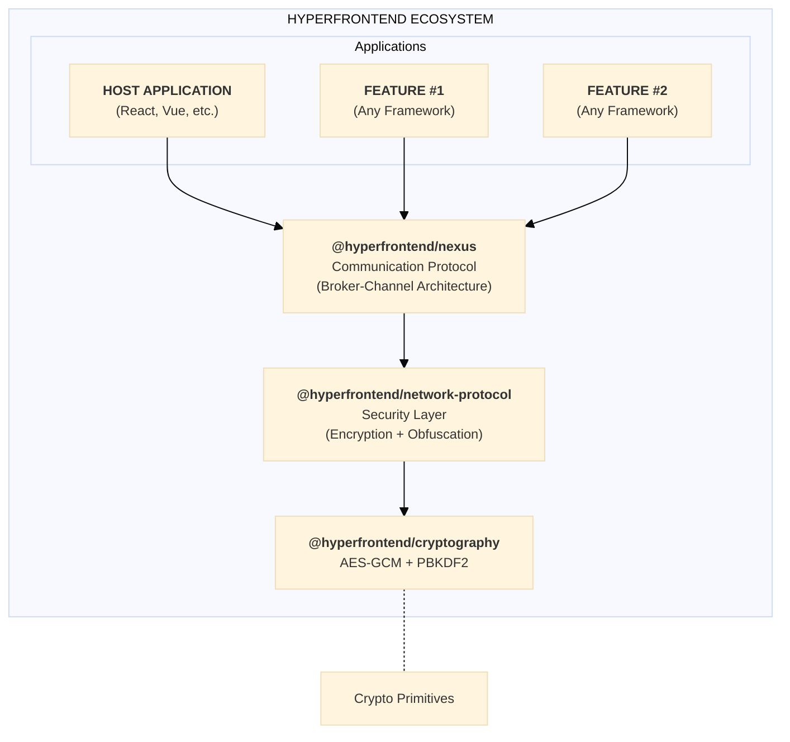
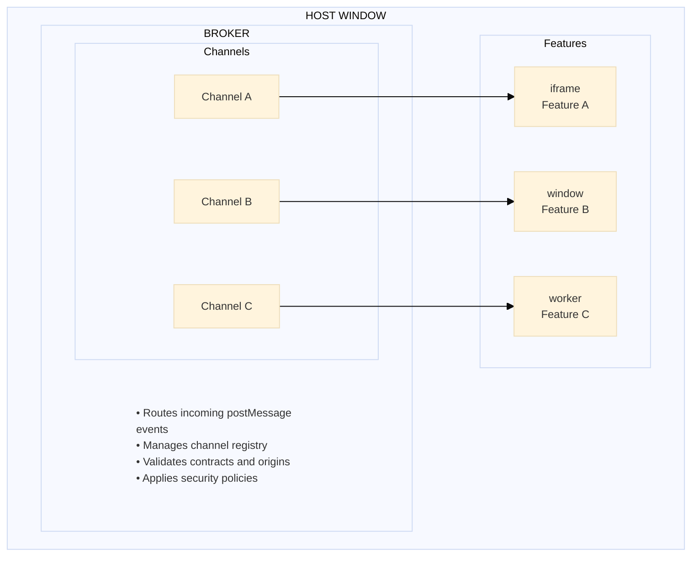
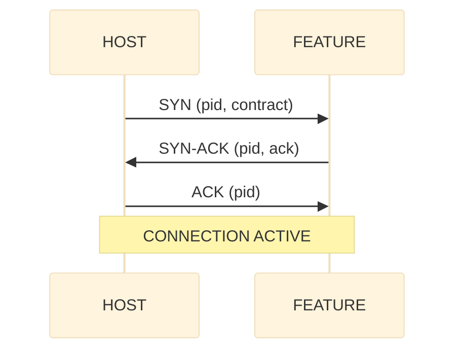

# Hyperfrontend Architecture

**How the pieces fit together**

---

## Overview

Hyperfrontend is a layered architecture designed for runtime micro-frontend integration. At its core, it enables independently deployed frontend applications ("features") to communicate through secure, contract-validated messaging—regardless of what framework they use.



---

## Library Stack

The architecture is composed of specialized libraries that layer on top of each other:

| Layer             | Package                           | Responsibility                                     |
| ----------------- | --------------------------------- | -------------------------------------------------- |
| **Tooling**       | `@hyperfrontend/features`         | Nx plugin for shell generation and automation      |
| **Communication** | `@hyperfrontend/nexus`            | Broker-channel messaging with contracts            |
| **Security**      | `@hyperfrontend/network-protocol` | Encryption pipelines and obfuscation               |
| **Crypto**        | `@hyperfrontend/cryptography`     | AES-GCM encryption, PBKDF2 key derivation, hashing |
| **Foundation**    | `@hyperfrontend/state-machine`    | State management patterns                          |
|                   | `@hyperfrontend/logging`          | Structured logging                                 |
|                   | `@hyperfrontend/web-worker`       | Web Worker utilities                               |
|                   | `@hyperfrontend/utils/*`          | Data, string, list, time, function utilities       |

---

## Communication Layer: Nexus

`@hyperfrontend/nexus` implements a TCP-like protocol over the browser's `postMessage` API. It provides secure, contract-validated messaging between browser contexts (iframes, windows, tabs, web workers).

### Broker-Channel Model



**Broker**: A singleton within each window context that routes messages to the appropriate channel. The broker holds the channel registry, validates incoming messages against contracts, and applies security policies.

**Channel**: A bidirectional communication pipe between two browser contexts. Each channel manages its own:

- Connection lifecycle (pending → active → closed)
- Message queue for buffering before connection
- Event subscriptions (lifecycle and domain messages)
- Security transport adapter (for encryption)

### Connection Protocol

Channels establish connections using a three-way handshake inspired by TCP:



Each connection attempt is tracked by a Process ID (UUID), enabling multiple concurrent connection attempts and clean lifecycle management.

### Contract System

Contracts define the communication interface between a host and feature:

```typescript
const contract = {
  emitted: [
    { type: 'CONFIG', schema: configSchema }, // Host sends configuration
    { type: 'NAVIGATION', schema: navSchema }, // Host sends navigation events
  ],
  accepted: [
    { type: 'READY', schema: readySchema }, // Feature signals readiness
    { type: 'DATA', schema: dataSchema }, // Feature sends data updates
  ],
}
```

- **Emitted actions**: Message types this context sends
- **Accepted actions**: Message types this context receives
- **JSON Schema validation**: Optional runtime validation of message payloads

---

## Security Layer: Network Protocol

`@hyperfrontend/network-protocol` provides defense-in-depth security for message transport. It sits between the application layer and the raw `postMessage` transport.

### Protocol Versions

| Version | Security Level  | Use Case                                   |
| ------- | --------------- | ------------------------------------------ |
| **v1**  | Obfuscation     | Trusted environments, same-origin features |
| **v2**  | Full Encryption | Cross-origin features, sensitive data      |

### Message Pipeline

Messages pass through staged queues for transformation:

```
┌─────────────────────────────────────────────────────────────────────────────────┐
│                              OUTBOUND PIPELINE                                   │
├─────────────────────────────────────────────────────────────────────────────────┤
│                                                                                  │
│   Plaintext    ┌─────────────┐    ┌─────────────┐    ┌─────────────┐   Wire    │
│   Message  ──▶ │ Encryption  │ ──▶│ Serialization│ ──▶│ Obfuscation │ ──▶ Format │
│                │    Queue    │    │    Queue    │    │    Queue    │            │
│                └─────────────┘    └─────────────┘    └─────────────┘            │
│                                                                                  │
├─────────────────────────────────────────────────────────────────────────────────┤
│                               INBOUND PIPELINE                                   │
├─────────────────────────────────────────────────────────────────────────────────┤
│                                                                                  │
│    Wire       ┌─────────────┐    ┌─────────────┐    ┌─────────────┐  Plaintext │
│   Format  ──▶ │Deobfuscation│ ──▶│Deserialization│ ──▶│ Decryption  │ ──▶ Message │
│               │    Queue    │    │    Queue    │    │    Queue    │            │
│               └─────────────┘    └─────────────┘    └─────────────┘            │
│                                                                                  │
└─────────────────────────────────────────────────────────────────────────────────┘
```

### Security Features

| Feature                          | Description                                                                 |
| -------------------------------- | --------------------------------------------------------------------------- |
| **Dynamic Key Encryption**       | Keys are exchanged per-message via the packet's `key` field                 |
| **Time-Based Password Rotation** | Passwords rotate based on UTC time intervals, synchronized across endpoints |
| **Clock Skew Handling**          | Automatically attempts ±1 time windows for deobfuscation                    |
| **Packet Obfuscation**           | Makes ciphertext unrecognizable as encrypted data                           |

---

## Cryptography Layer

`@hyperfrontend/cryptography` provides isomorphic cryptographic primitives—identical APIs for browser (Web Crypto API) and Node.js (crypto module).

### Capabilities

| Capability         | Implementation      | Details                                                    |
| ------------------ | ------------------- | ---------------------------------------------------------- |
| **Encryption**     | AES-256-GCM         | Authenticated encryption with password-derived keys        |
| **Key Derivation** | PBKDF2              | 100,000 iterations, unique salt per operation              |
| **Hashing**        | SHA-256             | Hexadecimal output                                         |
| **Time Passwords** | UTC-synchronized    | Generates passwords for current/previous/next time windows |
| **Vault Storage**  | In-memory encrypted | Password-protected storage with optional single-use mode   |

### Platform Parity

```typescript
// Browser
import { encrypt, decrypt } from '@hyperfrontend/cryptography/browser'

// Node.js
import { encrypt, decrypt } from '@hyperfrontend/cryptography/node'

// Same API, platform-optimized implementation
const encrypted = await encrypt('sensitive data', 'password')
const decrypted = await decrypt(encrypted, 'password')
```

---

## The Shell Pattern

A **shell** is a self-contained package that knows how to load and communicate with a specific feature. Shells are the distribution mechanism for hyperfrontend features.

### What the Shell Contains

```
┌────────────────────────────────────────────────────────────┐
│                     FEATURE SHELL                           │
├────────────────────────────────────────────────────────────┤
│                                                             │
│   ┌─────────────────────────────────────────────────────┐  │
│   │  Connection Setup                                    │  │
│   │  • Broker configuration                             │  │
│   │  • Channel initialization                            │  │
│   │  • Contract definition                               │  │
│   └─────────────────────────────────────────────────────┘  │
│                                                             │
│   ┌─────────────────────────────────────────────────────┐  │
│   │  Visual Coordination                                 │  │
│   │  • iframe/container styling                         │  │
│   │  • Responsive sizing                                 │  │
│   │  • Loading states                                    │  │
│   └─────────────────────────────────────────────────────┘  │
│                                                             │
│   ┌─────────────────────────────────────────────────────┐  │
│   │  Framework Adapters (optional)                       │  │
│   │  • React component wrapper                          │  │
│   │  • Vue component wrapper                             │  │
│   │  • Angular service                                   │  │
│   └─────────────────────────────────────────────────────┘  │
│                                                             │
│   ┌─────────────────────────────────────────────────────┐  │
│   │  Fluent API                                          │  │
│   │  • .mount(), .unmount()                             │  │
│   │  • .send(), .on()                                    │  │
│   │  • .configure()                                      │  │
│   └─────────────────────────────────────────────────────┘  │
│                                                             │
├────────────────────────────────────────────────────────────┤
│  ⚠️  Does NOT contain the feature app code itself          │
│      Feature is loaded at runtime from its deployment URL   │
└────────────────────────────────────────────────────────────┘
```

### Distribution Options

| Method          | Use Case             | Consumption                                                 |
| --------------- | -------------------- | ----------------------------------------------------------- |
| **npm package** | Modern build systems | `import { FeatureA } from '@org/shell-feature-a/react'`     |
| **CDN script**  | Legacy applications  | `<script src="https://cdn.example.com/shell-feature-a.js">` |

Both distribution methods produce zero-dependency bundles—all @hyperfrontend libraries are bundled into the shell.

### Framework Consumption

```typescript
// React
import { FeatureA } from '@org/shell-feature-a/react'
<FeatureA config={{ theme: 'dark' }} onReady={handleReady} />

// Vue
import { FeatureA } from '@org/shell-feature-a/vue'
<FeatureA :config="{ theme: 'dark' }" @ready="handleReady" />

// Vanilla JS
const feature = new HyperfrontendFeatureA('#container', { theme: 'dark' })
feature.on('ready', handleReady)
feature.mount()
```

---

## Runtime Flow

Here's how the components work together when a host application loads a feature:

```
┌──────────────────────────────────────────────────────────────────────────────────┐
│                              RUNTIME SEQUENCE                                     │
├──────────────────────────────────────────────────────────────────────────────────┤
│                                                                                   │
│  1. HOST INITIALIZATION                                                          │
│     ┌──────────────────────────────────────────────────────────────────────────┐ │
│     │  const broker = createBroker({ name: 'host', contracts, policies })      │ │
│     └──────────────────────────────────────────────────────────────────────────┘ │
│                                                                                   │
│  2. SHELL MOUNT                                                                  │
│     ┌──────────────────────────────────────────────────────────────────────────┐ │
│     │  <FeatureShell />  →  Creates iframe  →  Loads feature URL               │ │
│     └──────────────────────────────────────────────────────────────────────────┘ │
│                                                                                   │
│  3. CHANNEL CREATION                                                             │
│     ┌──────────────────────────────────────────────────────────────────────────┐ │
│     │  const channel = broker.addChannel('feature-a', iframe.contentWindow)    │ │
│     └──────────────────────────────────────────────────────────────────────────┘ │
│                                                                                   │
│  4. CONNECTION HANDSHAKE                                                         │
│     ┌──────────────────────────────────────────────────────────────────────────┐ │
│     │  channel.connect()  →  SYN  →  SYN-ACK  →  ACK  →  ACTIVE                │ │
│     └──────────────────────────────────────────────────────────────────────────┘ │
│                                                                                   │
│  5. MESSAGE EXCHANGE                                                             │
│     ┌──────────────────────────────────────────────────────────────────────────┐ │
│     │  channel.send('CONFIG', { theme: 'dark' })                               │ │
│     │  channel.onMessage((msg) => { /* handle feature messages */ })           │ │
│     └──────────────────────────────────────────────────────────────────────────┘ │
│                                                                                   │
│  6. LIFECYCLE EVENTS                                                             │
│     ┌──────────────────────────────────────────────────────────────────────────┐ │
│     │  channel.on('open', ...)   // Connection established                     │ │
│     │  channel.on('close', ...)  // Graceful disconnect                        │ │
│     │  channel.on('deny', ...)   // Connection refused                         │ │
│     └──────────────────────────────────────────────────────────────────────────┘ │
│                                                                                   │
└──────────────────────────────────────────────────────────────────────────────────┘
```

---

## Security Integration

When security is enabled, the communication flow adds encryption layers:

```
┌──────────────────────────────────────────────────────────────────────────────────┐
│                          SECURE MESSAGE FLOW                                      │
├──────────────────────────────────────────────────────────────────────────────────┤
│                                                                                   │
│  HOST                                                 FEATURE                     │
│    │                                                    │                         │
│    │  channel.send('DATA', payload)                     │                         │
│    │         │                                          │                         │
│    │         ▼                                          │                         │
│    │  ┌─────────────────────┐                           │                         │
│    │  │ Security Transport  │                           │                         │
│    │  │ • Encrypt payload   │                           │                         │
│    │  │ • Obfuscate packet  │                           │                         │
│    │  └─────────────────────┘                           │                         │
│    │         │                                          │                         │
│    │         │   postMessage (obfuscated ciphertext)    │                         │
│    │         └─────────────────────────────────────────▶│                         │
│    │                                                    │                         │
│    │                                          ┌─────────────────────┐             │
│    │                                          │ Security Transport  │             │
│    │                                          │ • Deobfuscate packet│             │
│    │                                          │ • Decrypt payload   │             │
│    │                                          └─────────────────────┘             │
│    │                                                    │                         │
│    │                                          onMessage('DATA', payload)          │
│    │                                                    │                         │
│                                                                                   │
└──────────────────────────────────────────────────────────────────────────────────┘
```

---

## Project Structure

```
hyperfrontend/
├── plugins/
│   └── features/              # Nx plugin for shell generation
│       └── src/generators/
│           ├── init/          # Transform app → feature
│           └── add/           # Consume feature in host
│
├── libs/
│   ├── nexus/                 # Core messaging (broker, channel, contracts)
│   ├── network-protocol/      # Security layer (encryption, obfuscation)
│   ├── cryptography/          # Crypto primitives (AES-GCM, PBKDF2)
│   ├── state-machine/         # State management patterns
│   ├── logging/               # Structured logging
│   ├── web-worker/            # Web Worker utilities
│   └── utils/                 # Utility libraries
│       ├── data/              # Data manipulation
│       ├── string/            # String utilities
│       ├── list/              # Array utilities
│       ├── time/              # Date/time utilities
│       ├── function/          # Function composition
│       ├── random-generator/  # Random value generation
│       └── immutable-api/     # Immutable APIs
│
├── apps/
│   ├── frontend/              # Demo frontends (React, Vue, Angular, Svelte, JS)
│   ├── backend/               # Demo backends (Express, Nest, HTTP)
│   └── demos/                 # Feature demonstrations
│
└── docs/                      # Documentation site (Hugo)
```

---

## Isomorphic Design

All security-related packages work identically in browser and Node.js environments:

| Package                           | Browser        | Node.js            |
| --------------------------------- | -------------- | ------------------ |
| `@hyperfrontend/cryptography`     | Web Crypto API | Node crypto module |
| `@hyperfrontend/network-protocol` | Web Crypto API | Node crypto module |

Entry points follow a consistent pattern:

```
@hyperfrontend/cryptography
├── /browser     # Web Crypto API implementation
├── /node        # Node crypto implementation
└── /common      # Platform-agnostic utilities

@hyperfrontend/network-protocol
├── /browser/v1  # Browser obfuscation protocol
├── /browser/v2  # Browser encryption protocol
├── /node/v1     # Node obfuscation protocol
└── /node/v2     # Node encryption protocol
```

This enables server-side features (SSR, API routes) to use the same security protocols as browser features.

---

## Deep Dive Resources

Each package contains its own architecture documentation with implementation details:

- [Nexus Architecture](libs/nexus/ARCHITECTURE.md) — Protocol design, handler reference, event system
- [Network Protocol Architecture](libs/network-protocol/ARCHITECTURE.md) — Queue composition, security suite, end-to-end flow
- [State Machine Architecture](libs/state-machine/ARCHITECTURE.md) — State patterns, transitions, reducers

---

## Design Principles

| Principle                  | Implementation                                                         |
| -------------------------- | ---------------------------------------------------------------------- |
| **Runtime Integration**    | Features load at runtime, not build-time. No coordination required.    |
| **Contract-First**         | Communication interfaces are declared, validated, and type-safe.       |
| **Framework Agnostic**     | The protocol is the common language. Any framework works.              |
| **Zero-Dependency Shells** | All dependencies bundled. Works with CDN or npm.                       |
| **Defense in Depth**       | Optional layered security: encryption, obfuscation, origin validation. |
| **Functional Core**        | Pure functions with dependency injection. Side effects at boundaries.  |
| **Isomorphic APIs**        | Same code runs in browser and Node.js.                                 |

---

## What's Next

See the [Manifesto](MANIFESTO.md) for the project philosophy, scope boundaries, and planned features.
