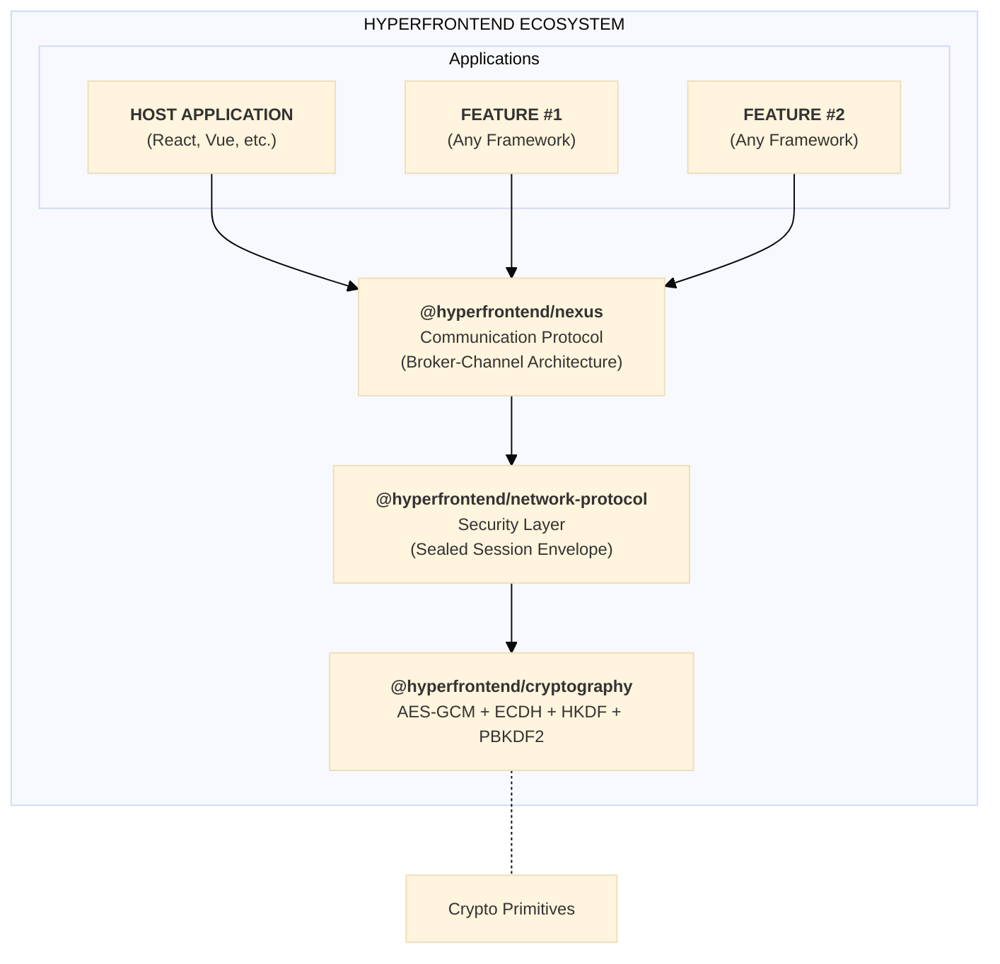
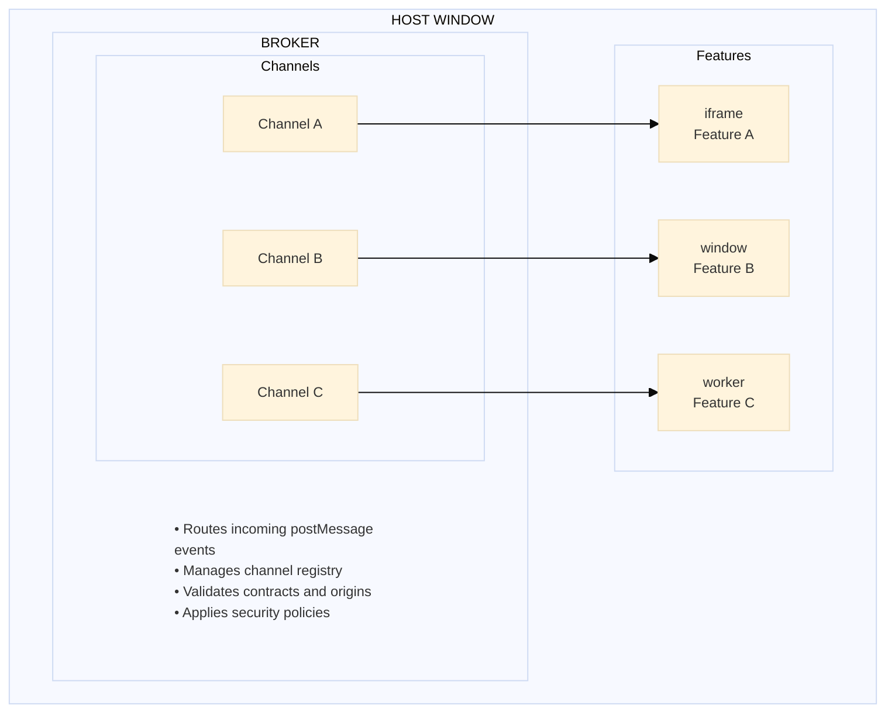
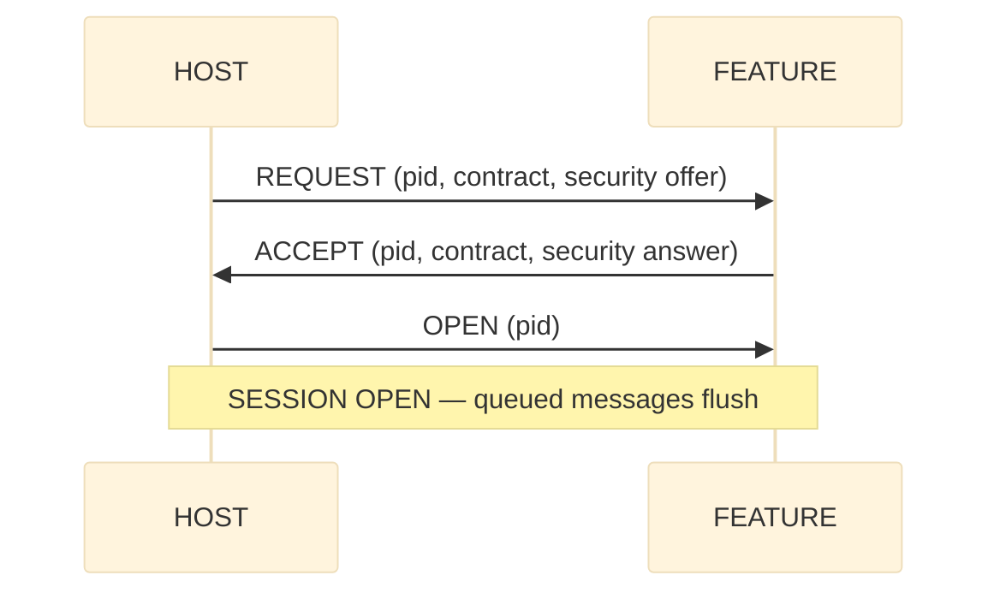
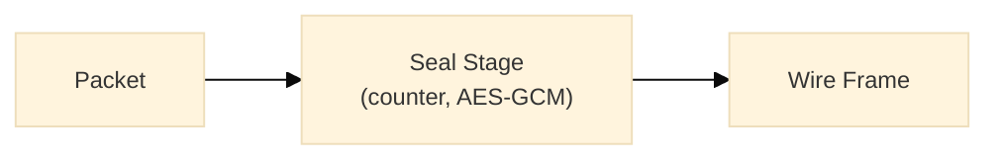
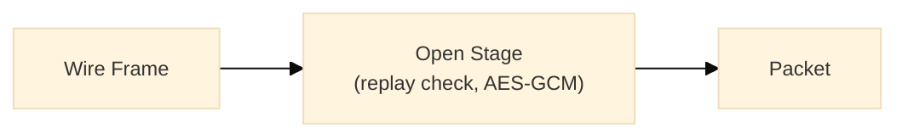
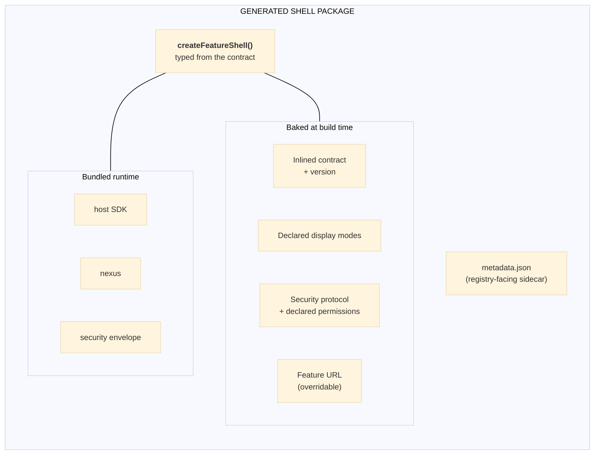
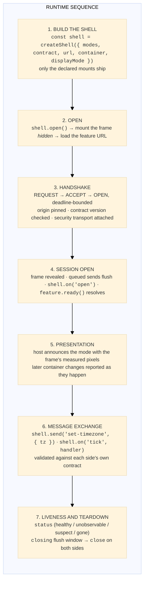
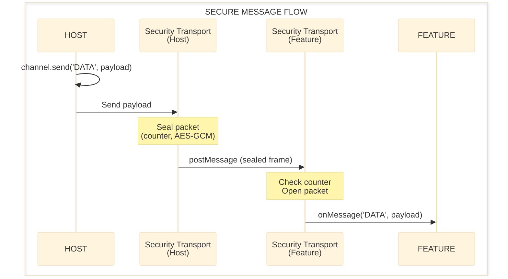

# Hyperfrontend Architecture

Hyperfrontend is a layered architecture designed for runtime micro-frontend integration. At its core, it enables independently deployed frontend applications ("features") to communicate through secure, contract-validated messaging, regardless of what framework they use.



---

## Library Stack

The architecture is composed of specialized libraries that layer on top of each other:

| Layer             | Package                           | Responsibility                                    |
| ----------------- | --------------------------------- | ------------------------------------------------- |
| **SDK**           | `@hyperfrontend/features`         | Host/hostee runtime SDK, shell generation, CLI    |
| **Communication** | `@hyperfrontend/nexus`            | Broker-channel messaging with contracts           |
| **Security**      | `@hyperfrontend/network-protocol` | Per-session sealed envelope over the wire         |
| **Crypto**        | `@hyperfrontend/cryptography`     | AES-GCM, ECDH agreement, HKDF and PBKDF2, hashing |
| **Foundation**    | `@hyperfrontend/state-machine`    | State management patterns                         |
|                   | `@hyperfrontend/logging`          | Structured logging                                |
|                   | `@hyperfrontend/web-worker`       | Web Worker utilities                              |
|                   | `@hyperfrontend/utils/*`          | Data, string, list, time, function utilities      |

---

## Communication Layer: Nexus

`@hyperfrontend/nexus` implements a session protocol over the browser's `postMessage` API. It provides secure, contract-validated messaging between browser contexts (iframes, windows, tabs).

> **Canonical protocol story.** The session model described here — wire handshake, pinned
> origins, versioned contracts, the four-state heartbeat, and polite teardown — is the
> canonical description of the shipped runtime. The article
> [Microfrontends from first principles](apps/docs-site/content/articles/microfrontends-from-first-principles.md)
> derives the same model from scratch and is the canonical rationale; the per-library
> architecture guides ([nexus](libs/nexus/ARCHITECTURE.md),
> [features](libs/features/ARCHITECTURE.md)) document the same protocol in implementation
> depth. Where an older document disagrees with these, this model wins.

### Broker-Channel Model



**Broker**: A singleton within each window context that routes messages to the appropriate channel. The broker holds the channel registry, validates incoming messages against contracts, and applies security policies.

**Channel**: A bidirectional communication pipe between two browser contexts. Each channel manages its own:

- Connection lifecycle (pending → active → closed)
- Message queue for buffering before connection
- Event subscriptions (lifecycle and domain messages)
- Security transport adapter (for encryption)

### Connection Protocol

Channels establish sessions through a wire handshake — REQUEST, ACCEPT, OPEN — and nothing
opens without it:



- **Symmetric initiation.** Either side may connect first; simultaneous requests (glare)
  resolve deterministically by a broker-id tie-break, and handshake replays are idempotent.
- **Deadlines and retries.** Pending REQUEST/ACCEPT messages re-send on a retry cadence, and
  every wait has a deadline: an unanswered attempt fires `connect-timeout` instead of hanging.
- **Origins are learned, then pinned.** Each side pins the counterpart's origin at the
  handshake and drops anything that does not match; receive-side routing resolves by the
  sending window, never by claimed identity.
- **Instances are distinguished from windows.** A window outlives the documents loaded into
  it, so each side also records which incarnation of the counterpart it is talking to and
  ignores frames from any other: traffic left over from a reloaded document cannot enter the
  session that replaced it.
- **Contracts gate the session.** Required actions must appear in the counterpart's contract,
  and contracts carry an optional semver version checked by a compatibility rule at the
  handshake gate. An incompatible pair is denied (`deny` with a reason) before anything opens.
- **Payloads validate twice.** Send validates against the sender's own emitted schemas and
  throws in the sender's frame; receive validates against the receiver's own accepted schemas
  and drops invalid payloads with a diagnosable error event.

Each connection attempt is tracked by a Process ID (UUID), enabling multiple concurrent
connection attempts and clean lifecycle management.

### Session Lifecycle: Heartbeat and Teardown

A session that is open is not necessarily alive, so the runtime judges liveness with four
states rather than a boolean:

| State            | Meaning                                                                                                                                                             |
| ---------------- | ------------------------------------------------------------------------------------------------------------------------------------------------------------------- |
| **healthy**      | Beats are arriving within the expected budget.                                                                                                                      |
| **unobservable** | Silence carries no information yet: a page is hidden (throttled timers pause the watchdog), or watching has just resumed and no beat has yet earned `healthy` back. |
| **suspect**      | The pages are visible and the miss budget is exhausted; the feature is probably unhealthy.                                                                          |
| **gone**         | The session is closed or destroyed.                                                                                                                                 |

The feature pulses a hidden beat; the host watchdog counts misses only while both pages are
visible (each side reports its own visibility). Entering `suspect` runs the host's
unresponsive policy once per episode, and a recovering beat returns the session to `healthy`
and re-arms it. Transitions surface as the shell's `status` event.

Teardown is a protocol, not an event. The polite form is a short exchange: one side proposes
closing (CLOSE), the other receives a `closing` notice while the channel still delivers (its
flush window for unsaved work), then confirms (ACK), and only then does each side fire its
single `close`. An unacknowledged close completes at a deadline, so an unresponsive
counterpart cannot hold the channel open, and the impolite forms (crash, tab close) remain
covered by the heartbeat. Dirty state is a contract event: the feature declares unsaved work
(`setDirty`), and the host can take it into account (`isDirty`, `dirty-state`) before
starting a polite teardown.

A reload is a third form: the feature's document is replaced, so the session ends without
either side asking. The host is told which one it was (`close` carries
`reason: 'peer-reload'`) and keeps the mount; the new document handshakes on the same frame
and is re-announced its presentation, so a refresh costs a session, not the feature.

### Contract System

Contracts define the communication interface between a host and feature:

```typescript
const contract = {
  emitted: [
    { type: 'CONFIG', schema: configSchema }, // Host sends configuration
    { type: 'NAVIGATION', schema: navSchema }, // Host sends navigation events
  ],
  accepted: [
    { type: 'READY', schema: readySchema }, // Feature signals readiness
    { type: 'DATA', schema: dataSchema }, // Feature sends data updates
  ],
}
```

- **Emitted actions**: Message types this context sends
- **Accepted actions**: Message types this context receives
- **JSON Schema validation**: Optional runtime validation of message payloads

---

## Security Layer: Network Protocol

> **Read the model first.** What this layer defends against, what it does not, and which party owns
> each control is stated once, in the
> [Security Model](https://www.hyperfrontend.dev/docs/core-concepts/security). This section describes
> the transport mechanics; the model tells you what they are worth.

`@hyperfrontend/network-protocol` provides defense-in-depth security for message transport. It sits between the application layer and the raw `postMessage` transport.

### Protocol Versions

| Version | Key Material                                    | Defeats                                                        |
| ------- | ----------------------------------------------- | -------------------------------------------------------------- |
| **v3**  | Ephemeral ECDH P-256 session keys               | Scripts that can only listen (passive observers of `message`)  |
| **v4**  | The same session keys bound to a pre-shared key | Any script without the key, including one that can post frames |

Neither protocol hides the hello: public keys and nonces are public by design. A v3 session does not authenticate who the counterpart is, because a script that can post to a peer's window with a genuine source can complete the handshake as that peer. Under v4 a key mismatch is detected because no frame ever authenticates. The pre-shared key must be at least 16 characters; `createProtocol` throws on a shorter one.

### Session Key Schedule

Each endpoint mints a 32-byte nonce and an ephemeral P-256 key pair when the session is created and exchanges them in a plaintext hello frame. The salt is the initiator nonce followed by the responder nonce. The input key material is the ECDH shared secret (v3), or that secret followed by PBKDF2-SHA256 of the shared key over the salt at 600,000 iterations (v4). HKDF-SHA256 expands two AES-GCM-256 keys, one per direction (`i2r` and `r2i`), with info bound to the protocol and both endpoint ids; each side seals with its own direction's key and opens with the other's. Raw material is zeroed after derivation, and the stretch is paid once per session, never per message.

### Message Pipeline

A channel runs one seal stage outbound and one open stage inbound, both array-backed FIFOs. A packet either stage rejects is reported through the channel's `onDrop` callback with its direction, stage, reason, cause, and the packet itself.

**Outbound Pipeline**



**Inbound Pipeline**



### Wire Format

| Frame     | Layout                                                                                         |
| --------- | ---------------------------------------------------------------------------------------------- |
| **Hello** | `[version][type=1][nonce 32][public key 65]`: 99 bytes, plaintext                              |
| **Data**  | `[version][type=0][counter u64 big-endian]` followed by the AES-GCM ciphertext and 16-byte tag |

The ten-byte data header is the additional authenticated data, and the nonce is derived from it. Version bytes are 3 and 4. A frame shorter than 27 bytes is malformed.

### Security Features

| Feature                    | Description                                                                                                           |
| -------------------------- | --------------------------------------------------------------------------------------------------------------------- |
| **Ephemeral session keys** | Fresh ECDH keys per session, expanded per direction and bound to both endpoint ids                                    |
| **Replay rejection**       | Counters start at 1 and increase; a frame whose counter is not above the last accepted one is rejected unopened       |
| **One-shot sessions**      | The first hello keys the session, a repeat is a duplicate, anything else is rejected; a live session is never rekeyed |
| **Typed failures**         | `unsupported-version`, `replayed`, `authentication-failed`, `malformed`, `counter-exhausted`, `invalid-session`       |

---

## Cryptography Layer

`@hyperfrontend/cryptography` provides isomorphic cryptographic primitives: identical APIs for browser (Web Crypto API) and Node.js (crypto module).

### Capabilities

| Capability         | Implementation      | Details                                                                            |
| ------------------ | ------------------- | ---------------------------------------------------------------------------------- |
| **Encryption**     | AES-256-GCM         | Authenticated encryption with password-derived keys                                |
| **Key Derivation** | PBKDF2              | 100,000 iterations, unique salt per operation                                      |
| **Hashing**        | SHA-256             | Hexadecimal output                                                                 |
| **Time Passwords** | UTC-synchronized    | Generates passwords for current/previous/next time windows                         |
| **Vault Storage**  | In-memory encrypted | Password-protected storage with optional single-use mode                           |
| **Key Agreement**  | ECDH P-256          | Ephemeral key pairs; `deriveSecret` rejects a point off the curve                  |
| **Key Expansion**  | HKDF-SHA256         | Non-extractable AES-GCM-256 keys with encrypt-only or decrypt-only usages          |
| **AEAD**           | AES-GCM             | `seal`/`open` with a 12-byte nonce, 16-byte tag, and additional authenticated data |
| **Key Stretching** | PBKDF2-SHA256       | `stretchPassword` with caller-chosen iterations and output length                  |

### Platform Parity

```typescript
// Browser
import { encrypt, decrypt } from '@hyperfrontend/cryptography/browser'

// Node.js
import { encrypt, decrypt } from '@hyperfrontend/cryptography/node'

// Same API, platform-optimized implementation
const encrypted = await encrypt('sensitive data', 'password')
const decrypted = await decrypt(encrypted, 'password')
```

---

## The Shell Pattern

Two applications, two SDK surfaces. A **feature app** (the _hostee_) declares a contract and connects
through `@hyperfrontend/features/hostee`; a **host app** mounts that feature through
`@hyperfrontend/features/host`. Neither writes protocol code.

```typescript
// In the feature app — declare the contract, connect to whatever host embeds it.
import { createFeature } from '@hyperfrontend/features/hostee'

const feature = createFeature({
  name: 'clock',
  contract: { emitted: [{ type: 'tick' }], accepted: [{ type: 'set-timezone' }] },
})
await feature.ready()
```

```typescript
// In the host app — take the feature's contract, pick a mount, pick a mode, open.
import { builtInDisplayModes, createShell, DisplayMode } from '@hyperfrontend/features/host'

const shell = createShell({
  modes: builtInDisplayModes,
  contract: { emitted: [{ type: 'tick' }], accepted: [{ type: 'set-timezone' }] },
  url: 'https://features.example.com/clock',
  container: '#clock-slot',
  displayMode: DisplayMode.Embedded,
})
shell.on('tick', (time) => console.log('feature said', time))
shell.open()
```

The **shell** is the outward-facing package a feature ships so a host can do that without installing
the SDK at all: `hf build` inlines the feature's contract, bakes its declared display modes, security
protocol and permissions as defaults, bundles every dependency, and packs a tarball. The host is
never the shell: the host is the application the shell is installed into.

### What the Shell Contains



> ⚠️ The shell does **not** contain the feature app code. Features load at runtime from their
> deployment URL.

### Distribution

`hf build` emits an ESM and a CommonJS bundle with TypeScript declarations, then packs them into a
publishable tarball:

```typescript
import { createFeatureShell } from '@org/clock-shell'
```

The published manifest declares no runtime dependencies (every @hyperfrontend library is bundled into
the shell), so a host installs one package and inherits no transitive install burden.

### Consumption

```typescript
// Any framework, or none — the shell exposes one factory and a handle.
import { createFeatureShell } from '@org/clock-shell'

const clock = createFeatureShell({ container: '#clock-slot' })
clock.on('open', () => console.log('connected'))
clock.on('tick', (time) => render(time))
clock.open()
clock.send('set-timezone', { tz: 'UTC' })
```

Framework bindings are deliberately out of scope (see the [Manifesto](MANIFESTO.md)): the handle is vanilla JavaScript, and a React hook or Vue composable around it is a few lines a team writes in its
own idiom.

---

## Runtime Flow

Here's the whole sequence, from the host building the shell to both sides closing the session:



Steps 3 through 7 are the session model described above, and the host writes none of it: the SDK owns
the handshake, the pinning, the geometry, the watchdog, and the teardown exchange.

---

## Security Integration

When a channel has selected a protocol, every product message crosses the wire as a sealed frame:



---

## Isomorphic Design

All security-related packages work identically in browser and Node.js environments:

| Package                           | Browser        | Node.js            |
| --------------------------------- | -------------- | ------------------ |
| `@hyperfrontend/cryptography`     | Web Crypto API | Node crypto module |
| `@hyperfrontend/network-protocol` | Web Crypto API | Node crypto module |

Entry points follow a consistent pattern:

```text
@hyperfrontend/cryptography
├── /browser     # Web Crypto API implementation
├── /node        # Node crypto implementation
└── /common      # Platform-agnostic utilities

@hyperfrontend/network-protocol
├── /browser/v3  # Browser ephemeral-key protocol
├── /browser/v4  # Browser pre-shared-key protocol
├── /node/v3     # Node ephemeral-key protocol
└── /node/v4     # Node pre-shared-key protocol
```

This enables server-side features (SSR, API routes) to use the same security protocols as browser features.

---

## Deep Dive Resources

Each package contains its own architecture documentation with implementation details:

- [Features Architecture](libs/features/ARCHITECTURE.md): Host/hostee SDK, control plane, shell generation
- [Nexus Architecture](libs/nexus/ARCHITECTURE.md): Protocol design, handler reference, event system
- [Network Protocol Architecture](libs/network-protocol/ARCHITECTURE.md): Queue composition, security suite, end-to-end flow
- [State Machine Architecture](libs/state-machine/ARCHITECTURE.md): State patterns, transitions, reducers

Two cross-cutting documents sit beside them:

- [Security Model](https://www.hyperfrontend.dev/docs/core-concepts/security): the trust model, the
  browser/protocol/operator split, the capability model, and the status of every control.
- [Microfrontends from first principles](apps/docs-site/content/articles/microfrontends-from-first-principles.md):
  why the boundary is drawn where it is, derived from scratch. The canonical rationale for
  everything above.

---

## Design Principles

| Principle                  | Implementation                                                                   |
| -------------------------- | -------------------------------------------------------------------------------- |
| **Runtime Integration**    | Features load at runtime, not build-time. No coordination required.              |
| **Contract-First**         | Communication interfaces are declared, validated, and type-safe.                 |
| **Framework Agnostic**     | The protocol is the common language. Any framework works.                        |
| **Zero-Dependency Shells** | All dependencies bundled. A host installs one package.                           |
| **Defense in Depth**       | Optional layered security: sealed sessions, replay rejection, origin validation. |
| **Functional Core**        | Pure functions with dependency injection. Side effects at boundaries.            |
| **Isomorphic APIs**        | Same code runs in browser and Node.js.                                           |

---

## What's Next

See the [Manifesto](MANIFESTO.md) for the project philosophy, scope boundaries, and planned features.
