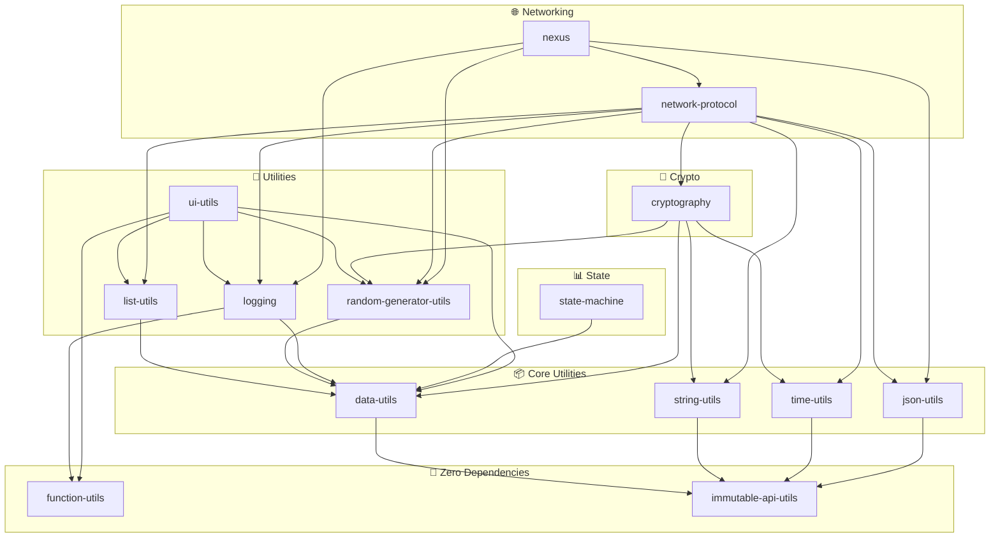
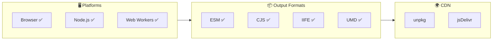

# Library Compatibility Matrix

> **Can I Use** style reference for @hyperfrontend libraries

Last updated: February 15, 2026

---

## Platform Support Overview

| Library                                 | Browser | Node.js | Web Worker | CDN Bundle |
| --------------------------------------- | :-----: | :-----: | :--------: | :--------: |
| `@hyperfrontend/data-utils`             |   ✅    |   ✅    |     ✅     |     ✅     |
| `@hyperfrontend/function-utils`         |   ✅    |   ✅    |     ✅     |     ✅     |
| `@hyperfrontend/string-utils`           |   ✅    |   ✅    |     ✅     |     ✅     |
| `@hyperfrontend/time-utils`             |   ✅    |   ✅    |     ✅     |     ✅     |
| `@hyperfrontend/immutable-api-utils`    |   ✅    |   ✅    |     ✅     |     ✅     |
| `@hyperfrontend/json-utils`             |   ✅    |   ✅    |     ✅     |     ✅     |
| `@hyperfrontend/list-utils`             |   ✅    |   ✅    |     ✅     |     ✅     |
| `@hyperfrontend/random-generator-utils` |   ✅    |   ✅    |     ✅     |     ✅     |
| `@hyperfrontend/ui-utils`               |   ✅    |   ⚠️¹   |     ✅     |     ✅     |
| `@hyperfrontend/logging`                |   ✅    |   ✅    |     ✅     |     ✅     |
| `@hyperfrontend/state-machine`          |   ✅    |   ✅    |     ✅     |     ✅     |
| `@hyperfrontend/cryptography`           |   ✅    |   ✅    |     ✅     |     ✅     |
| `@hyperfrontend/network-protocol`       |   ✅    |   ✅    |     ✅     |     ✅     |
| `@hyperfrontend/nexus`                  |   ✅    |   ✅    |     ✅     |     ✅     |

**Notes:**

1. `ui-utils` — Some DOM utilities require browser APIs; check individual exports

---

## Output Formats

All libraries ship with multiple output formats:

| Format | File Extension | Use Case                                         | Tree-Shakeable |
| ------ | -------------- | ------------------------------------------------ | :------------: |
| ESM    | `.esm.js`      | Modern bundlers, native `<script type="module">` |       ✅       |
| CJS    | `.cjs.js`      | Node.js, legacy bundlers (Webpack 4, etc.)       |       ❌       |
| IIFE   | `.iife.js`     | Browser `<script>` tags, CDN                     |       ❌       |
| UMD    | `.umd.js`      | Universal (AMD, CommonJS, global)                |       ❌       |

---

## Bundle Sizes (Minified)

| Library                  | IIFE Min | Self-Contained |
| ------------------------ | -------: | :------------: |
| `function-utils`         |   < 1 KB |       ✅       |
| `immutable-api-utils`    |   < 1 KB |       ✅       |
| `time-utils`             |     1 KB |       ✅       |
| `string-utils`           |     1 KB |       ✅       |
| `list-utils`             |     1 KB |       ✅       |
| `random-generator-utils` |     1 KB |       ✅       |
| `logging`                |     1 KB |       ✅       |
| `state-machine`          |   < 1 KB |       ✅       |
| `ui-utils`               |   < 1 KB |       ✅       |
| `cryptography`           |     3 KB |       ✅       |
| `json-utils`             |     — KB |       ✅       |
| `data-utils`             |    12 KB |       ✅       |
| `nexus`                  |    21 KB |       ✅       |
| `network-protocol` (v1)  |    66 KB |       ✅       |
| `network-protocol` (v2)  |    65 KB |       ✅       |

**Self-Contained:** All dependencies inlined — single `<script>` tag, no external requires.

---

## CDN Usage

### unpkg

```html
<!-- Latest version -->
<script src="https://unpkg.com/@hyperfrontend/data-utils"></script>

<!-- Specific version -->
<script src="https://unpkg.com/@hyperfrontend/data-utils@0.0.1"></script>

<!-- Explicit bundle path (required for multi-bundle packages) -->
<script src="https://unpkg.com/@hyperfrontend/network-protocol/bundle/v2/index.umd.min.js"></script>
```

### jsDelivr

```html
<!-- Latest version -->
<script src="https://cdn.jsdelivr.net/npm/@hyperfrontend/data-utils"></script>

<!-- Specific version -->
<script src="https://cdn.jsdelivr.net/npm/@hyperfrontend/data-utils@0.0.1"></script>

<!-- Explicit bundle path -->
<script src="https://cdn.jsdelivr.net/npm/@hyperfrontend/network-protocol/bundle/v2/index.umd.min.js"></script>
```

### Global Variable Names

| Library                  | Global Name                      |
| ------------------------ | -------------------------------- |
| `data-utils`             | `HyperfrontendDataUtils`         |
| `function-utils`         | `HyperfrontendFunctionUtils`     |
| `string-utils`           | `HyperfrontendStringUtils`       |
| `time-utils`             | `HyperfrontendTimeUtils`         |
| `immutable-api-utils`    | `HyperfrontendImmutableApiUtils` |
| `json-utils`             | `HyperfrontendJsonUtils`         |
| `list-utils`             | `HyperfrontendListUtils`         |
| `random-generator-utils` | `HyperfrontendRandomGenerator`   |
| `ui-utils`               | `HyperfrontendUIUtils`           |
| `logging`                | `HyperfrontendLogging`           |
| `state-machine`          | `HyperfrontendStateMachine`      |
| `cryptography`           | `HyperfrontendCryptography`      |
| `network-protocol` (v1)  | `HyperfrontendNetworkProtocolV1` |
| `network-protocol` (v2)  | `HyperfrontendNetworkProtocolV2` |
| `nexus`                  | `HyperfrontendNexus`             |

---

## Platform-Specific Exports

Some libraries have separate entry points for browser and Node.js environments:

### `@hyperfrontend/cryptography`

```typescript
// Auto-resolved based on environment (bundler conditions)
import { createHash } from '@hyperfrontend/cryptography'

// Explicit platform import
import { createHash } from '@hyperfrontend/cryptography/browser'
import { createHash } from '@hyperfrontend/cryptography/node'
```

### `@hyperfrontend/string-utils`

```typescript
// Auto-resolved based on environment
import { utf8StringToUint8Array } from '@hyperfrontend/string-utils'

// Explicit platform import
import { utf8StringToUint8Array } from '@hyperfrontend/string-utils/browser'
import { utf8StringToUint8Array } from '@hyperfrontend/string-utils/node'
```

### `@hyperfrontend/network-protocol`

```typescript
// Browser — choose protocol version explicitly
import { createProtocol } from '@hyperfrontend/network-protocol/browser/v2'

// Node.js
import { createProtocol } from '@hyperfrontend/network-protocol/node/v2'

// Shared types and utilities (isomorphic)
import type { Message } from '@hyperfrontend/network-protocol/lib/types'
```

---

## Dependency Graph

### Zero Dependencies (Leaf Nodes)

These libraries have no internal dependencies:

- `function-utils`
- `immutable-api-utils`

### Core Utilities (Depend Only on immutable-api-utils)

| Library        | Depends On          |
| -------------- | ------------------- |
| `data-utils`   | immutable-api-utils |
| `string-utils` | immutable-api-utils |
| `time-utils`   | immutable-api-utils |
| `json-utils`   | immutable-api-utils |

### Internal Dependencies

| Library                  | Depends On                                                                                   |
| ------------------------ | -------------------------------------------------------------------------------------------- |
| `list-utils`             | data-utils, immutable-api-utils                                                              |
| `random-generator-utils` | data-utils, immutable-api-utils                                                              |
| `logging`                | data-utils, function-utils, immutable-api-utils                                              |
| `state-machine`          | data-utils, immutable-api-utils                                                              |
| `ui-utils`               | data-utils, function-utils, list-utils, logging, random-generator-utils, immutable-api-utils |
| `cryptography`           | data-utils, random-generator-utils, string-utils, time-utils, immutable-api-utils            |

### High-Level Libraries

| Library            | Key Dependencies                                                                                |
| ------------------ | ----------------------------------------------------------------------------------------------- |
| `network-protocol` | cryptography, logging, json-utils, list-utils, random-generator-utils, string-utils, time-utils |
| `nexus`            | network-protocol, logging, json-utils, random-generator-utils                                   |

---

## Engine Requirements

All libraries specify minimum Node.js and npm versions in their `package.json` `engines` field.

### Version Requirements

| Library                                 |  Node.js   |    npm    | Notes                                        |
| --------------------------------------- | :--------: | :-------: | -------------------------------------------- |
| `@hyperfrontend/data-utils`             | `>=18.0.0` | `>=8.0.0` | Platform-agnostic                            |
| `@hyperfrontend/function-utils`         | `>=18.0.0` | `>=8.0.0` | Platform-agnostic                            |
| `@hyperfrontend/time-utils`             | `>=18.0.0` | `>=8.0.0` | Platform-agnostic                            |
| `@hyperfrontend/immutable-api-utils`    | `>=18.0.0` | `>=8.0.0` | Platform-agnostic                            |
| `@hyperfrontend/json-utils`             | `>=18.0.0` | `>=8.0.0` | Platform-agnostic                            |
| `@hyperfrontend/list-utils`             | `>=18.0.0` | `>=8.0.0` | Platform-agnostic                            |
| `@hyperfrontend/random-generator-utils` | `>=18.0.0` | `>=8.0.0` | Platform-agnostic                            |
| `@hyperfrontend/logging`                | `>=18.0.0` | `>=8.0.0` | Platform-agnostic                            |
| `@hyperfrontend/state-machine`          | `>=18.0.0` | `>=8.0.0` | Platform-agnostic                            |
| `@hyperfrontend/string-utils`           | `>=18.0.0` | `>=8.0.0` | Isomorphic (browser/node entries)            |
| `@hyperfrontend/ui-utils`               | `>=18.0.0` | `>=8.0.0` | Browser runtime, Node for dev/test           |
| `@hyperfrontend/cryptography`           | `>=18.0.0` | `>=8.0.0` | Node 19+ recommended for `/node` entry ¹     |
| `@hyperfrontend/network-protocol`       | `>=18.0.0` | `>=8.0.0` | Node 19+ recommended for `/node/*` entries ¹ |
| `@hyperfrontend/nexus`                  | `>=18.0.0` | `>=8.0.0` | Browser runtime, Node for dev/test           |

¹ The `/node` entry points use `webcrypto.subtle` which was experimental in Node 18.x and became stable in Node 19.0.0. For production use with Node.js, version 19+ is recommended.

### Why Node 18+?

- **ES2022 target** — All libraries compile to ES2022, which requires Node 18+ for full feature support
- **ESM support** — Native ES modules with `exports` field conditions
- **npm 8+** — Required for workspace dependencies and modern `package.json` features

---

## Web Worker Compatibility

All browser bundles use `globalThis.crypto` instead of `window.crypto`, ensuring compatibility with:

- Dedicated Workers
- Shared Workers
- Service Workers
- Cloudflare Workers
- Deno
- Bun

### Example: Using in a Web Worker

```javascript
// worker.js
importScripts('https://unpkg.com/@hyperfrontend/cryptography')

const { createHash } = HyperfrontendCryptography

self.onmessage = async (e) => {
  const hash = await createHash(e.data)
  self.postMessage(hash)
}
```

---

## TypeScript Support

All libraries ship with TypeScript declarations (`.d.ts` files) alongside JavaScript outputs.

| Feature           | Supported |
| ----------------- | :-------: |
| Type declarations |    ✅     |
| Source maps       |    ✅     |
| Strict mode       |    ✅     |
| ESM types         |    ✅     |

### tsconfig.json Recommendations

```json
{
  "compilerOptions": {
    "moduleResolution": "bundler",
    "target": "ES2022",
    "module": "ESNext"
  }
}
```

---

## Version Compatibility

| @hyperfrontend Version | Minimum TypeScript | Minimum Node.js | ES Target |
| :--------------------: | :----------------: | :-------------: | :-------: |
|         0.0.1          |        5.0         |     18.0.0      |  ES2022   |

---

## Library Dependency Diagram



### Platform & Format Support


