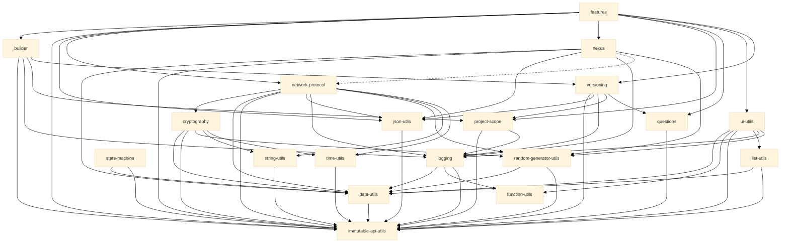

# Library Compatibility Matrix

> Generated from each package's `project.json` and `package.json`. Regenerate it with `npx nx lint:all` rather than editing it by hand.

## Platform Support

| Library | Node.js | Browser | Web Worker | CDN Bundle |
| --- | --- | --- | --- | --- |
| `@hyperfrontend/builder` | ✅ | ❌ | ❌ | ❌ |
| `@hyperfrontend/cryptography` | ✅ | ✅ | ✅ | ✅ |
| `@hyperfrontend/data-utils` | ✅ | ✅ | ✅ | ✅ |
| `@hyperfrontend/features` | ✅ | ✅ | ⚠️ | ✅ |
| `@hyperfrontend/function-utils` | ✅ | ✅ | ✅ | ✅ |
| `@hyperfrontend/immutable-api-utils` | ✅ | ✅ | ✅ | ✅ |
| `@hyperfrontend/json-utils` | ✅ | ✅ | ✅ | ✅ |
| `@hyperfrontend/list-utils` | ✅ | ✅ | ✅ | ✅ |
| `@hyperfrontend/logging` | ✅ | ✅ | ✅ | ✅ |
| `@hyperfrontend/network-protocol` | ✅ | ✅ | ✅ | ✅ |
| `@hyperfrontend/nexus` | ✅ | ✅ | ✅ | ✅ |
| `@hyperfrontend/project-scope` | ✅ | ❌ | ❌ | ❌ |
| `@hyperfrontend/questions` | ✅ | ❌ | ❌ | ❌ |
| `@hyperfrontend/random-generator-utils` | ✅ | ✅ | ✅ | ✅ |
| `@hyperfrontend/state-machine` | ✅ | ✅ | ✅ | ✅ |
| `@hyperfrontend/string-utils` | ✅ | ✅ | ✅ | ✅ |
| `@hyperfrontend/time-utils` | ✅ | ✅ | ✅ | ✅ |
| `@hyperfrontend/ui-utils` | ⚠️ | ✅ | ✅ | ✅ |
| `@hyperfrontend/versioning` | ✅ | ❌ | ❌ | ❌ |

Legend: ✅ full support, ⚠️ partial support, ❌ no support, ❓ nothing declared. CDN Bundle marks the packages whose build produces an IIFE or UMD bundle.

**Notes**

- `@hyperfrontend/features`: Support is per entry point: `/host` and `/hostee` are browser runtimes, `/cli`, `/server`, and `/generators` are Node-only, and the root entry is DOM-free and runs anywhere.
- `@hyperfrontend/ui-utils`: Some utilities require browser APIs; check individual exports.

## Output Formats

| Library | ESM | CJS | IIFE | UMD | Global name |
| --- | --- | --- | --- | --- | --- |
| `@hyperfrontend/builder` | ✅ | ✅ | ❌ | ❌ | - |
| `@hyperfrontend/cryptography` | ✅ | ✅ | ✅ | ✅ | `HyperfrontendCryptography` |
| `@hyperfrontend/data-utils` | ✅ | ✅ | ✅ | ✅ | `HyperfrontendDataUtils` |
| `@hyperfrontend/features` | ✅ | ✅ | ✅ | ✅ | `HyperfrontendFeaturesHost`, `HyperfrontendFeaturesHostee`, `HyperfrontendFeaturesDebugUi` |
| `@hyperfrontend/function-utils` | ✅ | ✅ | ✅ | ✅ | `HyperfrontendFunctionUtils` |
| `@hyperfrontend/immutable-api-utils` | ✅ | ✅ | ✅ | ✅ | `HyperfrontendImmutableApiUtils` |
| `@hyperfrontend/json-utils` | ✅ | ✅ | ✅ | ✅ | `HyperfrontendJsonUtils` |
| `@hyperfrontend/list-utils` | ✅ | ✅ | ✅ | ✅ | `HyperfrontendListUtils` |
| `@hyperfrontend/logging` | ✅ | ✅ | ✅ | ✅ | `HyperfrontendLogging` |
| `@hyperfrontend/network-protocol` | ✅ | ✅ | ✅ | ✅ | `HyperfrontendNetworkProtocolV3`, `HyperfrontendNetworkProtocolV4` |
| `@hyperfrontend/nexus` | ✅ | ✅ | ✅ | ✅ | `HyperfrontendNexus` |
| `@hyperfrontend/project-scope` | ✅ | ✅ | ❌ | ❌ | - |
| `@hyperfrontend/questions` | ✅ | ✅ | ❌ | ❌ | - |
| `@hyperfrontend/random-generator-utils` | ✅ | ✅ | ✅ | ✅ | `HyperfrontendRandomGenerator` |
| `@hyperfrontend/state-machine` | ✅ | ✅ | ✅ | ✅ | `HyperfrontendStateMachine` |
| `@hyperfrontend/string-utils` | ✅ | ✅ | ✅ | ✅ | `HyperfrontendStringUtils` |
| `@hyperfrontend/time-utils` | ✅ | ✅ | ✅ | ✅ | `HyperfrontendTimeUtils` |
| `@hyperfrontend/ui-utils` | ✅ | ✅ | ✅ | ✅ | `HyperfrontendUIUtils` |
| `@hyperfrontend/versioning` | ✅ | ✅ | ❌ | ❌ | - |

## Engine Requirements

| Library | Node.js | npm |
| --- | --- | --- |
| `@hyperfrontend/builder` | `>=18.0.0` | `>=8.0.0` |
| `@hyperfrontend/cryptography` | `>=18.0.0` | `>=8.0.0` |
| `@hyperfrontend/data-utils` | `>=18.0.0` | `>=8.0.0` |
| `@hyperfrontend/features` | `>=18.0.0` | `>=8.0.0` |
| `@hyperfrontend/function-utils` | `>=18.0.0` | `>=8.0.0` |
| `@hyperfrontend/immutable-api-utils` | `>=18.0.0` | `>=8.0.0` |
| `@hyperfrontend/json-utils` | `>=18.0.0` | `>=8.0.0` |
| `@hyperfrontend/list-utils` | `>=18.0.0` | `>=8.0.0` |
| `@hyperfrontend/logging` | `>=18.0.0` | `>=8.0.0` |
| `@hyperfrontend/network-protocol` | `>=18.0.0` | `>=8.0.0` |
| `@hyperfrontend/nexus` | `>=18.0.0` | `>=8.0.0` |
| `@hyperfrontend/project-scope` | `>=18.0.0` | `>=8.0.0` |
| `@hyperfrontend/questions` | `>=18.0.0` | `>=8.0.0` |
| `@hyperfrontend/random-generator-utils` | `>=18.0.0` | `>=8.0.0` |
| `@hyperfrontend/state-machine` | `>=18.0.0` | `>=8.0.0` |
| `@hyperfrontend/string-utils` | `>=18.0.0` | `>=8.0.0` |
| `@hyperfrontend/time-utils` | `>=18.0.0` | `>=8.0.0` |
| `@hyperfrontend/ui-utils` | `>=18.0.0` | `>=8.0.0` |
| `@hyperfrontend/versioning` | `>=18.0.0` | `>=8.0.0` |

## Dependency Graph

| Library | Depends on |
| --- | --- |
| `@hyperfrontend/builder` | `@hyperfrontend/immutable-api-utils`, `@hyperfrontend/logging`, `@hyperfrontend/project-scope`, `@hyperfrontend/versioning` |
| `@hyperfrontend/cryptography` | `@hyperfrontend/data-utils`, `@hyperfrontend/immutable-api-utils`, `@hyperfrontend/random-generator-utils`, `@hyperfrontend/string-utils`, `@hyperfrontend/time-utils` |
| `@hyperfrontend/data-utils` | `@hyperfrontend/immutable-api-utils` |
| `@hyperfrontend/features` | `@hyperfrontend/builder`, `@hyperfrontend/immutable-api-utils`, `@hyperfrontend/json-utils`, `@hyperfrontend/network-protocol`, `@hyperfrontend/nexus`, `@hyperfrontend/project-scope`, `@hyperfrontend/questions`, `@hyperfrontend/ui-utils`, `@hyperfrontend/versioning` |
| `@hyperfrontend/function-utils` | - |
| `@hyperfrontend/immutable-api-utils` | - |
| `@hyperfrontend/json-utils` | `@hyperfrontend/immutable-api-utils` |
| `@hyperfrontend/list-utils` | `@hyperfrontend/data-utils`, `@hyperfrontend/immutable-api-utils` |
| `@hyperfrontend/logging` | `@hyperfrontend/data-utils`, `@hyperfrontend/function-utils`, `@hyperfrontend/immutable-api-utils` |
| `@hyperfrontend/network-protocol` | `@hyperfrontend/cryptography`, `@hyperfrontend/data-utils`, `@hyperfrontend/immutable-api-utils`, `@hyperfrontend/json-utils`, `@hyperfrontend/logging`, `@hyperfrontend/random-generator-utils`, `@hyperfrontend/string-utils`, `@hyperfrontend/time-utils` |
| `@hyperfrontend/nexus` | `@hyperfrontend/data-utils`, `@hyperfrontend/immutable-api-utils`, `@hyperfrontend/json-utils`, `@hyperfrontend/logging`, `@hyperfrontend/network-protocol` (peer), `@hyperfrontend/random-generator-utils` |
| `@hyperfrontend/project-scope` | `@hyperfrontend/immutable-api-utils`, `@hyperfrontend/logging` |
| `@hyperfrontend/questions` | `@hyperfrontend/immutable-api-utils` |
| `@hyperfrontend/random-generator-utils` | `@hyperfrontend/data-utils`, `@hyperfrontend/immutable-api-utils` |
| `@hyperfrontend/state-machine` | `@hyperfrontend/data-utils`, `@hyperfrontend/immutable-api-utils` |
| `@hyperfrontend/string-utils` | `@hyperfrontend/immutable-api-utils` |
| `@hyperfrontend/time-utils` | `@hyperfrontend/immutable-api-utils` |
| `@hyperfrontend/ui-utils` | `@hyperfrontend/data-utils`, `@hyperfrontend/function-utils`, `@hyperfrontend/immutable-api-utils`, `@hyperfrontend/list-utils`, `@hyperfrontend/logging`, `@hyperfrontend/random-generator-utils` |
| `@hyperfrontend/versioning` | `@hyperfrontend/immutable-api-utils`, `@hyperfrontend/json-utils`, `@hyperfrontend/logging`, `@hyperfrontend/project-scope`, `@hyperfrontend/questions` |

Solid edges are runtime dependencies; dotted edges are peer dependencies.

## Published Versions

| Library | Version |
| --- | --- |
| `@hyperfrontend/builder` | `0.2.1` |
| `@hyperfrontend/cryptography` | `1.1.0` |
| `@hyperfrontend/data-utils` | `1.0.0` |
| `@hyperfrontend/features` | `0.10.0` |
| `@hyperfrontend/function-utils` | `1.0.0` |
| `@hyperfrontend/immutable-api-utils` | `1.0.0` |
| `@hyperfrontend/json-utils` | `1.0.0` |
| `@hyperfrontend/list-utils` | `0.1.0` |
| `@hyperfrontend/logging` | `1.0.0` |
| `@hyperfrontend/network-protocol` | `2.0.0` |
| `@hyperfrontend/nexus` | `3.0.0` |
| `@hyperfrontend/project-scope` | `0.2.4` |
| `@hyperfrontend/questions` | `0.3.0` |
| `@hyperfrontend/random-generator-utils` | `0.2.0` |
| `@hyperfrontend/state-machine` | `0.2.0` |
| `@hyperfrontend/string-utils` | `1.0.0` |
| `@hyperfrontend/time-utils` | `1.0.0` |
| `@hyperfrontend/ui-utils` | `0.0.8` |
| `@hyperfrontend/versioning` | `0.8.0` |
