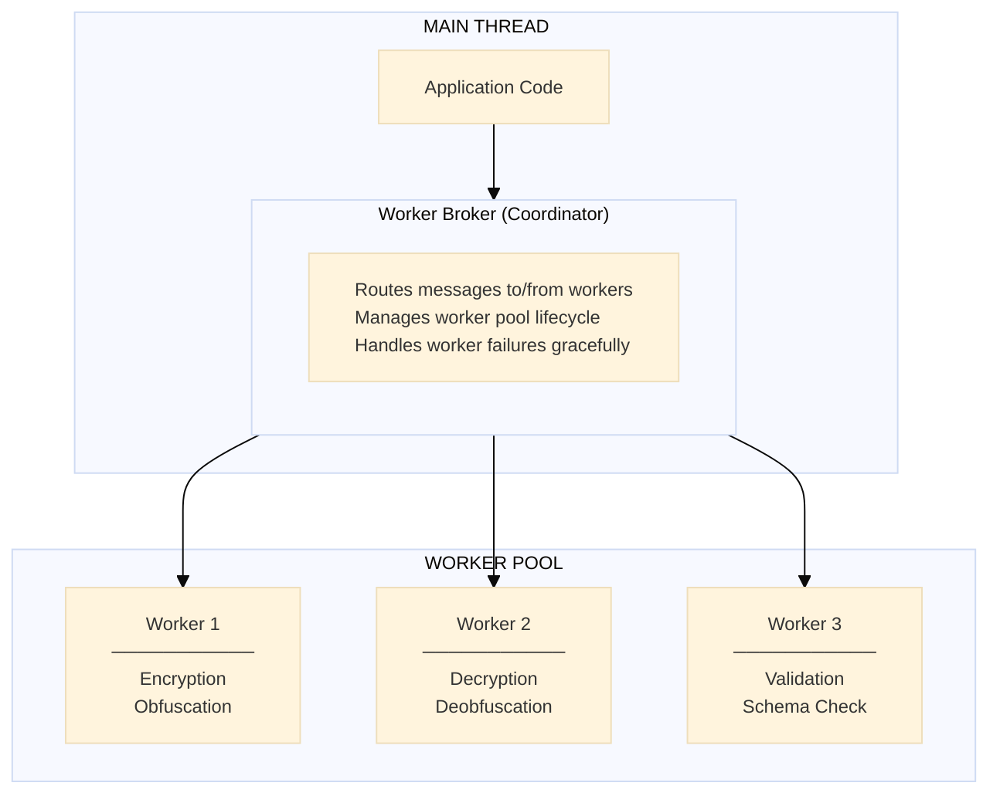

# Hyperfrontend Manifesto

**Why this exists, where it's going, and what I won't build**

---

## Why This Exists

Hyperfrontend is a personal project years in the making, born from a simple frustration: the JavaScript ecosystem has become a battleground where frameworks compete rather than collaborate.

Every few years, a new framework emerges and fragments the community further. Teams rewrite working applications chasing the latest paradigm. Companies end up maintaining parallel implementations of the same business logic in Angular, React, and Vue—not because any framework is wrong, but because we never agreed on how to share.

This project is my attempt to solve that problem once and for all.

The goal isn't to replace frameworks or pick winners. It's to create a neutral protocol layer where **any framework can participate**. A React application and an Angular application should be able to collaborate at runtime without caring about each other's internals. Legacy code shouldn't need rewrites to integrate with modern systems.

The minimum bar is something useful that people don't hate using. The real vision is a focal point where the community can collaborate instead of splinter—an antithesis to the constant framework wars.

If this sounds idealistic, that's fine. Good software often starts that way.

---

## Scope Boundaries

I'm one person, and even with a small group of future maintainers, there's only so much we can realistically build and maintain well. These boundaries exist to keep the project focused and sustainable.

### Framework-Specific Adapters

I will not be building React hooks, Vue composables, Angular services, or Svelte stores. Ever.

This isn't because I don't think they'd be useful—they would be. But hyperfrontend's value is in the **protocol layer**, not framework bindings. The `createBroker()` and channel APIs are deliberately vanilla JavaScript. They work everywhere, with anything.

**If you want framework-specific ergonomics, build them yourself.** Seriously. A React hook wrapping `createBroker()` is maybe 30 lines of code. You know your patterns, your state management, your conventions better than I ever will. Build what makes sense for your team, publish it, share it with others using the same framework.

This is a feature, not a limitation. Framework experts should own framework integrations.

### Web Components / Shadow DOM

Hyperfrontend uses iframes for isolation. Not Shadow DOM. Not Web Components.

The reason is simple: iframes provide real security boundaries. They enforce the Same-Origin Policy. They isolate JavaScript runtimes. Shadow DOM gives you style encapsulation, but the JavaScript still shares a runtime—which means untrusted feature code could access your host application's globals, cookies, or DOM.

For trusted widgets on your own domain, Shadow DOM might be fine. But hyperfrontend is designed for scenarios where you're embedding applications you don't fully control. Iframes are the only browser primitive that actually delivers on that promise.

I'm not interested in supporting both models. It would complicate the security story and split focus. Pick the right tool for your use case—if you need Shadow DOM, other solutions exist.

---

## What's Done

### Features SDK, CLI, and Shell Generation

A feature app declares its contract and connects with `createFeature`; a host mounts it with
`createShell`. The bundled `hf` CLI scaffolds the feature side, generates a self-contained shell
package with the contract inlined and a security envelope baked in, and serves both sides locally
with a debug UI. An optional Nx adapter ships a `feature` generator and `build`/`serve` executors.

```bash
npx @hyperfrontend/features init                # scaffold the feature glue into an app
npx @hyperfrontend/features build --protocol v2 # generate + bundle a publishable shell package
npx @hyperfrontend/features dev                 # serve apps with the debug UI
```

The envelope is a deliberate choice rather than a default: a build refuses to run until it is told
which one to bake in.

The session model underneath — gated handshake, pinned origins, versioned contracts, schema
validation on both ends, four-state liveness, and flush-then-confirm teardown — is described in the
[Architecture Guide](ARCHITECTURE.md) and derived from scratch in
[Microfrontends from first principles](https://www.hyperfrontend.dev/articles/microfrontends-from-first-principles).

### Security Layer

End-to-end encryption is integrated directly into the broker. See the [Architecture Guide](ARCHITECTURE.md#security-layer-network-protocol) for details, and the
[Security Model](https://www.hyperfrontend.dev/docs/core-concepts/security) for what it is worth
against which adversary.

```typescript
import { createBroker } from '@hyperfrontend/nexus'
import { createProtocol } from '@hyperfrontend/network-protocol/browser/v2'

const broker = createBroker({
  name: 'secure-host',
  contract,
  security: {
    protocol: createProtocol(logger, 60),
    required: true,
  },
})
```

**What this gives you:**

- Protocol negotiation during handshake (v1 obfuscation, v2 encryption, or none)
- Configurable fallback behavior
- All messages pass through the encryption pipeline automatically
- Time-based key rotation with clock skew tolerance

---

## What's Next

> **This section is a roadmap, not an API reference.** Nothing below has shipped, and the code
> sketches are illustrations of intent — package names, signatures, and file layouts will change as
> each item is built. For what exists today, see the [Architecture Guide](ARCHITECTURE.md) and the
> [documentation site](https://www.hyperfrontend.dev/docs).

### Web Worker Offloading

Encryption and schema validation can block the UI thread on large messages. The plan is a new `@hyperfrontend/nexus-worker` package that offloads this work to a Web Worker pool.

```typescript
import { createWorkerBroker } from '@hyperfrontend/nexus-worker'

const broker = createWorkerBroker({
  name: 'main-app',
  contract,
  workers: {
    pool: 4,
    encryption: true,
    validation: true,
  },
})
```



The API stays compatible with `@hyperfrontend/nexus`—it's just faster for heavy workloads.

---

### Host-Side Consumption Generator

Turning an app _into_ a feature is automated; embedding one is still hand-written. The missing
counterpart is a generator that runs in the host and does the wiring for you — install the shell
tarball or package, read its `metadata.json`, and scaffold a typed integration point in the
host's own idiom:

```bash
npx nx g @hyperfrontend/features:add --feature=my-feature --host=my-host
```

The feature side of this already exists: `hf init`, `hf build`, and the Nx `feature` generator and
`build`/`serve` executors. What is missing is the host's half of the same convenience.

---

### Feature Registry

Further out, I'd like to build a discovery service for organizations with many features. The idea is a lightweight registry where teams can publish feature metadata and shells, and host applications can discover what's available.

```typescript
import { FeatureRegistry } from '@hyperfrontend/registry'

const registry = new FeatureRegistry({
  endpoint: 'https://registry.example.com',
})

const features = await registry.list()
// [
//   { name: 'email-status', version: '2.1.0' },
//   { name: 'user-profile', version: '1.0.0' }
// ]

const shell = await registry.loadShell('email-status', '2.1.0')
shell.mount('#container', { theme: 'dark' })
```

This is lower priority than the core protocol work, but it's on my mind for organizations that end up with many features.

---

## Get Involved

If any of this resonates with you, I'd love your help. Every item here is designed to be independently implementable.

Before diving in:

1. Open an issue to discuss your approach
2. Reference this document and the [Architecture Guide](ARCHITECTURE.md)
3. Follow the patterns established in `@hyperfrontend/nexus`

See [CONTRIBUTING.md](CONTRIBUTING.md) for setup instructions.
