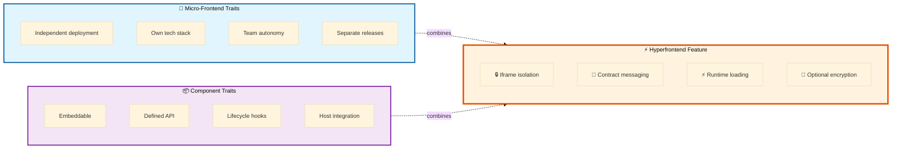

# hyperfrontend

<p align="center">
  <picture>
    <source media="(prefers-color-scheme: dark)" srcset="https://github.com/AndrewRedican/hyperfrontend/blob/main/assets/logo/hf-dark.svg?raw=true">
    
  </picture>
</p>
<p align="center">
  A hybrid <a href="https://en.wikipedia.org/wiki/Micro_frontend">micro-frontend</a> pattern to embed live web applications with communication protocols, lifecycle, and contract standards
</p>

<p align="center">
  <a href="https://www.hyperfrontend.dev">Docs</a> |
  <a href="https://github.com/AndrewRedican/hyperfrontend/blob/main/MANIFESTO.md">Manifesto</a> |
  <a href="https://github.com/AndrewRedican/hyperfrontend/blob/main/README.md#installation">Installation</a> |
  <a href="https://github.com/AndrewRedican/hyperfrontend/blob/main/README.md#quick-start">Quick Start</a> |
  <a href="https://github.com/AndrewRedican/hyperfrontend/blob/main/ARCHITECTURE.md">Architecture</a> |
  <a href="https://github.com/AndrewRedican/hyperfrontend/blob/main/README.md#live-demos">Live Demos</a> |
  <a href="https://github.com/AndrewRedican/hyperfrontend/blob/main/ACKNOWLEDGMENTS.md">Acknowledgments</a>
</p>

<p align="center">
  <a href="https://github.com/AndrewRedican/hyperfrontend/actions/workflows/ci-main.yml">
    
  </a>
  <a href="https://codecov.io/gh/AndrewRedican/hyperfrontend">
    
  </a>
  <a href="https://github.com/sponsors/AndrewRedican">
    
  </a>
  <!-- ALL-CONTRIBUTORS-BADGE:START - Do not remove or modify this section -->
  <a href="#contributors">
    
  </a>
  <!-- ALL-CONTRIBUTORS-BADGE:END -->
  <a href="https://github.com/AndrewRedican/hyperfrontend/blob/main/LICENSE.md">
    
  </a>
</p>

---

Look, nobody cares what framework you're using. [React](https://react.dev/), [Angular](https://angular.dev/), [Vue](https://vuejs.org/), that [jQuery](https://jquery.com/) thing from 2014 — whatever. You just want to ship the damn thing and go home.

Hyperfrontend lets you **compose your existing apps together securely** — like Lego bricks. No rewrites. No "let's align on a shared component library" meetings. Just plug it in and _it works_.

Display another app inside yours with a native look and feel — embed it seamlessly inline, throw it in a modal, pop it out in a new window, open a new tab. Your call. And you don't have to roll your own glue code to make them talk to each other.

Need to pass sensitive stuff between apps? Transactions, [PII](https://en.wikipedia.org/wiki/Personal_data), [auth tokens](https://en.wikipedia.org/wiki/Access_token)? Opt into the **encrypted messaging protocol**. It's built to stop [man-in-the-middle](https://en.wikipedia.org/wiki/Man-in-the-middle_attack) snooping and limit [XSS](https://en.wikipedia.org/wiki/Cross-site_scripting) blast radius — not just "button clicked" events, but the stuff that actually matters.

> Want the full picture? The [Manifesto](MANIFESTO.md) digs into the _why_ behind all of this.

---

## What is a Hyperfrontend Feature?

A **hyperfrontend feature** is your standalone frontend app — whether it was written ten years ago or last month. It could be React, Angular, Vue, Svelte, vanilla JS... doesn't matter. It manages its own state, handles its own auth, talks to its own backend. It's _yours_.

The difference? Now it can be plugged into other apps (or have other apps plugged into it) without anyone having to rewrite anything.

Think of it as combining the best of [micro-frontends](https://en.wikipedia.org/wiki/Micro_frontend) and embeddable components:



**Not a feature:** UI components, shared libraries, SPA routes, or [monolithic](https://en.wikipedia.org/wiki/Monolithic_application) frontends.

## How It Works

Each hyperfrontend feature uses the standard communication protocol provided by the **[@hyperfrontend/nexus](https://github.com/AndrewRedican/hyperfrontend/blob/main/libs/nexus)** library. This enables:

- **Contract-validated messaging** - Features define clear interfaces specifying emitted and accepted message types
- **Broker-channel architecture** - A TCP-like protocol over the browser's postMessage API routes messages between contexts
- **Iframe-based isolation** - Each feature operates in its own browser context with true security boundaries

For a deep dive into how the libraries compose together, see the **[Architecture Guide](ARCHITECTURE.md)**.

The **[@hyperfrontend/features](https://github.com/AndrewRedican/hyperfrontend/blob/main/libs/features)** package — an SDK, CLI, and dev server — helps you:

1. **Transform existing web apps** into hyperfrontend features by adding the necessary configuration
2. **Generate shell packages** that know how to load your frontend app at runtime
3. **Consume features** in host applications with typed bindings

Each feature gets an accompanying **shell package** that is:

- Self-contained with no external dependencies
- Installable as an npm package, in ESM or CommonJS form
- Responsible for loading and initializing the feature at runtime

This architecture enables you to compose applications from independently developed and deployed features, enabling true micro-frontend modularity.

## Why Hyperfrontend?

### Free Teams from Deployment Coordination

Hyperfrontend eliminates the need for teams to coordinate deployments, especially critical for organizations with:

- **Global teams** spanning multiple timezones
- **Different priorities and roadmaps** for each team
- **Varied technical capabilities** and framework preferences

Each feature is independently deployable - no more waiting for other teams to merge, test, or deploy before shipping your updates.

### Protect Against Version Thrashing

Traditional build-time integration creates tight coupling that leads to:

- Dependency conflicts when teams upgrade at different rates
- Breaking changes that cascade across the entire application
- Forced upgrades that consume valuable development time

Hyperfrontend's runtime integration approach isolates each feature's dependencies, allowing teams to:

- Upgrade frameworks on their own schedule
- Use different versions of the same library across features
- Deploy updates without breaking other features

### Modernize Without Expensive Rewrites

Hyperfrontend makes existing brownfield or mature projects easily consumable:

- **Wrap legacy applications** as features without rewriting them
- **Incrementally modernize** - replace features one at a time
- **Mix old and new** - run legacy AngularJS alongside modern React
- **Preserve investments** - keep working code working while evolving

The shell package defines a clear interface to interact with each feature, abstracting away the complexity of frontend coordination regardless of the underlying technology.

### Still Modern and Developer-Friendly

Despite its flexibility, hyperfrontend caters to modern frontend setups:

- Full TypeScript support with type-safe contracts
- Works with all modern build tools (Vite, Webpack, Rollup, etc.)
- Compatible with SSR and static site generation
- CLI to scaffold, build, and serve features, with optional Nx generators and executors
- Standard npm packages, published in ESM and CommonJS form

## Key Capabilities

- Framework-agnostic micro-frontend architecture
- Standardized communication via the browser's postMessage API (iframes, windows, tabs, web workers)
- Lifecycle management for embedded applications
- Contract-based integration with JSON Schema validation
- Broker-channel message routing with optional encryption
- Cross-stack compatibility (React, Vue, Angular, Svelte, vanilla JS)
- Self-contained shell packages with all dependencies bundled in
- Shells published as ESM and CommonJS; the libraries themselves also ship IIFE and UMD builds for CDN use

## Installation

Install the package:

```bash
npm install @hyperfrontend/features
```

## Quick Start

Four words recur below. The **host** is the application providing the containing product surface; the **hostee** is the application loaded inside it (the one hosted, as in _employee_). A **feature** is a hostee viewed as a product unit, and its **shell** is the package it ships so a host can embed it. See [Core Concepts](https://www.hyperfrontend.dev/docs/core-concepts) for the full vocabulary.

The bundled `hf` CLI drives the workflow. Run it with `npx @hyperfrontend/features <command>`.

### Creating a Feature

Initialize an existing application as a hyperfrontend feature:

```bash
npx @hyperfrontend/features init
```

This scaffolds the hostee glue module into your app and wires it into the entry file. You declare the feature's contract (the actions it emits and accepts) alongside it.

### Building a Feature

Generate and bundle a self-contained shell package that any host can install:

```bash
npx @hyperfrontend/features build --protocol v2
```

The CLI generates the shell package, inlines the contract, bundles every dependency into it, and packs a publishable tarball with typed bindings — the host installs one package and takes on no transitive dependencies. The security envelope is an explicit choice: pass `--protocol v1` or `--protocol v2` (or declare `protocol` in the feature config) and the build bakes it in as the shell's default.

### Testing Your Feature

Serve your apps with the debug UI to interact with your feature in isolation:

```bash
npx @hyperfrontend/features dev
```

This starts one static server per app plus an in-browser debug UI for inspecting host/hostee message traffic, display modes, resizing, and the security envelope.

> **Using Nx?** The package also ships a `feature` generator and `build`/`serve` executors (`npx nx add @hyperfrontend/features`) to streamline integration in an Nx workspace.

## Live Demos

| Demo                                                    | Description                |
| ------------------------------------------------------- | -------------------------- |
| [Chess](https://hyperfrontend.dev/demo/chess)           | Chess game demonstration   |
| [Clock](https://hyperfrontend.dev/demo/clock)           | Clock demonstration        |
| [Events](https://hyperfrontend.dev/demo/events)         | Events demonstration       |
| [File Share](https://hyperfrontend.dev/demo/file-share) | File sharing demonstration |
| [Heartbeat](https://hyperfrontend.dev/demo/heartbeat)   | Heartbeat demonstration    |
| [Views](https://hyperfrontend.dev/demo/views)           | Views demonstration        |

## Main Packages

| Package                                                                                           | Description                                                                                                                                                                   |
| ------------------------------------------------------------------------------------------------- | ----------------------------------------------------------------------------------------------------------------------------------------------------------------------------- |
| [@hyperfrontend/builder](https://github.com/AndrewRedican/hyperfrontend/blob/main/libs/builder)   | Composable, vendor-neutral build toolkit for TypeScript libraries, JS bins, and Node SEA native binaries · [📖 docs](https://www.hyperfrontend.dev/docs/libraries/builder/)   |
| [@hyperfrontend/features](https://github.com/AndrewRedican/hyperfrontend/blob/main/libs/features) | SDK, CLI, and dev server for building, embedding, and orchestrating hyperfrontend micro-frontend features · [📖 docs](https://www.hyperfrontend.dev/docs/libraries/features/) |
| [@hyperfrontend/nexus](https://github.com/AndrewRedican/hyperfrontend/blob/main/libs/nexus)       | Cross-window communication with contracts, lifecycle management, and security · [📖 docs](https://www.hyperfrontend.dev/docs/libraries/nexus/)                                |

## Internal Packages

| Package                                                                                                        | Description                                                                                                                                                                   |
| -------------------------------------------------------------------------------------------------------------- | ----------------------------------------------------------------------------------------------------------------------------------------------------------------------------- |
| [cryptography](https://github.com/AndrewRedican/hyperfrontend/blob/main/libs/cryptography)                     | Cryptography utilities for browser and Node.js environments · [📖 docs](https://www.hyperfrontend.dev/docs/libraries/cryptography/)                                           |
| [data-utils](https://github.com/AndrewRedican/hyperfrontend/blob/main/libs/utils/data)                         | Data manipulation and transformation utilities · [📖 docs](https://www.hyperfrontend.dev/docs/libraries/utils/data/)                                                          |
| [function-utils](https://github.com/AndrewRedican/hyperfrontend/blob/main/libs/utils/function)                 | Function composition and manipulation utilities · [📖 docs](https://www.hyperfrontend.dev/docs/libraries/utils/function/)                                                     |
| [immutable-api-utils](https://github.com/AndrewRedican/hyperfrontend/blob/main/libs/utils/immutable-api)       | Immutable API utilities for functional programming · [📖 docs](https://www.hyperfrontend.dev/docs/libraries/utils/immutable-api/)                                             |
| [json-utils](https://github.com/AndrewRedican/hyperfrontend/blob/main/libs/utils/json)                         | Zero-dependency JSON Schema Draft v4 validation and schema generation · [📖 docs](https://www.hyperfrontend.dev/docs/libraries/utils/json/)                                   |
| [list-utils](https://github.com/AndrewRedican/hyperfrontend/blob/main/libs/utils/list)                         | List and array manipulation utilities · [📖 docs](https://www.hyperfrontend.dev/docs/libraries/utils/list/)                                                                   |
| [logging](https://github.com/AndrewRedican/hyperfrontend/blob/main/libs/logging)                               | Structured logging utilities for applications · [📖 docs](https://www.hyperfrontend.dev/docs/libraries/logging/)                                                              |
| [network-protocol](https://github.com/AndrewRedican/hyperfrontend/blob/main/libs/network-protocol)             | Network protocol implementation with channels, routing, and security · [📖 docs](https://www.hyperfrontend.dev/docs/libraries/network-protocol/)                              |
| [project-scope](https://github.com/AndrewRedican/hyperfrontend/blob/main/libs/project-scope)                   | Project analysis, technology stack detection, and transactional virtual file system · [📖 docs](https://www.hyperfrontend.dev/docs/libraries/project-scope/)                  |
| [questions](https://github.com/AndrewRedican/hyperfrontend/blob/main/libs/questions)                           | Terminal prompting library with composable, functional API · [📖 docs](https://www.hyperfrontend.dev/docs/libraries/questions/)                                               |
| [random-generator-utils](https://github.com/AndrewRedican/hyperfrontend/blob/main/libs/utils/random-generator) | Random number and data generation utilities · [📖 docs](https://www.hyperfrontend.dev/docs/libraries/utils/random-generator/)                                                 |
| [state-machine](https://github.com/AndrewRedican/hyperfrontend/blob/main/libs/state-machine)                   | State machine implementation with lifecycle management, actions, and reducers · [📖 docs](https://www.hyperfrontend.dev/docs/libraries/state-machine/)                        |
| [string-utils](https://github.com/AndrewRedican/hyperfrontend/blob/main/libs/utils/string)                     | String manipulation utilities for browser and Node.js environments · [📖 docs](https://www.hyperfrontend.dev/docs/libraries/utils/string/)                                    |
| [time-utils](https://github.com/AndrewRedican/hyperfrontend/blob/main/libs/utils/time)                         | Time and date manipulation utilities · [📖 docs](https://www.hyperfrontend.dev/docs/libraries/utils/time/)                                                                    |
| [ui-utils](https://github.com/AndrewRedican/hyperfrontend/blob/main/libs/utils/ui)                             | UI utilities for elements, events, styling, and mobile interactions · [📖 docs](https://www.hyperfrontend.dev/docs/libraries/utils/ui/)                                       |
| [versioning](https://github.com/AndrewRedican/hyperfrontend/blob/main/libs/versioning)                         | One-stop commit lifecycle — `cz` author bin, `cl` validator bin, changelog parsing, semver release flow · [📖 docs](https://www.hyperfrontend.dev/docs/libraries/versioning/) |
| [web-worker](https://github.com/AndrewRedican/hyperfrontend/blob/main/libs/web-worker)                         | Web Worker utilities and abstractions · [📖 docs](https://www.hyperfrontend.dev/docs/libraries/web-worker/)                                                                   |

## Documentation

A comprehensive documentation site is under active development at [hyperfrontend.dev](https://www.hyperfrontend.dev).

**What to expect:**

- **Complete API Reference** — Auto-generated documentation for all libraries with TypeScript types, parameters, and examples
- **Versioned Documentation** — Match documentation to your installed package version
- **Fuzzy Search** — Find what you need instantly with Algolia-powered search
- **Interactive Code Examples** — Syntax-highlighted, copyable code snippets
- **Architecture Guides** — Deep dives into how the libraries work together
- **Getting Started Tutorials** — Step-by-step guides for common use cases

**Current documentation:**

- Each library has a detailed README with installation, usage, and architecture information
- See the [Main Packages](#main-packages) and [Internal Packages](#internal-packages) tables above for links
- [Architecture Guide](ARCHITECTURE.md) explains how the libraries compose together
- [Manifesto](MANIFESTO.md) explains the project's philosophy and scope

For the documentation roadmap, see [roadmap/docs-site-action-plan.md](roadmap/docs-site-action-plan.md).

## Contributing

We welcome contributions! Please read our [Contributing Guide](CONTRIBUTING.md) for details on:

- Setting up your development environment (we recommend using GitHub Codespaces!)
- Our code of conduct and contribution process
- How to submit pull requests
- Coding standards and commit message guidelines

If you plan to use LLM assistance, see [REGARDING_AI.md](REGARDING_AI.md) for how AI tooling is used in this project.

**Important**: All contributors must sign our [Contributor License Agreement (CLA)](CONTRIBUTING.md#contributor-license-agreement-cla) before pull requests can be merged.

## Security

If you discover a security vulnerability, please follow our responsible disclosure process outlined in our [Security Policy](SECURITY.md). Do not report security issues through public GitHub issues.

## Support & Funding

If you find hyperfrontend useful, please consider supporting the project:

- ⭐ [Star the repository](https://github.com/AndrewRedican/hyperfrontend)
- 💖 [Sponsor on GitHub](https://github.com/sponsors/AndrewRedican)
- 📣 [Share on X](https://twitter.com/intent/tweet?text=Check%20out%20hyperfrontend%20-%20a%20hybrid%20micro-frontend%20pattern%20for%20embedding%20live%20web%20apps%20with%20communication%20protocols%20and%20lifecycle%20management&url=https://github.com/AndrewRedican/hyperfrontend)

See [FUNDING.md](FUNDING.md) for more ways to support the project.

## Contributors

Thanks to these wonderful people who have contributed to hyperfrontend:

<!-- ALL-CONTRIBUTORS-LIST:START - Do not remove or modify this section -->
<!-- prettier-ignore-start -->
<!-- markdownlint-disable -->
<table>
  <tbody>
    <tr>
      <td align="center" valign="top" width="14.28%"><a href="https://github.com/AndrewRedican"><br /><sub><b>Andrew Redican</b></sub></a><br /><a href="https://github.com/AndrewRedican/hyperfrontend/commits?author=AndrewRedican" title="Code">💻</a> <a href="https://github.com/AndrewRedican/hyperfrontend/commits?author=AndrewRedican" title="Documentation">📖</a> <a href="#infra-AndrewRedican" title="Infrastructure (Hosting, Build-Tools, etc)">🚇</a> <a href="#maintenance-AndrewRedican" title="Maintenance">🚧</a> <a href="#projectManagement-AndrewRedican" title="Project Management">📆</a> <a href="#ideas-AndrewRedican" title="Ideas, Planning, & Feedback">🤔</a></td>
      <td align="center" valign="top" width="14.28%"><a href="https://github.com/bbsmithy"><br /><sub><b>Brian Smith</b></sub></a><br /><a href="#ideas-bbsmithy" title="Ideas, Planning, & Feedback">🤔</a></td>
    </tr>
  </tbody>
  <tfoot>
    <tr>
      <td align="center" size="13px" colspan="7">
        
          <a href="https://all-contributors.js.org/docs/en/bot/usage">Add your contributions</a>
        </img>
      </td>
    </tr>
  </tfoot>
</table>

<!-- markdownlint-restore -->
<!-- prettier-ignore-end -->

<!-- ALL-CONTRIBUTORS-LIST:END -->

This project follows the [all-contributors](https://allcontributors.org) specification. Contributions of any kind are welcome!

## Acknowledgments

This project wouldn't exist without the support of many people — family, friends, mentors, and the broader open source community. Read the full [Acknowledgments](ACKNOWLEDGMENTS.md) to learn about the humans behind the code.

## License

See [LICENSE.md](LICENSE.md) file for details.
