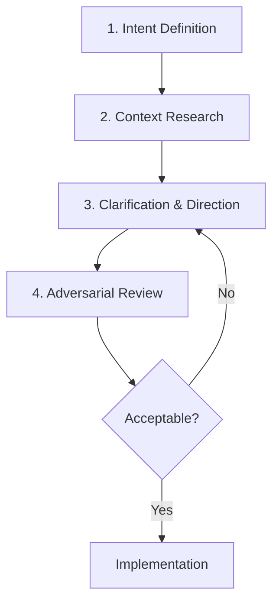

> This document describes how AI and Large Language Models are used in this project. It is written for contributors, auditors, and anyone curious about the intersection of human judgment and machine-generated code.

### The Role of AI in This Codebase

Parts of this codebase were produced with the assistance of LLMs, particularly `Claude Opus 4.5`. The original core libraries were written without them. As the project evolved, AI tools were used to accelerate refinement, documentation, and expansion. Today, we continue to do so.

I see no reason to obscure that fact, and I do not think anyone should.

### On Productivity

AI has measurably improved the development speed of this project. Certain tasks move faster, such as the documentation you read describing library APIs and the use of mermaid diagrams describing how things relate to each other. We generate early drafts of refactors and net new features, which makes exploratory work much easier.

But the gains are uneven and frequently overstated.

Generating code quickly is not the same as producing reliable software. Verification still takes time. Integration still requires care. Edge cases still exist. Anyone claiming dramatic productivity improvements without acknowledging the cost of verification is describing only half the reality.

### Trust, but Verify

The working rule is simple: treat AI output as a proposal, not a conclusion.

Every new feature generated with LLM assistance goes through deliberate review before implementation proceeds. There is no reliance on unsupervised agent swarms generating large volumes of code. That approach can produce output, but it rarely produces good software.

Instead, development follows a structured human-in-the-loop process.

### The Process

I think of this as collaborative iteration: a structured feedback loop where human reasoning and machine assistance operate at different stages.

**Intent Definition.** The human writes down the goal we are trying to achieve, the technical direction we believe is appropriate, and a rough approach for how the solution might look. This is not a rigid specification. It leaves room for discovery without losing the intent.

**Context Research.** The LLM gathers information about the current state of the codebase. It reviews files, identifies patterns already present in the system, and organizes relevant constraints. The purpose is to establish a shared understanding of where we are before deciding where to go.

**Clarification and Direction.** After the initial context research, it is very common to have open questions, and potential solutions. Misunderstandings are corrected. The human's role here is to guide the direction of the solution, answer questions directly, and challenge assumptions.

Often glossed over, another important task is to probe for downstream consequences of any given solution <ins>and</ins> **improve our own technical understanding**. Over-reliance on these tools for decision making poses a risk to personal development. I strongly advise making time in this process to actually learn from it.

One recurring pattern is worth noting. LLMs tend to prefer the simplest implementation. Sometimes that instinct is correct. Other times we deliberately accept complexity in the implementation so the resulting developer experience becomes simpler and hopefully easier to use. The guiding principles here are transparency and clarity of intent. Clear intent helps draw that boundary.

**Adversarial Review.** Before implementation begins, the proposal goes through adversarial review. The LLM is asked to adopt a contrarian posture and probe for weaknesses. It looks for edge cases, feasibility issues, and unnecessary complexity. This step frequently surfaces problems that would otherwise appear later during development.

Only after surviving that review does implementation proceed.

### What LLMs Actually Are

Using LLMs effectively requires a clear understanding of their true nature.

Large language models are statistical pattern matchers trained on enormous collections of text and code. They generate responses by predicting what sequences of words are most likely to follow a prompt. Some predictions are remarkably useful. Others are confidently incorrect.

One of the clearest examples is the [**tyranny of averages**](https://en.wikipedia.org/wiki/Tyranny_of_averages).

The "tyranny of averages" (or fallacy of averages) is the statistical error of relying on mean values to make decisions, which ignores data variation and leads to inaccurate conclusions. It assumes an "average" represents the whole, often resulting in skewed designs or policies that serve no one, because the average is often atypical in heterogeneous data. The data on which LLMs are trained naturally favors the most common code patterns, so an LLM's first, second, and third proposed solutions are likely to address a specific problem suboptimally, especially when the problem itself is interesting. Specific problems require specific solutions. Using the rough output of your first LLM prompt will likely work against you precisely where your problem calls for a specific answer.

That is not their only limitation. They are not mind readers, and their output is only as good as the instructions and context they are given. They also sometimes produce plausible-sounding explanations that collapse under closer inspection.

The practical conclusion is fairly simple: treating LLMs as infallible systems leads to poor outcomes, while treating them as tools for structured reasoning assistance is far more productive.

### Responsibility Remains Human

Contributors to this project are permitted to use LLMs responsibly. They are tools, nothing more and nothing less.

The human contributor remains accountable for the output. Code generated with AI assistance is judged by the same standards as code written by hand. If a change becomes part of the codebase, the contributor introducing it owns the result.

### AI Disclosure in Pull Requests

If any part of a pull request was produced with AI assistance — code, tests, documentation, or commit messages — that must be stated in the PR description. This is required, not optional.

When the maintainer needs to examine something closely or trace the origin of a bug, knowing whether code reflects personal expertise or came out of an LLM prompt matters. They are not equivalent. The level of scrutiny applied to a contribution, and the trust extended to a contributor over time, both depend on that distinction.

Honesty about the extent of AI involvement is looked upon well here. If you used an LLM extensively and are not certain about every detail, say so. That candor is valued. What is not acceptable is presenting AI-generated work as though it is entirely the product of your own understanding when it is not.

The PR template has a dedicated section for this. It is required.

### Steering Output Toward Project Standards

One practical challenge when working with LLMs is consistency. Asking a model to follow coding conventions reliably is difficult. Documentation and instruction files can help, but the model treats them as context rather than strict rules.

This project takes a different approach: encode patterns as enforceable rules.

The codebase uses custom ESLint rules that express project standards programmatically. When generated code violates a pattern, the linter catches it. This creates a feedback loop where output is steered toward acceptance criteria mechanically rather than statistically.

I find this approach powerful. It shifts effort from reviewing every stylistic detail to defining rules once and enforcing them everywhere. Time spent writing those rules pays dividends across every future contribution, whether human or machine.

### What to Expect

Because of this workflow, the origins of code in this repository vary. Some portions were written entirely by hand. Some were generated by LLMs and then reviewed. Others emerged through iterative collaboration.

All of it is held to the same standard. The origin of a line of code matters less than whether it is correct, maintainable, and consistent with the project's goals.

### Closing Thoughts

Working with LLMs has gradually changed how I think about software development.

Since the emergence of the more modern LLMs, I have come to think of them as something like the digital materialization of the collective human mind, a raw material akin to mud or clay.

What they produce feels less like a finished artifact and more like raw material. Clay is abundant, flexible, and easy to shape. But raw clay alone does not produce fine ceramics. What matters is the craft applied to it: the shaping, the firing temperature, the glazing technique, the patience of the potter.

Software generated with LLMs behaves similarly. The raw material suddenly becomes abundant. Ideas, fragments of logic, and structural patterns appear quickly. But abundance does not imply quality. Clay is everywhere; fine porcelain is not.

Quality still comes from judgment and craft. What we build with this material depends on the potter.
