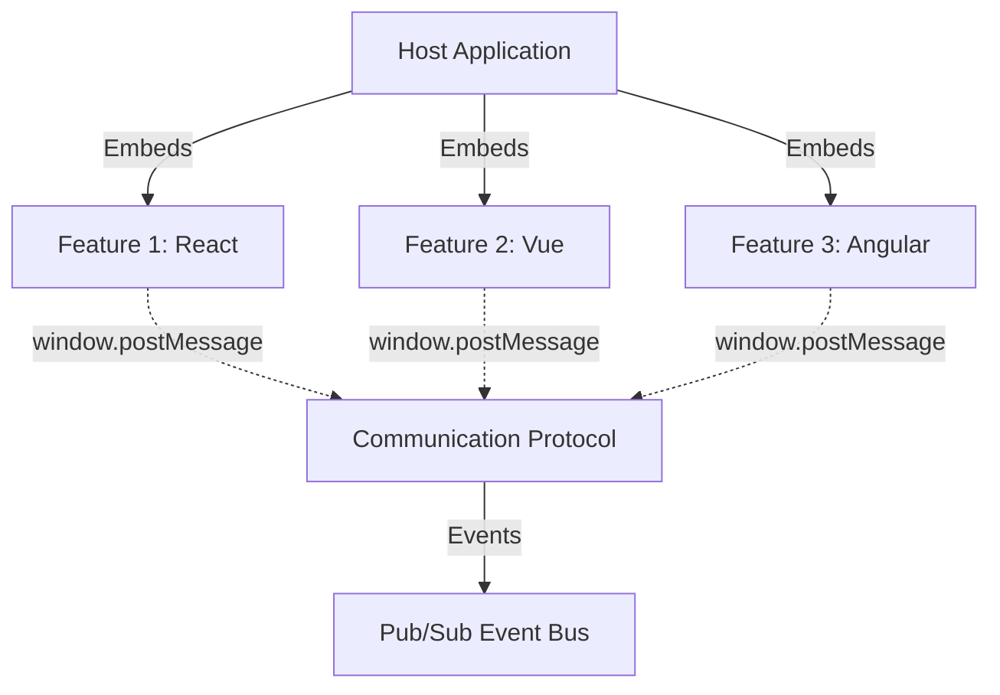

## Benefits

### Free Teams from Deployment Coordination

Hyperfrontend eliminates the need for teams to coordinate deployments, especially critical for organizations with:

- **Global teams** spanning multiple timezones
- **Different priorities and roadmaps** for each team
- **Varied technical capabilities** and framework preferences

Each feature is independently deployable - no more waiting for other teams to merge, test, or deploy before shipping your updates.

### Protect Against Version Thrashing

Traditional build-time integration creates tight coupling that leads to:

- Dependency conflicts when teams upgrade at different rates
- Breaking changes that cascade across the entire application
- Forced upgrades that consume valuable development time

Hyperfrontend's runtime integration approach isolates each feature's dependencies, allowing teams to:

- Upgrade frameworks on their own schedule
- Use different versions of the same library across features
- Deploy updates without breaking other features

### Modernize Without Expensive Rewrites

Hyperfrontend makes existing brownfield or mature projects easily consumable:

- **Wrap legacy applications** as features without rewriting them
- **Incrementally modernize** - replace features one at a time
- **Mix old and new** - run legacy AngularJS alongside modern React
- **Preserve investments** - keep working code working while evolving

The shell package defines a clear interface to interact with each feature, abstracting away the complexity of frontend coordination regardless of the underlying technology.

### Still Modern and Developer-Friendly

Despite its flexibility, hyperfrontend caters to modern frontend setups:

- Full TypeScript support with type-safe contracts
- Works with all modern build tools (Vite, Webpack, Rollup, etc.)
- Compatible with SSR and static site generation
- Nx plugin for streamlined development workflows
- Standard npm packages or CDN distribution

## Capabilities

- Framework-agnostic micro-frontend architecture
- Standardized communication via the browser's postMessage API (iframes, windows, tabs, web workers)
- Lifecycle management for embedded applications
- Contract-based integration with JSON Schema validation
- Broker-channel message routing with optional encryption
- Cross-stack compatibility (React, Vue, Angular, Svelte, vanilla JS)
- Shell applications with all dependencies bundled in
- Multiple deployment options (npm package or CDN script tag)

## Architecture Diagram


  Each feature is completely isolated with its own dependencies, state, and lifecycle.


## How It Works

1. **Features** are standalone applications with clear interfaces
2. **Shell applications** load and initialize features at runtime
3. **Communication protocol** enables secure cross-frame messaging
4. **Event bus** provides decoupled pub/sub architecture
5. **Lifecycle hooks** manage mount, unmount, and update operations

## Use Cases

### Multi-Team Organizations

Perfect for organizations where:
- Teams work across different timezones
- Each team has independent priorities and roadmaps
- Different technical capabilities and framework preferences exist

### Legacy Modernization

Ideal for:
- Wrapping legacy applications without rewrites
- Incrementally replacing old components
- Running legacy and modern code side-by-side

### Micro-Frontend Architecture

Enables:
- Independent feature development and deployment
- Version isolation and independent upgrade cycles
- Mix-and-match framework strategies
