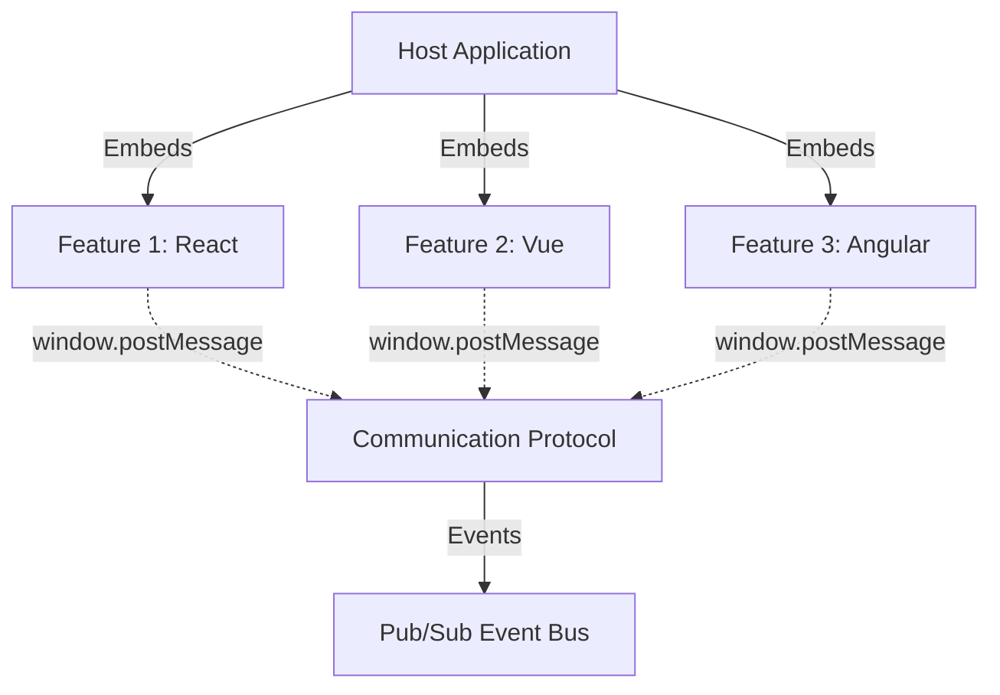

A **hyperfrontend feature** is a standalone frontend application that provides distinct business value or functionality. Features can be built with any framework (React, Angular, Vue, Svelte, etc.) or vanilla JavaScript, and may manage their own state, have their own user authentication, connect to backend APIs, and maintain their own domain models.

### What is a Feature?

| **What a Feature IS**                                              | **What a Feature ISN'T**                          |
| ------------------------------------------------------------------ | ------------------------------------------------- |
| A standalone web application with distinct business value          | A component or widget within a single framework   |
| Framework-agnostic (can use React, Vue, Angular, vanilla JS, etc.) | Tightly coupled to a specific parent application  |
| Self-contained with its own state management                       | A shared library or utility package               |
| Can run standalone or embedded in other applications               | A monolithic application that can't be decomposed |
| Has a clear domain model and API boundaries                        | A micro-library or helper function                |
| Independently deployable and versionable                           | A page or route within a single-page application  |

### Architecture

Each hyperfrontend feature uses the standard communication protocol provided by the **[@hyperfrontend/window-messages](https://github.com/AndrewRedican/hyperfrontend/blob/main/packages/window-messages)** package. This enables:

- **Domain-agnostic contracts** - Features define clear interfaces for communication
- **Pub/sub event bus** - Features can publish and subscribe to events without direct dependencies
- **Runtime isolation** - Each feature operates independently with its own lifecycle

The **[@hyperfrontend/features](https://github.com/AndrewRedican/hyperfrontend/blob/main/plugins/features)** Nx plugin helps you:

1. **Prime existing web apps** into hyperfrontend features by adding the necessary configuration
2. **Generate shell applications** that know how to load your frontend app at runtime
3. **Consume features** in host applications with ease

Each feature gets an accompanying **shell application** that is:

- Self-contained with no external dependencies
- Installable as an npm package or via `<script>` tag from a CDN
- Responsible for loading and initializing the feature at runtime

This architecture enables you to compose applications from independently developed and deployed features, enabling true micro-frontend modularity.

## Benefits

### Free Teams from Deployment Coordination

Hyperfrontend eliminates the need for teams to coordinate deployments, especially critical for organizations with:

- **Global teams** spanning multiple timezones
- **Different priorities and roadmaps** for each team
- **Varied technical capabilities** and framework preferences

Each feature is independently deployable - no more waiting for other teams to merge, test, or deploy before shipping your updates.

### Protect Against Version Thrashing

Traditional build-time integration creates tight coupling that leads to:

- Dependency conflicts when teams upgrade at different rates
- Breaking changes that cascade across the entire application
- Forced upgrades that consume valuable development time

Hyperfrontend's runtime integration approach isolates each feature's dependencies, allowing teams to:

- Upgrade frameworks on their own schedule
- Use different versions of the same library across features
- Deploy updates without breaking other features

### Modernize Without Expensive Rewrites

Hyperfrontend makes existing brownfield or mature projects easily consumable:

- **Wrap legacy applications** as features without rewriting them
- **Incrementally modernize** - replace features one at a time
- **Mix old and new** - run legacy AngularJS alongside modern React
- **Preserve investments** - keep working code working while evolving

The shell package defines a clear interface to interact with each feature, abstracting away the complexity of frontend coordination regardless of the underlying technology.

### Still Modern and Developer-Friendly

Despite its flexibility, hyperfrontend caters to modern frontend setups:

- Full TypeScript support with type-safe contracts
- Works with all modern build tools (Vite, Webpack, Rollup, etc.)
- Compatible with SSR and static site generation
- Nx plugin for streamlined development workflows
- Standard npm packages or CDN distribution

## Capabilities

- Framework-agnostic micro-frontend architecture
- Standardized communication protocols via window messaging
- Lifecycle management for embedded applications
- Contract-based integration with clear boundaries
- Lightweight pub/sub message broker
- Cross-stack compatibility (React, Vue, Angular, Svelte, vanilla JS)
- Shell applications with zero external dependencies
- Multiple deployment options (npm package or CDN script tag)

## Architecture Diagram


  Each feature is completely isolated with its own dependencies, state, and lifecycle.


## How It Works

1. **Features** are standalone applications with clear interfaces
2. **Shell applications** load and initialize features at runtime
3. **Communication protocol** enables secure cross-frame messaging
4. **Event bus** provides decoupled pub/sub architecture
5. **Lifecycle hooks** manage mount, unmount, and update operations

## Use Cases

### Multi-Team Organizations

Perfect for organizations where:
- Teams work across different timezones
- Each team has independent priorities and roadmaps
- Different technical capabilities and framework preferences exist

### Legacy Modernization

Ideal for:
- Wrapping legacy applications without rewrites
- Incrementally replacing old components
- Running legacy and modern code side-by-side

### Micro-Frontend Architecture

Enables:
- Independent feature development and deployment
- Version isolation and independent upgrade cycles
- Mix-and-match framework strategies
