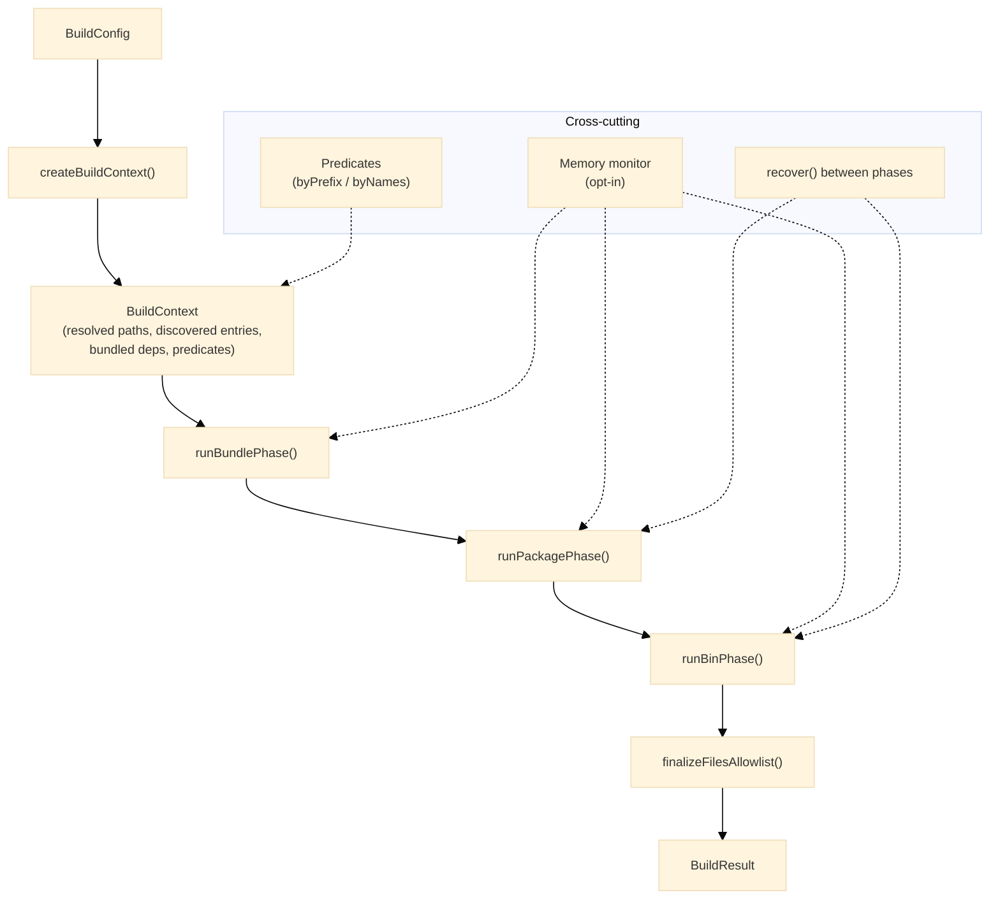
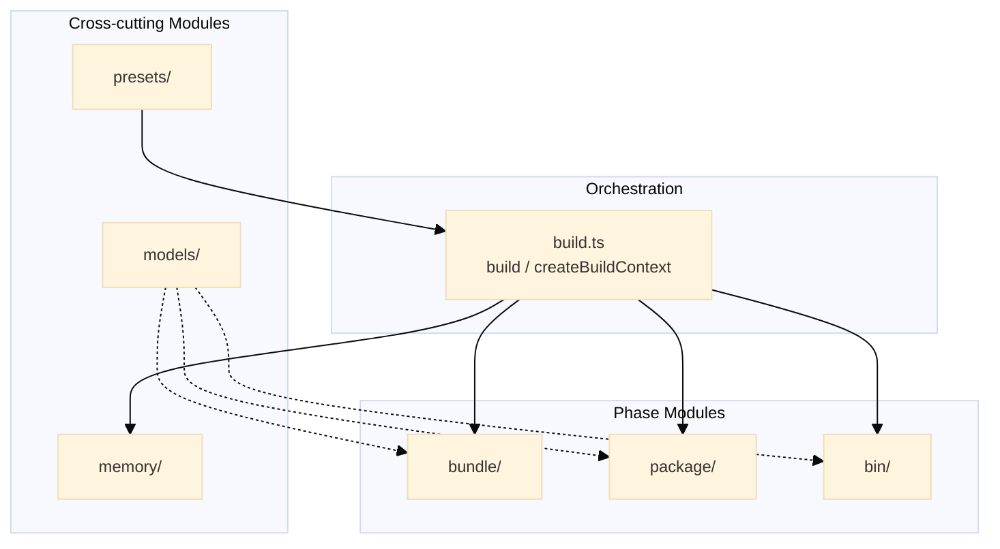
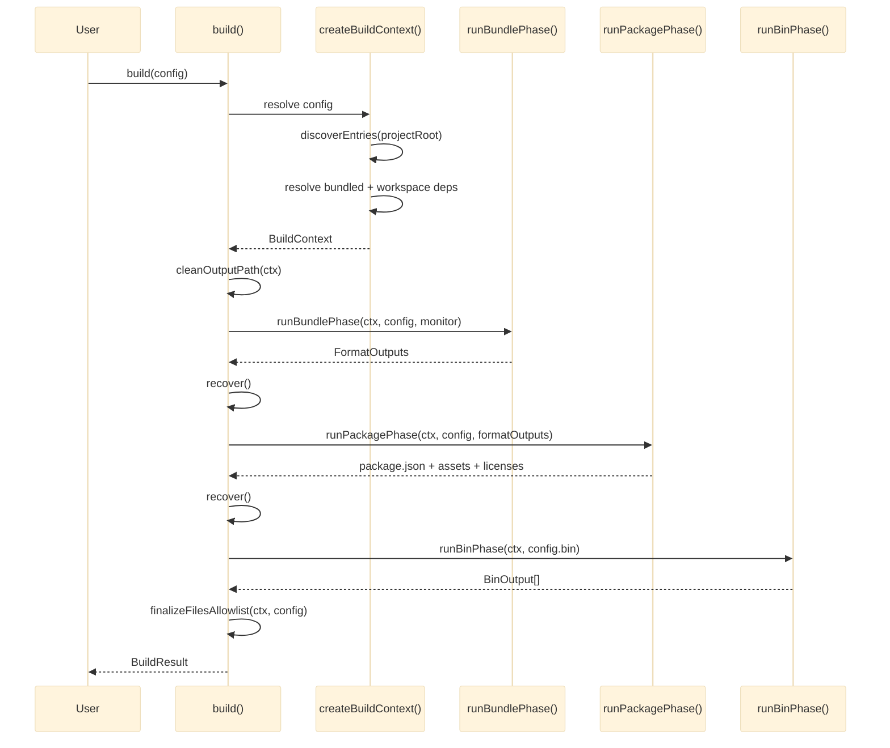
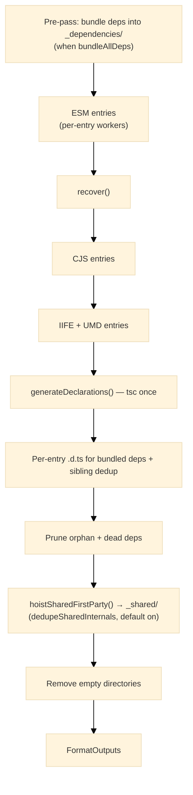
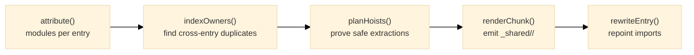

# Architecture

This document describes the internal architecture of `@hyperfrontend/builder`. For installation and usage examples, see the main [README.md](./README.md); for the full module surface, see the [per-module docs](./src/).

## Table of Contents

- [System Overview](#system-overview)
- [Design Principles](#design-principles)
- [Module Composition](#module-composition)
- [Data Flow](#data-flow)
- [Core Interfaces](#core-interfaces)
- [Module Details](#module-details)
- [Further Reading](#further-reading)

---

## System Overview

`@hyperfrontend/builder` turns a TypeScript source tree into a publishable npm package. A single declarative `BuildConfig` is resolved once into a fully-computed `BuildContext`, which is then handed to three composable phases that run in order:

- **bundle** — discover entry points, resolve externals, emit per-entry bundles for each format (ESM, CJS, IIFE, UMD), generate declarations, and deduplicate shared internals.
- **package** — synthesize the output `package.json`, copy assets, and optionally collect third-party licenses.
- **bin** — synthesize JavaScript bins and, optionally, Node SEA native binaries.

`build(config)` is a thin facade that resolves the context, runs all three phases, and reflects `package.json#files` from the materialized output. Each phase is also individually callable against a shared context, so a custom orchestrator can drive them à la carte.



---

## Design Principles

### 1. `build` orchestrates; phases compose

`build(config)` runs the full pipeline, but `runBundlePhase`, `runPackagePhase`, and `runBinPhase` remain independently callable against a shared `BuildContext` from `createBuildContext`. Nothing in a phase reaches back into the facade.

```typescript
// ✅ Compose phases against a shared, resolved context
const ctx = createBuildContext(config)
const outputs = await runBundlePhase(ctx, config)
await runPackagePhase(ctx, config, outputs)

// ❌ No phase depends on `build` having run — there is no hidden global state
```

### 2. Vendor-neutral via predicates, not config DSLs

Workspace membership, externals, and asset conditions are expressed as plain functions. The core makes no assumptions about package naming or which deps are first-party — the consumer injects those opinions.

```typescript
// ✅ Classify packages with a predicate the consumer supplies
isWorkspacePackage: byPrefix('@my-scope/')

// ❌ Never hard-code workspace assumptions inside the builder
if (name.startsWith('@hyperfrontend/')) {
  /* ... */
}
```

### 3. Per-entry isolation keeps peak memory bounded

Each entry point bundles in its own child worker process via Rollup, one format at a time. Peak memory is bounded by the largest single entry rather than the cumulative graph, which is what lets large multi-entry libraries build inside constrained environments.

```typescript
// ✅ One descriptor → one isolated worker per entry/format
const descriptor = toEsmBuildDescriptor(entry, ctx, config)
await dispatchRollupWorker(descriptor)

// ❌ Bundling every entry in one in-process Rollup run unbounds peak heap
```

### 4. Config resolves once into an immutable context

`createBuildContext` performs entry discovery and dependency resolution exactly once, filling every default and absolutizing every path. Phases consume the `BuildContext`, never the raw `BuildConfig`.

```typescript
// ✅ Defaults and discovery happen once, up front
outputPath: config.outputPath ?? join(workspaceRoot, 'dist', projectRelativePath)
entryPointDiscovery: discoverEntries(config.projectRoot)
```

### 5. Self-contained packages without burdening consumers

Bundled third-party and workspace deps are emitted into `_dependencies/` and stripped from the output `package.json`, so consumers never inherit transitive installs. Shared first-party modules are deduplicated by an **additive, post-emit** pass whose worst case is output identical to input.

```typescript
// ✅ Dedupe is safe-by-construction and opt-out, defaulting to enabled
dedupeSharedInternals?: boolean // default true; only hoists provably-safe modules

// ❌ Externalizing bundled deps would push transitive installs onto consumers
```

---

## Module Composition

The library is organized into six top-level modules. The three phase modules (`bundle/`, `package/`, `bin/`) are orchestrated by `build`; the remaining three are cross-cutting.



| Module     | Responsibility                                                                                 |
| ---------- | ---------------------------------------------------------------------------------------------- |
| `bundle/`  | Entry discovery, per-entry Rollup bundling, declaration emit, dependency bundling, and dedupe. |
| `package/` | Synthesize the output `package.json`, copy assets, collect third-party licenses.               |
| `bin/`     | Synthesize JavaScript bins and Node SEA native binaries.                                       |
| `models/`  | Type definitions for config, context, and results — the contracts shared across every phase.   |
| `memory/`  | Opt-in memory monitor (`createMemoryMonitor`) and the inter-phase `recover()` primitive.       |
| `presets/` | Predicate factories (`byPrefix`, `byNames`) for classifying workspace packages and externals.  |

### `bundle/` sub-modules

Each sub-module is its own package entry point and ships its own README — follow the link on its name for the full surface.

| Sub-module                                             | Responsibility                                                                                                 |
| ------------------------------------------------------ | -------------------------------------------------------------------------------------------------------------- |
| [`entries/`](./src/bundle/entries/README.md)           | Discover entry points from `src/` and resolve them per-format (`discoverEntries`).                             |
| [`rollup/`](./src/bundle/rollup/README.md)             | Build per-entry, JSON-serializable descriptors and dispatch isolated Rollup workers.                           |
| [`dependencies/`](./src/bundle/dependencies/README.md) | Pre-pass bundle each third-party/workspace dep into `_dependencies/`; route imports via an externalize plugin. |
| [`externals/`](./src/bundle/externals/README.md)       | Resolve which packages stay external; validate globals/externals pairing for IIFE/UMD.                         |
| [`declarations/`](./src/bundle/declarations/README.md) | Emit `.d.ts` via TypeScript, inline bundled-dep declarations, prune orphans.                                   |
| [`dedupe/`](./src/bundle/dedupe/README.md)             | Post-emit hoist of identical first-party modules shared across entries into `_shared/` chunks.                 |

### `package/` and `bin/` sub-modules

| Sub-module                                              | Responsibility                                                                             |
| ------------------------------------------------------- | ------------------------------------------------------------------------------------------ |
| [`package/json/`](./src/package/json/README.md)         | Synthesize `exports`, strip bundled/workspace deps, inherit fields, resolve CDN paths.     |
| [`package/assets/`](./src/package/assets/README.md)     | Materialize asset specs (files/globs), gated by an optional condition predicate.           |
| [`package/licenses/`](./src/package/licenses/README.md) | Collect external licenses and write `THIRD_PARTY_LICENSES.md`.                             |
| [`bin/script/`](./src/bin/script/README.md)             | Bundle `src/bin/<name>.ts`, prepend the shebang, append a bootstrap footer, chmod `0o755`. |
| [`bin/native/`](./src/bin/native/README.md)             | Node SEA pipeline: config → blob → inject (postject) → codesign strip → platform guard.    |

---

## Data Flow

### Full build pipeline

The primary use case — `build(config)` — flows through context resolution and the three phases in sequence, with `recover()` yielding between the heavy phases:



### Bundle phase: per-entry isolation

Within the bundle phase, each format runs as a group; within a group, every entry bundles in its own isolated worker, with `recover()` between groups. Declarations, pruning, and dedupe run as post-emit passes:



### Shared-first-party deduplication

The dedupe pass is additive and safe-by-construction: it only hoists modules it can prove are identical, cycle-free, and resolvable after rewriting.



---

## Core Interfaces

The contracts below live in `models/` and are re-exported from the package root.

### Configuration and context

`BuildConfig` is the declarative input; `createBuildContext` resolves it into the immutable `BuildContext` that every phase consumes.

```typescript
interface BuildConfig {
  projectRoot: string
  workspaceRoot: string
  outputPath?: string // default: <workspaceRoot>/dist/<projectRelativePath>
  tsConfig?: string // default: <projectRoot>/tsconfig.lib.json
  isWorkspacePackage?: IsWorkspacePackagePredicate
  workspaceDepPolicy?: Record<string, WorkspaceDepHoistPolicy>
  assets?: AssetSpec[]
  external?: string[]
  esm?: EsmConfig | EsmConfig[]
  cjs?: CjsConfig | CjsConfig[]
  iife?: IifeConfig | IifeConfig[]
  umd?: UmdConfig | UmdConfig[]
  bin?: BinConfig[]
  dedupeSharedInternals?: boolean // default: true
  thirdPartyLicenses?: boolean
  memoryMonitor?: boolean | MemoryMonitorOptions
  verbose?: boolean
}

interface BuildContext {
  projectRoot: string
  workspaceRoot: string
  projectRelativePath: string
  outputPath: string
  tsConfigPath: string
  external: string[]
  assets: AssetSpec[]
  isWorkspacePackage: IsWorkspacePackagePredicate
  entryPointDiscovery: EntryPointDiscovery
  bundledDeps: string[]
  workspaceBundledDeps: WorkspaceBundledDep[]
  startedAt: number
}
```

### Entry points

Discovery classifies the `src/` layout and yields the entries each format draws from.

```typescript
type EntryPointCategory = 'root' | 'platform' | 'feature' | 'hybrid' | 'complex'
type EntryPointPlatform = 'browser' | 'node'

interface EntryPoint {
  exportPath: string // subpath key: '.', './browser', './browser/v1'
  srcPath: string
  inputFile: string
  isRoot: boolean
  platform?: EntryPointPlatform
}

interface EntryPointDiscovery {
  category: EntryPointCategory
  entryPoints: EntryPoint[]
  platformEntries: EntryPoint[]
  featureEntries: EntryPoint[]
}
```

### Predicates and bins

Classification and bin synthesis are driven by plain functions and a small config shape.

```typescript
type IsWorkspacePackagePredicate = (name: string) => boolean
type AssetConditionPredicate = (pkg: PackageJson) => boolean
type WorkspaceDepHoistPolicy = 'sub-path' | 'whole-surface'
type SeaPlatform = 'linux-x64' | 'linux-arm64' | 'darwin-x64' | 'darwin-arm64' | 'win32-x64'

interface BinConfig {
  name: string
  format: BinScriptFormat | BinScriptFormat[] // 'cjs' | 'esm'
  runner?: string
  bootstrap?: string
  sea?: SeaConfig // opt into a native binary
}
```

### Result

```typescript
interface BuildResult {
  success: true
  formatCounts: FormatCounts // { esm, cjs, iife, umd }
  formatOutputs: FormatOutputs
  binOutputs: BinOutput[] // { name, kind: 'cjs' | 'esm' | 'native', outputPath, platform? }
  durationMs: number
}
```

---

## Module Details

### bundle/

**Purpose:** Discover entries and emit isolated per-entry bundles plus declarations for every configured format.

**Key components:**

- `entries/` — `discoverEntries()` scans `src/` and categorizes the layout (root, platform, feature, hybrid, complex).
- `rollup/` — `toEsmBuildDescriptor()` and siblings build JSON-serializable descriptors; `dispatchRollupWorker()` runs each in a child process.
- `dependencies/` — `runPrePass()` bundles each dep once into `_dependencies/`; `createExternalizeBundledDepsPlugin()` routes imports to those chunks.
- `declarations/` — `generateDeclarations()` drives tsc; per-entry passes inline bundled-dep types and prune orphans.
- `dedupe/` — `hoistSharedFirstParty()` lifts duplicated first-party modules into `_shared/`.

📖 [Full bundle/ documentation](./src/bundle/README.md)

### package/

**Purpose:** Turn bundle outputs into a publishable package directory.

**Key components:**

- `json/` — `synthesizePackageJson()` builds `exports` from the emitted formats, strips bundled and workspace deps, inherits fields, and resolves CDN paths.
- `assets/` — `copyAssets()` materializes file/glob specs, optionally gated by a condition predicate.
- `licenses/` — `collectThirdPartyLicenses()` and `writeThirdPartyLicensesFile()` produce `THIRD_PARTY_LICENSES.md`.

📖 [Full package/ documentation](./src/package/README.md)

### bin/

**Purpose:** Synthesize executables from `src/bin/` entries.

**Key components:**

- `script/` — `buildJsBin()` bundles the bin, prepends `#!/usr/bin/env node`, appends a bootstrap footer, and sets the executable bit.
- `native/` — the Node SEA pipeline: generate the SEA config and blob, resolve a host binary, inject the blob via postject, strip macOS signatures, and skip gracefully when the current platform is not a declared target.

📖 [Full bin/ documentation](./src/bin/README.md)

### models/

**Purpose:** Define the contracts every phase shares — the declarative input, the resolved context, and the result.

**Key components:**

- `BuildConfig` plus the per-format shapes (`EsmConfig`, `CjsConfig`, `IifeConfig`, `UmdConfig`) and `BinConfig`/`SeaConfig` — the declarative input surface.
- `BuildContext` — the resolved, immutable shape `createBuildContext()` produces and every phase consumes.
- `BuildResult`, `FormatOutputs`, `BinOutput`, and the predicate aliases — the values phases return and the functions consumers inject.

These types are reproduced in [Core Interfaces](#core-interfaces).

📖 [Full models/ documentation](./src/models/README.md)

### memory/

**Purpose:** Keep large builds inside constrained environments.

**Key components:**

- `createMemoryMonitor()` captures labeled `MemorySnapshot`s at phase boundaries and emits threshold warnings.
- `recover()` yields the event loop and triggers a manual GC (when `--expose-gc` is set) between phases and entries.

📖 [Full memory/ documentation](./src/memory/README.md)

### presets/

**Purpose:** Ready-made classification predicates.

**Key components:** `byPrefix(scope)` and `byNames(names)` return `IsWorkspacePackagePredicate` closures so the core stays free of workspace-specific assumptions.

📖 [Full presets/ documentation](./src/presets/README.md)

---

## Further Reading

- [Main README](./README.md) — Installation and quick start
- [Module Documentation](./src/) — Per-module README files
- [Contributing Guide](../../CONTRIBUTING.md) — Development setup
