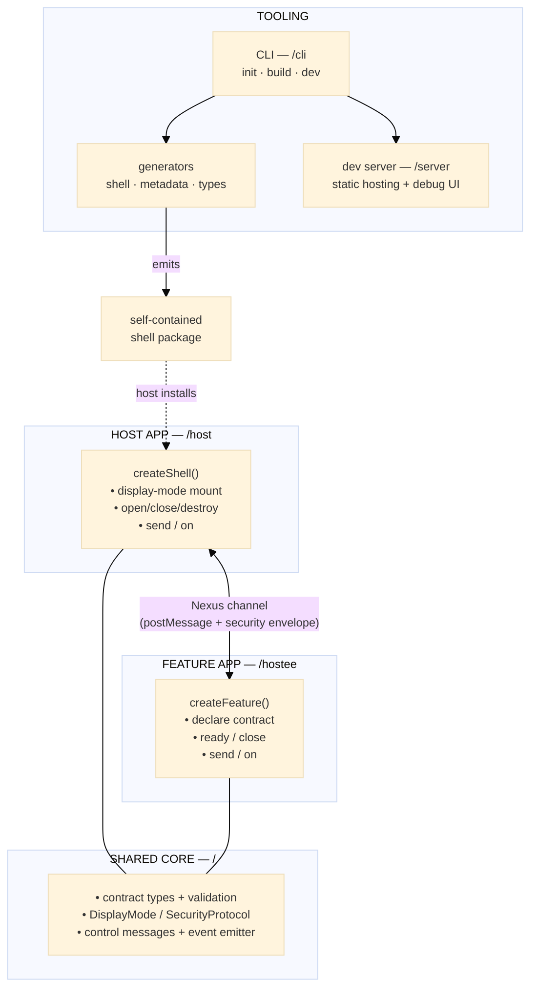
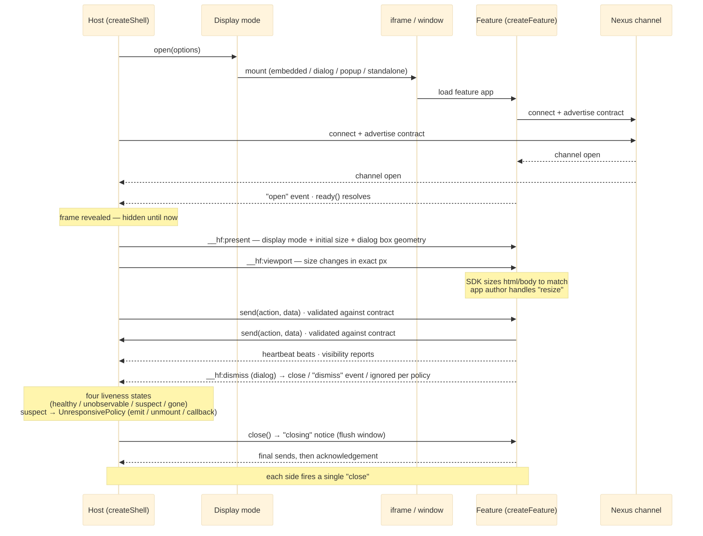

# Architecture

`@hyperfrontend/features` is the batteries-included layer on top of [`@hyperfrontend/nexus`](https://www.hyperfrontend.dev/docs/libraries/nexus/). Nexus owns the cross-window messaging protocol; this package owns the frontend glue around it — iframe management, display modes, lifecycle orchestration, shell generation, a CLI, and a dev server — so a feature app and a host app can be developed independently and composed at runtime.

---

## System Overview

A **feature app** (the _hostee_) is a normal web app that declares a contract and connects through the hostee SDK. A **host app** builds a _shell_ that mounts the feature in a display mode and exchanges contract-validated messages with it over a Nexus channel. The CLI turns a feature app into a self-contained _shell package_ that any host installs; the dev server runs both sides locally with a debug UI.



The host never needs `@hyperfrontend/features` as a direct dependency: it installs the generated shell package, which inlines everything it needs. The two sides only agree on a **contract** (the actions each emits and accepts).

---

## Design Principles

1. **Standalone core, isolated Nx adapter.** The package, CLI, and dev server have no build-tool dependency. The optional Nx generators and executors live in an isolated `/nx/*` adapter that the core never imports, so Nx integration can be added or ignored without touching the SDK.

   ```typescript
   // ✅ the core SDK
   import { createShell } from '@hyperfrontend/features/host'
   // ❌ the core never imports build-tool internals
   // import { …} from '@nx/devkit'
   ```

2. **Per-surface subpath isolation.** Host, hostee, CLI, and server are independent entry points so a consumer pulls in only what it uses and bundlers tree-shake the rest.

   ```typescript
   // ✅ a feature app ships only the hostee surface
   import { createFeature } from '@hyperfrontend/features/hostee'
   // ❌ never re-export the host/CLI/server surface from the hostee barrel
   ```

3. **Contract-validated messaging.** Every action a side emits or accepts is declared in a `FeatureContract`; the contract drives validation, the shell type generator, and the debug UI. The contract is the only coupling between host and feature. Unknown inbound types are dropped and logged, and only `accepted` entries flagged `required: true` gate the connection (the counterpart must emit them), so adding actions to a contract stays backward compatible.

4. **Self-contained generated shells.** `build` emits a shell package with **zero runtime dependencies** — the contract is inlined and direct deps are bundled — so a host installs one package and inherits no transitive install burden.

5. **Security is explicit.** The envelope defaults to `protocol: 'none'` for local development; production builds must opt into `v1` or `v2` (`@hyperfrontend/network-protocol`).

   ```typescript
   // ✅ production picks an envelope explicitly
   createShell({ url, container, protocol: 'v2', sharedKey })
   // ⚠️ 'none' is a local-only default
   ```

6. **Capability flows from the host, correct by construction.** The feature declares the Permissions-Policy features it needs (`permissions` in `feature.config.*`, baked into the connector and disclosed in `metadata.json`); the host applies them as the frame's `allow` attribute and can replace the list. Containment (`sandbox`) is host-decreed, never baked, and the two hazardous tokens are managed rather than configurable: `allow-scripts` is always granted (the feature runtime is JavaScript) and `allow-same-origin` only to cross-origin feature URLs — so a script-less frame and a sandbox-shedding same-origin frame cannot be expressed.

   ```typescript
   // ✅ delegation is reviewable, containment is the host's call
   shell.open({ permissions: ['fullscreen'], sandbox: { downloads: true } })
   // ❌ no raw token strings — the SDK owns the hazardous tokens
   ```

7. **Presentation is coordinated control — host-owned, contract-preconfigured.** The feature declares which display modes it supports and their per-mode defaults (`display` in `feature.config.*`); the build bakes the declaration into the generated shell, which is built from only the declared mounts (`createShell`'s explicit `modes` map) and narrows the generated types to the declared union — an undeclared mode is a compile error, a runtime throw, and absent from the bundle. At runtime the host picks the mode and is the single geometry authority: it announces the mode with the frame's initial dimensions over `__hf:present`, keeps the frame hidden until the session opens, and reports later size changes as exact pixels over `__hf:viewport`; the hostee SDK sizes its document to match and never announces geometry of its own. Dialog mode inverts the visuals, not the control: the host provides a full-viewport transparent pane, the feature draws the inner box (sized and positioned per the agreement) and backdrop, and dismiss interactions cross as `__hf:dismiss` for the host to apply its configured policy.

   ```typescript
   // ✅ a shell is built from exactly the declared modes
   createShell({ modes: { embedded: mountEmbedded, dialog: mountDialog }, ...options })
   // ❌ no hostee mode requests, no hostee-driven frame sizing
   ```

8. **Pure generators, I/O at the edges.** Generators are pure `(config, contract, tree) => void` functions that write to a `@hyperfrontend/project-scope` VFS tree; all filesystem I/O, prompting, and commits live in the CLI — never in the generators or the SDK.

---

## Module Composition

| Module       | Subpath       | Responsibility                                                                                                                                                                                                               |
| ------------ | ------------- | ---------------------------------------------------------------------------------------------------------------------------------------------------------------------------------------------------------------------------- |
| `shared`     | `.`           | Contract types, contract/config/display/payload validation, `DisplayMode`, `SecurityProtocol`, control messages, presentation payloads + size formulas, the event emitter, and the `defineConfig`/`defineDevConfig` helpers. |
| `host`       | `/host`       | `createShell` factory (explicit `modes` map), the four display-mode mounts, iframe utilities, container measurement + viewport reporting, heartbeat watchdog, and the experience-plugin seam.                                |
| `hostee`     | `/hostee`     | `createFeature` factory, host-window resolution, presentation application (canvas sync, dialog layout, dismiss detection), feature lifecycle, and heartbeat emission.                                                        |
| `cli`        | `/cli`        | `init`/`build`/`dev` command runners, the tiered `feature.config.*` / `hf-dev.config.*` loader, and CLI/flag parity; backs the `hf` bin.                                                                                     |
| `generators` | `/generators` | Pure generators for the shell package, `metadata.json`, the write-once feature module, and contract `.d.ts` types.                                                                                                           |
| `server`     | `/server`     | Static per-app hosting and the in-browser debug UI (display-mode, resize, message-log, security controls).                                                                                                                   |
| `nx`         | `/nx/*`       | Optional Nx adapter — a `feature` generator and `build`/`serve` executors that delegate to the SDK. Zero `@nx/devkit` dependency.                                                                                            |

---

## Data Flow

Mounting a feature and exchanging messages:



Opening is asynchronous and deadline-bounded: the channel activates only when the Nexus wire handshake completes, and sends issued before then queue and flush on open. If the counterpart never completes the handshake within the deadline (`openTimeoutMs` / `readyTimeoutMs`, default 10 s), the shell tears the mount down and emits `error` with `reason: 'open-timeout'`, and the feature's `ready()` rejects after emitting `error` with `reason: 'ready-timeout'`.

Liveness is judged in four states, not a boolean. The feature pulses a hidden beat and reports its page visibility; the host watchdog counts misses only while both pages are visible (`healthy`), pauses while either is hidden (`unobservable` — throttled timers make silence weak evidence), runs the `UnresponsivePolicy` once per `suspect` episode (a recovering beat returns to `healthy` and re-arms it), and reports `gone` once the session closes. Transitions surface as the shell's `status` event.

Teardown is polite by default: `close()` on either side proposes the close, the counterpart receives a `closing` event while the channel still delivers — its flush window for unsaved work — then acknowledges, and each side fires a single `close` (an unacknowledged close completes at a deadline). The feature can declare unsaved work with `setDirty(true)`; the host sees it as the `dirty-state` event and the `isDirty` flag and can take it into account before proposing a close. `destroy()` remains the impolite immediate teardown.

---

## Core Interfaces

```typescript
// Host: build a shell, mount a feature, exchange messages.
function createShell(options: ShellOptions): ShellHandle

interface ShellHandle {
  open(options?: Partial<ShellOptions>): void
  close(): void
  destroy(): void
  send(type: string, data?: unknown): void
  on(event: string, handler: (payload: unknown) => void): () => void
  readonly isOpen: boolean
  readonly isDirty: boolean
}

// Hostee: connect a feature app to whatever host embeds it.
function createFeature(options: FeatureOptions): FeatureHandle

interface FeatureHandle {
  send(type: string, data?: unknown): void
  on(event: string, handler: (payload: unknown) => void): () => void
  setDirty(isDirty: boolean): void
  ready(): Promise<void>
  close(): void
  readonly displayMode: DisplayMode | null
}

// The only coupling between the two sides.
interface FeatureContract {
  emitted: ActionDescription[]
  accepted: ActionDescription[]
}

type DisplayMode = 'embedded' | 'dialog' | 'popup' | 'standalone'
type SecurityProtocol = 'none' | 'v1' | 'v2'
```

---

## Links

- [README.md](./README.md) — installation, quick start, and the API overview.
- [`src/host/README.md`](./src/host/README.md) · [`src/hostee/README.md`](./src/hostee/README.md) · [`src/cli/README.md`](./src/cli/README.md) · [`src/server/README.md`](./src/server/README.md) · [`src/generators/README.md`](./src/generators/README.md) — per-surface reference.
- [`@hyperfrontend/nexus`](https://www.hyperfrontend.dev/docs/libraries/nexus/) — the messaging layer this package builds on.
