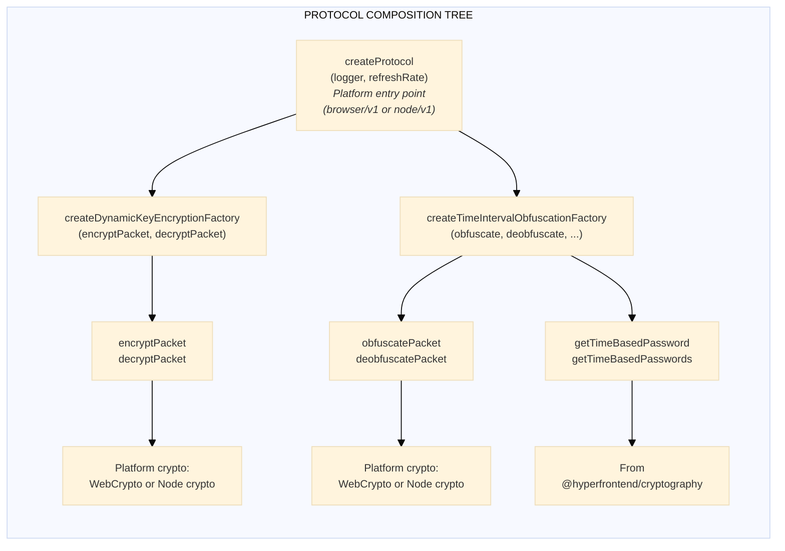
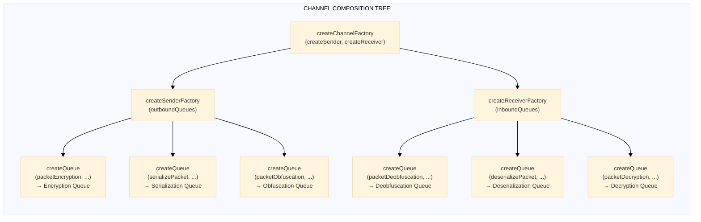
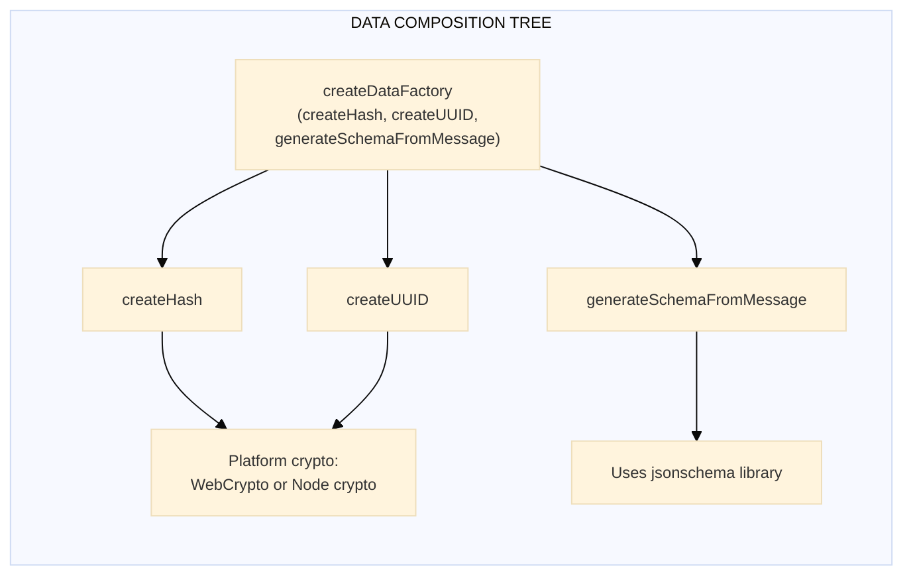
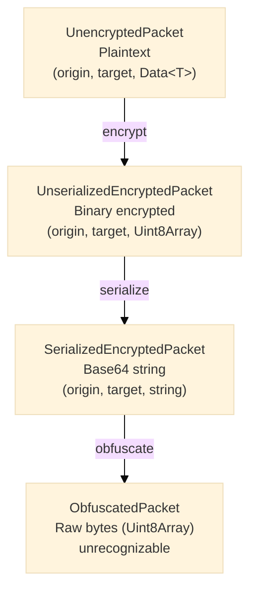
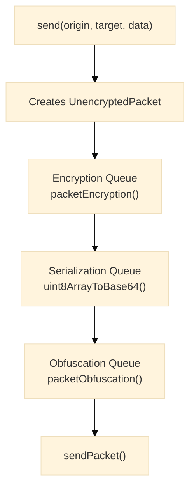
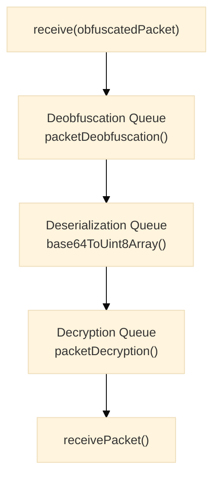
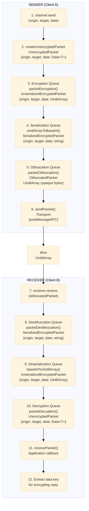

# Network Protocol Architecture Guide

This document provides an in-depth explanation of the major artifacts produced by `@hyperfrontend/network-protocol`. Each section covers the purpose, behavior, requirements, and usage examples for the core components of the library.

---

## Table of Contents

1. [Quick Reference: How Do I...](#quick-reference-how-do-i)
2. [Factory Function Reference](#factory-function-reference)
3. [Composition Tree](#composition-tree)
4. [Protocol](#protocol)
5. [Channel](#channel)
6. [Packet Types](#packet-types)
7. [Queue](#queue)
8. [Sender & Receiver](#sender--receiver)
9. [Topic](#topic)
10. [Routing](#routing)
11. [Security Suite](#security-suite)
12. [Data](#data)
13. [End-to-End Flow](#end-to-end-flow)

---

## Quick Reference: How Do I...

| Task                                 | Solution                                                        | Module                                        |
| ------------------------------------ | --------------------------------------------------------------- | --------------------------------------------- |
| **Create a secure channel?**         | Use `createChannelFactory` with a configured `ProtocolProvider` | [channel/](src/lib/channel/README.md)         |
| **Send an encrypted message?**       | Use `channel.send(origin, target, data)`                        | [channel/](src/lib/channel/README.md)         |
| **Customize encryption?**            | Create a custom `EncryptionSuite` and inject into protocol      | [security/](src/lib/security/README.md)       |
| **Add a new packet transformation?** | Extend the packet type hierarchy and add a new queue stage      | [packet/](src/lib/packet/README.md)           |
| **Route messages by topic?**         | Create topics with `TopicStore`, configure a `Router` function  | [routing/](src/lib/routing/README.md)         |
| **Handle clock skew?**               | Time-interval obfuscation automatically tries ±1 time windows   | [protocol/](src/lib/protocol/README.md)       |
| **Manage multiple channels?**        | Use `ChannelStore` for CRUD operations                          | [channel/](src/lib/channel/README.md)         |
| **Stop/resume message processing?**  | Call `channel.stop()` and `channel.resume()`                    | [channel/](src/lib/channel/README.md)         |
| **Monitor queue depth?**             | Access `channel.outbound.encryptionQueue.size()` etc.           | [queue/](src/lib/queue/README.md)             |
| **Validate message structure?**      | Use auto-generated JSON Schema in `Data.schema`                 | [data/](src/lib/data/README.md)               |
| **Rotate encryption keys?**          | Keys are exchanged per-message via `data.key`                   | [data/](src/lib/data/README.md)               |
| **Use in browser vs Node.js?**       | Import from `/browser/v1` or `/node/v1` entry points            | [Platform Differences](#platform-differences) |

---

## Factory Function Reference

The library uses factory functions to inject platform-specific dependencies while producing platform-agnostic artifacts.

| Factory                                | Injects                                                                                                                   | Produces                   | Location                          |
| -------------------------------------- | ------------------------------------------------------------------------------------------------------------------------- | -------------------------- | --------------------------------- |
| `createProtocol`                       | `encryptPacket`, `decryptPacket`, `obfuscatePacket`, `deobfuscatePacket`, `getTimeBasedPassword`, `getTimeBasedPasswords` | `ProtocolProvider`         | `browser/v1`, `node/v1`           |
| `createProtocolFactory`                | Encryption factory, Obfuscation factory                                                                                   | `CreateProtocol`           | `lib/protocol`                    |
| `createChannelFactory`                 | `CreateSender`, `CreateReceiver`                                                                                          | `ChannelCreater`           | `lib/channel`                     |
| `createChannelStore`                   | `ChannelCreater`                                                                                                          | `ChannelStore`             | `lib/channel`                     |
| `createSenderFactory`                  | `OutboundQueues`                                                                                                          | `CreateSender`             | `lib/sender`                      |
| `createReceiverFactory`                | `InboundQueues`                                                                                                           | `CreateReceiver`           | `lib/receiver`                    |
| `createQueue`                          | Transform function, callbacks                                                                                             | `Queue<T>`                 | `lib/queue`                       |
| `createDataFactory`                    | `createHash` (platform-specific)                                                                                          | `CreateData`               | `lib/data`                        |
| `createTopicStore`                     | None                                                                                                                      | `TopicStore`               | `lib/topic`                       |
| `createDynamicKeyEncryptionFactory`    | `encryptPacket`, `decryptPacket`                                                                                          | `EncryptionSuite` factory  | `lib/packet/security/encryption`  |
| `createTimeIntervalObfuscationFactory` | `obfuscatePacket`, `deobfuscatePacket`, `getTimeBasedPassword`, `getTimeBasedPasswords`                                   | `ObfuscationSuite` factory | `lib/packet/security/obfuscation` |

---

## Composition Tree

This diagram shows how factory functions compose to create the full protocol stack:







---

## Protocol

### Purpose

The **Protocol** is the central coordination object that encapsulates all cryptographic operations (encryption, decryption, obfuscation, deobfuscation) along with send/receive transport functions. It serves as a unified interface for secure message passing between endpoints.

### Interface

```typescript
interface Protocol<T = any> {
  packetEncryption: PacketEncryption<T>
  packetDecryption: PacketDecryption<T>
  packetObfuscation: PacketObfuscation
  packetDeobfuscation: PacketDeobfuscation
  send: SendPacketFn
  receive: ReceivePacketFn<T>
  getLogger: () => Logger
}
```

### How It Works

1. **Encryption/Decryption**: Uses dynamic key-based encryption where the key is derived from a provider function. This allows keys to rotate or change between operations without reconfiguring the protocol.

2. **Obfuscation/Deobfuscation**: Uses time-interval based obfuscation where passwords are generated based on the current time window. During deobfuscation, the protocol attempts to decode using the current, previous, and next time window passwords to handle clock skew between endpoints.

3. **Send/Receive**: Transport-agnostic functions injected at creation time. For browsers, this typically wraps `postMessage`; for Node.js, this wraps IPC mechanisms.

4. **Key Exchange**: The protocol captures encryption keys from incoming packets (via `packet.data.key`) and uses them for subsequent operations.

### Requirements

- A valid `Logger` instance from `@hyperfrontend/logging`
- A refresh rate (in minutes, minimum 1) for time-based password rotation
- Send function: `(packet: Uint8Array) => void`
- Receive function: `(packet: UnencryptedPacket<T>) => void`

### Example

```typescript
import { createProtocol } from '@hyperfrontend/network-protocol/browser/v1'
import { createLogger } from '@hyperfrontend/logging'

const logger = createLogger({ level: 'info' })

// Create a protocol provider with 60-minute key rotation
const protocolProvider = createProtocol(logger, 60)

// Instantiate with transport functions
const protocol = protocolProvider(
  (packet) => otherWindow.postMessage(packet, '*'), // send
  (packet) => handleReceivedMessage(packet.data) // receive
)
```

---

## Channel

### Purpose

A **Channel** is a named, bidirectional communication pipe that combines a Sender and Receiver with coordinated lifecycle controls. Channels provide a high-level abstraction for managing message flow between two endpoints.

### Interface

```typescript
interface Channel<T = any> extends StopResumeControl {
  label: string
  send: SendFn<T>
  receive: ReceiveFn
  outbound: OutboundQueues & StopResumeControl
  inbound: InboundQueues & StopResumeControl
}

interface StopResumeControl {
  stop: () => void
  resume: () => void
}
```

### How It Works

1. **Outbound Flow**: When you call `channel.send(origin, target, data)`, the message enters the outbound queue pipeline:
   - **Encryption Queue** → Encrypts the packet with the dynamic key
   - **Serialization Queue** → Converts binary to base64 string
   - **Obfuscation Queue** → Applies time-based obfuscation, then sends

2. **Inbound Flow**: When raw bytes arrive via `channel.receive(packet)`:
   - **Deobfuscation Queue** → Removes obfuscation layer
   - **Deserialization Queue** → Converts base64 to binary
   - **Decryption Queue** → Decrypts to plaintext packet

3. **Lifecycle Control**: `stop()` pauses all queues (messages accumulate but don't process); `resume()` restarts processing. This enables backpressure management.

4. **Queue Visibility**: Access queue sizes via `channel.outbound.encryptionQueue.size`, etc., for monitoring and metrics.

### Requirements

- A unique label (string identifier)
- Send packet function for transport
- Receive packet callback
- A configured `ProtocolProvider`

### Example

```typescript
import { createChannelFactory } from '@hyperfrontend/network-protocol/channel'

// Assuming sender and receiver factories are configured
const createChannel = createChannelFactory(createSender, createReceiver)

const channel = createChannel(
  'my-channel',
  (packet) => transport.send(packet),
  (packet) => console.log('Received:', packet.data),
  protocolProvider
)

// Send a message
channel.send('window-a', 'window-b', messageData)

// Pause processing (e.g., for backpressure)
channel.stop()

// Resume later
channel.resume()
```

### Channel Store

For managing multiple channels, use `ChannelStore`:

```typescript
interface ChannelStore<T = any> {
  readonly create: (label, send, receive, protocol) => Channel<T>
  readonly add: (...channels: Channel<T>[]) => void
  readonly getByName: (name: string) => Channel<T> | null
  readonly getById: (id: string) => Channel<T> | null
  readonly removeByName: (...names: string[]) => void
  readonly list: readonly ChannelEntry<T>[]
  // ... additional methods
}
```

---

## Packet Types

### Purpose

Packets are the fundamental data units that flow through the protocol. The library defines a strict type hierarchy representing the packet's state at each transformation stage.

### Packet Hierarchy



### Interface Definitions

```typescript
interface PacketBase {
  origin: string // Sender identifier
  target: string // Recipient identifier
}

interface UnencryptedPacket<T = any> extends PacketBase {
  data: Data<T> // Structured message with metadata
}

interface UnserializedEncryptedPacket extends PacketBase {
  data: Uint8Array // Encrypted binary
}

interface SerializedEncryptedPacket extends PacketBase {
  data: string // Base64-encoded encrypted data
}

type ObfuscatedPacket = Uint8Array // Fully opaque binary
```

### How They Work

1. **Outbound Transformation**:

   ```text
   UnencryptedPacket → encrypt → UnserializedEncrypted → serialize → SerializedEncrypted → obfuscate → ObfuscatedPacket
   ```

2. **Inbound Transformation** (reverse):

   ```text
   ObfuscatedPacket → deobfuscate → SerializedEncrypted → deserialize → UnserializedEncrypted → decrypt → UnencryptedPacket
   ```

3. **Origin/Target Preservation**: Origin and target identifiers are preserved through all transformations until the final obfuscation step, enabling routing decisions at any stage.

### Example

```typescript
import { createUnencryptedPacket } from '@hyperfrontend/network-protocol/packet'

const packet = createUnencryptedPacket(
  'https://sender.example.com',
  'https://receiver.example.com',
  data // Data<T> object
)
// → { origin: '...', target: '...', data: { pid, id, sequence, key, message, schema, schemaHash } }
```

---

## Queue

### Purpose

**Queues** are FIFO message processing containers that ensure ordered, asynchronous handling of packets at each transformation stage. They provide flow control through stop/resume capabilities.

### Interface

```typescript
interface Queue<T extends object> {
  addMessage: (message: T) => void
  isRunning: () => boolean
  stop: () => void
  resume: () => void
  size: () => number
  currentMessage: () => T | null
}
```

### How It Works

1. **FIFO Processing**: Messages are processed in the order they're added. Each message fully completes before the next begins.

2. **Async-Safe**: The queue handles async operations (like encryption) sequentially, preventing race conditions.

3. **Backpressure Control**: `stop()` halts processing while still accepting new messages. When `resume()` is called, accumulated messages are processed in order.

4. **Callbacks**: Each queue is created with success and failure callbacks, enabling metrics, dead-letter handling, and error logging.

### Queue Types

| Queue                 | Input                         | Output                        | Purpose              |
| --------------------- | ----------------------------- | ----------------------------- | -------------------- |
| Encryption Queue      | `UnencryptedPacket`           | `UnserializedEncryptedPacket` | Encrypt plaintext    |
| Serialization Queue   | `UnserializedEncryptedPacket` | `SerializedEncryptedPacket`   | Binary → Base64      |
| Obfuscation Queue     | `SerializedEncryptedPacket`   | `ObfuscatedPacket`            | Final encoding       |
| Deobfuscation Queue   | `ObfuscatedPacket`            | `SerializedEncryptedPacket`   | Remove obfuscation   |
| Deserialization Queue | `SerializedEncryptedPacket`   | `UnserializedEncryptedPacket` | Base64 → Binary      |
| Decryption Queue      | `UnserializedEncryptedPacket` | `UnencryptedPacket`           | Decrypt to plaintext |

### Example

```typescript
import { createQueue } from '@hyperfrontend/network-protocol/queue'

const queue = createQueue<{ id: string }>(
  async (message) => {
    await processMessage(message)
  },
  true // autoStart
)

queue.addMessage({ id: '123' }) // Immediately starts processing

queue.stop()
queue.addMessage({ id: '456' }) // Queued but not processed
queue.addMessage({ id: '789' }) // Queued but not processed

console.log(queue.size()) // 2

queue.resume() // Processes 456, then 789
```

---

## Sender & Receiver

### Purpose

**Sender** and **Receiver** are the outbound and inbound message processing pipelines. Each wires together the appropriate queues and transformations in the correct order.

### Sender Interface

```typescript
interface Sender<T = any> extends OutboundQueues {
  send: SendFn<T> // (origin, target, data) => void
  stop: () => void
  resume: () => void
  encryptionQueue: OutboundQueue
  serializationQueue: OutboundQueue
  obfuscationQueue: OutboundQueue
}

type SendFn<T = any> = (origin: string, target: string, data: Data<T>) => void
```

### Receiver Interface

```typescript
interface Receiver extends InboundQueues {
  receive: ReceiveFn // (packet: Uint8Array) => void
  stop: () => void
  resume: () => void
  deobfuscationQueue: InboundQueue
  deserializationQueue: InboundQueue
  decryptionQueue: InboundQueue
}

type ReceiveFn = (packet: Uint8Array) => void
```

### How They Work

**Sender Pipeline:**



**Receiver Pipeline:**



### Example

```typescript
// Sender usage (internal to Channel)
sender.send('origin-id', 'target-id', {
  pid: 'process-123',
  id: 'msg-456',
  sequence: 1,
  key: 'shared-key',
  message: { hello: 'world' },
  schema: { type: 'object' },
  schemaHash: 'abc123...',
})

// Check queue depth for monitoring
console.log('Pending encryptions:', sender.encryptionQueue.size)

// Receiver usage (internal to Channel)
receiver.receive(incomingBytes)
```

---

## Topic

### Purpose

A **Topic** is a named category for message routing. Topics enable pub/sub patterns where multiple channels can subscribe to the same topic, receiving copies of relevant messages.

### Interface

```typescript
interface Topic {
  readonly name: string // Human-readable identifier
  readonly id: string // UUID for internal tracking
}

interface TopicStore {
  readonly create: (...names: string[]) => void
  readonly add: (...topics: Topic[]) => void
  readonly getByName: (name: string) => Topic | null
  readonly getById: (id: string) => Topic | null
  readonly existsByName: (name: string) => boolean
  readonly removeByName: (...names: string[]) => void
  readonly clear: () => void
  readonly list: Topic[]
}
```

### How It Works

1. **Topic Creation**: Create topics by name; the store assigns a unique UUID automatically.

2. **Uniqueness**: Names must be unique within a store. Attempting to create a duplicate throws an error.

3. **Lookup**: Topics can be retrieved by name or ID for routing configuration.

4. **Lifecycle**: Topics can be removed or the entire store cleared for cleanup.

### Example

```typescript
import { createTopicStore } from '@hyperfrontend/network-protocol/topic'

const topics = createTopicStore()

// Create multiple topics at once
topics.create('user-events', 'system-alerts', 'data-updates')

// Lookup by name
const userEvents = topics.getByName('user-events')
// → { name: 'user-events', id: '550e8400-e29b-41d4-a716-446655440000' }

// Check existence
if (topics.existsByName('user-events')) {
  // Route messages to this topic
}

// List all topics
console.log(topics.list)
// → [{ name: 'user-events', id: '...' }, { name: 'system-alerts', id: '...' }, ...]
```

---

## Routing

### Purpose

**Routing** connects topics to channels, determining which channels receive messages for a given topic. The routing system supports both dynamic (per-message) and cached (static) subscription resolution.

### Interface

```typescript
interface RoutingOptions {
  isDynamic: boolean // Fetch subscriptions per-message or cache once
  subscriptions: Subscriptions // WeakMap<Channel, Topic[]>
}

type Router = (channels: Channel[], topics: Topic[]) => RoutingOptions

interface RoutedPacket {
  topicId: string
  packet: unknown
}

interface RoutedObfuscatedPacket extends RoutedPacket {
  packet: Uint8Array
}

interface RoutedUnencryptedPacket<T = any> extends RoutedPacket {
  packet: UnencryptedPacket<T>
}
```

### How It Works

1. **Router Configuration**: A `Router` function receives available channels and topics, returning a `RoutingOptions` object that maps channels to their subscribed topics.

2. **WeakMap for Memory Efficiency**: Subscriptions use `WeakMap<Channel, Topic[]>`, allowing channels to be garbage collected when no longer referenced elsewhere.

3. **Dynamic vs Cached Mode**:
   - `isDynamic: true` - Subscriptions are resolved for each message (useful when subscriptions change frequently)
   - `isDynamic: false` - Subscriptions are cached after first resolution (optimal for stable configurations)

4. **Routed Packets**: Packets are wrapped with a `topicId` for routing decisions, allowing the same packet to be sent to multiple channels subscribed to a topic.

### Example

```typescript
import { createRoutedObfuscatedPacket } from '@hyperfrontend/network-protocol/routing'

// Create a routed packet
const routedPacket = createRoutedObfuscatedPacket(topic.id, obfuscatedPacketBytes)
// → { topicId: '550e8400-...', packet: Uint8Array[...] }

// Router configuration example
const router: Router = (channels, topics) => {
  const subscriptions = new WeakMap<Channel, Topic[]>()

  // Subscribe channel A to user-events and system-alerts
  subscriptions.set(channelA, [topics.find((t) => t.name === 'user-events')!, topics.find((t) => t.name === 'system-alerts')!])

  // Subscribe channel B to data-updates only
  subscriptions.set(channelB, [topics.find((t) => t.name === 'data-updates')!])

  return {
    isDynamic: false, // Cache these subscriptions
    subscriptions,
  }
}
```

---

## Security Suite

### Purpose

The **Security Suite** bundles encryption and obfuscation capabilities into a unified interface. It provides the cryptographic primitives used by the protocol.

### Interface

```typescript
interface EncryptionSuite<T = any> {
  packetEncryption: PacketEncryption<T>
  packetDecryption: PacketDecryption<T>
}

interface ObfuscationSuite {
  packetObfuscation: PacketObfuscation
  packetDeobfuscation: PacketDeobfuscation
}

interface SecuritySuite<T = any> extends EncryptionSuite<T>, ObfuscationSuite {}
```

### Encryption (Dynamic Key)

The encryption system uses dynamic key providers, allowing the encryption key to change between operations:

```typescript
// Key provider returns the current encryption key
const keyProvider = () => currentSharedKey

// Create encryption suite with dynamic key
const { packetEncryption, packetDecryption } = createDynamicKeyEncryption(keyProvider)
```

**Behavior:**

- Key is fetched at encryption/decryption time
- Enables key rotation without recreating the suite
- Supports per-connection keys in multi-channel scenarios

### Obfuscation (Time-Based)

The obfuscation system generates passwords based on time windows:

```typescript
const { packetObfuscation, packetDeobfuscation } = createTimeIntervalObfuscation(60) // 60-minute windows
```

**Behavior:**

- Obfuscation uses current time window password
- Deobfuscation tries current, previous, and next window passwords
- Handles clock skew between endpoints (±1 time window tolerance)
- Configurable refresh rate (in minutes, minimum 1)

### Why Two Layers?

| Layer       | Purpose                     | Threat Mitigated                         |
| ----------- | --------------------------- | ---------------------------------------- |
| Encryption  | Confidentiality             | Data exposure to unauthorized parties    |
| Obfuscation | Traffic analysis prevention | Pattern recognition of encrypted traffic |

The combination makes even encrypted packets unrecognizable, preventing attackers from identifying which payloads are encrypted data versus random noise.

### Example

```typescript
import { createProtocol } from '@hyperfrontend/network-protocol/browser/v1'

// v1 protocol includes both dynamic encryption and time-based obfuscation
const protocolProvider = createProtocol(logger, 30) // 30-minute obfuscation windows

const protocol = protocolProvider(sendFn, receiveFn)

// Manual usage of security operations
const encrypted = await protocol.packetEncryption(unencryptedPacket)
const obfuscated = await protocol.packetObfuscation(serializedEncrypted)

// Reverse operations
const deobfuscated = await protocol.packetDeobfuscation(obfuscated)
const decrypted = await protocol.packetDecryption(deserializedPacket)
```

---

## Data

### Purpose

**Data** is the structured message payload within packets. It includes metadata for message tracking, sequencing, schema validation, and reply encryption.

### Interface

```typescript
interface Data<T = unknown> {
  pid: string // Process identifier
  id: string // Unique message ID (UUID)
  sequence: number // Sequence number within process
  key: string // Encryption key for replies
  message: T // The actual message payload
  schema: Schema // JSON Schema describing the message
  schemaHash: string // SHA-256 hash of the schema
}

interface SerializedData<T = unknown> {
  // Same fields, but message is JSONString<T> instead of T
  message: JSONString<T>
}
```

### How It Works

1. **Process Tracking**: `pid` groups related messages; `sequence` orders them within a process.

2. **Message Identification**: `id` is a unique UUID for deduplication and acknowledgment.

3. **Key Exchange**: `key` is included in every message, allowing the recipient to encrypt their reply. This enables forward secrecy by rotating keys per-message.

4. **Schema Validation**: Auto-generated JSON Schema enables runtime validation of message structure. The `schemaHash` allows quick comparison without full schema analysis.

5. **Serialization**: For wire transmission, `message` is JSON-stringified and typed as `JSONString<T>` to preserve type information.

### Requirements

- `pid`: Non-empty string
- `sequence`: Non-negative integer
- `message`: Serializable value (no circular references)

### Example

```typescript
import { createDataFactory } from '@hyperfrontend/network-protocol/data'
import { createHash } from '@hyperfrontend/cryptography/browser'

const createData = createDataFactory(createHash)

const data = await createData('process-123', 1, {
  action: 'LOGIN',
  username: 'alice',
})

// Result:
// {
//   pid: 'process-123',
//   id: '7f3b1e82-9e47-4b1a-a8c3-2d4e5f6a7b8c',
//   sequence: 1,
//   key: 'c9d0e1f2-3a4b-5c6d-7e8f-9a0b1c2d3e4f',
//   message: '{"action":"LOGIN","username":"alice"}',
//   schema: { type: 'object', properties: { action: {...}, username: {...} } },
//   schemaHash: 'a1b2c3d4...'
// }
```

---

## End-to-End Flow

### Complete Message Journey

Here's how a message flows from sender to receiver:



### Practical Example

```typescript
// ═══════════════════════════════════════════════════════════════════════════
// Setup (both clients)
// ═══════════════════════════════════════════════════════════════════════════

import { createProtocol } from '@hyperfrontend/network-protocol/browser/v1'
import { createLogger } from '@hyperfrontend/logging'

const logger = createLogger({ level: 'info' })
const protocolProvider = createProtocol(logger, 60) // 60-minute obfuscation windows

// ═══════════════════════════════════════════════════════════════════════════
// Client A (in main window)
// ═══════════════════════════════════════════════════════════════════════════

const iframeWindow = document.querySelector('iframe')!.contentWindow!

const protocolA = protocolProvider(
  (packet) => iframeWindow.postMessage(packet, '*'),
  (packet) => console.log('A received:', packet.data.message)
)

// Send a message
const data = await createData('session-1', 1, { action: 'SYNC_STATE', payload: {...} })
const encrypted = await protocolA.packetEncryption({ origin: 'main', target: 'iframe', data })
const serialized = createSerializedEncryptedPacket(encrypted)
const obfuscated = await protocolA.packetObfuscation(serialized)
protocolA.send(obfuscated)

// ═══════════════════════════════════════════════════════════════════════════
// Client B (in iframe)
// ═══════════════════════════════════════════════════════════════════════════

const protocolB = protocolProvider(
  (packet) => window.parent.postMessage(packet, '*'),
  (packet) => {
    console.log('B received:', packet.data.message)
    // packet.data.key is now available for encrypting replies
  }
)

window.addEventListener('message', async (event) => {
  const deobfuscated = await protocolB.packetDeobfuscation(event.data)
  const deserialized = createDeserializedEncryptedPacket(deobfuscated)
  const decrypted = await protocolB.packetDecryption(deserialized)
  protocolB.receive(decrypted)
})
```

---

## Platform Differences

| Aspect      | Browser                                      | Node.js                                   |
| ----------- | -------------------------------------------- | ----------------------------------------- |
| Crypto API  | Web Crypto API                               | Node.js `crypto` module                   |
| Transport   | `postMessage`, `BroadcastChannel`            | IPC, `process.send()`                     |
| Entry Point | `@hyperfrontend/network-protocol/browser/v1` | `@hyperfrontend/network-protocol/node/v1` |
| Base64      | `btoa`/`atob` or typed array utilities       | `Buffer`                                  |

Both platforms expose identical `Protocol`, `Channel`, and other interfaces; only the internal implementations differ.

---

## Summary

The `@hyperfrontend/network-protocol` library provides a comprehensive, secure communication framework built on these principles:

1. **Layered Security**: Encryption + obfuscation for defense in depth
2. **Typed Transformations**: Clear packet type progression through stages
3. **Queue-Based Flow Control**: Ordered processing with backpressure support
4. **Platform Agnostic**: Same API for browser and Node.js
5. **Observable**: Queue visibility and structured logging
6. **Flexible Routing**: Topic-based pub/sub with dynamic subscription support

Each artifact is designed to be composable, testable, and production-ready for applications requiring secure cross-context communication.
