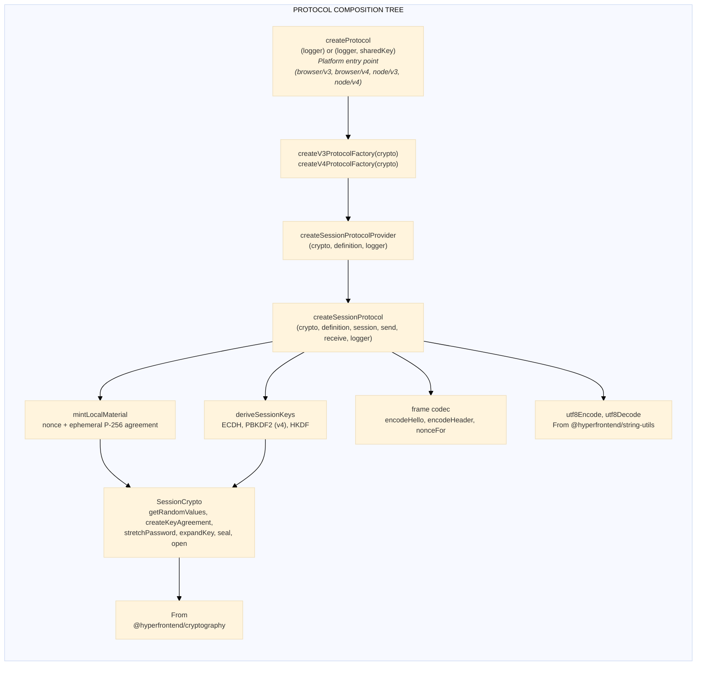
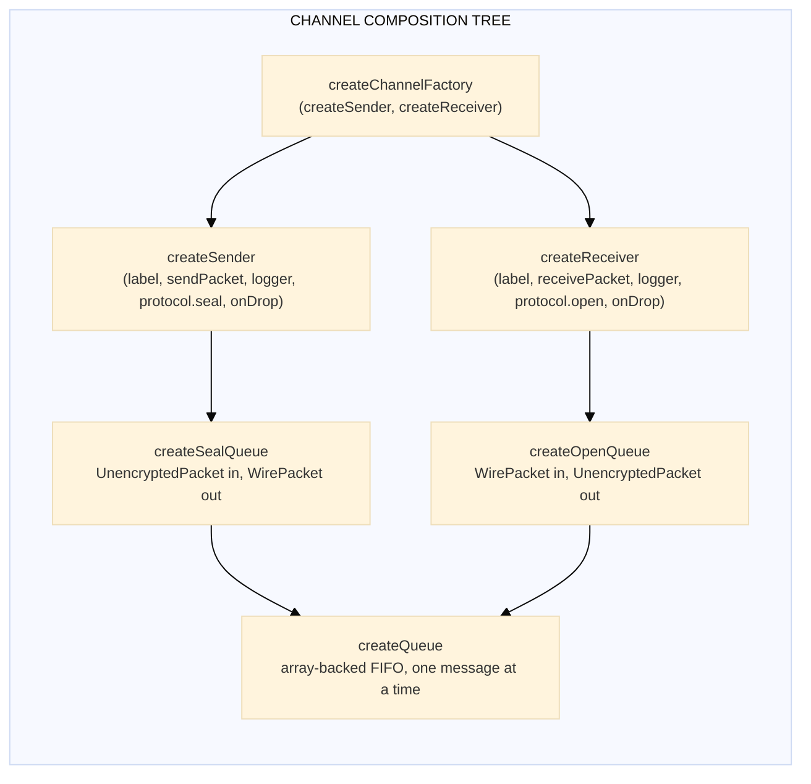
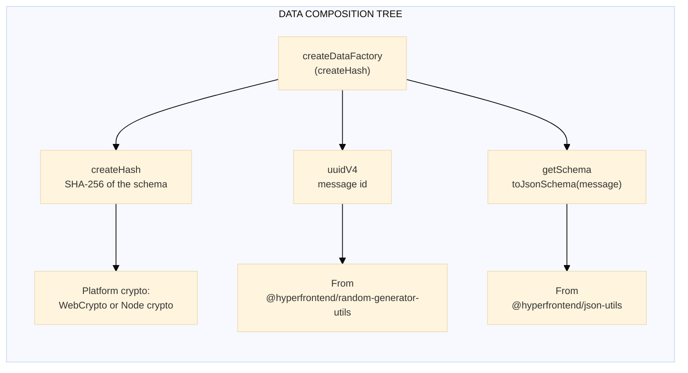
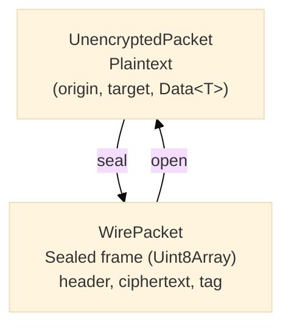
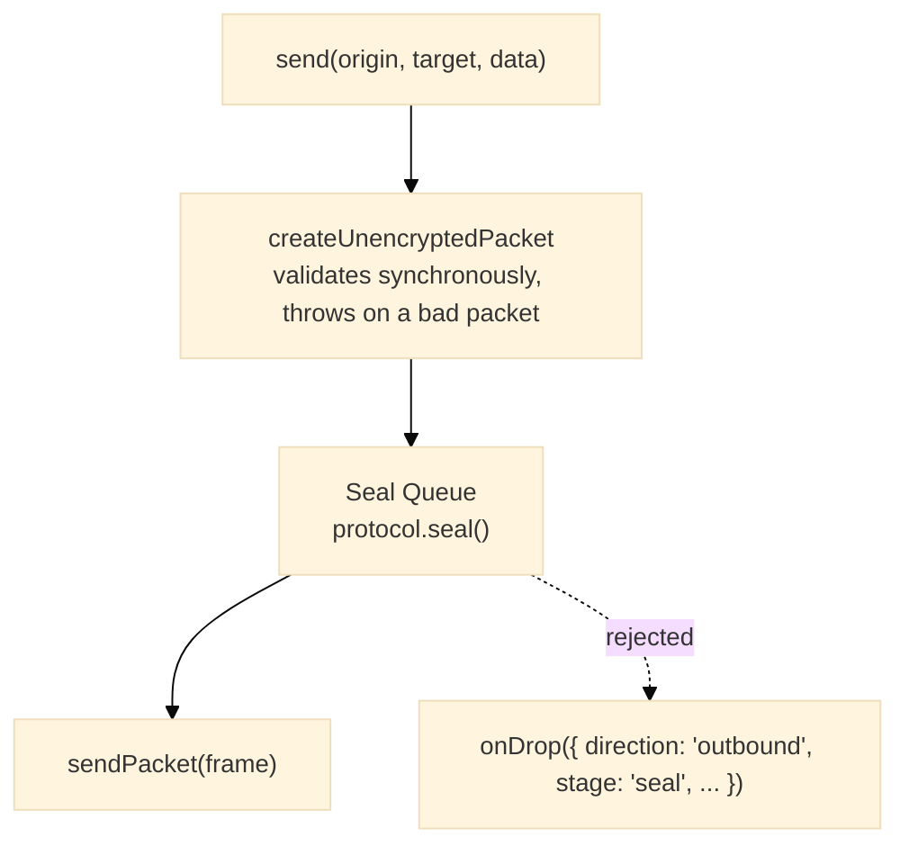
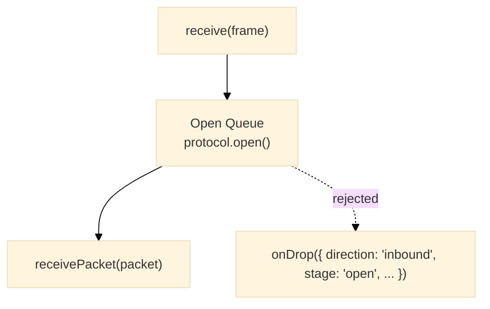
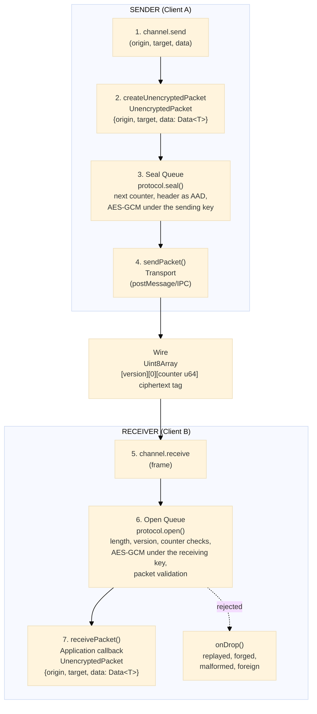

# Network Protocol Architecture Guide

This document provides an in-depth explanation of the major artifacts produced by `@hyperfrontend/network-protocol`. Each section covers the purpose, behavior, requirements, and usage examples for the core components of the library.

---

## Table of Contents

1. [Quick Reference: How Do I...](#quick-reference-how-do-i)
2. [Factory Function Reference](#factory-function-reference)
3. [Composition Tree](#composition-tree)
4. [Design Principles](#design-principles)
5. [Protocol](#protocol)
6. [Channel](#channel)
7. [Packet Types](#packet-types)
8. [Queue](#queue)
9. [Sender & Receiver](#sender--receiver)
10. [Topic](#topic)
11. [Routing](#routing)
12. [Security Suite](#security-suite)
13. [Data](#data)
14. [End-to-End Flow](#end-to-end-flow)
15. [Platform Differences](#platform-differences)
16. [Summary](#summary)
17. [Links](#links)

---

## Quick Reference: How Do I...

| Task                                  | Solution                                                                            | Module                                        |
| ------------------------------------- | ----------------------------------------------------------------------------------- | --------------------------------------------- |
| **Create a secure channel?**          | `createChannel(label, { send, receive, protocolProvider, session, onDrop? })`       | [channel/](src/lib/channel/README.md)         |
| **Send a sealed message?**            | `channel.send(origin, target, data)`                                                | [channel/](src/lib/channel/README.md)         |
| **Key the session?**                  | Post `await channel.hello()`; feed the peer's hello to `channel.acceptHello(frame)` | [protocol/](src/lib/protocol/README.md)       |
| **Tell a hello from a sealed frame?** | `channel.isHello(frame)`; hellos go to `acceptHello`, everything else to `receive`  | [protocol/](src/lib/protocol/README.md)       |
| **Authenticate the counterpart?**     | Use `v4` with a generated shared key of at least 16 characters                      | [protocol/](src/lib/protocol/README.md)       |
| **Find out why a frame was dropped?** | Pass `onDrop`; read `getProtocolErrorCode(drop.cause)`                              | [security/](src/lib/security/README.md)       |
| **Route messages by topic?**          | Create topics with `TopicStore`, configure a `Router` function                      | [routing/](src/lib/routing/README.md)         |
| **Manage multiple channels?**         | Use `ChannelStore` for CRUD operations                                              | [channel/](src/lib/channel/README.md)         |
| **Stop/resume message processing?**   | Call `channel.stop()` and `channel.resume()`                                        | [channel/](src/lib/channel/README.md)         |
| **Monitor queue depth?**              | Read `channel.outbound.queue.size` and `channel.inbound.queue.size`                 | [queue/](src/lib/queue/README.md)             |
| **Validate message structure?**       | Use auto-generated JSON Schema in `Data.schema`                                     | [data/](src/lib/data/README.md)               |
| **Start a new session?**              | Create a new channel; a live session is never rekeyed                               | [protocol/](src/lib/protocol/README.md)       |
| **Use in browser vs Node.js?**        | Import from `/browser/v3`, `/browser/v4`, `/node/v3`, or `/node/v4`                 | [Platform Differences](#platform-differences) |

---

## Factory Function Reference

The library uses factory functions to inject platform-specific dependencies while producing platform-agnostic artifacts.

| Factory                                                       | Injects                                                      | Produces                            | Location                                         |
| ------------------------------------------------------------- | ------------------------------------------------------------ | ----------------------------------- | ------------------------------------------------ |
| `createProtocol`                                              | The platform's `SessionCrypto` (composed at the entry)       | `ProtocolProvider`                  | `browser/v3`, `browser/v4`, `node/v3`, `node/v4` |
| `createV3ProtocolFactory(crypto)`                             | `SessionCrypto`                                              | `createProtocol(logger)`            | `lib/protocol/session`                           |
| `createV4ProtocolFactory(crypto)`                             | `SessionCrypto`                                              | `createProtocol(logger, sharedKey)` | `lib/protocol/session`                           |
| `createSessionProtocolProvider(crypto, definition, logger)`   | `SessionCrypto`, `{ id, version, sharedKey? }`, `Logger`     | `ProtocolProvider`                  | `lib/protocol/session`                           |
| `createSessionProtocol(input)`                                | Primitives, definition, session, `send`, `receive`, `Logger` | `Protocol`                          | `lib/protocol/session`                           |
| `createChannelFactory(createSender, createReceiver)`          | `CreateSender`, `CreateReceiver`                             | `ChannelCreater`                    | `lib/channel`                                    |
| `createChannelStoreFactory(createChannel)`                    | `ChannelCreater`                                             | `() => ChannelStore`                | `lib/channel`                                    |
| `createSender(label, sendPacket, logger, seal, onDrop?)`      | Transport send, the session's sealer                         | `Sender`                            | `lib/sender`                                     |
| `createReceiver(label, receivePacket, logger, open, onDrop?)` | Delivery callback, the session's opener                      | `Receiver`                          | `lib/receiver`                                   |
| `createSealQueue(label, seal, logger, onSuccess, onFail)`     | The session's sealer                                         | `Queue<UnencryptedPacket>`          | `lib/queue`                                      |
| `createOpenQueue(label, open, logger, onSuccess, onFail)`     | The session's opener                                         | `Queue<WirePacket>`                 | `lib/queue`                                      |
| `createQueue(processMessage, autoStart?)`                     | Message handler                                              | `Queue<T>`                          | `lib/queue`                                      |
| `createDataFactory(createHash)`                               | `createHash` (platform-specific)                             | `DataCreater`                       | `lib/data`                                       |
| `createProtocolProviderStore()`                               | None                                                         | `ProtocolProviderStore`             | `lib/protocol`                                   |
| `createTopicStore()`                                          | None                                                         | `TopicStore`                        | `lib/topic`                                      |

`SessionCrypto` is the set of primitives a session protocol is composed from: `getRandomValues`, `createKeyAgreement`, `stretchPassword`, `expandKey`, `seal`, and `open` from `@hyperfrontend/cryptography`, plus `utf8Encode` and `utf8Decode` from `@hyperfrontend/string-utils`. Each platform entry passes its platform's implementations; the shared logic in `lib/` never touches a crypto API directly.

---

## Composition Tree

This diagram shows how factory functions compose to create the full protocol stack:







---

## Design Principles

1. **Platform primitives are injected, never imported by the core.** The shared session protocol takes a `SessionCrypto`; the platform entries compose it.

   ```typescript
   // ✅ lib/ receives its primitives
   export function createV3ProtocolFactory(crypto: SessionCrypto): (logger: Logger) => ProtocolProvider

   // ❌ lib/ reaching for a platform API
   import { subtle } from 'node:crypto'
   ```

2. **One session, one protocol instance, one channel.** The provider is bound to a session once and a live session is never rekeyed; a new session means a new channel.

   ```typescript
   // ✅ a fresh channel for a fresh session
   const next = createChannel('link', { send, receive, protocolProvider, session: nextSession })

   // ❌ feeding a second hello to a keyed session; the outcome is 'rejected'
   channel.acceptHello(anotherHello)
   ```

3. **Replay is refused before decryption.** The counter check reads ten plaintext header bytes, so a replayed or forged frame costs no key operation.

   ```typescript
   // ✅ what the opener does first
   if (counter <= lastAccepted) throw createProtocolError('replayed', ...)

   // ❌ decrypting first and deduplicating afterwards
   const packet = await open(frame)
   if (seen.has(packet.data.id)) return
   ```

4. **Pipelines report, they do not throw.** `send` and `receive` return before any crypto runs; a stage that rejects a packet logs it and calls `onDrop`, and the next packet proceeds.

   ```typescript
   // ✅ observe drops where they happen
   createChannel('link', { ..., onDrop: (drop) => metrics.count(getProtocolErrorCode(drop.cause) ?? 'other') })

   // ❌ nothing to catch here; the seal runs later, inside the queue
   try {
     channel.send(origin, target, data)
   } catch {}
   ```

5. **Public material is public.** The hello carries a nonce and a public key in the clear, and nothing about the design depends on hiding them.

   ```typescript
   // ✅ post the hello by copy, as often as the transport needs
   target.postMessage(await channel.hello(), origin)

   // ❌ wrapping the hello in a second layer to hide it
   target.postMessage(await seal(hello), origin)
   ```

---

## Protocol

### Purpose

The **Protocol** is the object that keys one session and seals and opens its frames. It carries the session's hello exchange, its two directional AES-GCM keys, and its counters, along with the send/receive transport functions the channel was created with. It serves as a unified interface for secure message passing between two endpoints for the lifetime of one session.

### Interface

```typescript
interface Protocol<T = any> extends HelloExchange {
  seal: PacketSealer<T> // (packet: UnencryptedPacket<T>) => Promise<WirePacket>
  open: PacketOpener<T> // (frame: WirePacket) => Promise<UnencryptedPacket<T>>
  send: SendPacketFn // (frame: Uint8Array) => void
  receive: ReceivePacketFn<T> // (packet: UnencryptedPacket<T>) => void
  getLogger: () => Logger
}

interface HelloExchange {
  hello(): Promise<WirePacket> // this side's public material, the same bytes on every call
  isHello(frame: WirePacket): boolean // true for a hello frame of this protocol's version
  acceptHello(frame: WirePacket): HelloOutcome // 'accepted' | 'duplicate' | 'rejected'
}

type ProtocolProvider<T = any> = (send: SendPacketFn, receive: ReceivePacketFn<T>, session: ProtocolSession) => Protocol<T>

interface ProtocolSession {
  protocol: string // the negotiated identifier, 'v3' or 'v4'
  role: 'initiator' | 'responder'
  localId: string // this endpoint's identity as stamped on packets
  peerId: string // the peer's identity as stamped on packets
}
```

### How It Works

1. **Material**: At construction each instance mints a 32-byte random nonce and an ephemeral P-256 key pair. The private key never leaves the agreement object; it is collected with the session.

2. **Hello exchange**: `hello()` encodes the version byte, the hello type byte, the nonce, and the 65-byte uncompressed public key into a 99-byte frame. The transport posts it to the peer, as many times as it likes, until the peer answers. The peer's hello goes to `acceptHello(frame)`:
   - `'accepted'`: the first hello of the right version; the peer's material is now known and the session can be keyed.
   - `'duplicate'`: byte-for-byte the hello already accepted; a retry, ignored.
   - `'rejected'`: not a hello of this version, a public key not tagged as an uncompressed point, or a different hello after one was accepted. A live session is never rekeyed.

   ```mermaid
   ---
   config:
     theme: base
     themeVariables:
       fontSize: 12px
   ---
   sequenceDiagram
       participant I as Initiator
       participant R as Responder

       Note over I: mint nonce (32 bytes)<br/>and ephemeral P-256 key pair
       Note over R: mint nonce (32 bytes)<br/>and ephemeral P-256 key pair
       I->>R: hello: version, type 1, nonce, public key (99 bytes, plaintext)
       Note over R: acceptHello => 'accepted'
       R->>I: hello: version, type 1, nonce, public key (99 bytes, plaintext)
       Note over I: acceptHello => 'accepted'
       Note over I,R: salt = initiator nonce then responder nonce<br/>ikm = ECDH secret (v3) or ECDH secret then PBKDF2(sharedKey, salt) (v4)<br/>i2r key = HKDF-SHA256(ikm, salt, info i2r)<br/>r2i key = HKDF-SHA256(ikm, salt, info r2i)
       I->>R: data frame, counter 1, sealed under i2r
       Note over R: counter 1 > 0, open under i2r, deliver
       R->>I: data frame, counter 1, sealed under r2i
       Note over I: counter 1 > 0, open under r2i, deliver
   ```

3. **Key schedule**: Keys are derived once, on the first seal or open after both materials exist. Both sides order the material by role and compute the same two keys:
   - `salt` = initiator nonce followed by responder nonce
   - `dh` = ECDH(own private key, peer public key), 32 bytes; a peer public key that is not a point on the curve rejects here
   - `ikm` = `dh` (`v3`), or `dh` followed by PBKDF2-SHA256(`sharedKey`, `salt`, 600,000 iterations) (`v4`)
   - initiator-to-responder key = HKDF-SHA256(`ikm`, `salt`, `hyperfrontend/network-protocol/<protocol>/<initiatorId>/<responderId>/i2r`)
   - responder-to-initiator key = the same with `/r2i`

   Each key is a non-extractable AES-GCM-256 `CryptoKey` with a single usage: the initiator's `i2r` key can only encrypt and its `r2i` key can only decrypt, and the responder holds the mirror image. The protocol id and both identities are bound into the info, so keys belong to one negotiated session; both public keys are bound in through the agreement. Raw material (`dh`, the stretch, `ikm`) is zeroed once the keys exist. A derivation that fails rejects every later seal and open with `invalid-session`.

4. **Sealing**: `seal(packet)` takes the next counter (starting at 1), encodes the ten-byte header (version, type 0, counter as an unsigned 64-bit big-endian integer), serialises `{ origin, target, data }` with the message as a JSON string, UTF-8 encodes it, and seals it with AES-GCM under the sending key with the header as additional authenticated data and a nonce of four zero bytes followed by the counter's eight header bytes. The result is the header followed by the ciphertext and its 16-byte tag, in a buffer the transport may transfer. A session that has numbered every frame it can (the counter passes the largest safe integer) rejects with `counter-exhausted`.

5. **Opening**: `open(frame)` checks, in order and before any key operation, that the frame is at least 27 bytes (`malformed`), that its version byte is this protocol's (`unsupported-version`), and that its counter is above the last accepted one (`replayed`). It then opens the ciphertext under the receiving key with the same nonce and additional data (`authentication-failed` when the tag does not verify), parses and validates the packet (`malformed` when it authenticated but carries no valid packet), and only then records the counter as accepted.

6. **Waiting for the peer**: Until the peer's hello is accepted, every seal and open waits on the keys. The channel's queues hold their frames, so product traffic sent before the session is keyed leaves as soon as it is.

7. **Send/Receive**: Transport-agnostic functions injected at creation time. For browsers, `send` typically wraps `postMessage`; for Node.js, a worker or IPC port.

### Requirements

- A valid `Logger` instance from `@hyperfrontend/logging`
- For `v4`, a shared key of at least `MIN_SHARED_KEY_LENGTH` (16) characters; `createProtocol` throws otherwise
- A session whose `protocol` matches the provider's id; the provider throws `invalid-session` in the caller's frame otherwise
- Send function: `(frame: Uint8Array) => void`
- Receive function: `(packet: UnencryptedPacket<T>) => void`

### Example

```typescript
import { createProtocol } from '@hyperfrontend/network-protocol/browser/v4'
import { createLogger } from '@hyperfrontend/logging'

const logger = createLogger({ level: 'info' })

// Create a protocol provider bound to a generated shared key
const protocolProvider = createProtocol(logger, sharedKey)

// Instantiate for one session with transport functions
const protocol = protocolProvider(
  (frame) => otherWindow.postMessage(frame, origin, [frame.buffer]), // send
  (packet) => handleReceivedMessage(packet.data), // receive
  { protocol: 'v4', role: 'initiator', localId, peerId }
)

otherWindow.postMessage(await protocol.hello(), origin)
// ... once the peer's hello has been accepted:
const frame = await protocol.seal({ origin: localId, target: peerId, data })
const packet = await protocol.open(incomingFrame)
```

The channel does this binding for you; call the provider yourself only when you are building your own pipeline.

---

## Channel

### Purpose

A **Channel** is a named, bidirectional communication pipe that binds one protocol instance to one session and combines a Sender and Receiver with coordinated lifecycle controls. Channels provide a high-level abstraction for managing message flow between two endpoints.

### Interface

```typescript
interface Channel<T = any> extends StopResumeControl, HelloExchange {
  label: string
  send: SendFn<T> // (origin, target, data) => void
  receive: ReceiveFn // (frame: Uint8Array) => void; hello frames go to acceptHello instead
  outbound: OutboundPipeline // { queue: { size }, stop, resume }
  inbound: InboundPipeline // { queue: { size }, stop, resume }
}

interface ChannelOptions<T = any> {
  send: SendPacketFn // transmits each sealed frame to the peer
  receive: ReceivePacketFn<T> // receives each opened packet
  protocolProvider: ProtocolProvider<T>
  session: ProtocolSession
  onDrop?: PacketDropHandler // receives every packet either pipeline discards
}

interface StopResumeControl {
  stop: () => void
  resume: () => void
}
```

### How It Works

1. **Binding**: `createChannel(label, options)` validates the label, the callbacks, the provider, and the session, then calls the provider once. A provider that throws (a session negotiated for another protocol) throws out of `createChannel` in the caller's frame. The instance's `seal` feeds the outbound pipeline and its `open` feeds the inbound one; its `hello`, `isHello`, and `acceptHello` are exposed on the channel unchanged.

2. **Outbound Flow**: `channel.send(origin, target, data)` validates the origin, the target, and the data envelope synchronously (and throws on a malformed packet), assembles an `UnencryptedPacket`, and appends it to the seal queue. The seal stage seals one packet at a time and hands each frame to your `send`.

3. **Inbound Flow**: `channel.receive(frame)` appends the frame to the open queue. The open stage opens one frame at a time and hands each packet to your `receive`. Route hello frames to `channel.acceptHello` instead; a hello fed to `receive` fails to authenticate and is dropped.

4. **Lifecycle Control**: `stop()` pauses both queues (frames accumulate but are not processed); `resume()` restarts processing. `channel.outbound` and `channel.inbound` expose the same controls per direction.

5. **Queue Visibility**: `channel.outbound.queue.size` and `channel.inbound.queue.size` report how many packets are waiting, for monitoring and backpressure.

6. **Drops**: A packet a stage rejects is logged through the protocol's logger and, when `onDrop` is given, reported as a `PacketDrop` with the `direction`, the `stage` (`'seal'` or `'open'`), the `reason`, the `cause` (a `ProtocolError` for a protocol rejection), and the `packet` as the stage received it. The channel continues with the next packet.

### Requirements

- A unique label (non-empty string)
- Send packet function for transport
- Receive packet callback
- A configured `ProtocolProvider`
- A `ProtocolSession` with a protocol id, a role, and both identities (non-empty strings)

### Example

```typescript
import { createChannel } from '@hyperfrontend/network-protocol/browser/channel'
import { getProtocolErrorCode } from '@hyperfrontend/network-protocol/security'

const channel = createChannel('my-channel', {
  send: (frame) => transport.send(frame),
  receive: (packet) => console.log('Received:', packet.data),
  protocolProvider,
  session: { protocol: 'v3', role: 'initiator', localId, peerId },
  onDrop: (drop) => console.warn(drop.direction, drop.stage, getProtocolErrorCode(drop.cause), drop.reason),
})

// Key the session
transport.send(await channel.hello())
transport.onMessage((frame) => (channel.isHello(frame) ? channel.acceptHello(frame) : channel.receive(frame)))

// Send a message
channel.send(localId, peerId, messageData)

// Pause processing (e.g., for backpressure)
channel.stop()

// Resume later
channel.resume()
```

### Channel Store

For managing multiple channels, use `ChannelStore`:

```typescript
interface ChannelStore<T = any> {
  readonly create: (label: string, options: ChannelOptions<T>) => Channel<T>
  readonly add: (...channels: Channel<T>[]) => void
  readonly existsByName: (name: string) => boolean
  readonly existsById: (id: string) => boolean
  readonly getByName: (name: string) => Channel<T> | null
  readonly getById: (id: string) => Channel<T> | null
  readonly removeByName: (...names: string[]) => void
  readonly removeById: (...ids: string[]) => void
  readonly clear: () => void
  readonly list: readonly ChannelEntry<T>[]
}
```

`createChannelStore()` from `/browser/channel` or `/node/channel` returns a store whose `create` uses that platform's `createChannel`; labels are unique within a store.

---

## Packet Types

### Purpose

Packets are the fundamental data units that flow through the protocol. A packet has exactly two states: in the clear on either side of the pipeline, and sealed on the wire.

### Packet Hierarchy



### Interface Definitions

```typescript
interface PacketBase {
  origin: string // Sender identifier (UUID v4)
  target: string // Recipient identifier (UUID v4)
}

interface UnencryptedPacket<T = any> extends PacketBase {
  data: Data<T> // Structured message with metadata
}

type WirePacket = Uint8Array // A sealed frame carrying one packet

type Packet<T = any> = UnencryptedPacket<T> | WirePacket

type PacketSealer<T = any> = (packet: UnencryptedPacket<T>) => Promise<WirePacket>
type PacketOpener<T = any> = (packet: WirePacket) => Promise<UnencryptedPacket<T>>

interface PacketDrop {
  direction: 'inbound' | 'outbound'
  stage: 'seal' | 'open'
  reason: string
  cause?: unknown // the error the stage threw, when it threw one
  packet: unknown // the packet as the stage received it
}
```

### Wire Format

Every frame starts with a version byte (`3` for `v3`, `4` for `v4`) and a type byte.

| Frame | Layout                                                                              | Length                                  |
| ----- | ----------------------------------------------------------------------------------- | --------------------------------------- |
| Hello | `[version][type=1][nonce 32][public key 65]`                                        | 99 bytes, plaintext                     |
| Data  | `[version][type=0][counter u64 big-endian]` then AES-GCM ciphertext and 16-byte tag | at least 27 bytes; shorter is malformed |

The ten-byte data header is the additional authenticated data of the seal, and the AES-GCM nonce is four zero bytes followed by the counter's eight header bytes, so a counter is used once under a direction's key and the nonce is unique by construction. The plaintext inside a data frame is the UTF-8 JSON of `{ origin, target, data }`, where `data` is the `SerializedData` envelope (its `message` as a JSON string).

### How They Work

1. **Outbound Transformation**:

   ```text
   UnencryptedPacket → seal → WirePacket
   ```

2. **Inbound Transformation**:

   ```text
   WirePacket → open → UnencryptedPacket
   ```

3. **Origin/Target Preservation**: Origin and target identifiers travel inside the sealed payload, so they are authenticated along with the data and are available to the receiver for routing decisions once the frame is open.

### Example

```typescript
import { createUnencryptedPacket } from '@hyperfrontend/network-protocol/browser/packet'

const packet = createUnencryptedPacket(
  originId, // UUID v4
  targetId, // UUID v4
  data // Data<T> object
)
// → { origin: '...', target: '...', data: { pid, id, sequence, message, schema, schemaHash } }
```

---

## Queue

### Purpose

**Queues** are FIFO message processing containers that ensure ordered, asynchronous handling of packets at each pipeline stage. They provide flow control through stop/resume capabilities.

### Interface

```typescript
interface Queue<T extends object> {
  addMessage: (message: T) => void
  isRunning: () => boolean
  stop: () => void
  resume: () => void
  size: () => number
  currentMessage: () => T | null
}
```

### How It Works

1. **FIFO Processing**: Messages are processed in the order they're added. Each message fully completes before the next begins; that ordering is what lets the protocol assign a monotonically increasing counter to each frame it seals and keep the replay counter exact on each frame it opens.

2. **Array-backed**: The queue is an array with a moving head, so a pull is constant time; once 1,024 pulled slots sit at the front, the backing array is compacted.

3. **Backpressure Control**: `stop()` halts processing while still accepting new messages. When `resume()` is called, accumulated messages are processed in order.

4. **Callbacks**: Each specialised queue is created with success and failure callbacks; `onFail(raw, reason, cause?)` receives the rejected input, the stage's message, and the error the operation threw when it threw one.

### Queue Types

| Queue      | Creator           | Input               | Output              | Purpose                                                    |
| ---------- | ----------------- | ------------------- | ------------------- | ---------------------------------------------------------- |
| Seal queue | `createSealQueue` | `UnencryptedPacket` | `WirePacket`        | Validate the packet, seal it, validate the frame           |
| Open queue | `createOpenQueue` | `WirePacket`        | `UnencryptedPacket` | Validate the frame, open it, validate the resulting packet |

### Example

```typescript
import { createQueue } from '@hyperfrontend/network-protocol/queue'

const queue = createQueue<{ id: string }>(
  async (message) => {
    await processMessage(message)
  },
  true // autoStart
)

queue.addMessage({ id: '123' }) // Immediately starts processing

queue.stop()
queue.addMessage({ id: '456' }) // Queued but not processed
queue.addMessage({ id: '789' }) // Queued but not processed

console.log(queue.size()) // 2

queue.resume() // Processes 456, then 789
```

---

## Sender & Receiver

### Purpose

**Sender** and **Receiver** are the outbound and inbound message processing pipelines. Each wraps one queue around the session's sealer or opener.

### Sender Interface

```typescript
interface Sender<T = any> {
  send: SendFn<T> // (origin, target, data) => void
  stop: () => void
  resume: () => void
  queue: OutboundQueue // { size: number }
}

type SendFn<T = any> = (origin: string, target: string, data: Data<T>) => void
type SendPacketFn = (frame: Uint8Array) => void
```

### Receiver Interface

```typescript
interface Receiver {
  receive: ReceiveFn // (frame: Uint8Array) => void
  stop: () => void
  resume: () => void
  queue: InboundQueue // { size: number }
}

type ReceiveFn = (frame: Uint8Array) => void
type ReceivePacketFn<T = any> = (packet: UnencryptedPacket<T>) => void
```

### How They Work

**Sender Pipeline:**



**Receiver Pipeline:**



### Example

```typescript
import { createSender } from '@hyperfrontend/network-protocol/browser/sender'
import { createReceiver } from '@hyperfrontend/network-protocol/browser/receiver'

// Sender usage (internal to Channel)
const sender = createSender(
  'host sender',
  (frame) => frameWindow.postMessage(frame, origin, [frame.buffer]),
  logger,
  protocol.seal,
  (drop) => report(drop)
)
sender.send(originId, targetId, data)

// Check queue depth for monitoring
console.log('Pending seals:', sender.queue.size)

// Receiver usage (internal to Channel)
const receiver = createReceiver(
  'host receiver',
  (packet) => deliver(packet.data.message),
  logger,
  protocol.open,
  (drop) => report(drop)
)
receiver.receive(incomingFrame)
```

---

## Topic

### Purpose

A **Topic** is a named category for message routing. Topics enable pub/sub patterns where multiple channels can subscribe to the same topic, receiving copies of relevant messages.

### Interface

```typescript
interface Topic {
  readonly name: string // Human-readable identifier
  readonly id: string // UUID for internal tracking
}

interface TopicStore {
  readonly create: (...names: string[]) => void
  readonly add: (...topics: Topic[]) => void
  readonly getByName: (name: string) => Topic | null
  readonly getById: (id: string) => Topic | null
  readonly existsByName: (name: string) => boolean
  readonly existsById: (id: string) => boolean
  readonly removeByName: (...names: string[]) => void
  readonly removeById: (...ids: string[]) => void
  readonly clear: () => void
  readonly list: readonly Topic[]
}
```

### How It Works

1. **Topic Creation**: Create topics by name; the store assigns a unique UUID automatically.

2. **Uniqueness**: Names must be unique within a store. Attempting to create a duplicate throws an error.

3. **Lookup**: Topics can be retrieved by name or ID for routing configuration.

4. **Lifecycle**: Topics can be removed or the entire store cleared for cleanup.

### Example

```typescript
import { createTopicStore } from '@hyperfrontend/network-protocol/topic'

const topics = createTopicStore()

// Create multiple topics at once
topics.create('user-events', 'system-alerts', 'data-updates')

// Lookup by name
const userEvents = topics.getByName('user-events')
// → { name: 'user-events', id: '550e8400-e29b-41d4-a716-446655440000' }

// Check existence
if (topics.existsByName('user-events')) {
  // Route messages to this topic
}

// List all topics
console.log(topics.list)
// → [{ name: 'user-events', id: '...' }, { name: 'system-alerts', id: '...' }, ...]
```

---

## Routing

### Purpose

**Routing** connects topics to channels, determining which channels receive messages for a given topic. The routing system supports both dynamic (per-message) and cached (static) subscription resolution.

### Interface

```typescript
interface RoutingOptions {
  isDynamic: boolean // Fetch subscriptions per-message or cache once
  subscriptions: Subscriptions // WeakMap<Channel, Topic[]>
}

type Router = (channels: Channel[], topics: Topic[]) => RoutingOptions

interface RoutedPacket {
  topicId: string
  packet: unknown
}

interface RoutedWirePacket extends RoutedPacket {
  packet: Uint8Array // a sealed frame
}

interface RoutedUnencryptedPacket<T = any> extends RoutedPacket {
  packet: UnencryptedPacket<T>
}
```

### How It Works

1. **Router Configuration**: A `Router` function receives available channels and topics, returning a `RoutingOptions` object that maps channels to their subscribed topics.

2. **WeakMap for Memory Efficiency**: Subscriptions use `WeakMap<Channel, Topic[]>`, allowing channels to be garbage collected when no longer referenced elsewhere.

3. **Dynamic vs Cached Mode**:
   - `isDynamic: true` - Subscriptions are resolved for each message (useful when subscriptions change frequently)
   - `isDynamic: false` - Subscriptions are cached after first resolution (optimal for stable configurations)

4. **Routed Packets**: Packets are wrapped with a `topicId` for routing decisions, allowing the same packet to be sent to multiple channels subscribed to a topic. `createRoutedWirePacket` wraps a sealed frame; `createRoutedUnencryptedPacket` wraps a packet in the clear.

### Example

```typescript
import { createRoutedWirePacket } from '@hyperfrontend/network-protocol/routing'

// Create a routed packet
const routedPacket = createRoutedWirePacket(topic.id, sealedFrame)
// → { topicId: '550e8400-...', packet: Uint8Array[...] }

// Router configuration example
const router: Router = (channels, topics) => {
  const subscriptions = new WeakMap<Channel, Topic[]>()
  const byName = (name: string) => topics.filter((topic) => topic.name === name)

  // Subscribe channel A to user-events and system-alerts
  subscriptions.set(channelA, [...byName('user-events'), ...byName('system-alerts')])

  // Subscribe channel B to data-updates only
  subscriptions.set(channelB, byName('data-updates'))

  return {
    isDynamic: false, // Cache these subscriptions
    subscriptions,
  }
}
```

---

## Security Suite

### Purpose

The **Security Suite** is the pair of per-session packet operations a protocol implements, together with the session description, the hello outcome, and the error codes a protocol raises. The `/security` entry exports the types and the error helpers; the protocol entries provide the implementations.

### Interface

```typescript
interface SecuritySuite<T = any> {
  seal: PacketSealer<T> // seals outgoing packets under the session's sending key
  open: PacketOpener<T> // opens incoming frames under the session's receiving key
}

type SessionRole = 'initiator' | 'responder'

interface ProtocolSession {
  protocol: string
  role: SessionRole
  localId: string
  peerId: string
}

type HelloOutcome = 'accepted' | 'duplicate' | 'rejected'

interface ProtocolError extends Error {
  code: ProtocolErrorCode
}

function createProtocolError(code: ProtocolErrorCode, message: string): ProtocolError
function getProtocolErrorCode(error: unknown): ProtocolErrorCode | null
```

### Error Codes

| Code                    | Raised by              | When                                                                                           |
| ----------------------- | ---------------------- | ---------------------------------------------------------------------------------------------- |
| `unsupported-version`   | `open`                 | The frame's version byte is not this protocol's                                                |
| `replayed`              | `open`                 | The frame's counter is not above the last accepted one                                         |
| `authentication-failed` | `open`                 | The frame's tag does not verify under the session's keys                                       |
| `malformed`             | `open`                 | The frame is shorter than 27 bytes, or authenticated but carries no packet                     |
| `counter-exhausted`     | `seal`                 | The session has sealed every counter value it can number                                       |
| `invalid-session`       | both, and the provider | The session cannot be keyed from the material it holds, or was negotiated for another protocol |

Every error survives the pipeline's drop report as `drop.cause`; `getProtocolErrorCode(drop.cause)` returns the code, or `null` for an error that is not a protocol error.

### What Each Protocol Claims

| Claim                                                          | v3  | v4  |
| -------------------------------------------------------------- | :-: | :-: |
| A script that can only listen cannot read frames               | ✅  | ✅  |
| A script that can only listen cannot forge frames              | ✅  | ✅  |
| A replayed frame, or a frame from another session, is rejected | ✅  | ✅  |
| The counterpart is authenticated                               | ❌  | ✅  |
| A key mismatch is detected                                     | n/a | ✅  |
| The hello is hidden                                            | ❌  | ❌  |

`v3` defeats scripts that can only listen: a passive observer of `message` events cannot read or forge frames. Any script that can post to a peer's window with a genuine source can complete a `v3` handshake as that peer, so `v3` does not authenticate who the counterpart is. `v4` binds the session to the pre-shared key: without the key a script can neither read frames nor produce frames the counterpart accepts, and a key mismatch is detected because no frame ever authenticates. A party that can run a hello exchange against a `v4` side can test key guesses offline afterwards, which is why the key must be generated (128 bits or more), not chosen by a person. Neither protocol hides the hello; public keys and nonces are public by design.

### Cost

| Cost        | v3                                             | v4                                                           |
| ----------- | ---------------------------------------------- | ------------------------------------------------------------ |
| Per session | one ECDH agreement plus one HKDF per direction | the same plus one PBKDF2-SHA256 stretch (600,000 iterations) |
| Per message | one AES-GCM operation per direction            | one AES-GCM operation per direction                          |

The stretch is the only expensive step and it runs once, when the session is keyed, so it lands on the handshake and not on traffic.

### Example

```typescript
import { createProtocol } from '@hyperfrontend/network-protocol/browser/v3'
import { createProtocolError, getProtocolErrorCode, ProtocolErrorCode } from '@hyperfrontend/network-protocol/security'

const protocolProvider = createProtocol(logger)
const protocol = protocolProvider(sendFn, receiveFn, session)

// Manual usage of the suite operations
const frame = await protocol.seal(unencryptedPacket)
const packet = await protocol.open(frame)

// Reading a rejection
try {
  await protocol.open(frame) // the same counter again
} catch (error) {
  getProtocolErrorCode(error) // => 'replayed'
}

// Raising one from your own implementation of the suite
throw createProtocolError(ProtocolErrorCode.Malformed, 'Frame carries no packet')
```

---

## Data

### Purpose

**Data** is the structured message payload within packets. It includes metadata for message tracking, sequencing, and schema validation.

### Interface

```typescript
interface Data<T = unknown> {
  pid: string // Process identifier (UUID v4)
  id: string // Unique message ID (UUID v4)
  sequence: number // Sequence number within process
  message: T // The actual message payload
  schema: Schema // JSON Schema describing the message
  schemaHash: string // SHA-256 hash of the schema
}

interface SerializedData<T = unknown> {
  // Same fields, but message is JSONString<T> instead of T
  message: JSONString<T>
}
```

### How It Works

1. **Process Tracking**: `pid` groups related messages; `sequence` orders them within a process.

2. **Message Identification**: `id` is a unique UUID for deduplication and acknowledgment.

3. **Schema Validation**: Auto-generated JSON Schema enables runtime validation of message structure. The `schemaHash` allows quick comparison without full schema analysis.

4. **Serialization**: For wire transmission, `message` is JSON-stringified and typed as `JSONString<T>` to preserve type information; the seal stage does this itself, so a channel takes `Data<T>` and the frame carries `SerializedData<T>`.

### Requirements

- `pid`: UUID v4
- `sequence`: Positive number
- `message`: Serializable value (no circular references)

### Example

```typescript
import { createData, deserializeData } from '@hyperfrontend/network-protocol/browser/data'

const serialized = await createData(pid, 1, {
  action: 'LOGIN',
  username: 'alice',
})

// Result:
// {
//   pid: '550e8400-e29b-41d4-a716-446655440000',
//   id: '7f3b1e82-9e47-4b1a-a8c3-2d4e5f6a7b8c',
//   sequence: 1,
//   message: '{"action":"LOGIN","username":"alice"}',
//   schema: { type: 'object', properties: { action: {...}, username: {...} } },
//   schemaHash: 'a1b2c3d4...'
// }

const data = deserializeData(serialized) // message is the object again; this is what channel.send takes
```

---

## End-to-End Flow

### Complete Message Journey

Here's how a message flows from sender to receiver once both hellos have been accepted:



### Practical Example

Setup, on both sides:

```typescript
import { logger } from '@hyperfrontend/logging'
import { createChannel } from '@hyperfrontend/network-protocol/browser/channel'
import { createData, deserializeData } from '@hyperfrontend/network-protocol/browser/data'
import { createProtocol } from '@hyperfrontend/network-protocol/browser/v4'

const protocolProvider = createProtocol(logger, sharedKey) // the same generated key on both sides
```

Client A, in the main window:

```typescript
const iframeWindow = document.querySelector('iframe').contentWindow

const channelA = createChannel('main-to-iframe', {
  send: (frame) => iframeWindow.postMessage(frame, iframeOrigin, [frame.buffer]),
  receive: (packet) => console.log('A received:', packet.data.message),
  protocolProvider,
  session: { protocol: 'v4', role: 'initiator', localId: mainId, peerId: iframeId },
})

window.addEventListener('message', ({ origin, data }) => {
  if (origin !== iframeOrigin) return
  if (channelA.isHello(data)) channelA.acceptHello(data)
  else channelA.receive(data)
})

iframeWindow.postMessage(await channelA.hello(), iframeOrigin)

// Send a message; it is sealed as soon as B's hello has keyed the session
const data = deserializeData(await createData(sessionPid, 1, { action: 'SYNC_STATE', payload: state }))
channelA.send(mainId, iframeId, data)
```

Client B, in the iframe:

```typescript
const channelB = createChannel('iframe-to-main', {
  send: (frame) => window.parent.postMessage(frame, mainOrigin, [frame.buffer]),
  receive: (packet) => console.log('B received:', packet.data.message),
  protocolProvider,
  session: { protocol: 'v4', role: 'responder', localId: iframeId, peerId: mainId },
})

window.addEventListener('message', ({ origin, data }) => {
  if (origin !== mainOrigin) return
  if (channelB.isHello(data)) channelB.acceptHello(data)
  else channelB.receive(data)
})

window.parent.postMessage(await channelB.hello(), mainOrigin)
```

Both sides agree on the roles and the identities before the channels exist; `mainId` is A's `localId` and B's `peerId`, and the reverse for `iframeId`.

---

## Platform Differences

| Aspect        | Browser                                                        | Node.js                                                  |
| ------------- | -------------------------------------------------------------- | -------------------------------------------------------- |
| Crypto API    | Web Crypto API                                                 | Node.js `crypto` module (`webcrypto.subtle`)             |
| Transport     | `postMessage`, `MessageChannel`                                | `worker_threads`, IPC, `process.send()`                  |
| Entry Points  | `@hyperfrontend/network-protocol/browser/v3`, `.../browser/v4` | `@hyperfrontend/network-protocol/node/v3`, `.../node/v4` |
| Text Encoding | `@hyperfrontend/string-utils/browser`                          | `@hyperfrontend/string-utils/node`                       |

Both platforms expose identical `Protocol`, `Channel`, and other interfaces; only the injected primitives differ, and a session keyed by a browser-composed side and a Node-composed side produces identical frames.

---

## Summary

The `@hyperfrontend/network-protocol` library provides a comprehensive, secure communication framework built on these principles:

1. **Session-Keyed Envelope**: Ephemeral P-256 agreement, HKDF expansion per direction, AES-GCM with the header authenticated and the counter as the nonce
2. **One-Shot Sessions**: The first hello keys the session; a repeat is a duplicate, anything else is rejected, and a live session is never rekeyed
3. **Typed Transformations**: Two packet states, in the clear and on the wire, with one seal and one open between them
4. **Queue-Based Flow Control**: Ordered processing with backpressure support and an exact replay counter
5. **Platform Agnostic**: Same API for browser and Node.js, interoperable across them
6. **Observable**: Drop reports with machine-readable codes, queue visibility, and structured logging
7. **Flexible Routing**: Topic-based pub/sub with dynamic subscription support

Each artifact is designed to be composable, testable, and production-ready for applications requiring secure cross-context communication.

---

## Links

- [README.md](README.md) - Package overview, installation, and quick start
- [src/lib/README.md](src/lib/README.md) - Module index with links to each subdomain
- [src/browser/README.md](src/browser/README.md) - Browser platform entry points
- [src/node/README.md](src/node/README.md) - Node.js platform entry points
