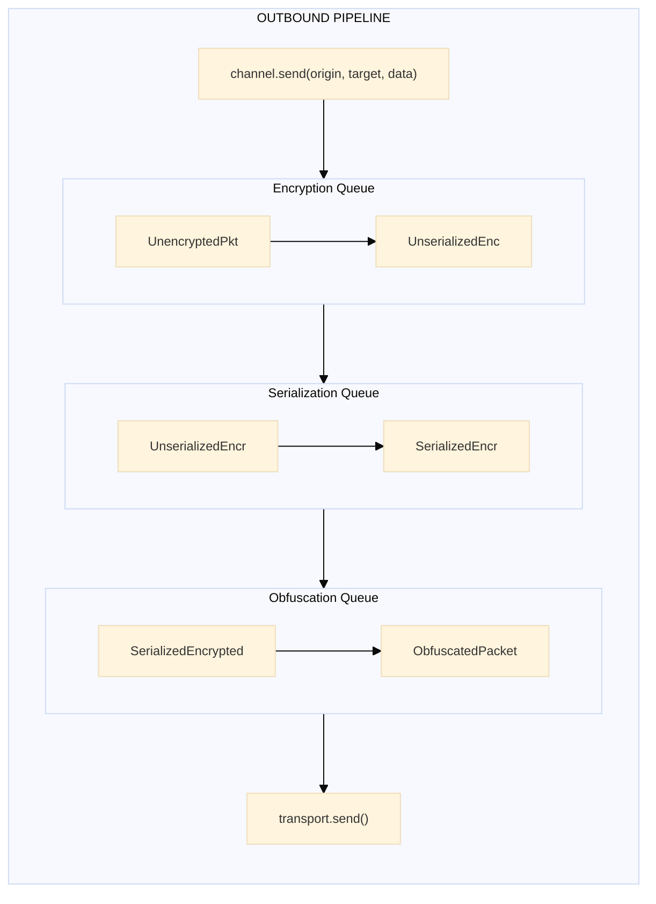
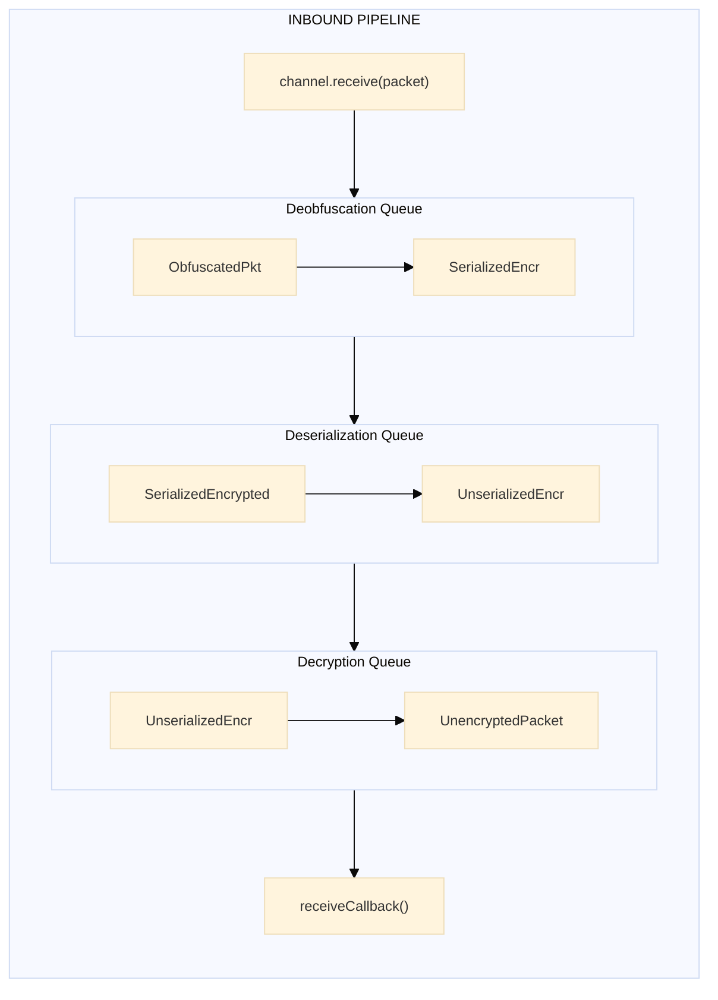

# Channel

## Purpose

The Channel module provides a named, bidirectional communication pipe that combines a Sender and Receiver with coordinated lifecycle controls. Channels provide a high-level abstraction for managing message flow between two endpoints.

---

## Key Interfaces

### `Channel<T>`

The main channel interface that extends `StopResumeControl`.

```typescript
interface Channel<T = any> extends StopResumeControl {
  label: string // Unique channel identifier
  send: SendFn<T> // Send messages through outbound pipeline
  receive: ReceiveFn // Process incoming packets
  outbound: OutboundQueues & StopResumeControl // Access to outbound queue chain
  inbound: InboundQueues & StopResumeControl // Access to inbound queue chain
}
```

### `StopResumeControl`

Lifecycle control interface for pausing/resuming message processing.

```typescript
interface StopResumeControl {
  stop: () => void // Pause processing (messages accumulate)
  resume: () => void // Resume processing accumulated messages
}
```

### `Protocol<T>`

The protocol object providing security operations.

```typescript
interface Protocol<T = any> {
  packetEncryption: PacketEncryption<T> // Encrypt outbound packets
  packetDecryption: PacketDecryption<T> // Decrypt inbound packets
  packetObfuscation: PacketObfuscation // Obfuscate outbound packets
  packetDeobfuscation: PacketDeobfuscation // Deobfuscate inbound packets
  send: SendPacketFn // Transport send function
  receive: ReceivePacketFn<T> // Receive callback
  getLogger: () => Logger // Logger accessor
}
```

### `ProtocolProvider<T>`

Factory function that creates a Protocol from transport functions.

```typescript
type ProtocolProvider<T = any> = (send: SendPacketFn, receive: ReceivePacketFn<T>) => Protocol<T>
```

### `ChannelCreater<T>`

Factory function type that creates Channel instances.

```typescript
type ChannelCreater<T = any> = (label: string, send: SendPacketFn, receive: ReceivePacketFn, protocol: ProtocolProvider<T>) => Channel<T>
```

### `ChannelStore<T>`

Store for managing multiple channels.

```typescript
interface ChannelStore<T = any> {
  readonly create: (label, send, receive, protocol) => Channel<T>
  readonly add: (...channels: Channel<T>[]) => void
  readonly existsByName: (name: string) => boolean
  readonly existsById: (id: string) => boolean
  readonly removeByName: (...names: string[]) => void
  readonly removeById: (...ids: string[]) => void
  readonly clear: () => void
  readonly getByName: (name: string) => Channel<T> | null
  readonly getById: (id: string) => Channel<T> | null
  readonly list: readonly ChannelEntry<T>[]
}
```

---

## Factory Functions

### `createChannelFactory`

Creates a channel factory with injected sender and receiver factories.

**Signature**:

```typescript
function createChannelFactory(createSender: SenderFactory, createReceiver: ReceiverFactory): ChannelCreater
```

**Parameters**:

| Parameter        | Type              | Description                          |
| ---------------- | ----------------- | ------------------------------------ |
| `createSender`   | `SenderFactory`   | Factory to create outbound pipelines |
| `createReceiver` | `ReceiverFactory` | Factory to create inbound pipelines  |

**Returns**: A `ChannelCreater` function.

**Example**:

```typescript
import { createChannelFactory } from '@hyperfrontend/network-protocol/lib/channel'
import { createSenderFactory } from '@hyperfrontend/network-protocol/lib/sender'
import { createReceiverFactory } from '@hyperfrontend/network-protocol/lib/receiver'

// Step 1: Create sender and receiver factories (platform-specific)
const createSender = createSenderFactory(/* platform dependencies */)
const createReceiver = createReceiverFactory(/* platform dependencies */)

// Step 2: Create channel factory
const createChannel = createChannelFactory(createSender, createReceiver)

// Step 3: Create a channel
const channel = createChannel(
  'my-channel',
  (packet) => transport.send(packet), // Send transport function
  (packet) => handleMessage(packet.data), // Receive callback
  protocolProvider // Security provider
)
```

---

### `createChannelStoreFactory`

Creates a channel store factory for managing multiple channels.

**Signature**:

```typescript
function createChannelStoreFactory(createChannel: ChannelCreater): () => ChannelStore
```

**Example**:

```typescript
import { createChannelStoreFactory } from '@hyperfrontend/network-protocol/lib/channel'

const createChannelStore = createChannelStoreFactory(createChannel)
const channelStore = createChannelStore()

// Create and automatically register a channel
const channel1 = channelStore.create('channel-1', sendFn, receiveFn, protocolProvider)

// Or add an externally created channel
const channel2 = createChannel('channel-2', sendFn, receiveFn, protocolProvider)
channelStore.add(channel2)

// Look up channels
const found = channelStore.getByName('channel-1')
console.log(channelStore.existsByName('channel-1')) // true

// List all channels
channelStore.list.forEach((entry) => {
  console.log(`${entry.id}: ${entry.name}`)
})

// Remove channels
channelStore.removeByName('channel-1')
channelStore.clear() // Remove all
```

---

## Pipeline Architecture

When a channel is created, it internally constructs two pipelines:

### Outbound Pipeline (Sender)

When you call `channel.send(origin, target, data)`:



### Inbound Pipeline (Receiver)

When a packet arrives via `channel.receive(packet)`:



---

## Lifecycle Management

### Stop/Resume Controls

Channels provide granular control over message processing:

```typescript
// Stop all processing (both directions)
channel.stop()

// Or stop just one direction
channel.outbound.stop() // Pause outbound only
channel.inbound.stop() // Pause inbound only

// Resume processing
channel.resume()

// Or resume just one direction
channel.outbound.resume()
channel.inbound.resume()
```

### What Happens When Stopped

1. **Messages Continue to Accumulate**: `addMessage()` still adds to queues
2. **Processing Pauses**: No messages are transformed or sent
3. **Queue Sizes Grow**: Monitor with `queue.size()` for backpressure

### What Happens When Resumed

1. **FIFO Processing Resumes**: Accumulated messages process in order
2. **Pipeline Continues**: Each queue feeds the next in sequence

---

## Queue Visibility & Monitoring

Access individual queues for monitoring and metrics:

```typescript
// Outbound queue access
const encryptQueueSize = channel.outbound.encryptionQueue.size()
const serializeQueueSize = channel.outbound.serializationQueue.size()
const obfuscateQueueSize = channel.outbound.obfuscationQueue.size()

// Inbound queue access
const deobfuscateQueueSize = channel.inbound.deobfuscationQueue.size()
const deserializeQueueSize = channel.inbound.deserializationQueue.size()
const decryptQueueSize = channel.inbound.decryptionQueue.size()

// Total pending outbound messages
const totalOutbound = encryptQueueSize + serializeQueueSize + obfuscateQueueSize

// Backpressure detection example
if (totalOutbound > 100) {
  console.warn('Outbound backpressure detected!')
  // Optionally slow down or pause upstream
}
```

---

## Backpressure Management

### Pattern: Pause on High Queue Depth

```typescript
const BACKPRESSURE_THRESHOLD = 50

function checkBackpressure(channel: Channel) {
  const depth = channel.outbound.encryptionQueue.size()
  if (depth > BACKPRESSURE_THRESHOLD) {
    channel.outbound.stop()
    console.warn(`Pausing channel ${channel.label}: queue depth ${depth}`)
    return true
  }
  return false
}

// Resume when queue drains
function maybeResume(channel: Channel) {
  const depth = channel.outbound.encryptionQueue.size()
  if (depth < BACKPRESSURE_THRESHOLD / 2) {
    channel.outbound.resume()
    console.log(`Resuming channel ${channel.label}`)
  }
}
```

### Pattern: Graceful Shutdown

```typescript
async function gracefulShutdown(channel: Channel, timeoutMs = 5000) {
  // Stop accepting new messages
  channel.stop()

  // Wait for queues to drain
  const start = Date.now()
  while (Date.now() - start < timeoutMs) {
    const outboundEmpty =
      channel.outbound.encryptionQueue.size() === 0 &&
      channel.outbound.serializationQueue.size() === 0 &&
      channel.outbound.obfuscationQueue.size() === 0

    if (outboundEmpty) {
      console.log(`Channel ${channel.label} drained successfully`)
      return
    }
    await new Promise((r) => setTimeout(r, 100))
  }
  console.warn(`Channel ${channel.label} shutdown timeout - some messages may be lost`)
}
```

---

## Error Handling

Errors in queues are handled via the `onFail` callback pattern:

```typescript
// Errors are logged and passed to fail callbacks
// The channel continues processing subsequent messages

// Access error handling through sender/receiver creation
// See sender/ and receiver/ modules for error callback patterns
```

---

## Complete Example

```typescript
import { createProtocol } from '@hyperfrontend/network-protocol/browser/v1'
import { createLogger } from '@hyperfrontend/logging'

// Setup
const logger = createLogger({ level: 'info' })
const protocolProvider = createProtocol(logger, 60) // 60-min refresh

// Create channel
const channel = createChannel(
  'iframe-communication',
  (packet) => iframe.contentWindow.postMessage(packet, '*'),
  (packet) => handleIncomingMessage(packet.data.message),
  protocolProvider
)

// Listen for incoming messages
window.addEventListener('message', (event) => {
  if (event.data instanceof Uint8Array) {
    channel.receive(event.data)
  }
})

// Send messages
channel.send('https://parent.example.com', 'https://iframe.example.com', createData(messagePayload))

// Monitor health
setInterval(() => {
  console.log(`Outbound queue depth: ${channel.outbound.encryptionQueue.size()}`)
}, 1000)
```

---

## Relationship to Other Modules

- **Depends on**: [`sender/`](../sender/README.md), [`receiver/`](../receiver/README.md), [`protocol/`](../protocol/README.md), [`packet/`](../packet/README.md)
- **Used by**: [`routing/`](../routing/README.md) (for topic-based message routing)

---

## Directory Structure

```
channel/
├── README.md           ← You are here
├── index.ts            ← Public exports
├── model.ts            ← Interface definitions
├── mocks.ts            ← Mock implementations for testing
├── channel.integration.spec.ts  ← Integration tests
├── creators/
│   ├── index.ts
│   ├── create-channel.ts
│   ├── create-channel-store.ts
│   └── mocks.ts
├── utils/
│   └── without-valid-error-message.ts
└── validations/
    ├── is-valid-label.ts
    ├── is-valid-sender.ts
    ├── is-valid-receiver.ts
    ├── is-valid-channel.ts
    └── get-first-invalid-protocol-property.ts
```

---

## See Also

- **[Library Index](../README.md)** - All modules
- **[Architecture Guide](../../../ARCHITECTURE.md#channel)** - Channel architecture
- **[Browser Entry](../../browser/README.md)** - Browser-specific channel
- **[Node Entry](../../node/README.md)** - Node.js-specific channel

### Related Modules

| Module                             | Relationship                           |
| ---------------------------------- | -------------------------------------- |
| [sender/](../sender/README.md)     | Outbound pipeline component            |
| [receiver/](../receiver/README.md) | Inbound pipeline component             |
| [protocol/](../protocol/README.md) | Provides security operations           |
| [queue/](../queue/README.md)       | Underlying queue implementation        |
| [routing/](../routing/README.md)   | Uses channels for message distribution |
