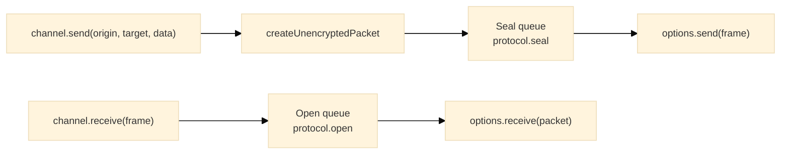

# Channel

## Purpose

The Channel module provides a named, bidirectional pipe that binds one protocol instance to one session and wraps it in a Sender and a Receiver with coordinated lifecycle controls. A channel seals what it sends, opens what it receives, and exposes the protocol's hello exchange unchanged so the owner can run it over the same transport.

---

## Key Interfaces

### `Channel<T>`

```typescript
interface Channel<T = any> extends StopResumeControl, HelloExchange {
  readonly label: string // Channel identifier
  readonly send: SendFn<T> // (origin, target, data) => void
  readonly receive: ReceiveFn // (frame: Uint8Array) => void; hello frames go to acceptHello instead
  readonly outbound: OutboundPipeline // { queue: { size }, stop, resume }
  readonly inbound: InboundPipeline // { queue: { size }, stop, resume }
}
```

`HelloExchange` contributes `hello()`, `isHello(frame)`, and `acceptHello(frame)`; `StopResumeControl` contributes `stop()` and `resume()`.

### `ChannelOptions<T>`

Everything a channel needs beyond its label.

```typescript
interface ChannelOptions<T = any> {
  readonly send: SendPacketFn // Transmits each sealed frame to the peer
  readonly receive: ReceivePacketFn<T> // Receives each opened packet
  readonly protocolProvider: ProtocolProvider<T> // Creates the protocol instance for the session
  readonly session: ProtocolSession // { protocol, role, localId, peerId }
  readonly onDrop?: PacketDropHandler // Receives every packet either pipeline discards
}
```

### `ChannelCreater<T>`

```typescript
type ChannelCreater<T = any> = (label: string, options: ChannelOptions<T>) => Channel<T>
```

### `Protocol<T>` and `ProtocolProvider<T>`

Declared here and documented in [`protocol/`](../protocol/README.md): a protocol carries `seal`, `open`, the hello exchange, `send`, `receive`, and `getLogger`; a provider is `(send, receive, session) => Protocol`.

### `ChannelStore<T>`

```typescript
interface ChannelStore<T = any> {
  readonly create: (label: string, options: ChannelOptions<T>) => Channel<T>
  readonly add: (...channels: Channel<T>[]) => void
  readonly existsByName: (name: string) => boolean
  readonly existsById: (id: string) => boolean
  readonly removeByName: (...names: string[]) => void
  readonly removeById: (...ids: string[]) => void
  readonly clear: () => void
  readonly getByName: (name: string) => Channel<T> | null
  readonly getById: (id: string) => Channel<T> | null
  readonly list: readonly ChannelEntry<T>[] // { id, name, channel }
}
```

---

## Factory Functions

### `createChannelFactory`

Creates a channel creator with injected sender and receiver factories. The `/browser/channel` and `/node/channel` entries call it with their platform's `createSender` and `createReceiver` and export the result as `createChannel`.

```typescript
function createChannelFactory(createSender: SenderFactory, createReceiver: ReceiverFactory): ChannelCreater
```

The creator validates the label, the options object, both callbacks, the provider, and the session, then calls the provider once. A provider that throws (a session it cannot key) throws out of `createChannel` in the caller's frame. The protocol's `seal` feeds the sender and its `open` feeds the receiver; `onDrop` is passed to both.

```typescript
import { createChannel } from '@hyperfrontend/network-protocol/browser/channel'
import { createProtocol } from '@hyperfrontend/network-protocol/browser/v3'
import { createLogger } from '@hyperfrontend/logging'

const channel = createChannel('app-to-widget', {
  send: (frame) => otherWindow.postMessage(frame, origin, [frame.buffer]),
  receive: (packet) => handle(packet.data.message),
  protocolProvider: createProtocol(createLogger({ level: 'info' })),
  session: { protocol: 'v3', role: 'initiator', localId, peerId },
  onDrop: (drop) => report(drop),
})
```

### `createChannelStoreFactory`

```typescript
function createChannelStoreFactory(createChannel: ChannelCreater): () => ChannelStore
```

```typescript
import { createChannel, createChannelStore } from '@hyperfrontend/network-protocol/browser/channel'

const store = createChannelStore()

const first = store.create('channel-1', options) // creates and registers
store.add(createChannel('channel-2', options)) // registers an existing channel

store.getByName('channel-1')
store.existsByName('channel-1') // true
store.list.forEach((entry) => track(entry.id, entry.name))
store.removeByName('channel-1')
store.clear()
```

`create` and `add` throw for a name already in the store; `removeByName` and `removeById` throw when nothing matches.

---

## Hello Exchange

The channel exposes the protocol's `hello`, `isHello`, and `acceptHello` so the owner can key the session over the same transport that carries frames:

```typescript
otherWindow.postMessage(await channel.hello(), origin)
window.addEventListener('message', ({ data }) => (channel.isHello(data) ? channel.acceptHello(data) : channel.receive(data)))
```

`hello()` returns the same bytes on every call, so it can be retried until the peer confirms. `acceptHello` returns `'accepted'` for the first hello, `'duplicate'` for the same bytes again, and `'rejected'` for anything else. Frames sent or received before the peer's hello is accepted wait inside the pipelines.

---

## Pipeline Architecture

Each direction is one stage over one FIFO queue.



- **Outbound**: `send` builds and validates the plaintext packet synchronously, then queues it; the seal stage produces the wire frame and hands it to `options.send`.
- **Inbound**: `receive` queues the frame; the open stage produces the plaintext packet and hands it to `options.receive`.

---

## Lifecycle Management

```typescript
channel.stop() // Pauses both directions
channel.resume() // Resumes both directions

channel.outbound.stop() // Pauses sealing only
channel.inbound.stop() // Pauses opening only
channel.outbound.resume()
channel.inbound.resume()
```

While stopped, `send` and `receive` still enqueue; nothing is sealed or opened, and `queue.size` grows. On resume, accumulated items process in FIFO order.

---

## Queue Visibility

```typescript
const pendingOut = channel.outbound.queue.size
const pendingIn = channel.inbound.queue.size

if (pendingOut > 100) {
  channel.outbound.stop()
}
```

---

## Error Handling

`createChannel` throws in the caller's frame for invalid input:

```typescript
createChannel('', options) // 'Cannot create a channel without a valid label'
createChannel('comms', null) // 'Cannot create a channel without a valid options object'
createChannel('comms', { ...options, send: null }) // 'Cannot create a channel without a valid send function'
createChannel('comms', { ...options, receive: null }) // 'Cannot create a channel without a valid receive function'
createChannel('comms', { ...options, protocolProvider: null }) // 'Cannot create a channel without a valid protocol provider function'
createChannel('comms', { ...options, session: null }) // 'Cannot create a channel without a valid session'
```

A provider that returns an object missing a protocol function throws `Cannot create a channel without a valid <name> function`, where `<name>` is the first invalid property (`getFirstInvalidProtocolProperty`).

`send` throws synchronously for a malformed origin, target, or data envelope (see [`packet/`](../packet/README.md)). Everything after that is asynchronous: a packet a stage rejects is logged and discarded, the channel continues with the next one, and `onDrop` (when given) receives a `PacketDrop`:

```typescript
const channel = createChannel('comms', {
  ...options,
  onDrop: (drop) => {
    // drop.direction: 'inbound' | 'outbound'
    // drop.stage: 'seal' | 'open'
    // drop.reason: the stage's message, e.g. 'Frame counter 7 is not above the last accepted counter 9'
    // drop.cause: the error the stage threw, when it threw one (a ProtocolError carries a code)
    // drop.packet: the packet or frame as the stage received it
    metrics.increment(`dropped.${drop.direction}.${drop.stage}`)
  },
})
```

---

## Validation Helpers

Exported from the channel entries for upstream guards: `isValidChannel`, `isValidLabel`, `isValidSender`, `isValidReceiver`, `isValidSession`, and `getFirstInvalidProtocolProperty`.

---

## Relationship to Other Modules

- **Depends on**: [`sender/`](../sender/README.md), [`receiver/`](../receiver/README.md), [`protocol/`](../protocol/README.md), [`packet/`](../packet/README.md), [`security/`](../security/README.md)
- **Used by**: [`routing/`](../routing/README.md) (channels are the subscription keys)

---

## See Also

- **[Library Index](../README.md)** - All modules
- **[Architecture Guide](../../../ARCHITECTURE.md#channel)** - Channel architecture
- **[Browser Entry](../../browser/channel/README.md)** - Browser-specific channel
- **[Node Entry](../../node/channel/README.md)** - Node.js-specific channel

### Related Modules

| Module                             | Relationship                                |
| ---------------------------------- | ------------------------------------------- |
| [sender/](../sender/README.md)     | Outbound pipeline component                 |
| [receiver/](../receiver/README.md) | Inbound pipeline component                  |
| [protocol/](../protocol/README.md) | Provides seal, open, and the hello exchange |
| [queue/](../queue/README.md)       | Underlying queue implementation             |
| [routing/](../routing/README.md)   | Uses channels for message distribution      |
