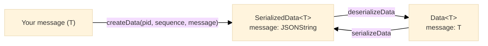

# Data

## Purpose

The Data module defines the message envelope a packet carries: a process identifier, a unique message identifier, a sequence number, the message itself, and a JSON Schema of the message with its SHA-256 hash. Data objects are the content inside every `UnencryptedPacket`.

---

## Key Interfaces

### `Data<T>`

Logical view with the message deserialised; what `channel.send` takes and what a receiver delivers.

```typescript
interface Data<T = unknown> {
  readonly pid: string // Process identifier (UUID v4)
  readonly id: string // Message identifier (UUID v4, generated)
  readonly sequence: number // Counter that increments by 1 within a process; must be > 0
  readonly message: T // The message
  readonly schema: Schema // JSON Schema describing the message
  readonly schemaHash: string // SHA-256 hash of the schema
}
```

### `SerializedData<T>`

The same envelope with `message` as a JSON string; what `createData` returns and what travels inside a sealed frame.

```typescript
interface SerializedData<T = unknown> {
  readonly pid: string
  readonly id: string
  readonly sequence: number
  readonly message: JSONString<T>
  readonly schema: Schema
  readonly schemaHash: string
}
```

### `JSONString<T>`

Branded string type for a JSON-serialised `T`.

```typescript
type JSONString<T = unknown> = string & {
  readonly __jsonBrand: unique symbol
  readonly __type: T
}
```

### `DataCreater` and `SchemaCreater`

```typescript
type DataCreater = <T = unknown>(pid: string, sequence: number, message: T) => Promise<SerializedData<T>>
type SchemaCreater = (data: unknown) => Schema
```

---

## Data Flow



---

## Factory Functions

### `createData`

**Location**: `@hyperfrontend/network-protocol/browser/data`, `@hyperfrontend/network-protocol/node/data`

```typescript
const createData: DataCreater
```

```typescript
import { createData } from '@hyperfrontend/network-protocol/browser/data'

const data = await createData(pid, 1, { type: 'greeting', content: 'Hello!' })
// {
//   pid,
//   id: '<generated uuid>',
//   sequence: 1,
//   message: '{"type":"greeting","content":"Hello!"}',
//   schema: { type: 'object', properties: { type: { type: 'string' }, content: { type: 'string' } }, ... },
//   schemaHash: '<sha-256 of the schema>'
// }
```

### `createDataFactory`

The composition point the platform entries use; it injects the hash function and is not itself exported from a package entry.

```typescript
function createDataFactory(createHash: (data: string, algorithm: string) => Promise<string>): DataCreater
```

The browser entry passes `createHash` from `@hyperfrontend/cryptography/browser` (Web Crypto); the Node.js entry passes the one from `@hyperfrontend/cryptography/node`.

### `getSchema`

```typescript
const getSchema: SchemaCreater // toJsonSchema(data, { arrays: { mode: 'all' } })
```

---

## Helper Functions

| Function                         | Effect                                                     |
| -------------------------------- | ---------------------------------------------------------- |
| `serializeData(data)`            | `Data<T>` to `SerializedData<T>` by stringifying `message` |
| `deserializeData(serialized)`    | `SerializedData<T>` to `Data<T>` by parsing `message`      |
| `asJSONString<T>(value)`         | Casts a string to `JSONString<T>`                          |
| `parseJSONString<T>(jsonString)` | Parses a `JSONString<T>` back to `T`                       |
| `isJSONString<T>(value)`         | Type guard: true for any string                            |

Both conversions return frozen objects.

---

## Schema Generation

Schemas are generated from the message shape, and `schemaHash` is the SHA-256 of the schema's JSON:

```typescript
const data = await createData(pid, 1, {
  type: 'greeting',
  count: 42,
  active: true,
  items: ['a', 'b'],
})

// data.schema = {
//   type: 'object',
//   properties: {
//     type: { type: 'string' },
//     count: { type: 'integer' },
//     active: { type: 'boolean' },
//     items: { type: 'array', items: { type: 'string' } }
//   }
// }
```

Receivers can compare `schemaHash` values to detect a change in message shape.

---

## Validation

`createData` validates its inputs and throws:

```typescript
await createData('not-a-uuid', 1, message)
// Error: 'Cannot create data without a valid pid'

await createData(pid, 0, message)
// Error: 'Cannot create data without a valid sequence'

const circular = { self: null }
circular.self = circular
await createData(pid, 1, circular)
// Error: 'Cannot create data with a message with circular references'

await createData(pid, 1, { callback: () => {} })
// Error: 'Cannot create data without a valid message'
```

A message is valid when every value in it is serialisable: no `null`, `undefined`, functions, symbols, or bigints anywhere in the structure.

The validators are exported from the data entries:

| Function                        | Accepts                                              |
| ------------------------------- | ---------------------------------------------------- |
| `isValidPid(value)`             | A 36-character UUID v4 string                        |
| `isValidId(value)`              | A 36-character UUID v4 string                        |
| `isValidSequence(value)`        | A number greater than zero                           |
| `isValidMessage(value)`         | A structure containing only serialisable values      |
| `isValidSchema(value)`          | A JSON Schema draft 4 document                       |
| `isValidSchemaHash(value)`      | A SHA-256 hash string                                |
| `isValidUnencryptedData(value)` | An object whose six fields all pass the checks above |

---

## Relationship to Other Modules

- **Depends on**: `@hyperfrontend/cryptography` (hashing), `@hyperfrontend/json-utils` (schema generation and validation), `@hyperfrontend/data-utils`
- **Used by**: [`packet/`](../packet/README.md), [`protocol/`](../protocol/README.md) (serialises the envelope into the frame plaintext), [`sender/`](../sender/README.md), [`receiver/`](../receiver/README.md)

---

## See Also

- **[Library Index](../README.md)** - All modules
- **[Architecture Guide](../../../ARCHITECTURE.md#data)** - Data architecture
- **[Browser Entry](../../browser/data/README.md)** - Browser-specific data
- **[Node Entry](../../node/data/README.md)** - Node.js-specific data

### Related Modules

| Module                             | Relationship                               |
| ---------------------------------- | ------------------------------------------ |
| [packet/](../packet/README.md)     | Data is the payload of `UnencryptedPacket` |
| [protocol/](../protocol/README.md) | Serialises and deserialises the envelope   |
