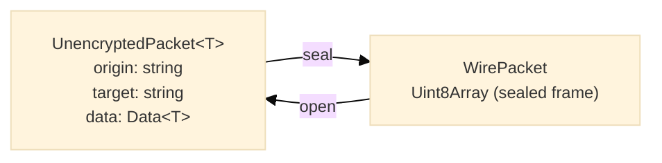

# Packet

## Purpose

The Packet module defines the two shapes a message takes on either side of the security pipeline: a plaintext packet (routing fields plus the data envelope) and the sealed wire frame that carries it. It also defines the seal and open operation types and the drop report a pipeline emits when it discards a packet.

---

## Packet Types



### `PacketBase`

Routing fields every plaintext packet carries. Both identifiers are UUID v4 strings.

```typescript
interface PacketBase {
  readonly origin: string // The sender's identity
  readonly target: string // The recipient's identity
}
```

### `UnencryptedPacket<T>`

```typescript
interface UnencryptedPacket<T = any> extends PacketBase {
  readonly data: Data<T> // The data envelope
}
```

### `WirePacket`

```typescript
type WirePacket = Uint8Array // A sealed frame carrying one packet
```

### `Packet<T>`

```typescript
type Packet<T = any> = UnencryptedPacket<T> | WirePacket
```

---

## Operation Types

```typescript
type PacketSealer<T = any> = (packet: UnencryptedPacket<T>) => Promise<WirePacket>
type PacketOpener<T = any> = (packet: WirePacket) => Promise<UnencryptedPacket<T>>
```

A session protocol supplies both (see [`protocol/`](../protocol/README.md)); the seal queue runs the sealer and the open queue runs the opener.

---

## Drop Reports

```typescript
type PacketDropStage = 'seal' | 'open'

interface PacketDrop {
  readonly direction: 'inbound' | 'outbound'
  readonly stage: PacketDropStage
  readonly reason: string // Why the stage rejected it
  readonly cause?: unknown // The error the stage threw, when it threw one
  readonly packet: unknown // The packet as the stage received it
}

type PacketDropHandler = (drop: PacketDrop) => void
```

When [`cause`](https://www.hyperfrontend.dev/docs/libraries/network-protocol/#api-PacketDrop-prop-cause) is a [`ProtocolError`](https://www.hyperfrontend.dev/docs/libraries/network-protocol/security/#api-ProtocolError), `getProtocolErrorCode(drop.cause)` from [`security/`](../security/README.md) yields the rejection code.

---

## Factory Functions

### `createUnencryptedPacket`

Creates a validated, frozen plaintext packet.

```typescript
function createUnencryptedPacket<T = any>(origin: string, target: string, data: Data<T>): UnencryptedPacket<T>
```

```typescript
import { createUnencryptedPacket } from '@hyperfrontend/network-protocol/browser/packet'
import { createData } from '@hyperfrontend/network-protocol/browser/data'

const packet = createUnencryptedPacket(originId, targetId, await createData(pid, 1, { action: 'ping' }))
// => { origin, target, data: { pid, id, sequence, message, schema, schemaHash } }
```

### `createPacketBase`

Creates the frozen routing structure alone.

```typescript
function createPacketBase(origin: string, target: string): PacketBase
```

---

## Validation Functions

| Function                          | Accepts                                                   |
| --------------------------------- | --------------------------------------------------------- |
| `isValidOrigin(value)`            | A 36-character UUID v4 string                             |
| `isValidTarget(value)`            | A 36-character UUID v4 string                             |
| `isValidUnencryptedPacket(value)` | A valid origin, a valid target, and a valid data envelope |
| `isValidWirePacket(value)`        | A `Uint8Array` with at least one byte                     |

```typescript
import { isValidUnencryptedPacket, isValidWirePacket } from '@hyperfrontend/network-protocol/browser/packet'

if (isValidWirePacket(event.data)) {
  channel.receive(event.data)
}
```

---

## Error Handling

The creators throw in the caller's frame:

```typescript
createUnencryptedPacket('not-a-uuid', targetId, data)
// Error: 'Cannot create a packet without a valid origin value'

createUnencryptedPacket(originId, 'not-a-uuid', data)
// Error: 'Cannot create a packet without a valid target value'

createUnencryptedPacket(originId, targetId, {})
// Error: 'Cannot create a packet without a valid data value'
```

The pipelines never throw for a packet they reject; they report it through [`onDrop`](https://www.hyperfrontend.dev/docs/libraries/network-protocol/#api-ChannelOptions-prop-onDrop) (see [`queue/`](../queue/README.md)).

---

## Relationship to Other Modules

- **Depends on**: [`data/`](../data/README.md) (for the [`Data`](https://www.hyperfrontend.dev/docs/libraries/network-protocol/#api-Data) envelope)
- **Used by**: [`sender/`](../sender/README.md), [`receiver/`](../receiver/README.md), [`queue/`](../queue/README.md), [`protocol/`](../protocol/README.md), [`routing/`](../routing/README.md)

---

## See Also

- **[Library Index](../README.md)** - All modules
- **[Architecture Guide](../../../ARCHITECTURE.md#packet-types)** - Packet architecture
- **[Browser Entry](../../browser/packet/README.md)** - Browser packet entry
- **[Node Entry](../../node/packet/README.md)** - Node.js packet entry

### Related Modules

| Module                             | Relationship                                                                                                                        |
| ---------------------------------- | ----------------------------------------------------------------------------------------------------------------------------------- |
| [data/](../data/README.md)         | Provides the [`Data`](https://www.hyperfrontend.dev/docs/libraries/network-protocol/#api-Data) envelope a packet carries            |
| [protocol/](../protocol/README.md) | Supplies the sealer and opener                                                                                                      |
| [security/](../security/README.md) | Error codes carried in a drop's [`cause`](https://www.hyperfrontend.dev/docs/libraries/network-protocol/#api-PacketDrop-prop-cause) |
| [sender/](../sender/README.md)     | Builds and seals packets                                                                                                            |
| [receiver/](../receiver/README.md) | Opens frames into packets                                                                                                           |
| [queue/](../queue/README.md)       | Runs the seal and open operations                                                                                                   |
