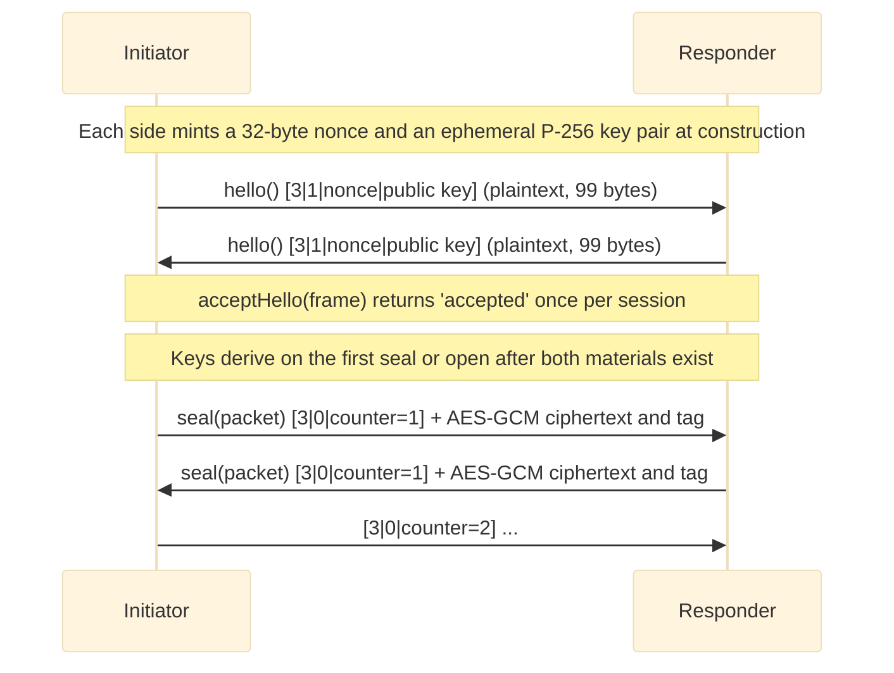

# Protocol

## Purpose

The Protocol module produces the object a channel drives: one [`Protocol`](https://www.hyperfrontend.dev/docs/libraries/network-protocol/#api-Protocol) instance per session, holding the session's [`seal`](https://www.hyperfrontend.dev/docs/libraries/network-protocol/#api-Protocol-prop-seal) and [`open`](https://www.hyperfrontend.dev/docs/libraries/network-protocol/#api-Protocol-prop-open) operations, its hello exchange, and the transport callbacks. Two protocols are built here, [`v3`](https://www.hyperfrontend.dev/docs/libraries/network-protocol/#api-V3) and [`v4`](https://www.hyperfrontend.dev/docs/libraries/network-protocol/#api-V4). Both key a session from an ephemeral P-256 agreement carried in plaintext hello frames; v4 also mixes a stretched pre-shared key into the schedule. The module also provides a store for named protocol providers.

---

## Key Interfaces

### `Protocol<T>`

Declared in `channel/model.ts`; every provider returns one.

```typescript
interface Protocol<T = any> extends HelloExchange {
  seal: PacketSealer<T> // (packet: UnencryptedPacket<T>) => Promise<WirePacket>
  open: PacketOpener<T> // (frame: WirePacket) => Promise<UnencryptedPacket<T>>
  send: SendPacketFn // Transmits a sealed frame
  receive: ReceivePacketFn<T> // Receives an opened packet
  getLogger: () => Logger
}

interface HelloExchange {
  hello(): Promise<WirePacket> // This side's hello frame; the same bytes on every call
  isHello(frame: WirePacket): boolean // True for a hello frame of this protocol's version
  acceptHello(frame: WirePacket): HelloOutcome // 'accepted' | 'duplicate' | 'rejected'
}
```

### `ProtocolProvider<T>`

Binds a protocol instance to one negotiated session.

```typescript
type ProtocolProvider<T = any> = (send: SendPacketFn, receive: ReceivePacketFn<T>, session: ProtocolSession) => Protocol<T>
```

[`ProtocolSession`](https://www.hyperfrontend.dev/docs/libraries/network-protocol/#api-ProtocolSession) is `{ protocol, role: 'initiator' | 'responder', localId, peerId }`; see [`security/`](../security/README.md).

### `ProtocolProviderStore<T>`

Store for named protocol providers.

```typescript
interface ProtocolProviderStore<T = unknown> {
  readonly add: (name: string, protocolProvider: ProtocolProvider<T>) => void
  readonly existsByName: (name: string) => boolean
  readonly existsById: (id: string) => boolean
  readonly removeByName: (...name: string[]) => void
  readonly removeById: (...id: string[]) => void
  readonly clear: () => void
  readonly getByName: (name: string) => ProtocolProvider<T> | null
  readonly getById: (id: string) => ProtocolProvider<T> | null
  readonly list: readonly ProtocolProviderEntry<T>[] // { id, name, provider }
}
```

### `SessionCrypto`

The platform primitives a session protocol is composed from. The [`/browser/v3`](https://www.hyperfrontend.dev/docs/libraries/network-protocol/browser/v3/) and [`/browser/v4`](https://www.hyperfrontend.dev/docs/libraries/network-protocol/browser/v4/) entries fill it from [`@hyperfrontend/cryptography/browser`](https://www.hyperfrontend.dev/docs/libraries/cryptography/browser/) and [`@hyperfrontend/string-utils/browser`](https://www.hyperfrontend.dev/docs/libraries/utils/string/browser/); the `/node/*` entries use the Node.js counterparts.

```typescript
interface SessionCrypto {
  getRandomValues: (byteLength: number) => Uint8Array
  createKeyAgreement: () => Promise<KeyAgreementLike> // Ephemeral P-256; publicKey is the 65-byte uncompressed point
  stretchPassword: (password: string, salt: Uint8Array, options?: StretchOptions) => Promise<Uint8Array> // PBKDF2-SHA256
  expandKey: (ikm: Uint8Array, salt: Uint8Array, info: Uint8Array, usages: readonly KeyUsage[]) => Promise<CryptoKey> // HKDF-SHA256
  seal: (key: CryptoKey, nonce: Uint8Array, additionalData: Uint8Array, plaintext: Uint8Array) => Promise<Uint8Array> // AES-GCM
  open: (key: CryptoKey, nonce: Uint8Array, additionalData: Uint8Array, sealed: Uint8Array) => Promise<Uint8Array>
  utf8Encode: (text: string) => Uint8Array
  utf8Decode: (bytes: Uint8Array) => string
}
```

### `SessionProtocolDefinition`

What distinguishes one protocol from another.

```typescript
interface SessionProtocolDefinition {
  readonly id: string // 'v3' or 'v4'
  readonly version: number // The version byte every frame starts with: 3 or 4
  readonly sharedKey?: string // Mixed into the key schedule when present (v4)
}
```

[`V3`](https://www.hyperfrontend.dev/docs/libraries/network-protocol/#api-V3) is `{ id: 'v3', version: 3 }` and [`V4`](https://www.hyperfrontend.dev/docs/libraries/network-protocol/#api-V4) is `{ id: 'v4', version: 4 }`.

---

## Protocol Versions

| Protocol | Factory                           | [`createProtocol`](https://www.hyperfrontend.dev/docs/libraries/network-protocol/#api-createProtocol) signature | Input keying material                                                                                                                          | Entry points                                                                                                                                                                     |
| -------- | --------------------------------- | --------------------------------------------------------------------------------------------------------------- | ---------------------------------------------------------------------------------------------------------------------------------------------- | -------------------------------------------------------------------------------------------------------------------------------------------------------------------------------- |
| **v3**   | `createV3ProtocolFactory(crypto)` | `createProtocol(logger)`                                                                                        | ECDH shared secret                                                                                                                             | [`/browser/v3`](https://www.hyperfrontend.dev/docs/libraries/network-protocol/browser/v3/), [`/node/v3`](https://www.hyperfrontend.dev/docs/libraries/network-protocol/node/v3/) |
| **v4**   | `createV4ProtocolFactory(crypto)` | `createProtocol(logger, sharedKey)`                                                                             | ECDH shared secret, then PBKDF2 of [`sharedKey`](https://www.hyperfrontend.dev/docs/libraries/network-protocol/browser/v4/#api-createProtocol) | [`/browser/v4`](https://www.hyperfrontend.dev/docs/libraries/network-protocol/browser/v4/), [`/node/v4`](https://www.hyperfrontend.dev/docs/libraries/network-protocol/node/v4/) |

The two protocols share every mechanism below; only the input keying material differs.

---

## Factory Functions

### `createProtocol` (v3)

**Location**: [`@hyperfrontend/network-protocol/browser/v3`](https://www.hyperfrontend.dev/docs/libraries/network-protocol/browser/v3/), [`@hyperfrontend/network-protocol/node/v3`](https://www.hyperfrontend.dev/docs/libraries/network-protocol/node/v3/)

```typescript
function createProtocol(logger: Logger): ProtocolProvider
```

Throws `Cannot create protocol provider without a valid logger` for an invalid logger.

```typescript
import { createProtocol } from '@hyperfrontend/network-protocol/browser/v3'
import { createChannel } from '@hyperfrontend/network-protocol/browser/channel'
import { createLogger } from '@hyperfrontend/logging'

const channel = createChannel('app-to-widget', {
  send: (frame) => otherWindow.postMessage(frame, origin, [frame.buffer]),
  receive: (packet) => handle(packet.data.message),
  protocolProvider: createProtocol(createLogger({ level: 'info' })),
  session: { protocol: 'v3', role: 'initiator', localId, peerId },
})
```

### `createProtocol` (v4)

**Location**: [`@hyperfrontend/network-protocol/browser/v4`](https://www.hyperfrontend.dev/docs/libraries/network-protocol/browser/v4/), [`@hyperfrontend/network-protocol/node/v4`](https://www.hyperfrontend.dev/docs/libraries/network-protocol/node/v4/)

```typescript
function createProtocol(logger: Logger, sharedKey: string): ProtocolProvider
```

Throws `Cannot create the v4 protocol without a shared key of at least 16 characters` when `isValidSharedKey(sharedKey)` is false. [`MIN_SHARED_KEY_LENGTH`](https://www.hyperfrontend.dev/docs/libraries/network-protocol/#api-MIN_SHARED_KEY_LENGTH) is `16`. The guarantee needs a generated key of 128 bits or more: a party that can run a hello exchange against this side can test key guesses offline afterwards, so a human-chosen passphrase is not a substitute.

```typescript
import { createProtocol } from '@hyperfrontend/network-protocol/browser/v4'

const protocolProvider = createProtocol(createLogger({ level: 'info' }), sharedKey)
```

### `createProtocolProviderStore`

**Location**: every [`v3`](https://www.hyperfrontend.dev/docs/libraries/network-protocol/#api-V3) and [`v4`](https://www.hyperfrontend.dev/docs/libraries/network-protocol/#api-V4) entry

```typescript
import { createProtocolProviderStore } from '@hyperfrontend/network-protocol/browser/v4'
import { createProtocol as createV3 } from '@hyperfrontend/network-protocol/browser/v3'
import { createProtocol as createV4 } from '@hyperfrontend/network-protocol/browser/v4'

const store = createProtocolProviderStore()
store.add('v3', createV3(logger))
store.add('v4', createV4(logger, sharedKey))

const provider = store.getByName('v4')
store.list.forEach((entry) => register(entry.id, entry.name, entry.provider))
```

[`add`](https://www.hyperfrontend.dev/docs/libraries/network-protocol/#api-ProtocolProviderStore-prop-add) throws for an empty name (`Cannot add a provider with invalid name`), a name already in the store, or a provider already registered under another name; [`removeByName`](https://www.hyperfrontend.dev/docs/libraries/network-protocol/#api-ProtocolProviderStore-prop-removeByName) and [`removeById`](https://www.hyperfrontend.dev/docs/libraries/network-protocol/#api-ProtocolProviderStore-prop-removeById) throw when nothing matches.

### Composition

The platform entries compose the factories in `session/`. Of these, only [`createV3ProtocolFactory`](https://www.hyperfrontend.dev/docs/libraries/network-protocol/#api-createV3ProtocolFactory), [`createV4ProtocolFactory`](https://www.hyperfrontend.dev/docs/libraries/network-protocol/#api-createV4ProtocolFactory), [`V3`](https://www.hyperfrontend.dev/docs/libraries/network-protocol/#api-V3), and [`V4`](https://www.hyperfrontend.dev/docs/libraries/network-protocol/#api-V4) are exported from the package entries; the rest are internal.

| Function                                                    | Role                                                                                                                                                                                                                                                                                                                                                                                                                                                                                                                                                                                                                                                                                                                                                                                                                                                                                                                                                                        |
| ----------------------------------------------------------- | --------------------------------------------------------------------------------------------------------------------------------------------------------------------------------------------------------------------------------------------------------------------------------------------------------------------------------------------------------------------------------------------------------------------------------------------------------------------------------------------------------------------------------------------------------------------------------------------------------------------------------------------------------------------------------------------------------------------------------------------------------------------------------------------------------------------------------------------------------------------------------------------------------------------------------------------------------------------------- |
| `createV3ProtocolFactory(crypto)`                           | `(logger) => ProtocolProvider` for definition [`V3`](https://www.hyperfrontend.dev/docs/libraries/network-protocol/#api-V3)                                                                                                                                                                                                                                                                                                                                                                                                                                                                                                                                                                                                                                                                                                                                                                                                                                                 |
| `createV4ProtocolFactory(crypto)`                           | `(logger, sharedKey) => ProtocolProvider` for definition `{ ...V4, sharedKey }`                                                                                                                                                                                                                                                                                                                                                                                                                                                                                                                                                                                                                                                                                                                                                                                                                                                                                             |
| `createSessionProtocolProvider(crypto, definition, logger)` | The provider: validates the transport callbacks and that `session.protocol === definition.id`, then creates the instance                                                                                                                                                                                                                                                                                                                                                                                                                                                                                                                                                                                                                                                                                                                                                                                                                                                    |
| `createSessionProtocol(input)`                              | One session's instance; [`input`](https://github.com/AndrewRedican/hyperfrontend/blob/main/libs/network-protocol/src/lib/protocol/session/create-session-protocol.ts) adds an optional [`counterLimit`](https://github.com/AndrewRedican/hyperfrontend/blob/main/libs/network-protocol/src/lib/protocol/session/create-session-protocol.ts) (defaults to the largest safe integer)                                                                                                                                                                                                                                                                                                                                                                                                                                                                                                                                                                                          |
| `mintLocalMaterial(crypto)`                                 | A 32-byte nonce and an ephemeral key agreement                                                                                                                                                                                                                                                                                                                                                                                                                                                                                                                                                                                                                                                                                                                                                                                                                                                                                                                              |
| `deriveSessionKeys(crypto, definition, session, own, peer)` | The two directional AES-GCM keys                                                                                                                                                                                                                                                                                                                                                                                                                                                                                                                                                                                                                                                                                                                                                                                                                                                                                                                                            |
| `frame.ts`                                                  | [`encodeHeader`](https://github.com/AndrewRedican/hyperfrontend/blob/main/libs/network-protocol/src/lib/protocol/session/frame.ts), [`decodeHeader`](https://github.com/AndrewRedican/hyperfrontend/blob/main/libs/network-protocol/src/lib/protocol/session/frame.ts), [`nonceFor`](https://github.com/AndrewRedican/hyperfrontend/blob/main/libs/network-protocol/src/lib/protocol/session/frame.ts), [`assembleFrame`](https://github.com/AndrewRedican/hyperfrontend/blob/main/libs/network-protocol/src/lib/protocol/session/frame.ts), [`encodeHello`](https://github.com/AndrewRedican/hyperfrontend/blob/main/libs/network-protocol/src/lib/protocol/session/frame.ts), [`decodeHello`](https://github.com/AndrewRedican/hyperfrontend/blob/main/libs/network-protocol/src/lib/protocol/session/frame.ts), [`isHelloFrame`](https://github.com/AndrewRedican/hyperfrontend/blob/main/libs/network-protocol/src/lib/protocol/session/frame.ts), the length constants |

Because the two factories are exported, a custom [`SessionCrypto`](https://www.hyperfrontend.dev/docs/libraries/network-protocol/#api-SessionCrypto) can be wired without touching the rest.

---

## Session Lifecycle



1. **Construction**: the provider is called with [`send`](https://www.hyperfrontend.dev/docs/libraries/network-protocol/#api-Protocol-prop-send), [`receive`](https://www.hyperfrontend.dev/docs/libraries/network-protocol/#api-Protocol-prop-receive), and the session; the instance mints its material at once.
2. **Hello**: `hello()` returns this side's frame. The owner transmits it and retries until the peer confirms; the bytes never change.
3. **Accept**: the peer's frame goes to [`acceptHello`](https://www.hyperfrontend.dev/docs/libraries/network-protocol/#api-HelloExchange). The first hello keys the session (`'accepted'`); the same bytes again are `'duplicate'`; any other frame, including a different hello, is `'rejected'`. A live session is never rekeyed.
4. **Traffic**: [`seal`](https://www.hyperfrontend.dev/docs/libraries/network-protocol/#api-Protocol-prop-seal) and [`open`](https://www.hyperfrontend.dev/docs/libraries/network-protocol/#api-Protocol-prop-open) wait until both materials exist, so frames queued before the peer's hello simply hold. Keys derive once; a derivation that fails rejects every later operation with `invalid-session`.

---

## Wire Format

| Frame | Layout                                                         | Length            |
| ----- | -------------------------------------------------------------- | ----------------- |
| Hello | `[version][type=1][nonce 32][public key 65]`                   | 99 bytes          |
| Data  | `[version][type=0][counter u64 big-endian]` + ciphertext + tag | at least 27 bytes |

- Version bytes are `3` and `4`; [`isHello`](https://www.hyperfrontend.dev/docs/libraries/network-protocol/#api-HelloExchange) accepts only this protocol's version.
- The ten-byte data header is the additional authenticated data. The AES-GCM nonce is four zero bytes followed by the eight counter bytes, so it is unique per direction by construction.
- The plaintext is the UTF-8 JSON of `{ origin, target, data }` with [`data`](https://www.hyperfrontend.dev/docs/libraries/network-protocol/#api-UnencryptedPacket-prop-data) serialised ([`serializeData`](https://www.hyperfrontend.dev/docs/libraries/network-protocol/#api-serializeData)).
- The tag is 16 bytes; a data frame shorter than 27 bytes (header, tag, one ciphertext byte) is malformed.
- [`decodeHello`](https://github.com/AndrewRedican/hyperfrontend/blob/main/libs/network-protocol/src/lib/protocol/session/frame.ts) also requires the public key to start with the uncompressed-point tag; whether the point lies on the curve is decided by the key agreement when keys derive.

---

## Key Schedule

Both sides order the material by role, compute the same two keys, and each picks the sending one for its own role.

| Step                                                                                                                             | Value                                                                                                                                                                                                                                                                                                                                                                      |
| -------------------------------------------------------------------------------------------------------------------------------- | -------------------------------------------------------------------------------------------------------------------------------------------------------------------------------------------------------------------------------------------------------------------------------------------------------------------------------------------------------------------------- |
| [`salt`](https://github.com/AndrewRedican/hyperfrontend/blob/main/libs/network-protocol/src/lib/protocol/session/derive-keys.ts) | `initiatorNonce \|\| responderNonce`                                                                                                                                                                                                                                                                                                                                       |
| [`dh`](https://github.com/AndrewRedican/hyperfrontend/blob/main/libs/network-protocol/src/lib/protocol/session/derive-keys.ts)   | ECDH(own private key, peer public key), 32 bytes                                                                                                                                                                                                                                                                                                                           |
| [`ikm`](https://github.com/AndrewRedican/hyperfrontend/blob/main/libs/network-protocol/src/lib/protocol/session/derive-keys.ts)  | [`dh`](https://github.com/AndrewRedican/hyperfrontend/blob/main/libs/network-protocol/src/lib/protocol/session/derive-keys.ts) (v3), or `dh \|\| PBKDF2-SHA256(sharedKey, salt, 600000 iterations)` (v4)                                                                                                                                                                   |
| [`i2r`](https://github.com/AndrewRedican/hyperfrontend/blob/main/libs/network-protocol/src/lib/protocol/session/derive-keys.ts)  | HKDF-SHA256([`ikm`](https://github.com/AndrewRedican/hyperfrontend/blob/main/libs/network-protocol/src/lib/protocol/session/derive-keys.ts), [`salt`](https://github.com/AndrewRedican/hyperfrontend/blob/main/libs/network-protocol/src/lib/protocol/session/derive-keys.ts), `hyperfrontend/network-protocol/<protocol>/<initiatorId>/<responderId>/i2r`) as AES-GCM-256 |
| [`r2i`](https://github.com/AndrewRedican/hyperfrontend/blob/main/libs/network-protocol/src/lib/protocol/session/derive-keys.ts)  | the same with `.../r2i`                                                                                                                                                                                                                                                                                                                                                    |

The initiator seals with [`i2r`](https://github.com/AndrewRedican/hyperfrontend/blob/main/libs/network-protocol/src/lib/protocol/session/derive-keys.ts) and opens with [`r2i`](https://github.com/AndrewRedican/hyperfrontend/blob/main/libs/network-protocol/src/lib/protocol/session/derive-keys.ts); the responder does the reverse. Each key is non-extractable and restricted to one usage. Binding the protocol id and both identities into the info ties the keys to the negotiated session. [`dh`](https://github.com/AndrewRedican/hyperfrontend/blob/main/libs/network-protocol/src/lib/protocol/session/derive-keys.ts), [`ikm`](https://github.com/AndrewRedican/hyperfrontend/blob/main/libs/network-protocol/src/lib/protocol/session/derive-keys.ts), and the stretched key are zeroed once the keys exist. The stretch runs once per session, so its cost lands on the handshake, not on traffic.

---

## Replay and Ordering

- Counters start at `1` and increase by one per sealed frame in each direction.
- [`open`](https://www.hyperfrontend.dev/docs/libraries/network-protocol/#api-Protocol-prop-open) rejects a frame whose counter is not above the last accepted counter before any decryption, so a replayed or forged frame costs nothing.
- A session that has sealed [`counterLimit`](https://github.com/AndrewRedican/hyperfrontend/blob/main/libs/network-protocol/src/lib/protocol/session/create-session-protocol.ts) frames rejects the next [`seal`](https://www.hyperfrontend.dev/docs/libraries/network-protocol/#api-Protocol-prop-seal) with `counter-exhausted`; open a new session.
- The pipelines process one frame at a time (see [`queue/`](../queue/README.md)), which keeps the counter exact.

---

## Error Handling

### At construction

```typescript
createProtocol(null)
// Error: 'Cannot create protocol provider without a valid logger'

createProtocol(logger, 'short')
// Error: 'Cannot create the v4 protocol without a shared key of at least 16 characters'

protocolProvider(null, receiveFn, session)
// Error: 'Cannot create protocol without a valid send function'

protocolProvider(sendFn, null, session)
// Error: 'Cannot create protocol without a valid receive function'

// on a v3 provider
protocolProvider(sendFn, receiveFn, { ...session, protocol: 'v4' })
// ProtocolError (code 'invalid-session'): "The session was negotiated for 'v4', not 'v3'"
```

### At seal and open

Every rejection is a [`ProtocolError`](https://www.hyperfrontend.dev/docs/libraries/network-protocol/security/#api-ProtocolError) whose [`code`](https://www.hyperfrontend.dev/docs/libraries/network-protocol/security/#api-ProtocolError-prop-code) is one of [`ProtocolErrorCode`](https://www.hyperfrontend.dev/docs/libraries/network-protocol/security/#api-ProtocolErrorCode) (see [`security/`](../security/README.md)); the pipelines report it through [`onDrop`](https://www.hyperfrontend.dev/docs/libraries/network-protocol/#api-ChannelOptions-prop-onDrop) with the error as [`cause`](https://www.hyperfrontend.dev/docs/libraries/network-protocol/#api-PacketDrop-prop-cause).

| Code                                                                                                         | Raised by                                                                                                                                                                                  | When                                                                |
| ------------------------------------------------------------------------------------------------------------ | ------------------------------------------------------------------------------------------------------------------------------------------------------------------------------------------ | ------------------------------------------------------------------- |
| [`malformed`](https://www.hyperfrontend.dev/docs/libraries/network-protocol/security/#api-ProtocolErrorCode) | [`open`](https://www.hyperfrontend.dev/docs/libraries/network-protocol/#api-PacketDropStage)                                                                                               | Fewer than 27 bytes, or the plaintext is not a valid packet         |
| `unsupported-version`                                                                                        | [`open`](https://www.hyperfrontend.dev/docs/libraries/network-protocol/#api-PacketDropStage)                                                                                               | The version byte is not this protocol's                             |
| [`replayed`](https://www.hyperfrontend.dev/docs/libraries/network-protocol/security/#api-ProtocolErrorCode)  | [`open`](https://www.hyperfrontend.dev/docs/libraries/network-protocol/#api-PacketDropStage)                                                                                               | The counter is not above the last accepted one                      |
| `authentication-failed`                                                                                      | [`open`](https://www.hyperfrontend.dev/docs/libraries/network-protocol/#api-PacketDropStage)                                                                                               | The tag does not verify under the session's receiving key           |
| `counter-exhausted`                                                                                          | [`seal`](https://www.hyperfrontend.dev/docs/libraries/network-protocol/#api-PacketDropStage)                                                                                               | The session has sealed every frame it can number                    |
| `invalid-session`                                                                                            | [`seal`](https://www.hyperfrontend.dev/docs/libraries/network-protocol/#api-PacketDropStage), [`open`](https://www.hyperfrontend.dev/docs/libraries/network-protocol/#api-PacketDropStage) | The keys could not be derived (for example an off-curve public key) |

---

## Security Claims

- **v3** defeats scripts that can only listen: a passive observer of the hello exchange and the traffic cannot read or forge frames. Any script that can post to a peer's window with a genuine source can complete a v3 handshake as that peer, so v3 does not authenticate who the counterpart is.
- **v4** binds the session to the pre-shared key: without the key a script can neither read frames nor produce frames the counterpart accepts, and a key mismatch is detected because no frame ever authenticates. A key that leaks later does not expose earlier sessions.
- Neither protocol hides the hello; public keys and nonces are public by design.
- Cost: one ECDH agreement plus one HKDF per session (plus one 600k-iteration PBKDF2 for v4), then one AES-GCM operation per frame in each direction.

---

## Validation Helpers

Exported from every [`v3`](https://www.hyperfrontend.dev/docs/libraries/network-protocol/#api-V3) and [`v4`](https://www.hyperfrontend.dev/docs/libraries/network-protocol/#api-V4) entry for upstream guards:

| Function                         | Result                                                                                                                                                                                                                                                                                                                                                                                                                                                                                                                                                                                                                                                                                                                                                                                                                                                                                                                                                                                                                                    |
| -------------------------------- | ----------------------------------------------------------------------------------------------------------------------------------------------------------------------------------------------------------------------------------------------------------------------------------------------------------------------------------------------------------------------------------------------------------------------------------------------------------------------------------------------------------------------------------------------------------------------------------------------------------------------------------------------------------------------------------------------------------------------------------------------------------------------------------------------------------------------------------------------------------------------------------------------------------------------------------------------------------------------------------------------------------------------------------------- |
| `isValidProtocolProvider(value)` | `true` when the value is a function                                                                                                                                                                                                                                                                                                                                                                                                                                                                                                                                                                                                                                                                                                                                                                                                                                                                                                                                                                                                       |
| `isValidProtocol(value)`         | A [`ValidProtocolResult`](https://www.hyperfrontend.dev/docs/libraries/network-protocol/#api-ValidProtocolResult): [`seal`](https://www.hyperfrontend.dev/docs/libraries/network-protocol/#api-Protocol-prop-seal), [`open`](https://www.hyperfrontend.dev/docs/libraries/network-protocol/#api-Protocol-prop-open), [`hello`](https://www.hyperfrontend.dev/docs/libraries/network-protocol/#api-HelloExchange), [`isHello`](https://www.hyperfrontend.dev/docs/libraries/network-protocol/#api-HelloExchange), [`acceptHello`](https://www.hyperfrontend.dev/docs/libraries/network-protocol/#api-HelloExchange), [`send`](https://www.hyperfrontend.dev/docs/libraries/network-protocol/#api-Protocol-prop-send), [`receive`](https://www.hyperfrontend.dev/docs/libraries/network-protocol/#api-Protocol-prop-receive), and [`getLogger`](https://www.hyperfrontend.dev/docs/libraries/network-protocol/#api-Protocol-prop-getLogger) each mapped to `true`, `false`, or `undefined` (not reached because an earlier property failed) |
| `isValidSendFn(value)`           | `true` when the value is a function                                                                                                                                                                                                                                                                                                                                                                                                                                                                                                                                                                                                                                                                                                                                                                                                                                                                                                                                                                                                       |
| `isValidReceiveFn(value)`        | `true` when the value is a function                                                                                                                                                                                                                                                                                                                                                                                                                                                                                                                                                                                                                                                                                                                                                                                                                                                                                                                                                                                                       |
| `isValidName(value)`             | `true` for a non-empty string                                                                                                                                                                                                                                                                                                                                                                                                                                                                                                                                                                                                                                                                                                                                                                                                                                                                                                                                                                                                             |
| `isValidSharedKey(value)`        | `true` for a string of at least [`MIN_SHARED_KEY_LENGTH`](https://www.hyperfrontend.dev/docs/libraries/network-protocol/#api-MIN_SHARED_KEY_LENGTH) characters; [`v4`](https://www.hyperfrontend.dev/docs/libraries/network-protocol/#api-V4) entries only                                                                                                                                                                                                                                                                                                                                                                                                                                                                                                                                                                                                                                                                                                                                                                                |

---

## Relationship to Other Modules

- **Depends on**: [`security/`](../security/README.md), [`packet/`](../packet/README.md), [`data/`](../data/README.md), [`@hyperfrontend/cryptography`](https://www.hyperfrontend.dev/docs/libraries/cryptography/), [`@hyperfrontend/logging`](https://www.hyperfrontend.dev/docs/libraries/logging/)
- **Used by**: [`channel/`](../channel/README.md) (binds a provider to a session)

---

## See Also

- **[Library Index](../README.md)** - All modules
- **[Architecture Guide](../../../ARCHITECTURE.md#protocol)** - Protocol architecture
- **[Browser v3](../../browser/v3/README.md)** - Browser-specific v3 protocol
- **[Browser v4](../../browser/v4/README.md)** - Browser-specific v4 protocol
- **[Node v3](../../node/v3/README.md)** - Node.js-specific v3 protocol
- **[Node v4](../../node/v4/README.md)** - Node.js-specific v4 protocol

### Related Modules

| Module                             | Relationship                                                                                                                                                                                                                  |
| ---------------------------------- | ----------------------------------------------------------------------------------------------------------------------------------------------------------------------------------------------------------------------------- |
| [channel/](../channel/README.md)   | Binds a protocol instance to a session                                                                                                                                                                                        |
| [security/](../security/README.md) | Session, hello outcome, and error codes                                                                                                                                                                                       |
| [packet/](../packet/README.md)     | The packet shapes [`seal`](https://www.hyperfrontend.dev/docs/libraries/network-protocol/#api-Protocol-prop-seal) and [`open`](https://www.hyperfrontend.dev/docs/libraries/network-protocol/#api-Protocol-prop-open) convert |
