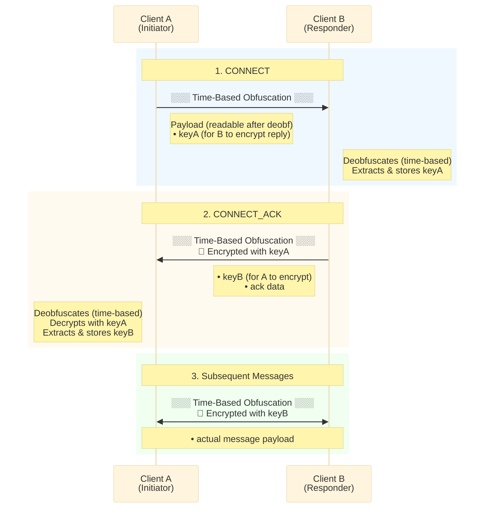
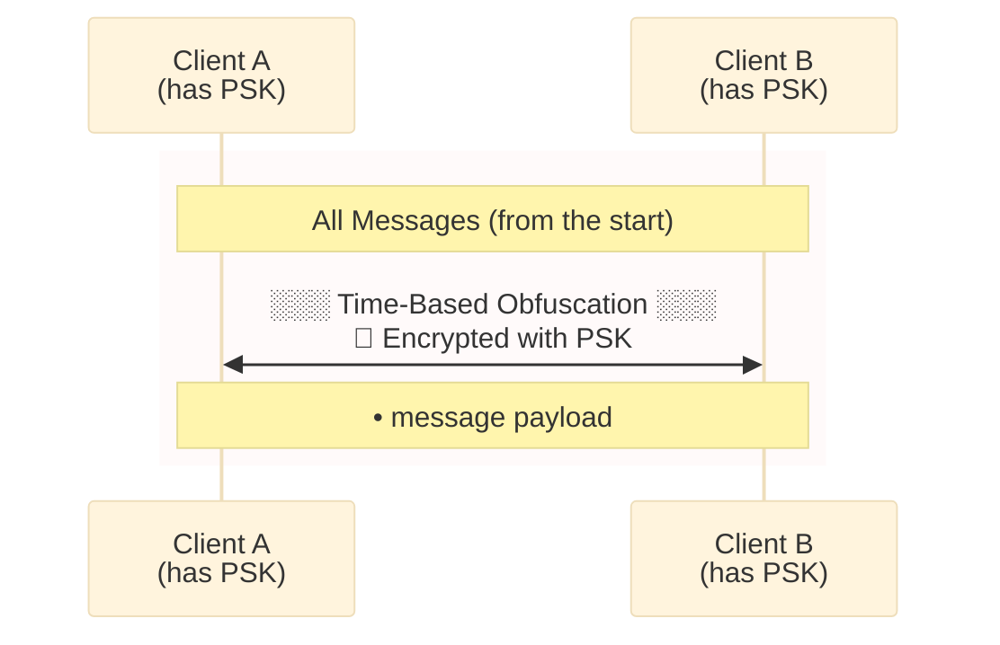
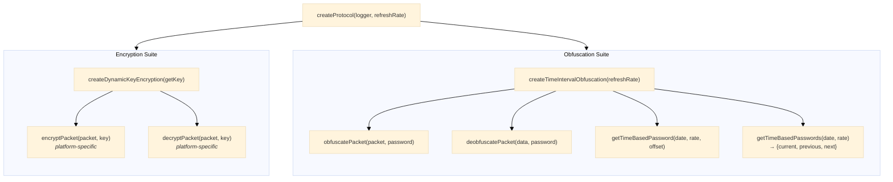
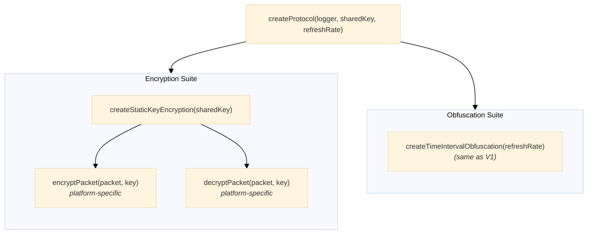

# Protocol

**Navigation**: [↑ lib/](../README.md) · [channel](../channel/README.md) · [security](../security/README.md) · [packet](../packet/README.md)

---

## Purpose

The Protocol module provides the central coordination object that encapsulates all cryptographic operations (encryption, decryption, obfuscation, deobfuscation) along with send/receive transport functions. It serves as a unified interface for secure message passing between endpoints.

---

## Key Interfaces

### `Protocol<T>`

The main protocol interface combining security operations with transport.

```typescript
interface Protocol<T = any> {
  packetEncryption: PacketEncryption<T> // Encrypt outbound packets
  packetDecryption: PacketDecryption<T> // Decrypt inbound packets
  packetObfuscation: PacketObfuscation // Obfuscate for wire transmission
  packetDeobfuscation: PacketDeobfuscation // Deobfuscate received data
  send: SendPacketFn // Transport send function
  receive: ReceivePacketFn<T> // Wrapped receive callback
  getLogger: () => Logger // Logger accessor
}
```

### `ProtocolProvider<T>`

Factory function type that binds transport functions to create a protocol.

```typescript
type ProtocolProvider<T = any> = (send: SendPacketFn, receive: ReceivePacketFn<T>) => Protocol<T>
```

### `ProtocolProviderStore<T>`

Store for managing multiple named protocol providers.

```typescript
interface ProtocolProviderStore<T = unknown> {
  readonly add: (name: string, provider: ProtocolProvider<T>) => void
  readonly existsByName: (name: string) => boolean
  readonly existsById: (id: string) => boolean
  readonly removeByName: (...names: string[]) => void
  readonly removeById: (...ids: string[]) => void
  readonly clear: () => void
  readonly getByName: (name: string) => ProtocolProvider<T> | null
  readonly getById: (id: string) => ProtocolProvider<T> | null
  readonly list: readonly ProtocolProviderEntry<T>[]
}
```

---

## Protocol Versions

The protocol module supports two versions with distinct handshake security:

| Version | Factory Name                               | Handshake Security | Import Path                                  |
| ------- | ------------------------------------------ | ------------------ | -------------------------------------------- |
| **V1**  | `createObfuscatedHandshakeProtocolFactory` | Obfuscation only   | `@hyperfrontend/network-protocol/browser/v1` |
| **V2**  | `createPSKHandshakeProtocolFactory`        | PSK-encrypted      | `@hyperfrontend/network-protocol/browser/v2` |

> **Important**: Both protocols use dynamic key encryption for all messages **after** the handshake.
> The only difference is how the first message (containing the encryption key) is protected.

### V1 - Obfuscation-Only Handshake

The first message is sent with **obfuscation only** (no encryption), since no shared key exists yet.
The encryption key is transmitted in the first message's payload. Subsequent messages use the
captured dynamic key for encryption, plus time-based obfuscation.

**Security Model**:

1. **First message**: Time-based obfuscation only
2. **Subsequent messages**: Dynamic key encryption + time-based obfuscation

### V2 - PSK-Encrypted Handshake

Both endpoints share a secret key beforehand (out-of-band). The first message is encrypted
with the pre-shared key, protecting the dynamic key exchange from eavesdropping.
Subsequent messages use the captured dynamic key for encryption, plus time-based obfuscation.

**Security Model**:

1. **First message**: PSK encryption + time-based obfuscation
2. **Subsequent messages**: Dynamic key encryption + time-based obfuscation

---

## Factory Functions

### `createProtocol` (v1) - Dynamic Key

The primary protocol factory, available at platform entry points.

**Location**:

- `@hyperfrontend/network-protocol/browser/v1`
- `@hyperfrontend/network-protocol/node/v1`

**Signature**:

```typescript
function createProtocol<T>(
  logger: Logger,
  refreshRate?: number // default: 1 (minute)
): ProtocolProvider<T>
```

**Parameters**:

| Parameter     | Type     | Default | Description                                         |
| ------------- | -------- | ------- | --------------------------------------------------- |
| `logger`      | `Logger` | —       | Logger instance from `@hyperfrontend/logging`       |
| `refreshRate` | `number` | `1`     | Time-based password rotation interval (minutes, ≥1) |

**Returns**: `ProtocolProvider<T>` - A factory that creates Protocol instances.

**Example**:

```typescript
import { createProtocol } from '@hyperfrontend/network-protocol/browser/v1'
import { createLogger } from '@hyperfrontend/logging'

const logger = createLogger({ level: 'info' })

// Create a protocol provider with 60-minute key rotation
const protocolProvider = createProtocol(logger, 60)

// Instantiate with transport functions
const protocol = protocolProvider(
  (packet) => otherWindow.postMessage(packet, '*'), // send
  (packet) => handleReceivedMessage(packet.data) // receive
)
```

---

### `createProtocol` (v2) - PSK Handshake

The PSK handshake protocol factory, available at platform entry points.
Uses PSK for the initial handshake, then dynamic keys for subsequent messages.

**Location**:

- `@hyperfrontend/network-protocol/browser/v2`
- `@hyperfrontend/network-protocol/node/v2`

**Signature**:

```typescript
function createProtocol<T>(
  logger: Logger,
  sharedKey: string,
  refreshRate?: number // default: 1 (minute)
): ProtocolProvider<T>
```

**Parameters**:

| Parameter     | Type     | Default | Description                                                       |
| ------------- | -------- | ------- | ----------------------------------------------------------------- |
| `logger`      | `Logger` | —       | Logger instance from `@hyperfrontend/logging`                     |
| `sharedKey`   | `string` | —       | Pre-shared key for handshake encryption (must match on both ends) |
| `refreshRate` | `number` | `1`     | Time-based password rotation interval (minutes, ≥1)               |

**Returns**: `ProtocolProvider<T>` - A factory that creates Protocol instances.

**Example**:

```typescript
import { createProtocol } from '@hyperfrontend/network-protocol/browser/v2'
import { createLogger } from '@hyperfrontend/logging'

const logger = createLogger({ level: 'info' })

// Both endpoints must use the same shared key for handshake
const SHARED_KEY = 'your-pre-shared-secret-key'

// Create a protocol provider with PSK handshake and 60-minute obfuscation rotation
// Note: PSK protects the first message; dynamic keys are used for subsequent messages
const protocolProvider = createProtocol(logger, SHARED_KEY, 60)

// Instantiate with transport functions
const protocol = protocolProvider(
  (packet) => otherWindow.postMessage(packet, '*'), // send
  (packet) => handleReceivedMessage(packet.data) // receive
)
```

---

### `createProtocolProviderStore`

Creates a store for managing multiple protocol providers.

**Location**: Same as `createProtocol`

**Example**:

```typescript
import { createProtocolProviderStore } from '@hyperfrontend/network-protocol/browser/v1'

const store = createProtocolProviderStore()

// Add protocol providers
store.add('secure-60min', createProtocol(logger, 60))
store.add('secure-5min', createProtocol(logger, 5))

// Retrieve by name
const provider = store.getByName('secure-60min')
if (provider) {
  const protocol = provider(sendFn, receiveFn)
}

// List all providers
store.list.forEach((entry) => {
  console.log(`${entry.id}: ${entry.name}`)
})
```

---

## Protocol V1 Architecture

Protocol V1 uses **dynamic key exchange** where keys are exchanged in-band during the
connection handshake.

### Security Layers

All packets in Protocol V1 are protected by two independent security layers:

| Layer           | Mechanism           | Purpose                                              |
| --------------- | ------------------- | ---------------------------------------------------- |
| **Obfuscation** | Time-Based Password | Baseline protection without prior key exchange       |
| **Encryption**  | AES-256-GCM         | Strong encryption with negotiated or pre-shared keys |

### Connection Handshake (Dynamic Key Mode)

When using dynamic key encryption, the protocol performs an in-band key exchange.
The first message uses **only time-based obfuscation** (no encryption) since no shared
key exists yet. This pattern is similar to TLS/DTLS handshakes.



#### Protection Layers by Message

| Message        | Time-Based Obfuscation | Key-Based Encryption      |
| -------------- | :--------------------: | :------------------------ |
| 1. CONNECT     |           ✅           | ❌ (no shared key yet)    |
| 2. CONNECT_ACK |           ✅           | ✅ (using keyA)           |
| 3+ Messages    |           ✅           | ✅ (using exchanged keys) |

---

## Protocol V2 Architecture

Protocol V2 uses **pre-shared key (PSK)** encryption where both endpoints share the same
secret key beforehand (out-of-band key exchange).

### When to Use V2

- Both parties can securely share a key out-of-band
- Simpler setup without in-band key negotiation
- Testing and integration scenarios
- Environments where key exchange overhead should be avoided

### V2 Security Model

In PSK mode, **all messages** are both obfuscated and encrypted from the start:



### V2 Example

```typescript
import { createProtocol } from '@hyperfrontend/network-protocol/browser/v2'
import { createLogger } from '@hyperfrontend/logging'

const logger = createLogger({ level: 'info' })

// Both endpoints must use the same shared key
const SHARED_KEY = 'your-pre-shared-secret-key'

const protocolProvider = createProtocol(logger, SHARED_KEY, 60)
const protocol = protocolProvider(sendFn, receiveFn)
```

---

### Composition Tree

#### Protocol V1 Composition (Dynamic Key Mode)



#### Protocol V2 Composition (PSK Mode)



---

## Dynamic Key Encryption

The dynamic key protocol uses **in-band key exchange** where the encryption key is transmitted
within the first message and can change during the session.

### How It Works

1. **Key Capture**: When a packet is received, the protocol extracts the key from `packet.data.key`
2. **Key Provider**: A closure (`getKey()`) always returns the most recently captured key
3. **Per-Operation**: Each encryption/decryption call evaluates the key provider at call time

```typescript
// Inside protocol creation
let key: string
const receive: ReceivePacketFn<T> = (packet) => {
  key = packet.data.key // Capture key from incoming packet
  originalReceive(packet)
}
const getKey = () => key

// Encryption uses current key
const { packetEncryption, packetDecryption } = createDynamicKeyEncryption(getKey)
```

---

## Time-Interval Obfuscation

The protocol uses **time-based passwords** for the obfuscation layer.

### How It Works

1. **Password Generation**: Passwords are derived from the current time window
2. **Refresh Rate**: Defines the interval (in minutes) for password rotation
3. **Clock Skew Handling**: Deobfuscation tries current, previous, and next windows

### Obfuscation (Outbound)

```typescript
const packetObfuscation = async (packet) => {
  const password = await getTimeBasedPassword(new Date(), refreshRate, 0)
  return await obfuscatePacket(packet, password)
}
```

### Deobfuscation (Inbound)

```typescript
const packetDeobfuscation = async (data) => {
  const { current, previous, next } = getTimeBasedPasswords(new Date(), refreshRate)

  // Try current time window first
  const result = await tryDeobfuscate(data, current)
  if (result) return result

  // Try previous window (clock behind)
  const result2 = await tryDeobfuscate(data, previous)
  if (result2) return result2

  // Try next window (clock ahead)
  const result3 = await tryDeobfuscate(data, next)
  if (result3) return result3

  throw new Error('Could not deobfuscate data')
}
```

### Clock Skew Tolerance

With a 60-minute refresh rate, the protocol tolerates up to ±60 minutes of clock drift:

```
      ← 60 min →   ← 60 min →   ← 60 min →
    ─────────────────────────────────────────
    │  previous  │  current   │    next    │
    ─────────────────────────────────────────
                      ↑
              Sender's time

    ←────────── Receiver tolerance ──────────→
```

---

## Platform Differences

### Browser

Uses Web Crypto API:

- `encrypt`/`decrypt` from `@hyperfrontend/cryptography/browser`
- `getTimeBasedPassword`/`getTimeBasedPasswords` from `@hyperfrontend/cryptography/browser`

```typescript
// V1 - Dynamic Key
import { createProtocol } from '@hyperfrontend/network-protocol/browser/v1'

// V2 - Pre-Shared Key
import { createProtocol } from '@hyperfrontend/network-protocol/browser/v2'
```

### Node.js

Uses Node.js crypto module:

- `encrypt`/`decrypt` from `@hyperfrontend/cryptography/node`
- `getTimeBasedPassword`/`getTimeBasedPasswords` from `@hyperfrontend/cryptography/node`

```typescript
// V1 - Dynamic Key
import { createProtocol } from '@hyperfrontend/network-protocol/node/v1'

// V2 - Pre-Shared Key
import { createProtocol } from '@hyperfrontend/network-protocol/node/v2'
```

---

## Complete Example

```typescript
import { createProtocol } from '@hyperfrontend/network-protocol/browser/v1'
import { createLogger } from '@hyperfrontend/logging'
import { createChannelFactory } from '@hyperfrontend/network-protocol/lib/channel'

// Setup
const logger = createLogger({ level: 'info' })
const protocolProvider = createProtocol(logger, 60)

// Create channel with protocol
const channel = createChannel(
  'secure-iframe',
  (packet) => iframe.contentWindow.postMessage(packet, '*'),
  (packet) => handleMessage(packet.data.message),
  protocolProvider
)

// The protocol handles:
// - Dynamic key encryption (keys captured from incoming packets)
// - Time-based obfuscation (60-minute rotation)
// - Clock skew tolerance (±60 minutes)
```

---

## Error Handling

The protocol validates inputs at creation time:

```typescript
// Invalid logger
createProtocol(null, 60)
// Error: 'Cannot create protocol provider without a valid logger'

// Invalid refresh rate
createProtocol(logger, 0)
// Error: 'Cannot create protocol provider without a valid refresh rate'

// Invalid send function
protocolProvider(null, receiveFn)
// Error: 'Cannot create protocol without a valid send function'

// Invalid receive function
protocolProvider(sendFn, null)
// Error: 'Cannot create protocol without a valid receive function'
```

Deobfuscation can fail if clock drift exceeds tolerance:

```typescript
try {
  await protocol.packetDeobfuscation(obfuscatedData)
} catch (error) {
  // Error: 'Could not deobfuscate data'
  // Check clock synchronization between endpoints
}
```

---

## Relationship to Other Modules

- **Depends on**: [`security/`](../security/README.md), [`packet/`](../packet/README.md), `@hyperfrontend/logging`
- **Used by**: [`channel/`](../channel/README.md) (creates channels with a protocol provider)

---

## Directory Structure

```
protocol/
├── README.md                  ← You are here
├── v1/                        ← Dynamic Key Protocol
│   ├── index.ts               ← Public exports
│   ├── model.ts               ← v1-specific interfaces
│   ├── creators/
│   │   ├── index.ts
│   │   ├── create-protocol-factory.ts
│   │   └── create-provider-protocol-store.ts
│   └── validations/
│       ├── index.ts
│       ├── is-valid-send-fn.ts
│       └── is-valid-receive-fn.ts
└── v2/                        ← Pre-Shared Key Protocol
    ├── index.ts               ← Public exports
    ├── model.ts               ← v2-specific interfaces (same as v1)
    ├── creators/
    │   ├── index.ts
    │   └── create-static-key-protocol-factory.ts
    └── validations/
        └── index.ts           ← Re-exports v1 validations
```

---

## See Also

- **[Library Index](../README.md)** - All modules
- **[Architecture Guide](../../../ARCHITECTURE.md#protocol)** - Protocol architecture
- **[Browser v1](../../browser/v1/)** - Browser-specific v1 protocol (dynamic key)
- **[Browser v2](../../browser/v2/)** - Browser-specific v2 protocol (PSK)
- **[Node v1](../../node/v1/)** - Node.js-specific v1 protocol (dynamic key)
- **[Node v2](../../node/v2/)** - Node.js-specific v2 protocol (PSK)

### Related Modules

| Module                             | Relationship                      |
| ---------------------------------- | --------------------------------- |
| [channel/](../channel/README.md)   | Uses protocol for secure channels |
| [security/](../security/README.md) | Provides security suites          |
| [packet/](../packet/README.md)     | Packet transformations            |
