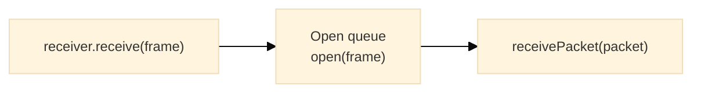

# Receiver

## Purpose

The Receiver module provides the inbound half of a channel: frames are opened one at a time on the session's receiving key and delivered as plaintext packets. A frame that does not authenticate is never delivered.

---

## Key Interfaces

### `Receiver`

```typescript
interface Receiver {
  readonly receive: ReceiveFn // Feeds an incoming frame into the pipeline
  readonly stop: () => void // Pauses opening (frames accumulate)
  readonly resume: () => void // Resumes opening
  readonly queue: InboundQueue // The frames waiting to be opened
}
```

### `ReceiveFn`

Takes raw wire bytes from the transport.

```typescript
type ReceiveFn = (packet: Uint8Array) => void
```

### `ReceivePacketFn<T>`

Called with each opened packet.

```typescript
type ReceivePacketFn<T = any> = (packet: UnencryptedPacket<T>) => void
```

### `InboundQueue`

```typescript
interface InboundQueue {
  readonly size: number // Frames waiting to be opened
}
```

### `CreateReceiver<T>` and `ReceiverFactory`

```typescript
type CreateReceiver<T = any> = (
  label: string,
  receiver: ReceivePacketFn<T>,
  logger: Logger,
  open: PacketOpener<T>,
  onDrop?: PacketDropHandler
) => Receiver

type ReceiverFactory = CreateReceiver
```

---

## Factory Functions

### `createReceiver`

**Location**: [`@hyperfrontend/network-protocol/browser/receiver`](https://www.hyperfrontend.dev/docs/libraries/network-protocol/browser/receiver/), [`@hyperfrontend/network-protocol/node/receiver`](https://www.hyperfrontend.dev/docs/libraries/network-protocol/node/receiver/)

| Parameter                                                                                                 | Type                                                                                                        | Description                                                                                                                    |
| --------------------------------------------------------------------------------------------------------- | ----------------------------------------------------------------------------------------------------------- | ------------------------------------------------------------------------------------------------------------------------------ |
| [`label`](https://www.hyperfrontend.dev/docs/libraries/network-protocol/#api-createReceiver)              | `string`                                                                                                    | Identifier for logging (a channel passes `'<label> receiver'`)                                                                 |
| [`receivePacket`](https://www.hyperfrontend.dev/docs/libraries/network-protocol/#api-createReceiver)      | `ReceivePacketFn<T>`                                                                                        | Receives each opened packet                                                                                                    |
| [`logger`](https://www.hyperfrontend.dev/docs/libraries/network-protocol/#api-createReceiver)             | [`Logger`](https://www.hyperfrontend.dev/docs/libraries/logging/#api-Logger)                                | Logger instance from [`@hyperfrontend/logging`](https://www.hyperfrontend.dev/docs/libraries/logging/)                         |
| [`open`](https://www.hyperfrontend.dev/docs/libraries/network-protocol/#api-createReceiver)               | `PacketOpener<T>`                                                                                           | The session's opener, [`protocol.open`](https://www.hyperfrontend.dev/docs/libraries/network-protocol/#api-Protocol-prop-open) |
| [`onDrop`](https://www.hyperfrontend.dev/docs/libraries/network-protocol/#api-ChannelOptions-prop-onDrop) | [`PacketDropHandler`](https://www.hyperfrontend.dev/docs/libraries/network-protocol/#api-PacketDropHandler) | Optional; receives each frame the opener rejects                                                                               |

```typescript
import { createReceiver } from '@hyperfrontend/network-protocol/browser/receiver'

const receiver = createReceiver(
  'host receiver',
  (packet) => deliver(packet.data.message),
  logger,
  protocol.open,
  (drop) => report(drop)
)
window.addEventListener('message', (event) => receiver.receive(event.data))
```

A channel creates its receiver for you; standalone use needs a [`Protocol`](https://www.hyperfrontend.dev/docs/libraries/network-protocol/#api-Protocol) instance from a provider (see [`protocol/`](../protocol/README.md)). Hello frames are not for the receiver: route them to the protocol's [`acceptHello`](https://www.hyperfrontend.dev/docs/libraries/network-protocol/#api-HelloExchange) instead.

---

## Inbound Pipeline



The open queue processes one frame at a time, which keeps the session's replay counter exact, and delivers each opened packet in order.

---

## Lifecycle Management

```typescript
receiver.stop() // Frames keep accumulating; nothing is opened
receiver.resume() // Accumulated frames open in FIFO order
```

---

## Queue Monitoring

```typescript
if (receiver.queue.size > 100) {
  receiver.stop()
}
```

---

## Error Handling

A frame the opener rejects is logged and reported through [`onDrop`](https://www.hyperfrontend.dev/docs/libraries/network-protocol/#api-ChannelOptions-prop-onDrop) as `{ direction: 'inbound', stage: 'open', reason, cause, packet }`; the receiver continues with the next frame. When [`cause`](https://www.hyperfrontend.dev/docs/libraries/network-protocol/#api-PacketDrop-prop-cause) is a [`ProtocolError`](https://www.hyperfrontend.dev/docs/libraries/network-protocol/security/#api-ProtocolError), `getProtocolErrorCode(drop.cause)` yields why:

| Code                                                                                                         | Meaning                                                     |
| ------------------------------------------------------------------------------------------------------------ | ----------------------------------------------------------- |
| [`malformed`](https://www.hyperfrontend.dev/docs/libraries/network-protocol/security/#api-ProtocolErrorCode) | Fewer than 27 bytes, or the plaintext is not a valid packet |
| `unsupported-version`                                                                                        | The version byte is not this protocol's                     |
| [`replayed`](https://www.hyperfrontend.dev/docs/libraries/network-protocol/security/#api-ProtocolErrorCode)  | The counter is not above the last accepted one              |
| `authentication-failed`                                                                                      | The tag does not verify under the session's receiving key   |
| `invalid-session`                                                                                            | The session's keys could not be derived                     |

Bytes that are not a `Uint8Array` with at least one byte are dropped with reason `Invalid frame ignored` before the opener runs.

---

## Relationship to Other Modules

- **Depends on**: [`queue/`](../queue/README.md), [`packet/`](../packet/README.md), [`@hyperfrontend/logging`](https://www.hyperfrontend.dev/docs/libraries/logging/)
- **Used by**: [`channel/`](../channel/README.md)

---

## See Also

- **[Library Index](../README.md)** - All modules
- **[Architecture Guide](../../../ARCHITECTURE.md#sender--receiver)** - Receiver architecture
- **[Browser Entry](../../browser/receiver/README.md)** - Browser-specific receiver
- **[Node Entry](../../node/receiver/README.md)** - Node.js-specific receiver

### Related Modules

| Module                             | Relationship                                                                                                               |
| ---------------------------------- | -------------------------------------------------------------------------------------------------------------------------- |
| [sender/](../sender/README.md)     | Counterpart for outbound packets                                                                                           |
| [channel/](../channel/README.md)   | Composes receiver into channel                                                                                             |
| [queue/](../queue/README.md)       | The open queue                                                                                                             |
| [security/](../security/README.md) | Error codes carried in [`cause`](https://www.hyperfrontend.dev/docs/libraries/network-protocol/#api-PacketDrop-prop-cause) |
| [packet/](../packet/README.md)     | Packet types processed                                                                                                     |
