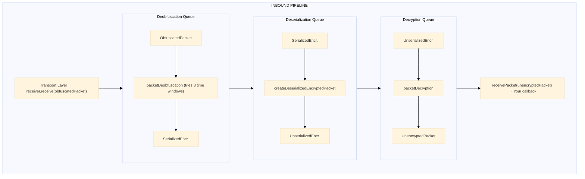

# Receiver

**Navigation**: [↑ lib/](../README.md) · [↔ sender](../sender/README.md) · [channel](../channel/README.md) · [queue](../queue/README.md)

---

## Purpose

The Receiver module provides the inbound message pipeline, orchestrating the flow of packets through deobfuscation, deserialization, and decryption queues after reception.

---

## Key Interfaces

### `Receiver`

The main receiver interface combining queue access with receive functionality.

```typescript
interface Receiver extends InboundQueues {
  receive: ReceiveFn // Process incoming obfuscated packets
  stop: () => void // Pause all inbound processing
  resume: () => void // Resume inbound processing
  deobfuscationQueue: InboundQueue
  deserializationQueue: InboundQueue
  decryptionQueue: InboundQueue
}
```

### `ReceiveFn`

Function type for receiving obfuscated packets from the transport layer.

```typescript
type ReceiveFn = (packet: Uint8Array) => void
```

### `ReceivePacketFn<T>`

Callback function type for handling fully decrypted packets.

```typescript
type ReceivePacketFn<T = any> = (packet: UnencryptedPacket<T>) => void
```

### `InboundQueue`

Access to queue size for monitoring.

```typescript
interface InboundQueue {
  size: number // Current number of messages in the queue
}
```

### `InboundQueues`

Combined access to all inbound queues.

```typescript
interface InboundQueues {
  deobfuscationQueue: InboundQueue
  deserializationQueue: InboundQueue
  decryptionQueue: InboundQueue
}
```

---

## Factory Functions

### `createReceiverFactory`

Creates a receiver factory with injected deserialization.

**Location**: `@hyperfrontend/network-protocol/lib/receiver`

**Signature**:

```typescript
function createReceiverFactory(createDeserializedEncryptedPacket: PacketDeserialization): CreateReceiver
```

**Parameters**:

| Parameter                           | Type                    | Description                               |
| ----------------------------------- | ----------------------- | ----------------------------------------- |
| `createDeserializedEncryptedPacket` | `PacketDeserialization` | Function to deserialize encrypted packets |

**Returns**: `CreateReceiver` - A factory function that creates Receiver instances.

**Example**:

```typescript
import { createDeserializedEncryptedPacketCreator } from '@hyperfrontend/network-protocol/lib/packet/creators'
import { base64ToUint8Array } from '@hyperfrontend/string-utils/browser'
import { createReceiverFactory } from '@hyperfrontend/network-protocol/lib/receiver/creators'

// Create deserialization function (platform-specific)
const deserializePacket = createDeserializedEncryptedPacketCreator(base64ToUint8Array)

// Create receiver factory
const createReceiver = createReceiverFactory(deserializePacket)

// Create a receiver instance
const receiver = createReceiver(
  'my-receiver',
  (packet) => handleMessage(packet.data), // ReceivePacketFn
  logger,
  protocol.packetDeobfuscation,
  protocol.packetDecryption
)
```

---

### `CreateReceiver<T>` (Receiver Factory)

The factory function produced by `createReceiverFactory`.

**Signature**:

```typescript
type CreateReceiver<T = any> = (
  label: string,
  receiver: ReceivePacketFn<T>,
  logger: Logger,
  packetDeobfuscation: PacketDeobfuscation,
  packetDecryption: PacketDecryption<T>
) => Receiver
```

**Parameters**:

| Parameter             | Type                  | Description                                           |
| --------------------- | --------------------- | ----------------------------------------------------- |
| `label`               | `string`              | Identifier for logging (e.g., `'channel-1 receiver'`) |
| `receiver`            | `ReceivePacketFn<T>`  | Callback for handling decrypted packets               |
| `logger`              | `Logger`              | Logger instance from `@hyperfrontend/logging`         |
| `packetDeobfuscation` | `PacketDeobfuscation` | Function to deobfuscate incoming packets              |
| `packetDecryption`    | `PacketDecryption<T>` | Function to decrypt unserialized packets              |

---

## Inbound Pipeline

When you call `receiver.receive(packet)`:



---

## Lifecycle Management

### Stop/Resume

```typescript
// Pause all inbound processing
receiver.stop()
// Messages continue to accumulate in queues

// Resume processing (processes accumulated messages in FIFO order)
receiver.resume()
```

### Stop Order

When `stop()` is called, queues are stopped in order:

1. Deobfuscation queue (entry point)
2. Deserialization queue
3. Decryption queue

### Resume Order

When `resume()` is called, queues are resumed in reverse order:

1. Decryption queue (exit point - resume first to accept output)
2. Deserialization queue
3. Deobfuscation queue (resume last to start feeding the chain)

---

## Queue Monitoring

Access queue sizes for backpressure detection:

```typescript
// Monitor individual queue depths
console.log('Deobfuscation queue:', receiver.deobfuscationQueue.size)
console.log('Deserialization queue:', receiver.deserializationQueue.size)
console.log('Decryption queue:', receiver.decryptionQueue.size)

// Total pending inbound messages
const totalPending = receiver.deobfuscationQueue.size + receiver.deserializationQueue.size + receiver.decryptionQueue.size

// Backpressure detection
const BACKPRESSURE_THRESHOLD = 100
if (totalPending > BACKPRESSURE_THRESHOLD) {
  console.warn('Inbound backpressure detected')
  receiver.stop()
  // Signal to slow down message processing
}
```

---

## Error Handling

### Clock Skew Failures

Deobfuscation may fail if clock drift exceeds tolerance:

```typescript
// Deobfuscation tries current, previous, and next time windows
// If all three fail, the packet is dropped and logged

// Monitor logs for: "Could not deobfuscate data"
// This indicates clock synchronization issues
```

### Decryption Failures

Decryption may fail if the key doesn't match:

```typescript
// Decryption failures are logged and the packet is dropped
// Common causes:
// - Key not yet exchanged (first message scenario)
// - Key mismatch between endpoints
// - Corrupted packet data
```

---

## Usage Example

```typescript
import { createProtocol } from '@hyperfrontend/network-protocol/browser/v1'
import { createReceiverFactory } from '@hyperfrontend/network-protocol/browser/receiver'
import { createLogger } from '@hyperfrontend/logging'

const logger = createLogger({ level: 'info' })
const protocolProvider = createProtocol(logger, 60)
const protocol = protocolProvider(
  (packet) => transport.send(packet),
  (packet) => {
    // This callback receives fully decrypted packets
    console.log('Received message:', packet.data.message)
  }
)

// Create receiver (typically done via channel, but can be standalone)
const receiver = createReceiver('my-receiver', protocol.receive, logger, protocol.packetDeobfuscation, protocol.packetDecryption)

// Listen for transport events
transport.on('message', (data) => {
  if (data instanceof Uint8Array) {
    receiver.receive(data)
  }
})
```

---

## Relationship to Other Modules

- **Depends on**: [`queue/`](../queue/README.md), [`packet/`](../packet/README.md), `@hyperfrontend/logging`
- **Used by**: [`channel/`](../channel/README.md)

---

## Directory Structure

```
receiver/
├── README.md           ← You are here
├── index.ts            ← Public exports
├── model.ts            ← Receiver interface definitions
└── creators/
    ├── index.ts
    └── create-receiver-factory.ts
```

---

## See Also

- **[Library Index](../README.md)** - All modules
- **[Architecture Guide](../../../ARCHITECTURE.md#sender--receiver)** - Receiver architecture
- **[Browser Entry](../../browser/receiver/)** - Browser-specific receiver
- **[Node Entry](../../node/receiver/)** - Node.js-specific receiver

### Related Modules

| Module                           | Relationship                      |
| -------------------------------- | --------------------------------- |
| [sender/](../sender/README.md)   | Counterpart for outbound messages |
| [channel/](../channel/README.md) | Composes receiver into channel    |
| [queue/](../queue/README.md)     | Underlying queue implementation   |
| [packet/](../packet/README.md)   | Packet types processed            |
