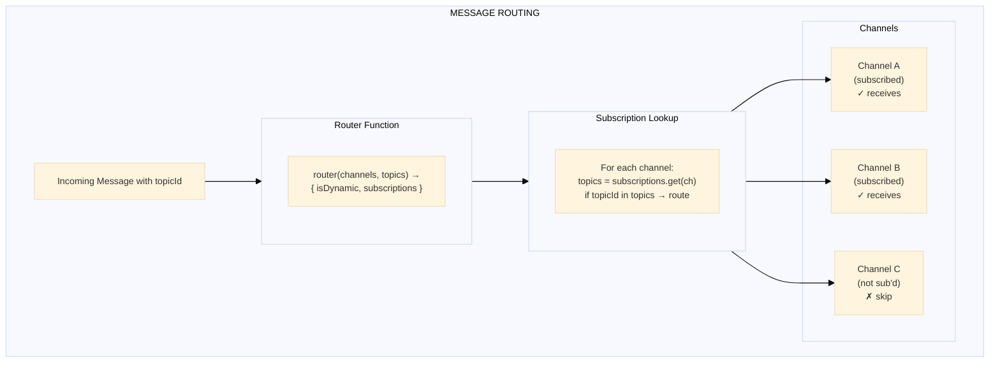

# Routing

## Purpose

The Routing module provides topic-based message routing across channels, enabling publish-subscribe patterns where channels subscribe to topics and receive messages routed to those topics.

---

## Key Interfaces

### `RoutedPacket`

Base interface for routed packets with topic association.

```typescript
interface RoutedPacket {
  topicId: string // Topic this packet is routed to
  packet: unknown // The packet content
}
```

### `RoutedObfuscatedPacket`

Routed packet containing obfuscated data (wire format).

```typescript
interface RoutedObfuscatedPacket extends RoutedPacket {
  packet: Uint8Array // Obfuscated packet bytes
}
```

### `RoutedUnencryptedPacket<T>`

Routed packet containing decrypted data (application format).

```typescript
interface RoutedUnencryptedPacket<T = any> extends RoutedPacket {
  packet: UnencryptedPacket<T> // Decrypted packet
}
```

### `RoutingOptions`

Configuration for routing behavior.

```typescript
interface RoutingOptions {
  isDynamic: boolean // Subscription fetching mode
  subscriptions: Subscriptions // Channel-to-topic mappings
}
```

**`isDynamic` Options**:

- `true`: Fetches subscriptions anew for each message (dynamic subscriptions)
- `false`: Fetches subscriptions once and caches them (static subscriptions)

### `Subscriptions`

WeakMap linking channels to their subscribed topics.

```typescript
type Subscriptions = WeakMap<Channel, Topic[]>
```

### `Router`

Function type that configures routing based on available channels and topics.

```typescript
type Router = (channels: Channel[], topics: Topic[]) => RoutingOptions
```

---

## Routing Flow



---

## Dynamic vs Static Routing

### Static Routing (`isDynamic: false`)

- Subscriptions are resolved once when routing is configured
- More efficient for stable subscription patterns
- Use when channels don't change subscriptions at runtime

```typescript
const router: Router = (channels, topics) => {
  const subscriptions = new WeakMap<Channel, Topic[]>()

  // Set up subscriptions once
  const userTopic = topics.find((t) => t.name === 'user-events')
  channels.forEach((channel) => {
    subscriptions.set(channel, [userTopic])
  })

  return {
    isDynamic: false, // Cached subscriptions
    subscriptions,
  }
}
```

### Dynamic Routing (`isDynamic: true`)

- Subscriptions are re-evaluated for each message
- Enables runtime subscription changes
- Use when channels need to subscribe/unsubscribe dynamically

```typescript
const router: Router = (channels, topics) => {
  const subscriptions = new WeakMap<Channel, Topic[]>()

  // Subscriptions are evaluated per-message
  // External state can modify subscription patterns

  return {
    isDynamic: true, // Fresh lookup each time
    subscriptions,
  }
}
```

---

## Usage Example

```typescript
import { createTopicStore } from '@hyperfrontend/network-protocol/lib/topic'
import { createChannelStore } from '@hyperfrontend/network-protocol/lib/channel'

// Create stores
const topicStore = createTopicStore()
const channelStore = createChannelStore()

// Create topics
topicStore.create('user-events', 'system-events', 'notifications')

// Create channels
const channel1 = channelStore.create('client-1', sendFn, receiveFn, protocolProvider)
const channel2 = channelStore.create('client-2', sendFn, receiveFn, protocolProvider)

// Define router
const router: Router = (channels, topics) => {
  const subscriptions = new WeakMap<Channel, Topic[]>()

  const userEvents = topics.find((t) => t.name === 'user-events')
  const notifications = topics.find((t) => t.name === 'notifications')

  // Channel 1 subscribes to user events and notifications
  subscriptions.set(channel1, [userEvents, notifications])

  // Channel 2 subscribes only to notifications
  subscriptions.set(channel2, [notifications])

  return { isDynamic: false, subscriptions }
}

// Get routing configuration
const routingOptions = router(
  channelStore.list.map((e) => e.channel),
  topicStore.list
)
```

---

## Relationship to Other Modules

- **Depends on**: [`channel/`](../channel/README.md), [`topic/`](../topic/README.md), [`packet/`](../packet/README.md)
- **Used by**: Application layer (pub-sub patterns)

---

## See Also

- **[Library Index](../README.md)** - All modules
- **[Architecture Guide](../../../ARCHITECTURE.md#routing)** - Routing architecture

### Related Modules

| Module                           | Relationship                          |
| -------------------------------- | ------------------------------------- |
| [topic/](../topic/README.md)     | Topics used for subscription          |
| [channel/](../channel/README.md) | Channels that receive routed messages |
| [packet/](../packet/README.md)   | RoutedPacket types                    |
