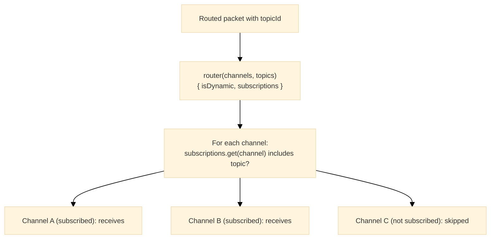

# Routing

## Purpose

The Routing module provides topic-based message routing across channels: routed-packet envelopes that pair a packet with a topic, and the subscription types a router uses to decide which channels receive a topic's messages.

---

## Key Interfaces

### `RoutedPacket`

```typescript
interface RoutedPacket {
  topicId: string // Topic this packet is routed to (UUID v4)
  packet: unknown // The packet content
}
```

### `RoutedWirePacket`

A routed packet carrying a sealed frame.

```typescript
interface RoutedWirePacket extends RoutedPacket {
  packet: Uint8Array // The sealed frame
}
```

### `RoutedUnencryptedPacket<T>`

A routed packet carrying a plaintext packet.

```typescript
interface RoutedUnencryptedPacket<T = any> extends RoutedPacket {
  packet: UnencryptedPacket<T>
}
```

### `RoutingOptions`

```typescript
interface RoutingOptions {
  isDynamic: boolean // true: fetch subscriptions anew for each message; false: fetch once and cache
  subscriptions: Subscriptions // Maps channels to their subscribed topics
}
```

### `Subscriptions`

```typescript
type Subscriptions = WeakMap<Channel, Topic[]>
```

### `Router`

Configures routing from the available channels and topics.

```typescript
type Router = (channels: Channel[], topics: Topic[]) => RoutingOptions
```

---

## Routing Flow



---

## Factory Functions

### `createRoutedUnencryptedPacket`

Builds the plaintext packet with `createUnencryptedPacket` and pairs it with a topic; the result is frozen.

```typescript
function createRoutedUnencryptedPacket<T = any>(topicId: string, origin: string, target: string, data: Data<T>): RoutedUnencryptedPacket
```

```typescript
import { createRoutedUnencryptedPacket } from '@hyperfrontend/network-protocol/routing'

const routed = createRoutedUnencryptedPacket(topic.id, originId, targetId, data)
// => { topicId, packet: { origin, target, data } }
```

### `createRoutedWirePacket`

Pairs an already sealed frame with a topic; the result is frozen.

```typescript
function createRoutedWirePacket(topicId: string, packet: WirePacket): RoutedWirePacket
```

---

## Dynamic vs Static Routing

### Static (`isDynamic: false`)

Subscriptions are resolved once; use when channels do not change subscriptions at runtime.

```typescript
const router: Router = (channels, topics) => {
  const subscriptions = new WeakMap<Channel, Topic[]>()
  const userEvents = topics.find((t) => t.name === 'user-events')
  channels.forEach((channel) => subscriptions.set(channel, userEvents ? [userEvents] : []))
  return { isDynamic: false, subscriptions }
}
```

### Dynamic (`isDynamic: true`)

Subscriptions are re-evaluated for each message; use when channels subscribe and unsubscribe at runtime.

```typescript
const router: Router = (channels, topics) => ({ isDynamic: true, subscriptions: currentSubscriptions() })
```

---

## Usage Example

```typescript
import { createTopicStore } from '@hyperfrontend/network-protocol/topic'
import { createChannelStore } from '@hyperfrontend/network-protocol/browser/channel'

const topicStore = createTopicStore()
const channelStore = createChannelStore()

topicStore.create('user-events', 'system-events', 'notifications')

const first = channelStore.create('client-1', {
  send,
  receive,
  protocolProvider,
  session: firstSession,
})
const second = channelStore.create('client-2', {
  send,
  receive,
  protocolProvider,
  session: secondSession,
})

const router: Router = (channels, topics) => {
  const subscriptions = new WeakMap<Channel, Topic[]>()
  const userEvents = topics.find((t) => t.name === 'user-events')
  const notifications = topics.find((t) => t.name === 'notifications')
  subscriptions.set(first, [userEvents, notifications].filter(Boolean) as Topic[])
  subscriptions.set(second, notifications ? [notifications] : [])
  return { isDynamic: false, subscriptions }
}

const routingOptions = router(
  channelStore.list.map((entry) => entry.channel),
  topicStore.list
)
```

---

## Error Handling

```typescript
createRoutedUnencryptedPacket('not-a-uuid', originId, targetId, data)
// Error: 'Cannot create a routed unencrypted packet without a valid topic'

createRoutedWirePacket('not-a-uuid', frame)
// Error: 'Cannot create a routed wire packet without a valid topic'

createRoutedWirePacket(topic.id, new Uint8Array(0))
// Error: 'Cannot create a routed wire packet without a valid wire packet'
```

`createRoutedUnencryptedPacket` also throws the packet creator's errors for an invalid origin, target, or data envelope.

---

## Validation Helpers

`validations/` holds `isValidRoutedUnencryptedPacket`, `isValidRoutedWirePacket`, `isValidRoutingOptions`, `isValidSubscriptions` (a `WeakMap`), and `isValidRouter` (a function whose result for empty inputs is valid routing options). They are internal to the module.

---

## Relationship to Other Modules

- **Depends on**: [`channel/`](../channel/README.md), [`topic/`](../topic/README.md), [`packet/`](../packet/README.md)
- **Used by**: Application layer (pub-sub patterns)

---

## See Also

- **[Library Index](../README.md)** - All modules
- **[Architecture Guide](../../../ARCHITECTURE.md#routing)** - Routing architecture
- **[Routing Entry](../../routing/README.md)** - The `@hyperfrontend/network-protocol/routing` entry

### Related Modules

| Module                           | Relationship                              |
| -------------------------------- | ----------------------------------------- |
| [topic/](../topic/README.md)     | Topics used for subscription              |
| [channel/](../channel/README.md) | Channels that receive routed messages     |
| [packet/](../packet/README.md)   | The packet shapes a routed packet carries |
