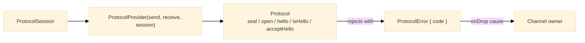

# Security

## Purpose

The Security module defines what a security protocol implements: the per-session seal and open operations, the session a protocol is bound to, the outcome of accepting a hello frame, and the machine-readable error a protocol raises when it rejects a frame or a session.

---

## Key Interfaces

### `SecuritySuite<T>`

The two per-session packet operations.

```typescript
interface SecuritySuite<T = any> {
  readonly seal: PacketSealer<T> // (packet: UnencryptedPacket<T>) => Promise<WirePacket>
  readonly open: PacketOpener<T> // (frame: WirePacket) => Promise<UnencryptedPacket<T>>
}
```

`PacketSealer` and `PacketOpener` are re-exported from [`packet/`](../packet/README.md).

### `ProtocolSession` and `SessionRole`

What a protocol needs to key one session. The key material itself is minted by the protocol and exchanged through hello frames once the session exists.

```typescript
type SessionRole = 'initiator' | 'responder'

interface ProtocolSession {
  readonly protocol: string // The negotiated protocol identifier, e.g. 'v3'
  readonly role: SessionRole // Which side of the handshake this endpoint played
  readonly localId: string // This endpoint's identity as stamped on packets
  readonly peerId: string // The peer's identity as stamped on packets
}
```

### `HelloOutcome`

```typescript
type HelloOutcome = 'accepted' | 'duplicate' | 'rejected'
```

| Outcome     | Meaning                                                       |
| ----------- | ------------------------------------------------------------- |
| `accepted`  | The peer's material is now known and the session can be keyed |
| `duplicate` | The same material was already accepted; a retry, ignored      |
| `rejected`  | The frame is not a hello this session can use                 |

### `ProtocolError`

```typescript
interface ProtocolError extends Error {
  readonly code: ProtocolErrorCode // Why the protocol rejected the input
}
```

The error's `name` is `'ProtocolError'`.

---

## Error Codes

```typescript
const ProtocolErrorCode = {
  UnsupportedVersion: 'unsupported-version',
  Replayed: 'replayed',
  AuthenticationFailed: 'authentication-failed',
  Malformed: 'malformed',
  CounterExhausted: 'counter-exhausted',
  InvalidSession: 'invalid-session',
} as const

type ProtocolErrorCode = (typeof ProtocolErrorCode)[keyof typeof ProtocolErrorCode]
```

| Code                    | Meaning                                                              |
| ----------------------- | -------------------------------------------------------------------- |
| `unsupported-version`   | The frame's version byte is not this protocol's                      |
| `replayed`              | The frame's counter is not above the last accepted one               |
| `authentication-failed` | The frame's tag does not verify under the session's keys             |
| `malformed`             | The frame is too short, or authenticated but does not carry a packet |
| `counter-exhausted`     | The session has sealed every counter value it can represent          |
| `invalid-session`       | The session cannot be keyed from the material it holds               |

---

## Functions

### `createProtocolError`

```typescript
function createProtocolError(code: ProtocolErrorCode, message: string): ProtocolError
```

```typescript
import { createProtocolError, ProtocolErrorCode } from '@hyperfrontend/network-protocol/security'

throw createProtocolError(ProtocolErrorCode.Replayed, 'Frame counter 7 is not above the last accepted counter 9')
```

### `getProtocolErrorCode`

Reads the code off any thrown value, or returns `null` when the value is not a protocol error.

```typescript
function getProtocolErrorCode(error: unknown): ProtocolErrorCode | null
```

```typescript
import { getProtocolErrorCode } from '@hyperfrontend/network-protocol/security'

const channel = createChannel('comms', {
  ...options,
  onDrop: (drop) => {
    const code = getProtocolErrorCode(drop.cause)
    if (code === 'authentication-failed' || code === 'replayed') {
      alarm(drop)
    }
  },
})
```

---

## Where the Pieces Meet



A protocol (see [`protocol/`](../protocol/README.md)) implements the suite for one session; a channel (see [`channel/`](../channel/README.md)) runs it; every rejection reaches the owner as the `cause` of a `PacketDrop`.

---

## Relationship to Other Modules

- **Depends on**: [`packet/`](../packet/README.md) (the seal and open types)
- **Used by**: [`protocol/`](../protocol/README.md), [`channel/`](../channel/README.md), [`queue/`](../queue/README.md)

---

## See Also

- **[Library Index](../README.md)** - All modules
- **[Architecture Guide](../../../ARCHITECTURE.md#security-suite)** - Security architecture
- **[Security Entry](../../security/README.md)** - The `@hyperfrontend/network-protocol/security` entry

### Related Modules

| Module                             | Relationship                               |
| ---------------------------------- | ------------------------------------------ |
| [protocol/](../protocol/README.md) | Implements the suite and raises the errors |
| [channel/](../channel/README.md)   | Binds a session and surfaces drops         |
| [packet/](../packet/README.md)     | The packet shapes the operations convert   |
