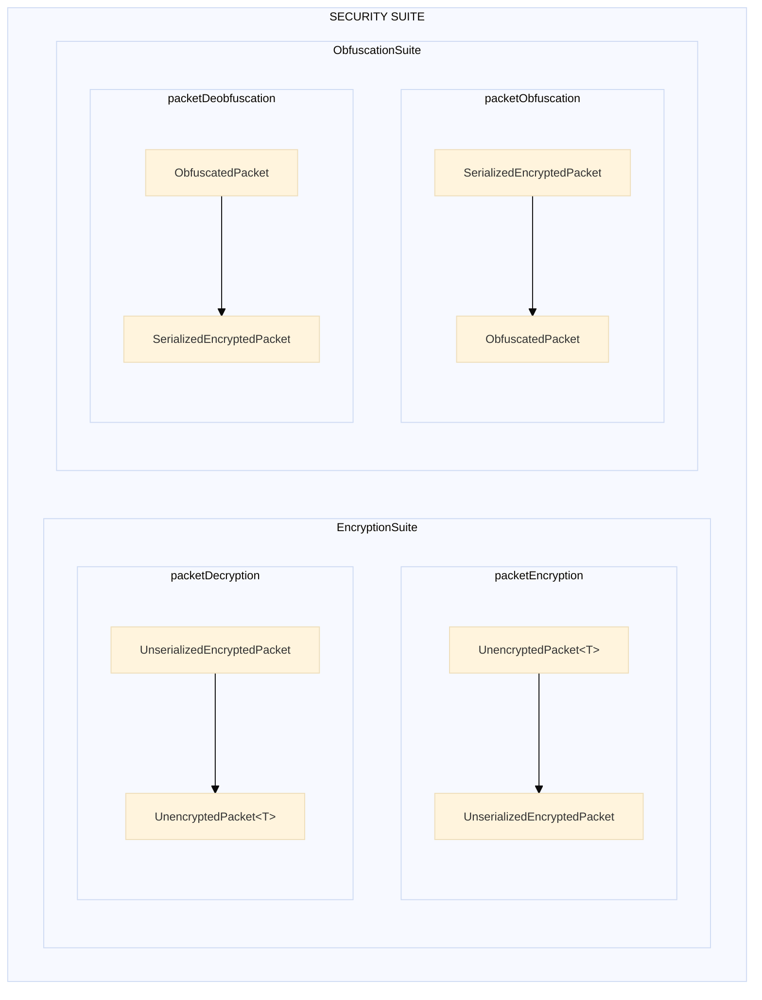
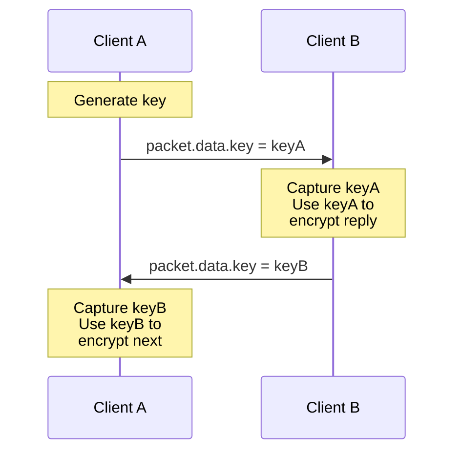
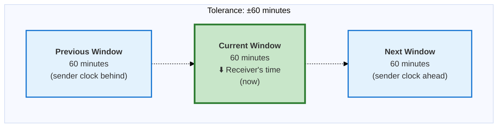
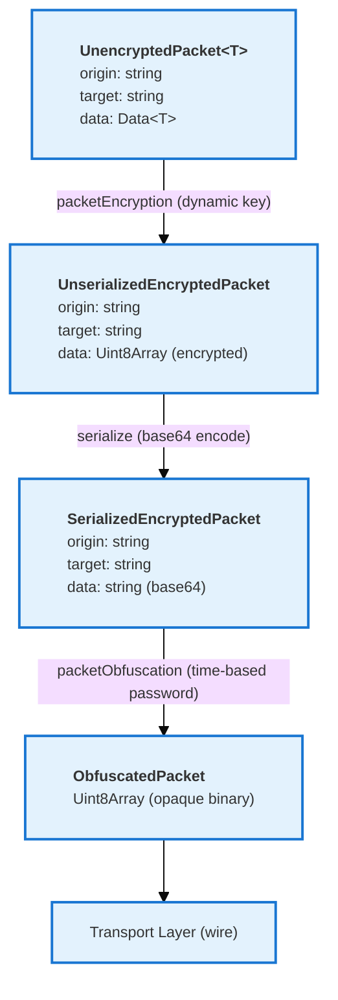
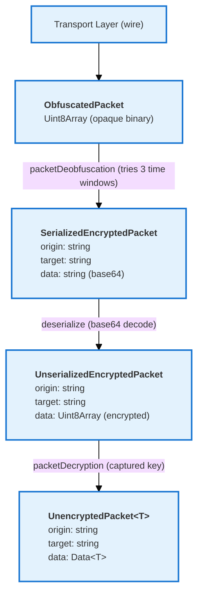

# Security

**Navigation**: [↑ lib/](../README.md) · [protocol](../protocol/README.md) · [packet](../packet/README.md)

---

## Purpose

The Security module defines the security suite interfaces that combine encryption and obfuscation capabilities. It provides a unified interface for the complete security pipeline used by the protocol.

---

## Key Interfaces

### `EncryptionSuite<T>`

Provides packet encryption and decryption operations with dynamic key support.

```typescript
interface EncryptionSuite<T = any> {
  packetEncryption: PacketEncryption<T> // (packet: UnencryptedPacket<T>) => Promise<UnserializedEncryptedPacket>
  packetDecryption: PacketDecryption<T> // (packet: UnserializedEncryptedPacket) => Promise<UnencryptedPacket<T>>
}
```

### `ObfuscationSuite`

Provides packet obfuscation and deobfuscation operations with time-based passwords.

```typescript
interface ObfuscationSuite {
  packetObfuscation: PacketObfuscation // (packet: SerializedEncryptedPacket) => Promise<ObfuscatedPacket>
  packetDeobfuscation: PacketDeobfuscation // (packet: ObfuscatedPacket) => Promise<SerializedEncryptedPacket>
}
```

### `SecuritySuite<T>`

Combined interface for complete security operations (encryption + obfuscation).

```typescript
interface SecuritySuite<T = any> extends EncryptionSuite<T>, ObfuscationSuite {
  // Inherits all four operations:
  // packetEncryption, packetDecryption, packetObfuscation, packetDeobfuscation
}
```

---

## Security Suite Composition

The security suite is composed from separate encryption and obfuscation components:



---

## Factory Functions

### Dynamic Key Encryption Suite

Created by `createDynamicKeyEncryptionFactory`, this suite uses a key provider function evaluated at each operation.

**Location**: `packet/security/encryption/dynamic-encryption-key.ts`

```typescript
import { createDynamicKeyEncryptionFactory } from '@hyperfrontend/network-protocol/lib/packet/security/encryption'

// Create the factory with platform-specific encryption
const createDynamicKeyEncryption = createDynamicKeyEncryptionFactory(
  encryptPacket, // Platform-specific encrypt
  decryptPacket // Platform-specific decrypt
)

// Create a suite with a key provider
let currentKey = 'initial-key'
const getKey = () => currentKey

const encryptionSuite = createDynamicKeyEncryption(getKey)

// Key is evaluated at each operation
await encryptionSuite.packetEncryption(packet) // Uses current key
currentKey = 'rotated-key'
await encryptionSuite.packetEncryption(packet) // Uses rotated key
```

### Time-Interval Obfuscation Suite

Created by `createTimeIntervalObfuscationFactory`, this suite uses time-based passwords with automatic clock-skew handling.

**Location**: `packet/security/obfuscation/time-interval-obfuscation-factory.ts`

```typescript
import { createTimeIntervalObfuscationFactory } from '@hyperfrontend/network-protocol/lib/packet/security/obfuscation'

// Create the factory with platform-specific obfuscation
const createTimeIntervalObfuscation = createTimeIntervalObfuscationFactory(
  obfuscatePacket, // Platform-specific obfuscate
  deobfuscatePacket, // Platform-specific deobfuscate
  getTimeBasedPassword, // Password from time window
  getTimeBasedPasswords // Current, previous, next passwords
)

// Create a suite with 60-minute refresh
const obfuscationSuite = createTimeIntervalObfuscation(60)

// Obfuscate with current time window password
await obfuscationSuite.packetObfuscation(serializedPacket)

// Deobfuscate tries current, previous, and next windows
await obfuscationSuite.packetDeobfuscation(obfuscatedPacket)
```

---

## Platform-Specific Creation

### Browser

```typescript
import { createProtocol } from '@hyperfrontend/network-protocol/browser/v1'
import { createLogger } from '@hyperfrontend/logging'

const logger = createLogger({ level: 'info' })
const protocolProvider = createProtocol(logger, 60)

// The protocol includes:
// - Web Crypto API-based encryption (AES-GCM)
// - Web Crypto API-based obfuscation
// - Time-based password generation
```

### Node.js

```typescript
import { createProtocol } from '@hyperfrontend/network-protocol/node/v1'
import { createLogger } from '@hyperfrontend/logging'

const logger = createLogger({ level: 'info' })
const protocolProvider = createProtocol(logger, 60)

// The protocol includes:
// - Node.js crypto module-based encryption (AES-256-GCM)
// - Node.js crypto module-based obfuscation
// - Time-based password generation
```

---

## Encryption Key Management

### Dynamic Key Pattern

The encryption suite uses a **key provider function** that is evaluated at each operation:

```typescript
// Key captured from incoming packets
let capturedKey: string

const receive = (packet: UnencryptedPacket) => {
  capturedKey = packet.data.key // Capture key from peer
  handlePacket(packet)
}

const getKey = () => capturedKey

// Encryption suite uses the latest key
const suite = createDynamicKeyEncryption(getKey)
```

### Key Exchange Flow



---

## Obfuscation Password Management

### Time-Based Password Generation

Passwords are derived from the current time window:

```typescript
// Password changes every refreshRate minutes
const password = await getTimeBasedPassword(new Date(), refreshRate, 0)
```

### Clock Skew Tolerance

During deobfuscation, the suite tries multiple time windows:

```typescript
const { current, previous, next } = getTimeBasedPasswords(new Date(), refreshRate)

// Try in order:
// 1. Current time window password
// 2. Previous time window password (sender clock behind)
// 3. Next time window password (sender clock ahead)
```

### Window Tolerance Example

With `refreshRate = 60` (60-minute windows):



---

## Security Pipeline Flow

### Outbound (Sending)



### Inbound (Receiving)



---

## Security Considerations

### Key Rotation

- Dynamic key encryption allows key rotation without protocol reconfiguration
- Keys are exchanged via the `packet.data.key` field
- Consider implementing periodic key rotation for long-lived sessions

### Time Synchronization

- Obfuscation depends on synchronized clocks between endpoints
- Built-in tolerance handles up to ±refreshRate minutes of drift
- Monitor for repeated deobfuscation failures (may indicate clock issues)

### Refresh Rate Selection

| Refresh Rate | Clock Tolerance | Security Tradeoff              |
| ------------ | --------------- | ------------------------------ |
| 1 minute     | ±1 minute       | Higher security, strict timing |
| 5 minutes    | ±5 minutes      | Balanced                       |
| 60 minutes   | ±60 minutes     | More tolerant, larger windows  |

### Best Practices

1. **Use NTP**: Ensure all endpoints sync with reliable time servers
2. **Monitor Failures**: Log deobfuscation failures to detect clock drift
3. **Key Management**: Implement secure key generation and exchange
4. **Logging**: Use debug-level logging in development, info in production

---

## Relationship to Other Modules

- **Depends on**: [`packet/`](../packet/README.md) (for packet transformation types), `@hyperfrontend/cryptography`
- **Used by**: [`protocol/`](../protocol/README.md) (composes the security suite)

---

## Directory Structure

```
security/
├── README.md           ← You are here
├── index.ts            ← Public exports
└── model.ts            ← Security suite interface definitions

# Related implementation files:
packet/security/
├── encryption/
│   ├── create-encrypter.ts
│   ├── create-decrypter.ts
│   └── dynamic-encryption-key.ts
└── obfuscation/
    ├── create-obfuscator.ts
    ├── create-deobfuscator.ts
    └── time-interval-obfuscation-factory.ts
```

---

## See Also

- **[Library Index](../README.md)** - All modules
- **[Architecture Guide](../../../ARCHITECTURE.md#security-suite)** - Security architecture

### Related Modules

| Module                                                          | Relationship                          |
| --------------------------------------------------------------- | ------------------------------------- |
| [protocol/](../protocol/README.md)                              | Composes security suite               |
| [packet/](../packet/README.md)                                  | Packet transformations using security |
| [packet/security/encryption/](../packet/security/encryption/)   | Encryption implementations            |
| [packet/security/obfuscation/](../packet/security/obfuscation/) | Obfuscation implementations           |
