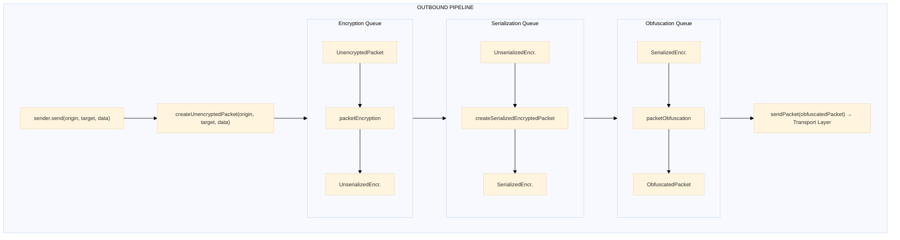

# Sender

## Purpose

The Sender module provides the outbound message pipeline, orchestrating the flow of messages through encryption, serialization, and obfuscation queues before transmission.

---

## Key Interfaces

### `Sender<T>`

The main sender interface combining queue access with send functionality.

```typescript
interface Sender<T = any> extends OutboundQueues {
  send: SendFn<T> // Send messages through the pipeline
  stop: () => void // Pause all outbound processing
  resume: () => void // Resume outbound processing
  encryptionQueue: OutboundQueue
  serializationQueue: OutboundQueue
  obfuscationQueue: OutboundQueue
}
```

### `SendFn<T>`

Function type for sending messages with routing information.

```typescript
type SendFn<T = any> = (origin: string, target: string, data: Data<T>) => void
```

### `SendPacketFn`

Low-level function type for transmitting obfuscated packets to the transport layer.

```typescript
type SendPacketFn = (packet: Uint8Array) => void
```

### `OutboundQueue`

Access to queue size for monitoring.

```typescript
interface OutboundQueue {
  size: number // Current number of messages in the queue
}
```

### `OutboundQueues`

Combined access to all outbound queues.

```typescript
interface OutboundQueues {
  encryptionQueue: OutboundQueue
  serializationQueue: OutboundQueue
  obfuscationQueue: OutboundQueue
}
```

---

## Factory Functions

### `createSenderFactory`

Creates a sender factory with injected serialization.

**Location**: `@hyperfrontend/network-protocol/lib/sender`

**Signature**:

```typescript
function createSenderFactory(createSerializedEncryptedPacket: PacketSerialization): CreateSender
```

**Parameters**:

| Parameter                         | Type                  | Description                             |
| --------------------------------- | --------------------- | --------------------------------------- |
| `createSerializedEncryptedPacket` | `PacketSerialization` | Function to serialize encrypted packets |

**Returns**: `CreateSender` - A factory function that creates Sender instances.

**Example**:

```typescript
import { createSerializedEncryptedPacketCreator } from '@hyperfrontend/network-protocol/lib/packet/creators'
import { uint8ArrayToBase64 } from '@hyperfrontend/string-utils/browser'
import { createSenderFactory } from '@hyperfrontend/network-protocol/lib/sender/creators'

// Create serialization function (platform-specific)
const serializePacket = createSerializedEncryptedPacketCreator(uint8ArrayToBase64)

// Create sender factory
const createSender = createSenderFactory(serializePacket)

// Create a sender instance
const sender = createSender(
  'my-sender',
  (packet) => transport.send(packet), // SendPacketFn
  logger,
  protocol.packetEncryption,
  protocol.packetObfuscation
)
```

---

### `CreateSender<T>` (Sender Factory)

The factory function produced by `createSenderFactory`.

**Signature**:

```typescript
type CreateSender<T = any> = (
  label: string,
  sender: SendPacketFn,
  logger: Logger,
  packetEncryption: PacketEncryption<T>,
  packetObfuscation: PacketObfuscation
) => Sender<T>
```

**Parameters**:

| Parameter           | Type                  | Description                                         |
| ------------------- | --------------------- | --------------------------------------------------- |
| `label`             | `string`              | Identifier for logging (e.g., `'channel-1 sender'`) |
| `sender`            | `SendPacketFn`        | Transport function to send obfuscated packets       |
| `logger`            | `Logger`              | Logger instance from `@hyperfrontend/logging`       |
| `packetEncryption`  | `PacketEncryption<T>` | Function to encrypt unencrypted packets             |
| `packetObfuscation` | `PacketObfuscation`   | Function to obfuscate serialized packets            |

---

## Outbound Pipeline

When you call `sender.send(origin, target, data)`:



---

## Lifecycle Management

### Stop/Resume

```typescript
// Pause all outbound processing
sender.stop()
// Messages continue to accumulate in queues

// Resume processing (processes accumulated messages in FIFO order)
sender.resume()
```

### Stop Order

When `stop()` is called, queues are stopped in order:

1. Encryption queue (entry point)
2. Serialization queue
3. Obfuscation queue

### Resume Order

When `resume()` is called, queues are resumed in reverse order:

1. Obfuscation queue (exit point - resume first to accept output)
2. Serialization queue
3. Encryption queue (resume last to start feeding the chain)

---

## Queue Monitoring

Access queue sizes for backpressure detection:

```typescript
// Monitor individual queue depths
console.log('Encryption queue:', sender.encryptionQueue.size)
console.log('Serialization queue:', sender.serializationQueue.size)
console.log('Obfuscation queue:', sender.obfuscationQueue.size)

// Total pending outbound messages
const totalPending = sender.encryptionQueue.size + sender.serializationQueue.size + sender.obfuscationQueue.size

// Backpressure detection
const BACKPRESSURE_THRESHOLD = 100
if (totalPending > BACKPRESSURE_THRESHOLD) {
  console.warn('Outbound backpressure detected')
  sender.stop()
  // Signal upstream to slow down
}
```

---

## Usage Example

```typescript
import { createProtocol } from '@hyperfrontend/network-protocol/browser/v1'
import { createSenderFactory } from '@hyperfrontend/network-protocol/browser/sender'
import { createLogger } from '@hyperfrontend/logging'

const logger = createLogger({ level: 'info' })
const protocolProvider = createProtocol(logger, 60)
const protocol = protocolProvider(
  (packet) => transport.send(packet),
  (packet) => {
    /* receive callback */
  }
)

// Create sender (typically done via channel, but can be standalone)
const sender = createSender('my-sender', protocol.send, logger, protocol.packetEncryption, protocol.packetObfuscation)

// Send a message
sender.send('https://app.example.com', 'https://widget.example.com', createData({ type: 'greeting', message: 'Hello!' }))
```

---

## Relationship to Other Modules

- **Depends on**: [`queue/`](../queue/README.md), [`packet/`](../packet/README.md), `@hyperfrontend/logging`
- **Used by**: [`channel/`](../channel/README.md)

---

## Directory Structure

```
sender/
├── README.md           ← You are here
├── index.ts            ← Public exports
├── model.ts            ← Sender interface definitions
└── creators/
    ├── index.ts
    └── create-sender-factory.ts
```

---

## See Also

- **[Library Index](../README.md)** - All modules
- **[Architecture Guide](../../../ARCHITECTURE.md#sender--receiver)** - Sender architecture
- **[Browser Entry](../../browser/sender/)** - Browser-specific sender
- **[Node Entry](../../node/sender/)** - Node.js-specific sender

### Related Modules

| Module                             | Relationship                     |
| ---------------------------------- | -------------------------------- |
| [receiver/](../receiver/README.md) | Counterpart for inbound messages |
| [channel/](../channel/README.md)   | Composes sender into channel     |
| [queue/](../queue/README.md)       | Underlying queue implementation  |
| [packet/](../packet/README.md)     | Packet types processed           |
