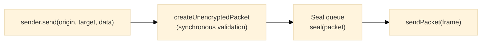

# Sender

## Purpose

The Sender module provides the outbound half of a channel: packets are assembled from an origin, a target, and a data envelope, sealed one at a time on the session's sending key, and handed to the transport as wire frames.

---

## Key Interfaces

### `Sender<T>`

```typescript
interface Sender<T = any> {
  readonly send: SendFn<T> // Builds a packet and queues it for sealing
  readonly stop: () => void // Pauses sealing (packets accumulate)
  readonly resume: () => void // Resumes sealing
  readonly queue: OutboundQueue // The packets waiting to be sealed
}
```

### `SendFn<T>`

```typescript
type SendFn<T = any> = (origin: string, target: string, data: Data<T>) => void
```

### `SendPacketFn`

Transmits a sealed frame to the transport.

```typescript
type SendPacketFn = (packet: Uint8Array) => void
```

### `OutboundQueue`

```typescript
interface OutboundQueue {
  readonly size: number // Packets waiting to be sealed
}
```

### `CreateSender<T>` and `SenderFactory`

```typescript
type CreateSender<T = any> = (
  label: string,
  sender: SendPacketFn,
  logger: Logger,
  seal: PacketSealer<T>,
  onDrop?: PacketDropHandler
) => Sender<T>

type SenderFactory = CreateSender
```

---

## Factory Functions

### `createSender`

**Location**: [`@hyperfrontend/network-protocol/browser/sender`](https://www.hyperfrontend.dev/docs/libraries/network-protocol/browser/sender/), [`@hyperfrontend/network-protocol/node/sender`](https://www.hyperfrontend.dev/docs/libraries/network-protocol/node/sender/)

| Parameter                                                                                                 | Type                                                                                                        | Description                                                                                                                    |
| --------------------------------------------------------------------------------------------------------- | ----------------------------------------------------------------------------------------------------------- | ------------------------------------------------------------------------------------------------------------------------------ |
| [`label`](https://www.hyperfrontend.dev/docs/libraries/network-protocol/#api-createSender)                | `string`                                                                                                    | Identifier for logging (a channel passes `'<label> sender'`)                                                                   |
| [`sendPacket`](https://www.hyperfrontend.dev/docs/libraries/network-protocol/#api-createSender)           | [`SendPacketFn`](https://www.hyperfrontend.dev/docs/libraries/network-protocol/#api-SendPacketFn)           | Transmits each sealed frame                                                                                                    |
| [`logger`](https://www.hyperfrontend.dev/docs/libraries/network-protocol/#api-createSender)               | [`Logger`](https://www.hyperfrontend.dev/docs/libraries/logging/#api-Logger)                                | Logger instance from [`@hyperfrontend/logging`](https://www.hyperfrontend.dev/docs/libraries/logging/)                         |
| [`seal`](https://www.hyperfrontend.dev/docs/libraries/network-protocol/#api-createSender)                 | `PacketSealer<T>`                                                                                           | The session's sealer, [`protocol.seal`](https://www.hyperfrontend.dev/docs/libraries/network-protocol/#api-Protocol-prop-seal) |
| [`onDrop`](https://www.hyperfrontend.dev/docs/libraries/network-protocol/#api-ChannelOptions-prop-onDrop) | [`PacketDropHandler`](https://www.hyperfrontend.dev/docs/libraries/network-protocol/#api-PacketDropHandler) | Optional; receives each packet the sealer rejects                                                                              |

```typescript
import { createSender } from '@hyperfrontend/network-protocol/browser/sender'

const sender = createSender(
  'host sender',
  (frame) => frameWindow.postMessage(frame, origin, [frame.buffer]),
  logger,
  protocol.seal,
  (drop) => report(drop)
)
sender.send(originId, targetId, data)
```

A channel creates its sender for you; standalone use needs a [`Protocol`](https://www.hyperfrontend.dev/docs/libraries/network-protocol/#api-Protocol) instance from a provider (see [`protocol/`](../protocol/README.md)).

---

## Outbound Pipeline



[`send`](https://www.hyperfrontend.dev/docs/libraries/network-protocol/#api-Sender) validates the origin, the target, and the data envelope synchronously and throws in the caller's frame on a malformed packet. Everything after that is asynchronous: the seal queue processes one packet at a time, and each sealed frame goes to [`sendPacket`](https://www.hyperfrontend.dev/docs/libraries/network-protocol/#api-createSender) in order.

---

## Lifecycle Management

```typescript
sender.stop() // Packets keep accumulating; nothing is sealed
sender.resume() // Accumulated packets seal in FIFO order
```

---

## Queue Monitoring

```typescript
if (sender.queue.size > 100) {
  sender.stop()
}
```

---

## Error Handling

[`send`](https://www.hyperfrontend.dev/docs/libraries/network-protocol/#api-Sender) throws for invalid input (see [`packet/`](../packet/README.md)):

```typescript
sender.send('not-a-uuid', targetId, data)
// Error: 'Cannot create a packet without a valid origin value'
```

A packet the sealer rejects is logged and reported through [`onDrop`](https://www.hyperfrontend.dev/docs/libraries/network-protocol/#api-ChannelOptions-prop-onDrop) as `{ direction: 'outbound', stage: 'seal', reason, cause, packet }`, never thrown. The reasons are those of the seal queue (see [`queue/`](../queue/README.md)); a [`cause`](https://www.hyperfrontend.dev/docs/libraries/network-protocol/#api-PacketDrop-prop-cause) that is a [`ProtocolError`](https://www.hyperfrontend.dev/docs/libraries/network-protocol/security/#api-ProtocolError) carries a code such as `counter-exhausted` or `invalid-session`.

---

## Relationship to Other Modules

- **Depends on**: [`queue/`](../queue/README.md), [`packet/`](../packet/README.md), [`@hyperfrontend/logging`](https://www.hyperfrontend.dev/docs/libraries/logging/)
- **Used by**: [`channel/`](../channel/README.md)

---

## See Also

- **[Library Index](../README.md)** - All modules
- **[Architecture Guide](../../../ARCHITECTURE.md#sender--receiver)** - Sender architecture
- **[Browser Entry](../../browser/sender/README.md)** - Browser-specific sender
- **[Node Entry](../../node/sender/README.md)** - Node.js-specific sender

### Related Modules

| Module                             | Relationship                   |
| ---------------------------------- | ------------------------------ |
| [receiver/](../receiver/README.md) | Counterpart for inbound frames |
| [channel/](../channel/README.md)   | Composes sender into channel   |
| [queue/](../queue/README.md)       | The seal queue                 |
| [packet/](../packet/README.md)     | Packet types processed         |
