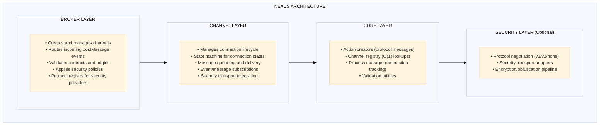
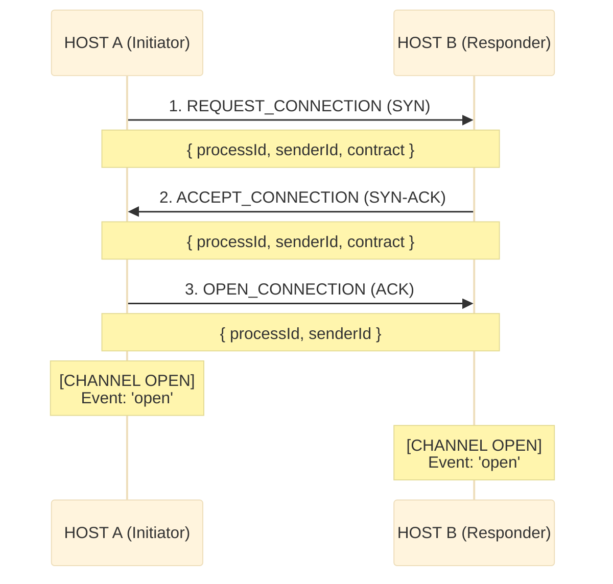
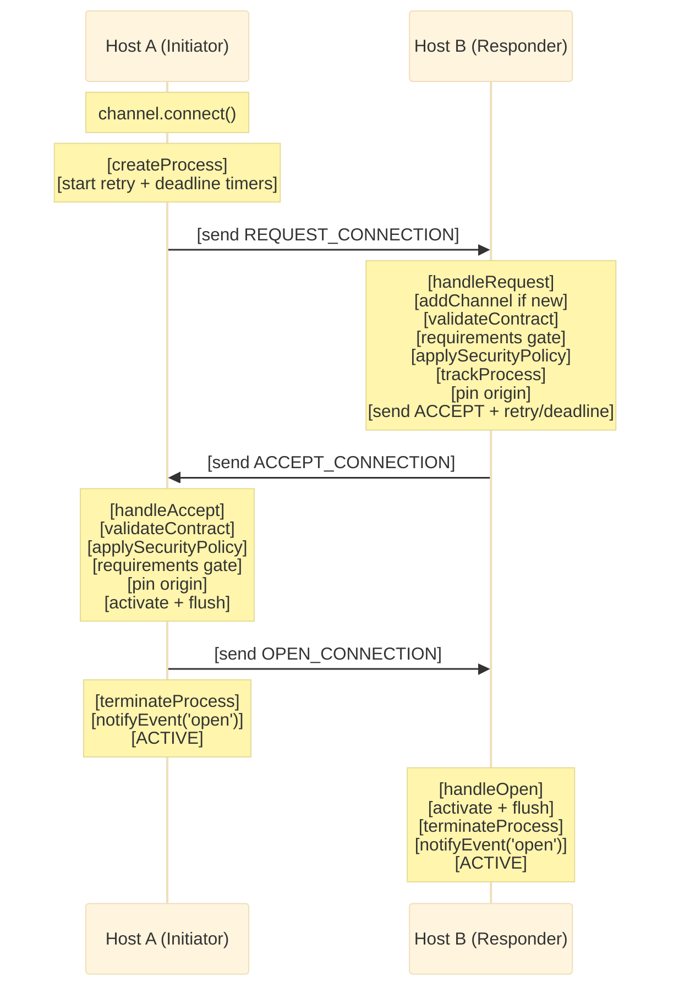
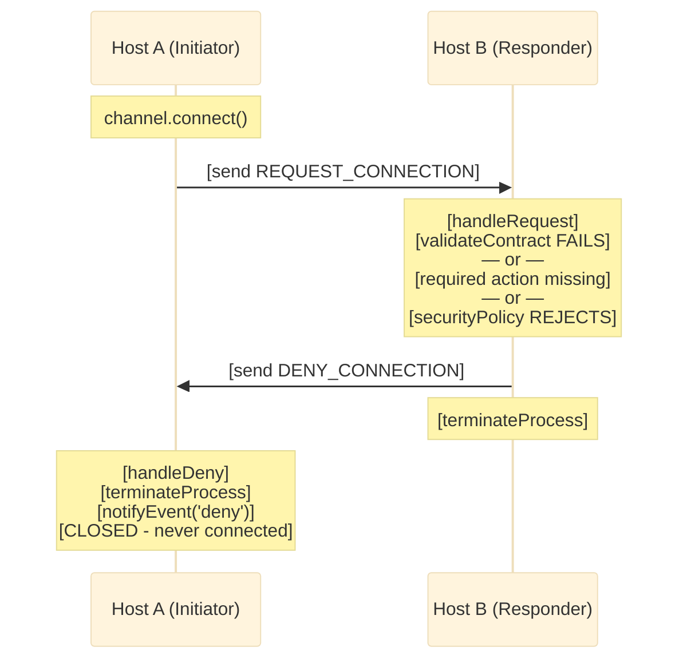
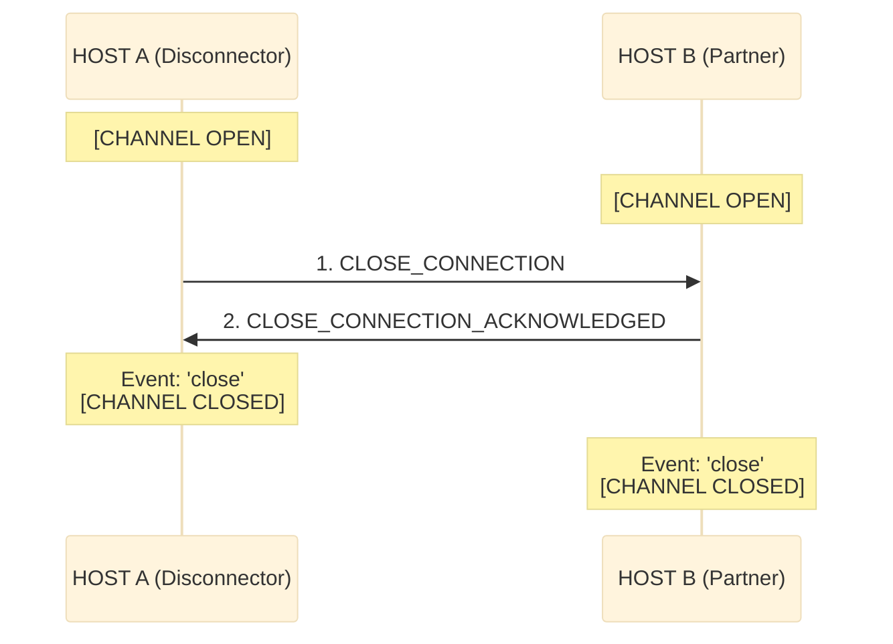
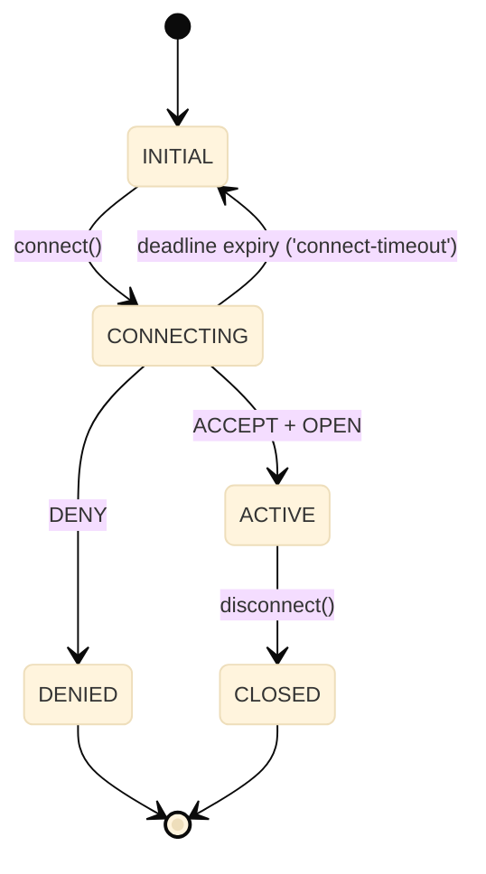
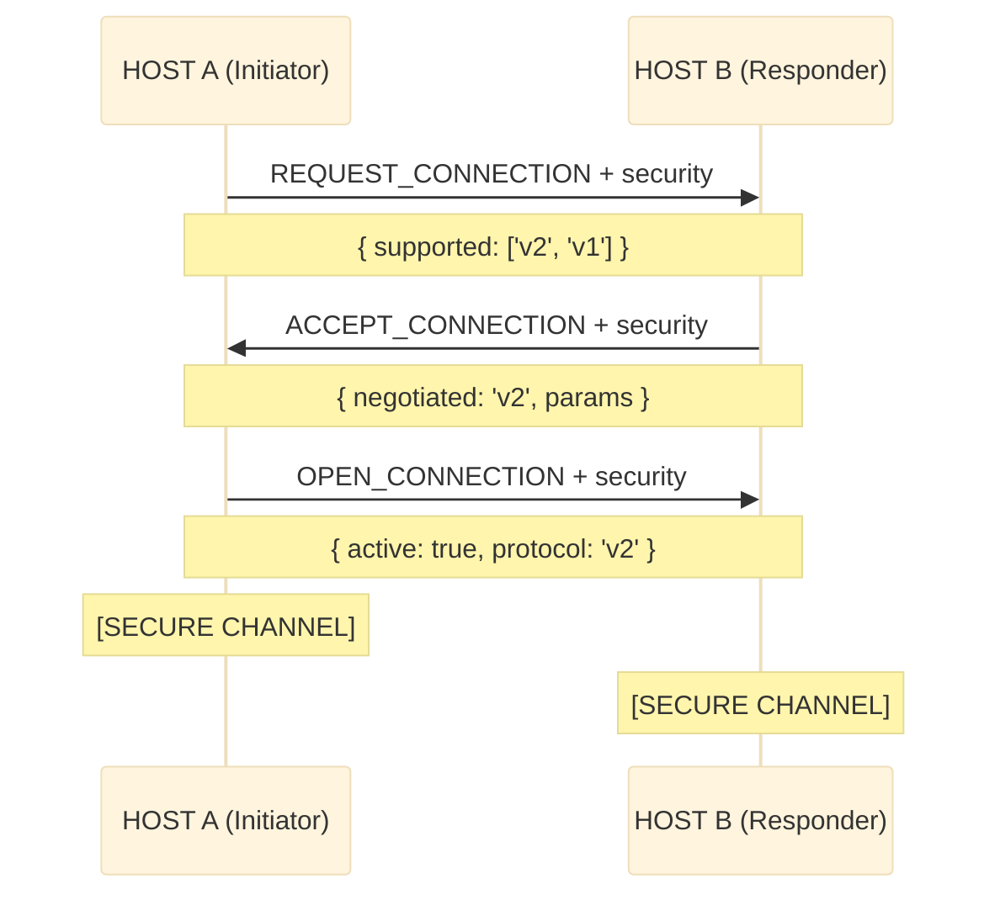
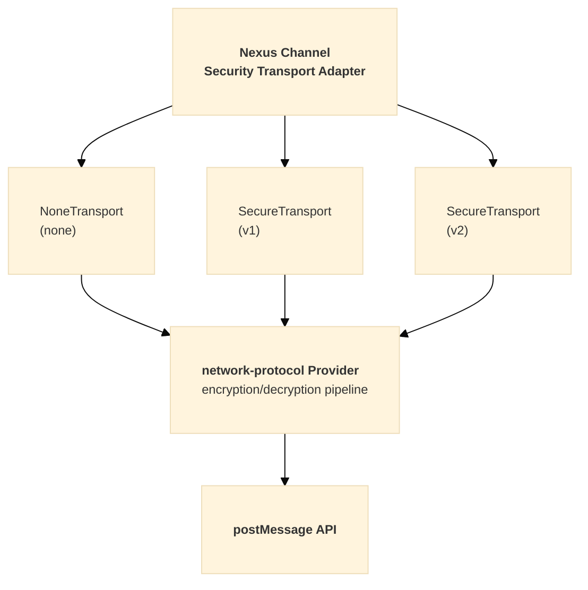

# Nexus Architecture

**Complete Overview of `@hyperfrontend/nexus`**

---

## Overview

`@hyperfrontend/nexus` is a cross-window communication library designed for micro-frontend architectures. It implements a TCP-like connection protocol over the browser's `postMessage` API, providing secure, contract-validated messaging between browser contexts (iframes, windows, and web workers).

### Target Use Cases

1. **Micro-frontend communication** — Shell applications coordinating multiple micro-apps
2. **Iframe integration** — Secure bidirectional messaging with embedded content
3. **Multi-window applications** — Communication between browser windows/tabs
4. **Plugin architectures** — Host-to-plugin communication with contract enforcement

---

## Table of Contents

1. [Architecture Overview](#architecture-overview)
2. [Design Philosophy](#design-philosophy)
3. [Module Structure](#module-structure)
4. [Core Concepts](#core-concepts)
5. [Protocol Design](#protocol-design)
6. [Handler Reference](#handler-reference)
7. [Event System](#event-system)
8. [Logging System](#logging-system)
9. [Security Model](#security-model)
10. [Internal Dependencies](#internal-dependencies)
11. [Integration Points](#integration-points)
12. [Public API Surface](#public-api-surface)

---

## Architecture Overview



---

## Design Philosophy

The library follows **functional programming principles** with factory-based architecture.

### Key Design Decisions

| Aspect               | Implementation                        | Rationale                                                  |
| -------------------- | ------------------------------------- | ---------------------------------------------------------- |
| **State Management** | Closure-based encapsulation           | True information hiding, prevents external mutation        |
| **Factory Pattern**  | `createBroker()`, `createChannel()`   | Testable, composable, no class inheritance complexity      |
| **Registry**         | Instance-based with WeakMap/Map       | O(1) lookups, memory-efficient, multiple brokers supported |
| **Process Tracking** | UUID-based ProcessManager             | Clean lifecycle management for in-flight connections       |
| **Router Pattern**   | Handler registry keyed by action type | Single responsibility, extensible protocol                 |
| **Immutability**     | `Object.freeze()`, spread patterns    | Predictable state transitions                              |

### Notable Patterns

- **Functional Core, Imperative Shell** — Pure logic in core, side effects at boundaries
- **Handler Registry** — Extensible protocol handling
- **WeakMap for Window References** — Prevents memory leaks
- **Immutable State Updates** — Predictable state transitions

---

## Module Organization

The library is organized into logical modules by responsibility:

| Module       | Responsibility                                     |
| ------------ | -------------------------------------------------- |
| **Broker**   | Central message coordinator, channel management    |
| **Channel**  | Bidirectional communication endpoints, lifecycle   |
| **Security** | Origin filtering, protocol negotiation, encryption |
| **Filters**  | Event and message filtering utilities              |
| **Schema**   | JSON Schema validation for contracts               |

---

## Core Concepts

### 1. Broker (`BrokerHandle`)

The broker is the central coordinator that:

- Manages multiple channels
- Listens for incoming `postMessage` events
- Routes messages to appropriate handlers
- Enforces security policies

```typescript
interface BrokerHandle {
  readonly id: string
  readonly name: string
  readonly contract: IChannelContract
  readonly channels: ReadonlyArray<ChannelJSON>

  addChannel(name: string, target: Window, settings?: IChannelSettings): ChannelHandle
  getChannel(reference: string | Window): ChannelHandle | null
  removeChannel(reference: string | Window): void
  setSecurityPolicy(policy: SecurityPolicy): BrokerHandle
  extendContract(contract: IChannelContract): BrokerHandle

  // Security protocol management
  registerProtocol(version: 'v1' | 'v2', provider: unknown): BrokerHandle
  unregisterProtocol(version: 'v1' | 'v2'): BrokerHandle
  hasProtocol(version: SecurityProtocolVersion): boolean
  getSupportedProtocols(): SecurityProtocolVersion[]
}
```

### 2. Channel (`ChannelHandle`)

A channel represents a communication endpoint to another window:

```typescript
interface ChannelHandle {
  readonly id: string
  readonly name: string
  readonly target: Window

  // State queries
  isActive(): boolean
  toJSON(): ChannelJSON

  // Lifecycle
  connect(): void
  disconnect(notify?: boolean): void
  cancel(notify?: boolean): void
  destroy(notify?: boolean): void

  // Communication
  send(type: string, data?: unknown): void

  // Subscriptions
  on(handler: EventHandler): () => void
  on<E extends ChannelEvent>(event: E, handler: EventCallbackMap[E]): () => void
  onMessage(handler: MessageHandler): () => void
}
```

### 3. Contract (`IChannelContract`)

Contracts define the messaging agreement between parties:

```typescript
interface IChannelContract {
  emitted: IActionDescription[] // Message types this party sends
  accepted: IActionDescription[] // Message types this party receives
}

interface IActionDescription {
  type: string // Message type identifier
  description?: string // Human-readable description
  schema?: object // Optional JSON Schema for validation
  required?: boolean // Accepted entries only: deny the connection unless the peer emits this type
}
```

Contracts are exchanged during the handshake. Unknown inbound types are dropped and logged; only `accepted` entries flagged `required` gate the connection (the peer must emit them), so additive contract evolution is non-breaking in both directions.

### 4. Actions (Protocol Messages)

The protocol defines 11 action types for connection lifecycle:

| Action Type                      | Purpose                     |
| -------------------------------- | --------------------------- |
| `REQUEST_CONNECTION`             | Initiate connection (SYN)   |
| `ACCEPT_CONNECTION`              | Accept connection (SYN-ACK) |
| `OPEN_CONNECTION`                | Confirm connection (ACK)    |
| `DENY_CONNECTION`                | Reject connection (RST)     |
| `CANCEL_CONNECTION`              | Cancel pending connection   |
| `CANCEL_CONNECTION_ACKNOWLEDGED` | Acknowledge cancellation    |
| `CLOSE_CONNECTION`               | Graceful disconnect         |
| `CLOSE_CONNECTION_ACKNOWLEDGED`  | Acknowledge disconnect      |
| `DESTROY_CONNECTION`             | Force disconnect            |
| `NEW_MESSAGE`                    | User data transmission      |
| `INVALID_REQUEST`                | Protocol violation          |

---

## Protocol Design

### Three-Way Handshake

Nexus implements a TCP-like handshake for reliable connection establishment:



Initiation is symmetric — either side may `connect()` first, and simultaneous requests (glare) resolve by broker-id tie-break (the lower id yields and answers as responder). Pending REQUEST/ACCEPT frames are re-sent every `requestRetryMs` until answered; all three handshake messages are idempotent under replay. A handshake that stays unanswered past `connectTimeoutMs` fires `connect-timeout` and leaves the channel inactive, reconnectable, with queued messages retained. Each side pins the counterpart's origin during the handshake; subsequent sends target the pin and mismatched inbound origins are dropped.

**Internal Sequence:**



### Denial Flow

When a connection is rejected (invalid contract or security policy failure):



### Graceful Disconnection



### State Transitions



---

## Handler Reference

Each protocol action is processed by a dedicated handler. All handlers receive the broker state, channel registry, process manager, and incoming message.

| Handler                    | Responsibilities                                                                                                                                                                   |
| -------------------------- | ---------------------------------------------------------------------------------------------------------------------------------------------------------------------------------- |
| `handleRequest`            | Enforce origin pin, resolve glare/reload, validate contract + requirements, apply policy, track process, pin origin, send ACCEPT with retry/deadline (or schedule until connect()) |
| `handleAccept`             | Resolve by process or source window, enforce origin pin, validate contract + requirements, apply policy, activate + flush, send OPEN, notify 'open'                                |
| `handleOpen`               | Activate from the pending accept, flush queue, terminate process, notify 'open' (responder side)                                                                                   |
| `handleDeny`               | Abandon the pending request (stop retrying), terminate process, notify 'deny' with error context                                                                                   |
| `handleCancel`             | Cancel channel, send CANCEL_ACK, notify 'cancel'                                                                                                                                   |
| `handleCancelAcknowledged` | Terminate process, notify 'cancel' (initiator side)                                                                                                                                |
| `handleClose`              | Disconnect channel, send CLOSE_ACK, notify 'close'                                                                                                                                 |
| `handleCloseAcknowledged`  | Terminate process, notify 'close' (initiator side)                                                                                                                                 |
| `handleMessage`            | Validate payload, forward to subscribers via `notifyMessage()`                                                                                                                     |
| `handleDestroy`            | Force-destroy connection, clean up resources                                                                                                                                       |
| `handleInvalid`            | Log invalid requests, optionally notify sender — see [handle-invalid.ts](https://github.com/AndrewRedican/hyperfrontend/blob/main/libs/nexus/src/broker/routing/handle-invalid.ts) |

---

## Event System

Channels emit lifecycle events to subscribers. Each event has a specific trigger and payload structure.

### Lifecycle Events

| Event               | Trigger                                   | Payload                |
| ------------------- | ----------------------------------------- | ---------------------- |
| `'open'`            | Connection successfully established       | `{ origin, contract }` |
| `'close'`           | Connection gracefully closed              | `{ notify: boolean }`  |
| `'cancel'`          | Pending connection cancelled              | `{ notify: boolean }`  |
| `'deny'`            | Connection request rejected               | `{ error, origin }`    |
| `'connect-timeout'` | Handshake deadline expired with no answer | `{ elapsedMs }`        |
| `'destroy'`         | Connection force-destroyed                | `{}`                   |

### Security Events

| Event                 | Payload                     | Description                    |
| --------------------- | --------------------------- | ------------------------------ |
| `security-negotiated` | `{ protocol, isPreferred }` | Protocol negotiation completed |
| `security-ready`      | `{ protocol }`              | Security transport is active   |
| `security-error`      | `{ message, code, cause? }` | Security operation failed      |

### Event Subscription

```typescript
// Subscribe to a specific event (recommended)
channel.on('open', (data) => console.log('Opened:', data.origin))
channel.on('close', (data) => console.log('Closed'))
channel.on('security-ready', (data) => console.log(`Secure channel using ${data.protocol}`))

// Subscribe to all events (for generic handling)
channel.on((event, data) => {
  switch (event) {
    case 'open':
      console.log(`Connected to ${data.origin}`)
      break
    case 'close':
      console.log('Connection closed')
      break
  }
})

// Use filter utilities for advanced composition
import { openFilter, closeFilter } from '@hyperfrontend/nexus/filters'

channel.on(openFilter((data) => console.log('Opened:', data.origin)))
channel.on(closeFilter((data) => console.log('Closed')))
```

---

## Logging System

Nexus provides a configurable logging system that routes all internal output through a `Logger` interface from `@hyperfrontend/logging`.

### Logger Interface

```typescript
interface Logger {
  error(...args: unknown[]): void
  warn(...args: unknown[]): void
  log(...args: unknown[]): void
  info(...args: unknown[]): void
  debug(...args: unknown[]): void
  setLogLevel(level: LogLevel): void
  getLogLevel(): LogLevel
}

type LogLevel = 'error' | 'warn' | 'log' | 'info' | 'debug' | 'none'
```

### Logger Flow

1. **Broker initialization** — `createBroker()` creates or adopts a logger based on `settings.logLevel` and `settings.logger`
2. **Channel inheritance** — Channels created via `broker.addChannel()` inherit the broker's logger
3. **RoutingContext** — All routing handlers receive the logger via `RoutingContext`

### RoutingContext

All routing handlers receive a `RoutingContext` object containing shared dependencies:

```typescript
interface RoutingContext {
  readonly state: BrokerState // Immutable broker state snapshot
  readonly registry: Registry // Channel registry for lookups
  readonly processManager: ProcessManager // Tracks handshake processes
  readonly actions: ActionCreators // Factory functions for protocol actions
  readonly logger: Logger // Logger instance for this broker
}
```

This pattern:

- Eliminates parameter proliferation across handlers
- Makes testing straightforward (mock the context)
- Provides clean access to logger without prop drilling

### Structured Logging Utilities

| Utility     | Purpose                         | Output Format                                 |
| ----------- | ------------------------------- | --------------------------------------------- |
| `logAction` | Protocol action tracing         | `[nexus] Action <direction>: <type> <action>` |
| `logEvent`  | Channel lifecycle event logging | `[nexus] Channel event: <event> <data>`       |

### createLogger Factory

```typescript
import { createLogger, type NexusLoggerOptions } from '@hyperfrontend/nexus'

interface NexusLoggerOptions {
  level?: LogLevel // Default: 'error'
  prefix?: string // Default: '[nexus]'
  customLogger?: Logger // Use this logger directly if provided
}

const logger = createLogger({ level: 'debug', prefix: '[app]' })
```

---

## Security Model

Nexus provides a multi-layered security approach:

### Layer 1: Origin Filtering

Basic origin-based access control:

```typescript
const broker = createBroker({
  settings: {
    whitelist: ['https://trusted.com'],
    blacklist: ['https://malicious.com'],
  },
})
```

### Layer 2: Security Policy

Custom programmatic validation:

```typescript
broker.setSecurityPolicy((event: MessageEvent) => {
  return event.origin.endsWith('.mycompany.com')
})
```

### Layer 3: Contract Validation

Schema-based message validation:

```typescript
const contract: IChannelContract = {
  emitted: [
    {
      type: 'USER_DATA',
      schema: {
        type: 'object',
        properties: {
          userId: { type: 'string' },
          email: { type: 'string', format: 'email' },
        },
        required: ['userId'],
      },
    },
  ],
  accepted: [{ type: 'ACK' }],
}
```

### Layer 4: Transport Security (Optional)

End-to-end encryption via `@hyperfrontend/network-protocol`:

| Protocol | Description                                 | Use Case             |
| -------- | ------------------------------------------- | -------------------- |
| `none`   | Passthrough, no encryption                  | Trusted environments |
| `v1`     | Obfuscation-first with dynamic key exchange | Basic protection     |
| `v2`     | Pre-shared key with dynamic key rotation    | High security        |

#### Security Negotiation Flow

During connection handshake, parties negotiate the security protocol:



#### Security Transport Architecture



#### Configuration Examples

```typescript
// Register protocol at broker level
broker.registerProtocol('v2', createProtocol(logger, 'shared-key', 60))

// Override per-channel
const channel = broker.addChannel('secure', targetWindow, {
  security: {
    protocol: 'v2',
    sharedKey: 'channel-specific-key',
    refreshRate: 30,
  },
})

// Protocol registry API
broker.hasProtocol('v2') // true
broker.getSupportedProtocols() // ['v2', 'none']
broker.unregisterProtocol('v2') // Remove provider
```

---

## Internal Dependencies

### Hyperfrontend Libraries

```json
{
  "@hyperfrontend/function-utils": "0.0.0",
  "@hyperfrontend/logging": "0.0.0",
  "@hyperfrontend/random-generator-utils": "0.0.0"
}
```

### External Dependencies

```json
{
  "jsonschema": "1.5.0"
}
```

### Optional Integration

- `@hyperfrontend/network-protocol` — For transport-level security (v1/v2 protocols)

---

## Integration Points

### With Other Hyperfrontend Libraries

| Library                                 | Integration                            |
| --------------------------------------- | -------------------------------------- |
| `@hyperfrontend/network-protocol`       | Optional transport security            |
| `@hyperfrontend/logging`                | Logging infrastructure                 |
| `@hyperfrontend/random-generator-utils` | UUID generation                        |
| `@hyperfrontend/function-utils`         | Utility functions                      |
| `@hyperfrontend/state-machine`          | Potential state management enhancement |

### With External Systems

- **Micro-frontend frameworks** — Module federation, single-spa
- **Web workers** — Worker-to-main thread communication
- **Service workers** — Offline-capable messaging
- **Electron** — Main-renderer process communication

---

## Public API Surface

### Exports from `@hyperfrontend/nexus`

```typescript
// Core factories
export { createBroker } from './broker'
export { createChannel } from './channel'
export { mergeContracts } from './setup'
export { broker as defaultBroker, DEFAULT_CONTRACT } from './singleton'

// Broker types
export type { BrokerHandle, BrokerConfig, BrokerSettings, BrokerState, SecurityPolicy }

// Channel types
export type { ChannelHandle, ChannelJSON, IChannelSettings, IChannelConfig }

// Contract types
export type { IChannelContract, IActionDescription }

// Message types
export type { IMessage, MessageEnvelope }

// Event types
export type { ChannelEvent, EventData, OpenEventData, CloseEventData, ... }

// Action types
export type { IAction, ActionType }

// Filter utilities
export { openFilter, closeFilter, cancelFilter, denyFilter, invalidFilter, createEventFilter }
export { byType, compose, createMessageFilter }
export type { MessageFilter, MessagePredicate, MessageHandler, EventHandler }

// Logging
export { createLogger, logAction, logEvent } from './utils/logging'
export type { Logger, LogLevel, NexusLoggerOptions }
```
