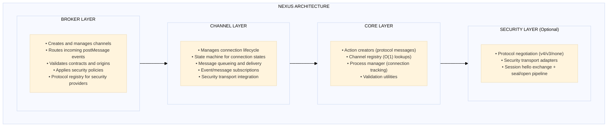
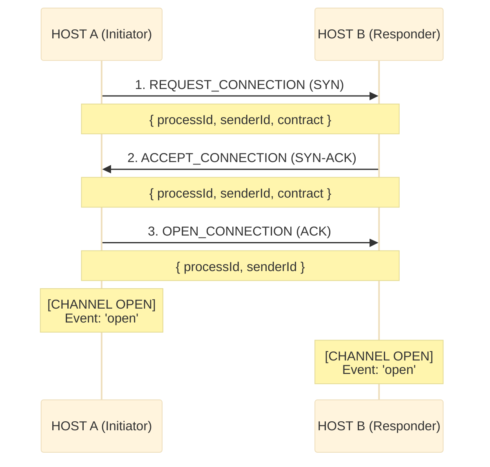
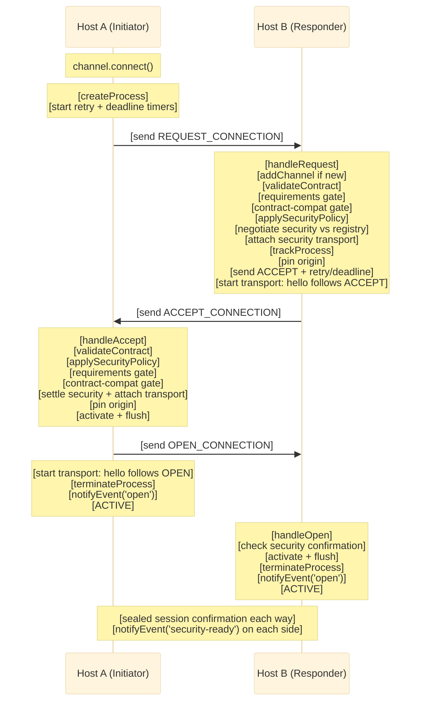
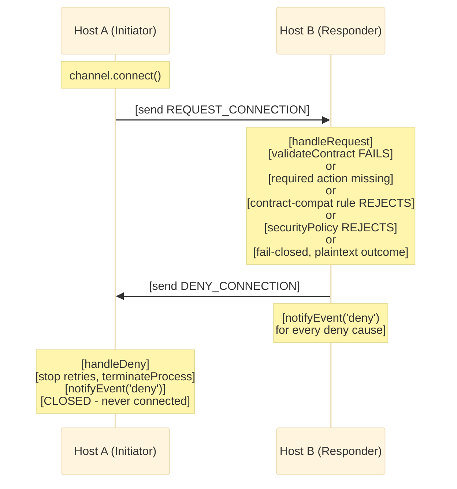
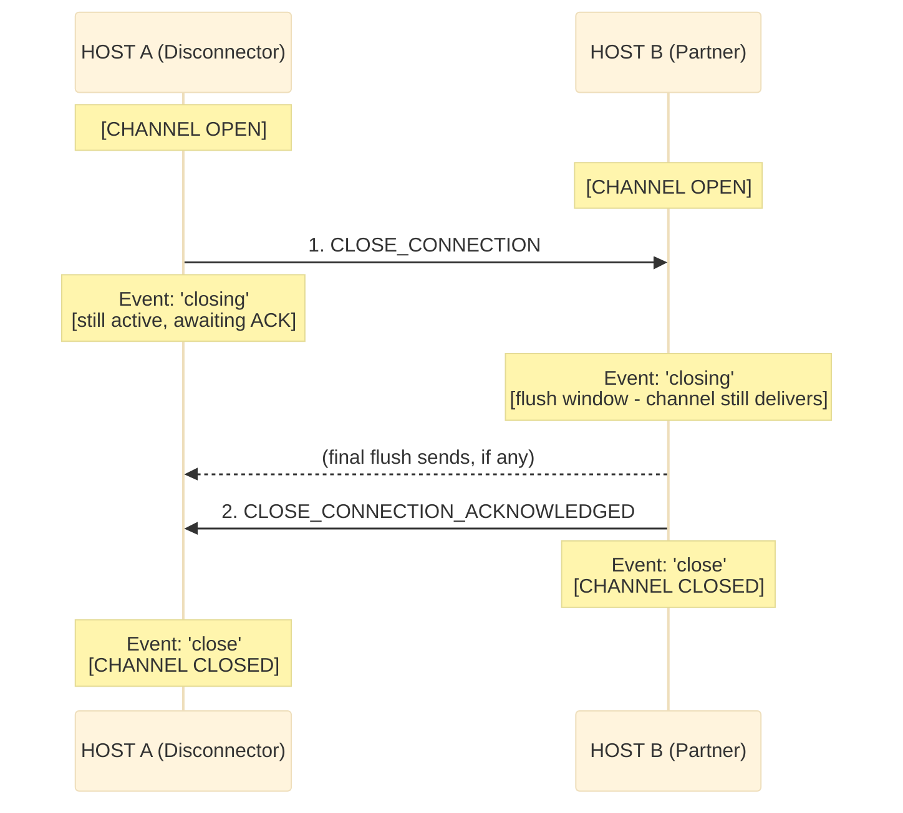
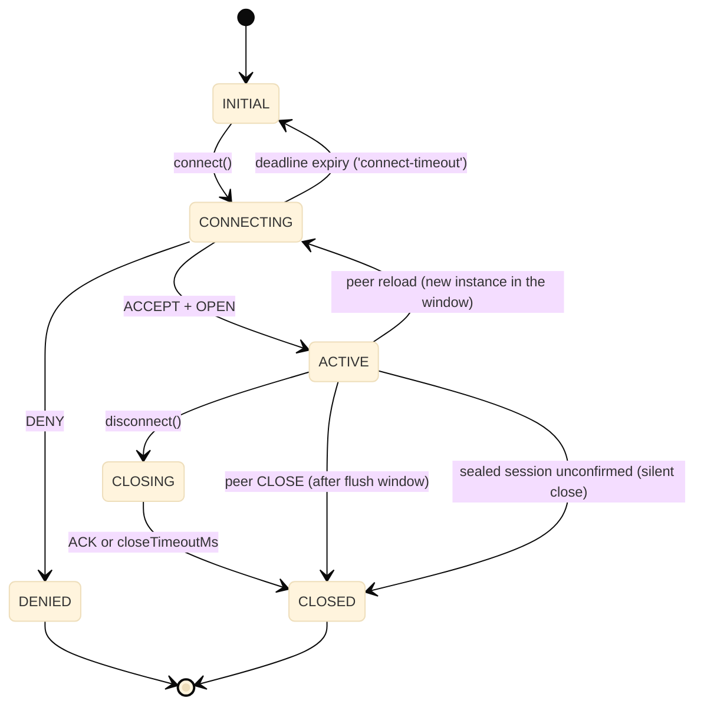
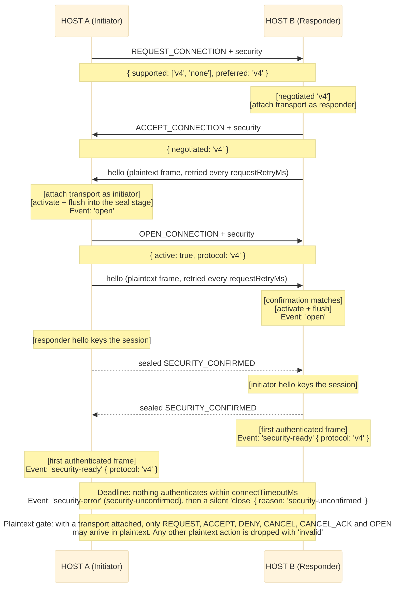
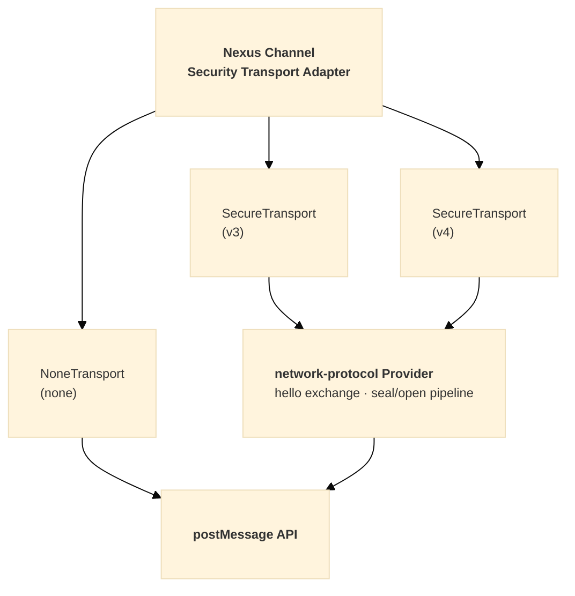

# Nexus Architecture

**Complete Overview of `@hyperfrontend/nexus`**

---

## Overview

`@hyperfrontend/nexus` is a cross-window communication library designed for micro-frontend architectures. It implements a TCP-like connection protocol over the browser's `postMessage` API, providing secure, contract-validated messaging between browser contexts (iframes, windows, and web workers).

### Target Use Cases

1. **Micro-frontend communication**: Host applications coordinating multiple micro-apps
2. **Iframe integration**: Secure bidirectional messaging with embedded content
3. **Multi-window applications**: Communication between browser windows/tabs
4. **Plugin architectures**: Host-to-plugin communication with contract enforcement

---

## Table of Contents

1. [Architecture Overview](#architecture-overview)
2. [Design Philosophy](#design-philosophy)
3. [Module Organization](#module-organization)
4. [Core Concepts](#core-concepts)
5. [Protocol Design](#protocol-design)
6. [Handler Reference](#handler-reference)
7. [Event System](#event-system)
8. [Logging System](#logging-system)
9. [Security Model](#security-model)
10. [Internal Dependencies](#internal-dependencies)
11. [Integration Points](#integration-points)
12. [Public API Surface](#public-api-surface)
13. [Links](#links)

---

## Architecture Overview



---

## Design Philosophy

The library follows **functional programming principles** with factory-based architecture.

### Key Design Decisions

| Aspect               | Implementation                        | Rationale                                                  |
| -------------------- | ------------------------------------- | ---------------------------------------------------------- |
| **State Management** | Closure-based encapsulation           | True information hiding, prevents external mutation        |
| **Factory Pattern**  | `createBroker()`, `createChannel()`   | Testable, composable, no class inheritance complexity      |
| **Registry**         | Instance-based with WeakMap/Map       | O(1) lookups, memory-efficient, multiple brokers supported |
| **Process Tracking** | UUID-based ProcessManager             | Clean lifecycle management for in-flight connections       |
| **Router Pattern**   | Handler registry keyed by action type | Single responsibility, extensible protocol                 |
| **Immutability**     | `Object.freeze()`, spread patterns    | Predictable state transitions                              |

### Notable Patterns

- **Functional Core, Imperative Shell**: Pure logic in core, side effects at boundaries
- **Handler Registry**: Extensible protocol handling
- **WeakMap for Window References**: Prevents memory leaks
- **Immutable State Updates**: Predictable state transitions

---

## Module Organization

The library is organized into logical modules by responsibility:

| Module       | Responsibility                                           |
| ------------ | -------------------------------------------------------- |
| **Broker**   | Central message coordinator, channel management          |
| **Channel**  | Bidirectional communication endpoints, lifecycle         |
| **Security** | Origin filtering, protocol negotiation, sealed transport |
| **Filters**  | Event and message filtering utilities                    |
| **Schema**   | JSON Schema validation for contracts                     |

---

## Core Concepts

### 1. Broker (`BrokerHandle`)

The broker is the central coordinator that:

- Manages multiple channels
- Listens for incoming `postMessage` events
- Routes messages to appropriate handlers
- Enforces security policies

```typescript
interface BrokerHandle {
  readonly id: string
  readonly name: string
  readonly contract: IChannelContract
  readonly settings: BrokerSettings
  readonly channels: ReadonlyArray<ChannelJSON>
  readonly acceptedActionTypes: readonly string[]
  readonly logger: Logger

  addChannel(name: string, target: Window, settings?: Record<string, unknown>): ChannelHandle
  getChannel(reference: string | Window): ChannelHandle | null
  removeChannel(reference: string | Window): void
  setSecurityPolicy(policy: SecurityPolicy): BrokerHandle
  extendContract(contract: IChannelContract): BrokerHandle
  toJSON(): Record<string, unknown>

  // Security protocol management
  registerProtocol(version: SecurityProtocolVersion, provider: SecurityProvider): BrokerHandle
  unregisterProtocol(version: SecurityProtocolVersion): BrokerHandle
  hasProtocol(version: SecurityProtocolVersion): boolean
  getSupportedProtocols(): SecurityProtocolVersion[]
}
```

### 2. Channel (`ChannelHandle`)

A channel represents a communication endpoint to another window:

```typescript
interface ChannelHandle {
  readonly id: string
  readonly name: string
  readonly target: Window

  // State queries
  isActive(): boolean
  toJSON(): ChannelJSON

  // Lifecycle
  connect(): void
  disconnect(notify?: boolean): void
  cancel(notify?: boolean): void
  destroy(notify?: boolean): void

  // Communication
  send(type: string, data?: unknown): void

  // Subscriptions
  on(handler: EventHandler): () => void
  on<E extends ChannelEvent>(event: E, handler: EventCallbackMap[E]): () => void
  onMessage(handler: MessageHandler): () => void
}
```

### 3. Contract (`IChannelContract`)

Contracts define the messaging agreement between parties:

```typescript
interface IChannelContract {
  emitted: IActionDescription[] // Message types this party sends
  accepted: IActionDescription[] // Message types this party receives
  version?: string // Optional version announcement crossed during the handshake
}

interface IActionDescription {
  type: string // Message type identifier
  description?: string // Human-readable description
  schema?: object // Optional JSON Schema for validation
  required?: boolean // Accepted entries only: deny the connection unless the peer emits this type
}
```

Contracts are exchanged during the handshake. Unknown inbound types are dropped and logged; only `accepted` entries flagged `required` gate the connection (the peer must emit them), so additive contract evolution is non-breaking in both directions. See [Contract Compatibility](#contract-compatibility) for the full gating rules, including the optional `version` announcement and the channel-supplied `contractCompat` rule.

### 4. Actions (Protocol Messages)

The protocol defines 12 action types for connection lifecycle:

| Action Type                      | Purpose                                                               |
| -------------------------------- | --------------------------------------------------------------------- |
| `REQUEST_CONNECTION`             | Initiate connection (SYN)                                             |
| `ACCEPT_CONNECTION`              | Accept connection (SYN-ACK)                                           |
| `OPEN_CONNECTION`                | Confirm connection (ACK)                                              |
| `DENY_CONNECTION`                | Reject connection (RST)                                               |
| `CANCEL_CONNECTION`              | Cancel pending connection                                             |
| `CANCEL_CONNECTION_ACKNOWLEDGED` | Acknowledge cancellation                                              |
| `CLOSE_CONNECTION`               | Graceful disconnect                                                   |
| `CLOSE_CONNECTION_ACKNOWLEDGED`  | Acknowledge disconnect                                                |
| `DESTROY_CONNECTION`             | Force disconnect                                                      |
| `NEW_MESSAGE`                    | User data transmission                                                |
| `INVALID_REQUEST`                | Protocol violation                                                    |
| `SECURITY_CONFIRMED`             | Sealed session confirmation (consumed by the transport, never routed) |

The first six are the handshake actions and always travel in plaintext; once a channel has a security transport, every other action crosses the wire sealed (see [Layer 4](#layer-4-transport-security-optional)).

---

## Protocol Design

### Three-Way Handshake

Nexus implements a TCP-like handshake for reliable connection establishment:



Initiation is symmetric: either side may `connect()` first, and simultaneous requests (glare) resolve by broker-id tie-break (the lower id yields and answers as responder). Pending REQUEST/ACCEPT frames are re-sent every `requestRetryMs` (default 500 ms) until answered; all three handshake messages are idempotent under replay. A handshake that stays unanswered past `connectTimeoutMs` (default 10 000 ms) fires `connect-timeout` and leaves the channel inactive, reconnectable, with queued messages retained. Each side pins the counterpart's origin during the handshake; subsequent sends target the pin and mismatched inbound origins are dropped. A channel can also be pre-pinned via the `origin` setting before the first message leaves.

**Internal Sequence:**



### Instance Identity

Every broker mints a UUID when it boots and stamps it on every action it sends (`senderId`).
It is a machine identity, not a label (the broker's `name` is the readable one), and it does
three jobs a name cannot: it is the endpoint identifier the encrypted wire format requires
(each packet carries the sender's and the target's id, both validated as UUID v4), the ordinal
that settles glare without an extra round trip, and the identity of one **incarnation** of the
counterpart.

That last job matters because a window outlives the documents loaded into it. Routing resolves
an inbound frame by its source window, which identifies the window, not what is running inside
it. So the channel records the counterpart's id at handshake time (`peerId`, exposed on
`ChannelJSON`) and, while a session is open, ignores frames stamped with any other id: product
messages, CLOSE, CANCEL, DESTROY, and the OPEN that completes a handshake. Traffic left over
from a document that has been replaced is dropped instead of entering the session that
replaced it.

REQUEST is the exception, because it is how a new incarnation announces itself. A REQUEST
carrying a different id on a connected channel means the window reloaded (or navigated
in-frame): the session it belonged to ends silently. `close` fires with
`reason: 'peer-reload'` so subscribers can drop session-scoped state, and the same channel
re-handshakes with the new instance. The channel is never removed, and security and contract
compatibility are renegotiated from scratch; only the origin pin carries over.

The id is cooperative, not a credential: any script that can post to the window can claim one,
so the check is a correctness mechanism (and a hurdle for a co-resident script that has never
observed the id), while origin pinning stays the boundary. Inside a sealed envelope it is
authenticated, because producing a frame at all requires the session keys.

### Contract Compatibility

Both sides exchange contracts during the handshake. Vocabulary differences never gate the connection: only `accepted` entries flagged `required: true` do, and each must appear in the counterpart's `emitted` list or the connection is denied with `Incompatible contract: missing required actions …`. This keeps additive contract evolution non-breaking in both directions:

| Situation                               | Fatal? | Handling                                              |
| --------------------------------------- | ------ | ----------------------------------------------------- |
| Peer emits a type outside my vocabulary | No     | Dropped and logged at receive                         |
| I accept a type the peer never emits    | No     | Nothing: dormant vocabulary                           |
| I emit a type the peer does not accept  | No     | Peer drops it; the peer's own `required` flags decide |
| I require an input the peer never emits | Yes    | Connection denied at handshake time                   |

A contract may also carry an optional `version` string. Nexus attaches no semantics to it; supply a `contractCompat` rule in the channel settings to decide whether two contracts may interoperate:

```typescript
const channel = broker.addChannel('partner', partnerWindow, {
  contractCompat: (own, peer) =>
    own.version === peer.version ? { compatible: true } : { compatible: false, reason: `${own.version} does not match ${peer.version}` },
})
```

The rule runs at the same handshake gate as the required-actions check, on whichever side holds it, receiving the local contract and the counterpart's. On the responder (REQUEST time) an incompatible result sends DENY with the rule's reason and `reason: 'incompatible-contract'`, so the `deny` event fires on both the denying responder and the denied initiator. On the initiator (ACCEPT time) an incompatible result aborts the handshake: the initiator fires its own `deny` event with the same reason and sends CANCEL to the counterpart, which observes a `cancel`, not a `deny`.

### Denial Flow

When a connection is rejected during REQUEST handling:



Every gate carries a machine-readable `reason` (`'invalid-contract'`, `'missing-required-actions'`, `'policy-rejected'`, `'incompatible-contract'`, or `'security-unavailable'`) alongside the human-readable `error`, and every gate fires the denial locally on the responder as a `deny` event. A denying side is never left waiting on a channel it refused: without the local event, a responder that yielded the glare tie-break has already cleared its handshake timers and would see neither `deny` nor `connect-timeout`. The local event fires once per handshake process: the initiator retries REQUEST while pending, and each retry is answered with another DENY frame without re-notifying the responder's subscribers. On the initiator, `handleDeny` stops the request retries and removes the tracked process, so duplicate DENY frames are no-ops and the `deny` event fires once.

The DENY frame discloses less than the local event for one gate. A policy rejection tells the refused requester only `error: 'Not accepted.'` with no `reason`, because naming the gate would tell an origin the policy just refused how this side judges connections; the local event names the rejected origin and carries `reason: 'policy-rejected'`. The other gates disclose the same `error` and `reason` both ways: an invalid or under-specified contract is the requester's own artifact, so the detail is actionable on both ends.

### Cancellation Flow

Either party can cancel before the connection completes: CANCEL_CONNECTION is answered with CANCEL_CONNECTION_ACKNOWLEDGED, and both sides fire the `cancel` event. The initiator-side gates that run at ACCEPT time (invalid contract, missing required actions, security policy, contract compatibility, fail-closed security) also abort through this verb: the aborting initiator sends CANCEL to the counterpart, logs an operator warning naming the channel, and fires a local `deny` with the gate's reason, once per handshake process, so a replayed ACCEPT that raced the CANCEL does not notify twice. The counterpart observes a `cancel`, not a `deny`: an aborted acceptance is indistinguishable on the wire from any other cancellation.

### Graceful Disconnection



The polite close is a flush-then-confirm exchange. The disconnector posts CLOSE, fires
`closing` (`{ initiatedLocally: true }`), and stays active so the partner's final sends
still deliver; its single `close` fires only when the acknowledgement arrives, or when
`closeTimeoutMs` (default 2 s) expires, so an unresponsive partner cannot hold the channel
open. The partner fires `closing` (`{ initiatedLocally: false }`) while the channel still
delivers (subscribers may synchronously send final messages, which arrive before the
acknowledgement), then acknowledges, deactivates, and fires its single `close`. New sends
issued after a close was proposed queue for the next connection instead of racing the CLOSE.
Simultaneous polite closes (close glare) acknowledge each other and still fire exactly one
`closing` and one `close` per side. `destroy()` remains the immediate, unacknowledged
teardown.

### State Transitions



---

## Handler Reference

Each protocol action is processed by a dedicated handler. All handlers receive the broker state, channel registry, process manager, and incoming message.

| Handler                    | Responsibilities                                                                                                                                                                                                                                                                                                                                                                                                                                                                                                                                                                                                                                                          |
| -------------------------- | ------------------------------------------------------------------------------------------------------------------------------------------------------------------------------------------------------------------------------------------------------------------------------------------------------------------------------------------------------------------------------------------------------------------------------------------------------------------------------------------------------------------------------------------------------------------------------------------------------------------------------------------------------------------------- |
| `handleRequest`            | Enforce origin pin, resolve glare/reload (a new instance in the window ends the stale session with `reason: 'peer-reload'`), validate contract + requirements + compat rule, apply policy, negotiate security against the protocol registry (a channel that selected a protocol offers that protocol or plaintext only; deny fail-closed plaintext outcomes, firing the local 'deny' once per process), attach the security transport before ACCEPT leaves (a scheduled answer attaches it when connect() composes the ACCEPT), track process, pin origin, send ACCEPT with retry/deadline (or schedule until connect()), start the transport so the hello follows ACCEPT |
| `handleAccept`             | Resolve by process or source window, enforce origin pin, drop an ACCEPT that does not answer the pending request (with an 'invalid' event), validate contract + requirements + compat rule, apply policy, settle security (a protocol other than the one the channel asked for counts as plaintext) and attach the transport before OPEN leaves (abort fail-closed plaintext outcomes via CANCEL + local 'deny'), activate + flush (queued traffic waits in the seal stage until keyed), send OPEN confirming the security outcome, start the transport so the hello follows OPEN, notify 'open'                                                                          |
| `handleOpen`               | Ignore an OPEN from another instance (leaving the process intact), check the initiator's confirmation against the negotiated protocol (keep the transport attached at ACCEPT time when it matches; release it and record plaintext otherwise, refusing fail-closed outcomes via CANCEL + local 'deny'), activate from the pending accept, flush queue, terminate process, notify 'open' (responder side)                                                                                                                                                                                                                                                                  |
| `handleDeny`               | Abandon the pending request (stop retrying), terminate process, notify 'deny' with error context                                                                                                                                                                                                                                                                                                                                                                                                                                                                                                                                                                          |
| `handleCancel`             | Ignore a CANCEL from another instance, else cancel channel, send CANCEL_ACK, notify 'cancel'                                                                                                                                                                                                                                                                                                                                                                                                                                                                                                                                                                              |
| `handleCancelAcknowledged` | Terminate process, notify 'cancel' (initiator side)                                                                                                                                                                                                                                                                                                                                                                                                                                                                                                                                                                                                                       |
| `handleClose`              | Ignore a CLOSE from another instance, else notify 'closing' (flush window, channel still active), send CLOSE_ACK, then deactivate and notify a single 'close'                                                                                                                                                                                                                                                                                                                                                                                                                                                                                                             |
| `handleCloseAcknowledged`  | Complete the initiator's polite close: deactivate, terminate process, notify its single 'close' (ignores stray acks for channels not closing)                                                                                                                                                                                                                                                                                                                                                                                                                                                                                                                             |
| `handleMessage`            | Drop and log messages from another instance, validate payload, forward to subscribers via `notifyMessage()`                                                                                                                                                                                                                                                                                                                                                                                                                                                                                                                                                               |
| `handleDestroy`            | Ignore a DESTROY from another instance, else force-destroy connection, clean up resources                                                                                                                                                                                                                                                                                                                                                                                                                                                                                                                                                                                 |
| `handleInvalid`            | Log invalid requests, optionally notify sender: see [handle-invalid.ts](https://github.com/AndrewRedican/hyperfrontend/blob/main/libs/nexus/src/broker/routing/handle-invalid.ts)                                                                                                                                                                                                                                                                                                                                                                                                                                                                                         |

---

## Event System

Channels emit lifecycle events to subscribers. Each event has a specific trigger and payload structure.

### Lifecycle Events

| Event               | Trigger                                           | Payload                         |
| ------------------- | ------------------------------------------------- | ------------------------------- |
| `'open'`            | Connection successfully established               | `{ origin, contract }`          |
| `'closing'`         | Polite close proposed; channel still delivers     | `{ initiatedLocally: boolean }` |
| `'close'`           | Close completed (fires once per side)             | `{ notify: boolean, reason? }`  |
| `'cancel'`          | Pending connection cancelled                      | `{ notify: boolean }`           |
| `'deny'`            | Connection request rejected (either side's gates) | `{ error?, reason?, origin?}`   |
| `'invalid'`         | Protocol violation or unexpected-origin drop      | `{ error, action? }`            |
| `'connect-timeout'` | Handshake deadline expired with no answer         | `{ elapsedMs }`                 |

The `close` payload's optional `reason` (`CloseReason`) is set only when neither side asked for the close: `'peer-reload'` when the session ended because the target window now hosts a different instance (see [Instance Identity](#instance-identity)), and `'security-unconfirmed'` when a sealed session was never confirmed within `connectTimeoutMs` (a silent close: no CLOSE frame travels, see [Layer 4](#layer-4-transport-security-optional)). The `deny` payload's `reason` is machine-readable and typed as `DenyReason`: `'invalid-contract'` (the counterpart's contract failed structural validation), `'missing-required-actions'` (it does not emit an action this side accepts as `required: true`), `'policy-rejected'` (the broker's `securityPolicy` refused the exchange), `'incompatible-contract'` (a `contractCompat` rule rejected the pair), or `'security-unavailable'` (a fail-closed channel could not obtain an encrypted transport). The union stays open, so a counterpart running a newer protocol can report a reason this build does not know yet. The `invalid` event fires with `{ error, action? }` for unexpected-origin drops, and with `{ reason, origin }` when the counterpart reports an INVALID_REQUEST frame.

### Connection Outcomes

A connection attempt ends in one of four distinct ways, each with its own event:

| Event             | A session existed? | Deliberate? | Who decided           | Wire evidence of a peer | Natural reaction         |
| ----------------- | ------------------ | ----------- | --------------------- | ----------------------- | ------------------------ |
| `close`           | Yes                | Yes         | Either side           | Yes (CLOSE/ACK)         | Handle disconnect        |
| `cancel`          | No                 | Yes         | Either side           | Yes (CANCEL verb)       | Accept abandonment       |
| `deny`            | No                 | Yes         | A gate, with a reason | Yes (DENY + reason)     | Fix the integration      |
| `connect-timeout` | No                 | No          | Nobody: silence       | None                    | Fallback UI, retry later |

### Security Events

| Event            | Payload                     | Description                                                                               |
| ---------------- | --------------------------- | ----------------------------------------------------------------------------------------- |
| `security-ready` | `{ protocol }`              | The counterpart's first sealed frame authenticated: the session is confirmed on this side |
| `security-error` | `{ message, code, cause? }` | A frame was dropped in either direction, a hello was rejected, or the session failed      |

`security-ready` follows `open`: it fires once per session, when the first frame the counterpart sealed under the session keys authenticates, whether that frame is the counterpart's `SECURITY_CONFIRMED` control action or a product message. `security-error` reports every dropped frame, so a message one side sent and the other never delivered is never silent. Its `code` (`SecurityErrorCode`) is one of the wire protocol's verdicts on a single frame (`'unsupported-version'`, `'replayed'`, `'authentication-failed'`, `'malformed'`, `'counter-exhausted'`, `'invalid-session'`) or a transport-level code: `'hello-rejected'` (a hello arrived that differs from the one keying the session), `'security-unconfirmed'` (the confirmation deadline expired), `'transport-error'` (a packet could not be sealed or handed to the wire), or `'unknown'`. Two codes end the session rather than describe a single frame: `'security-unconfirmed'` and `'invalid-session'` are followed by the silent `close` with `reason: 'security-unconfirmed'` (or, on a responder still awaiting OPEN, by a CANCEL and a local `deny` with `reason: 'security-unavailable'`).

### Event Subscription

```typescript
// Subscribe to a specific event (recommended)
channel.on('open', (data) => console.log('Opened:', data.origin))
channel.on('close', (data) => console.log('Closed'))
channel.on('security-ready', (data) => console.log(`Secure channel using ${data.protocol}`))

// Subscribe to all events (for generic handling)
channel.on((event, data) => {
  switch (event) {
    case 'open':
      console.log(`Connected to ${data.origin}`)
      break
    case 'close':
      console.log('Connection closed')
      break
  }
})

// Use filter utilities for advanced composition
import { openFilter, closeFilter } from '@hyperfrontend/nexus'

channel.on(openFilter((data) => console.log('Opened:', data.origin)))
channel.on(closeFilter((data) => console.log('Closed')))
```

---

## Logging System

Nexus provides a configurable logging system that routes all internal output through a `Logger` interface from `@hyperfrontend/logging`.

### Logger Interface

```typescript
interface Logger {
  error(...args: unknown[]): void
  warn(...args: unknown[]): void
  log(...args: unknown[]): void
  info(...args: unknown[]): void
  debug(...args: unknown[]): void
  setLogLevel(level: LogLevel): void
  getLogLevel(): LogLevel
}

type LogLevel = 'error' | 'warn' | 'log' | 'info' | 'debug' | 'none'
```

### Logger Flow

1. **Broker initialization**: `createBroker()` creates or adopts a logger based on `settings.logLevel` and `settings.logger`
2. **Channel inheritance**: Channels created via `broker.addChannel()` inherit the broker's logger
3. **RoutingContext**: All routing handlers receive the logger via `RoutingContext`

### RoutingContext

All routing handlers receive a `RoutingContext` object containing shared dependencies:

```typescript
interface RoutingContext {
  readonly state: BrokerState // Immutable broker state snapshot
  readonly registry: Registry // Channel registry for lookups
  readonly processManager: ProcessManager // Tracks handshake processes
  readonly actions: ActionCreators // Factory functions for protocol actions
  readonly logger: Logger // Logger instance for this broker
  readonly getSupportedProtocols: () => readonly SecurityProtocolVersion[] // Registry-sourced negotiable protocols, 'none' last
  readonly security: ChannelSecurityDependencies // localId, getProvider(protocol), dispatch(event): what a channel needs to run a transport
}
```

This pattern:

- Eliminates parameter proliferation across handlers
- Makes testing straightforward (mock the context)
- Provides clean access to logger without prop drilling

### Structured Logging Utilities

| Utility     | Purpose                         | Output Format                                 |
| ----------- | ------------------------------- | --------------------------------------------- |
| `logAction` | Protocol action tracing         | `[nexus] Action <direction>: <type> <action>` |
| `logEvent`  | Channel lifecycle event logging | `[nexus] Channel event: <event> <data>`       |

### createLogger Factory

```typescript
import { createLogger, type NexusLoggerOptions } from '@hyperfrontend/nexus'

interface NexusLoggerOptions {
  level?: LogLevel // Default: 'error'
  prefix?: string // Default: '[nexus]'
  customLogger?: Logger // Use this logger directly if provided
}

const logger = createLogger({ level: 'debug', prefix: '[app]' })
```

### Custom Logger Injection

Verbosity is controlled with the `logLevel` setting; a custom logger (Winston, Pino, etc.) can be injected for production:

```typescript
const broker = createBroker({
  name: 'production-broker',
  contract,
  settings: {
    logger: {
      error: (...args) => myLogger.error(args.join(' ')),
      warn: (...args) => myLogger.warn(args.join(' ')),
      log: (...args) => myLogger.info(args.join(' ')),
      info: (...args) => myLogger.info(args.join(' ')),
      debug: (...args) => myLogger.debug(args.join(' ')),
      setLogLevel: () => {},
      getLogLevel: () => 'info',
    },
  },
})
```

Channels inherit the broker's logger; it is exposed via `broker.logger`.

---

## Security Model

Nexus provides a multi-layered security approach:

### Layer 1: Origin Filtering

Basic origin-based access control, applied to every inbound message before routing. A non-empty `whitelist` takes precedence over the `blacklist`:

```typescript
const broker = createBroker({
  settings: {
    whitelist: ['https://trusted.com'],
    blacklist: ['https://malicious.com'],
  },
})
```

During the handshake each side additionally pins the counterpart's concrete origin; inbound frames from any other origin are dropped and surfaced as `invalid`.

### Layer 2: Security Policy

Custom programmatic validation, applied while handling REQUEST and ACCEPT. A rejected request is answered with DENY_CONNECTION:

```typescript
broker.setSecurityPolicy((event: MessageEvent) => {
  return event.origin.endsWith('.mycompany.com')
})
```

### Layer 3: Contract Validation

Contracts gate the handshake (structure validation, the required-actions check, and any `contractCompat` rule) and filter product traffic: inbound messages are validated for envelope shape and dropped when their type is not in the channel's `accepted` list. Per-action `schema` fields travel with the contract but nexus does not evaluate them against message payloads: payload-schema enforcement is left to the consuming layer (`@hyperfrontend/features` validates payloads against the sender's `emitted` and the receiver's `accepted` schemas on both ends):

```typescript
const contract: IChannelContract = {
  emitted: [
    {
      type: 'USER_DATA',
      schema: {
        type: 'object',
        properties: {
          userId: { type: 'string' },
          email: { type: 'string', format: 'email' },
        },
        required: ['userId'],
      },
    },
  ],
  accepted: [{ type: 'ACK' }],
}
```

### Layer 4: Transport Security (Optional)

A sealed session envelope via `@hyperfrontend/network-protocol`:

| Protocol | Key schedule                                                                                                        | Defeats                                                                                                    |
| -------- | ------------------------------------------------------------------------------------------------------------------- | ---------------------------------------------------------------------------------------------------------- |
| `none`   | Passthrough, no envelope                                                                                            | Nothing: trusted environments only                                                                         |
| `v3`     | Ephemeral P-256 agreement per session, HKDF-SHA256 into two direction-bound AES-GCM-256 keys                        | Scripts that can only listen: a passive observer of `message` events can neither read nor forge frames     |
| `v4`     | The `v3` agreement with a PBKDF2-SHA256 stretch of the pre-shared key mixed into the key material, once per session | Any script without the key: without it no frame can be read or accepted, and a key mismatch never confirms |

Neither protocol hides the hello (public keys and nonces are public by design), and `v3` does not authenticate who the counterpart is: any script that can post to a peer's window with a genuine source can complete a `v3` handshake as that peer. The cost is one key agreement plus one HKDF per session (plus one 600k-iteration PBKDF2 for `v4`), then one AES-GCM operation per message in each direction.

#### Security Negotiation Flow

Negotiation is registry-sourced: each broker holds a protocol registry, filled via `broker.registerProtocol(version, provider)` or the `settings.security.protocols` bag (`{ v3?, v4? }`), and `getSupportedProtocols()` lists `v4`, then `v3`, then other registered identifiers, then `none`. A channel opts in with `security: { protocol: ... }` and from then on accepts that protocol or plaintext and nothing else, on both sides: its REQUEST advertises `[protocol, 'none']`, and a counterpart naming any other protocol is treated as offering plaintext. The responder picks the first initiator preference its own registry supports (falling back to `'none'`), answers it in ACCEPT_CONNECTION, and the initiator confirms the outcome in OPEN_CONNECTION. An ACCEPT must answer the process this side has pending and an OPEN must match the accept this side made; anything else is dropped with an `invalid` event.

The transport is attached as each side composes its own handshake answer: the responder when it composes ACCEPT (or, for a request that arrived before `connect()`, when `connect()` composes it), the initiator when it handles ACCEPT, before OPEN leaves. Once that frame is posted the transport starts: it posts the session hello and retries it every `requestRetryMs` (500 ms default) until the counterpart confirms. Product traffic sent before the session is keyed waits inside the seal stage, so sends queued before the handshake still leave sealed. Once keyed, each side sends a sealed `SECURITY_CONFIRMED` control action; the first inbound frame that authenticates (that action or any product frame) confirms the counterpart and fires `security-ready` `{ protocol }`:



The confirmation deadline is `connectTimeoutMs` (10 s default), armed when the transport starts. If nothing authenticates in time, the channel fires `security-error` with code `'security-unconfirmed'` and closes silently with `close` `{ notify: false, reason: 'security-unconfirmed' }`: no CLOSE frame travels, because nothing but the handshake may cross in plaintext once a transport is attached and the session keys were never confirmed. A session whose material cannot key (`'invalid-session'`) ends the same way at once. A responder still awaiting OPEN when its session fails cancels the handshake instead (CANCEL to the counterpart, a local `deny` with `reason: 'security-unavailable'`). Every dropped frame in either direction (replays, forgeries, malformed frames, seal failures) is reported through `security-error` with the wire protocol's code, and a hello that differs from the one keying the session is reported as `'hello-rejected'`; the session itself is one-shot and never rekeyed.

Wire frames arrive as `Uint8Array` payloads. The broker resolves them by source window, enforces the channel's pinned origin, and hands them to the channel's transport: a hello keys the session, anything else is opened and the transported action is dispatched into the same handler map as a plaintext action, with the counterpart window as its source. The plaintext gate guards the other entry: once a channel has a transport, only the six handshake actions may arrive in plaintext, and any other plaintext action (a bypass attempt, or a counterpart that lost its transport) is dropped with an `invalid` event before any handler sees it. CLOSE, CLOSE_ACK, DESTROY, NEW_MESSAGE and SECURITY_CONFIRMED therefore always travel sealed on a secured channel.

#### Fail-Open and Fail-Closed Modes

Negotiation **fails open** by default: when the handshake cannot deliver a sealed transport (the counterpart predates security, offers no common protocol, selects a protocol other than the one asked for, or the negotiated provider is missing), the channel falls back to plaintext with a warning. Setting `security: { protocol: ..., mode: 'fail-closed' }` refuses that outcome instead: the connection is denied before it opens, with a `deny` event carrying `reason: 'security-unavailable'` (the responder denies at REQUEST time, or when `connect()` finds no working provider for a scheduled answer; the initiator aborts at ACCEPT time via CANCEL plus a local `deny`; the responder refuses a plaintext OPEN confirmation the same way). A session that negotiates but is never confirmed is a different failure and ends the same way in both modes: the silent `close` with `reason: 'security-unconfirmed'` described above.

#### Security Transport Architecture



`SecurityTransport` is `{ send, receive, start, stop, resume, dispose, getProtocol }`. `createSecurityTransport(config)` builds one from a `SecurityTransportConfig`: the protocol and provider, the counterpart window and pinned-origin accessor, the two endpoint ids and this side's `role`, `helloRetryMs` and `confirmTimeoutMs` (defaulting to the request retry interval and the connect timeout), and the `onAction`, `onError`, `onConfirmed` and `onFailed` callbacks. For `'none'` it returns the passthrough transport, which has no session to start.

#### Configuration Examples

The registered provider satisfies the `SecurityProvider` shape: a per-channel wire-pipeline factory plus the protocol instance factory. `@hyperfrontend/network-protocol`'s `createChannel` and `createProtocol` exports satisfy it directly (`createProtocol(logger)` from the `v3` entry; `createProtocol(logger, sharedKey)` from the `v4` entry, which throws for a key shorter than 16 characters), and `createSecurityTransport` plus the `SecurityTransport`/`SecurityProvider` types keep the seam public for other implementations. The pre-shared key lives in the `v4` provider, not in the channel settings:

```typescript
import { createChannel as createWireChannel } from '@hyperfrontend/network-protocol/browser/channel'
import { createProtocol as createV4Protocol } from '@hyperfrontend/network-protocol/browser/v4'

// Register a provider at broker level
broker.registerProtocol('v4', {
  createChannel: createWireChannel,
  protocolProvider: createV4Protocol(broker.logger, 'a-pre-shared-key-of-sixteen-or-more'),
})

// Opt a channel into negotiation
const channel = broker.addChannel('secure', targetWindow, {
  security: {
    protocol: 'v4',
    mode: 'fail-closed',
  },
})

// Protocol registry API
broker.hasProtocol('v4') // true
broker.getSupportedProtocols() // ['v4', 'none']
broker.unregisterProtocol('v4') // Remove provider
```

---

## Internal Dependencies

### Hyperfrontend Libraries

- `@hyperfrontend/data-utils`
- `@hyperfrontend/immutable-api-utils`
- `@hyperfrontend/json-utils`
- `@hyperfrontend/logging`
- `@hyperfrontend/random-generator-utils`

### Optional Integration

- `@hyperfrontend/network-protocol` 2.0.0 (optional peer dependency): the `v3`/`v4` sealed session envelope

---

## Integration Points

### With Other Hyperfrontend Libraries

| Library                                 | Integration                                |
| --------------------------------------- | ------------------------------------------ |
| `@hyperfrontend/network-protocol`       | Optional transport security                |
| `@hyperfrontend/logging`                | Logging infrastructure                     |
| `@hyperfrontend/random-generator-utils` | UUID generation                            |
| `@hyperfrontend/json-utils`             | JSON Schema validation of protocol shapes  |
| `@hyperfrontend/immutable-api-utils`    | Immutable built-in wrappers                |
| `@hyperfrontend/data-utils`             | Type inspection for deep-freeze and guards |

### With External Systems

- **Micro-frontend frameworks**: Module federation, single-spa
- **Web workers**: Worker-to-main thread communication
- **Service workers**: Offline-capable messaging
- **Electron**: Main-renderer process communication

---

## Public API Surface

### Exports from `@hyperfrontend/nexus`

```typescript
// Core factories
export { createBroker } from './broker/factory'
export { createChannel } from './channel/factory'
export { mergeContracts } from './setup/merge-contracts'
export { createSecurityTransport } from './security/transport/factory'
export { broker as defaultBroker } from './singleton'
export { DEFAULT_CONTRACT } from './constants/default-contract'

// Broker types
export type { BrokerHandle, BrokerConfig, BrokerSettings, BrokerState, SecurityPolicy }

// Channel types
export type { ChannelHandle, ChannelJSON, IChannelSettings, IChannelConfig }

// Contract types
export type { IChannelContract, IActionDescription }
export type { ContractCompat, ContractCompatibility, ContractCompatible, ContractIncompatible }

// Message types
export type { IMessage, MessageEnvelope }

// Event types
export type { ChannelEvent, EventData, OpenEventData, CloseEventData, CloseReason, CancelEventData, DenyEventData, DenyReason }
export type { InvalidEventData, SecurityReadyEventData, SecurityErrorEventData }
export type { OpenEventHandler, CloseEventHandler, CancelEventHandler, DenyEventHandler, InvalidEventHandler }

// Action types
export type { IAction, ActionType }

// Security types: the negotiation slots, the transport seam, and the wire-pipeline mirrors a provider implements
export type { SecurityProtocolVersion, SecurityNegotiationRequest, SecurityNegotiationResponse, SecurityConfirmation }
export type { SecurityErrorCode, SecurityTransportError, SecurityProvider, SecurityTransport, SecurityTransportConfig }
export type { SecurityPacket, SecurityPacketData, SecurityPacketDrop, SecuritySendPacket, SecurityReceivePacket }
export type { SecuritySession, SecuritySessionRole, SecurityHelloOutcome, SecurityWireProtocol, SecurityProtocolProvider }
export type { SecurityWireChannel, SecurityChannelOptions, SecurityChannelFactory }
export type { SecurityProtocolProviders, BrokerSecurityConfig, ChannelSecuritySettings }

// Filter utilities
export { openFilter, closeFilter, cancelFilter, denyFilter, invalidFilter, createEventFilter }
export { byType, compose, createMessageFilter }
export type { MessageFilter, MessagePredicate, MessageHandler, EventHandler }

// Logging
export { createLogger, logAction, logEvent }
export type { Logger, LogLevel, NexusLoggerOptions }
```

---

## Links

- [Microfrontends from first principles](https://www.hyperfrontend.dev/articles/microfrontends-from-first-principles): why this protocol exists and what each of its agreements is for. The canonical rationale.
- [Security Model](https://www.hyperfrontend.dev/docs/core-concepts/security): the trust model these layers operate under, and which controls are the operator's rather than the protocol's.
- [README.md](https://github.com/AndrewRedican/hyperfrontend/blob/main/libs/nexus/README.md): consumer-facing overview, installation, and quick start
- [Documentation site](https://www.hyperfrontend.dev/docs/libraries/nexus/): published guides and API reference
