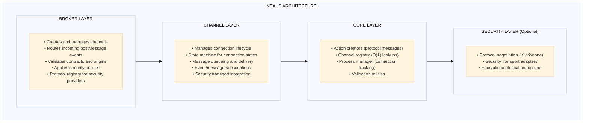
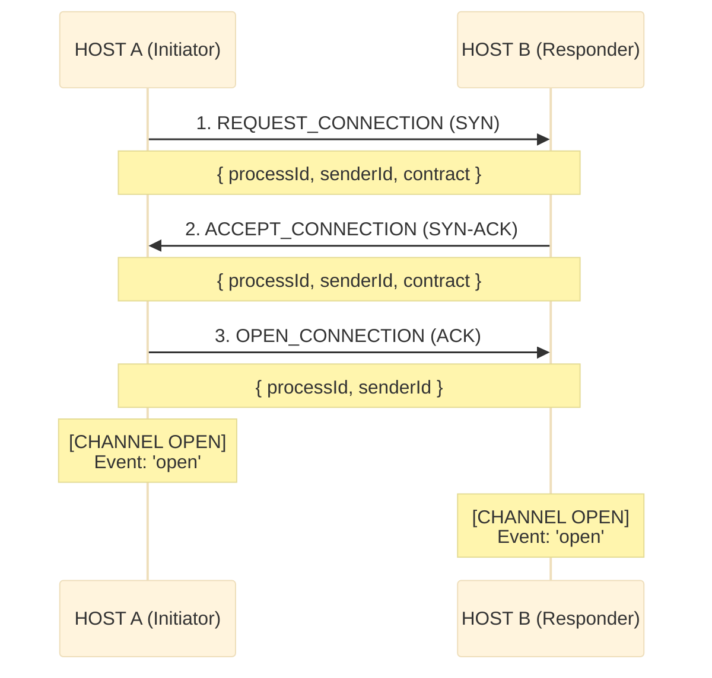
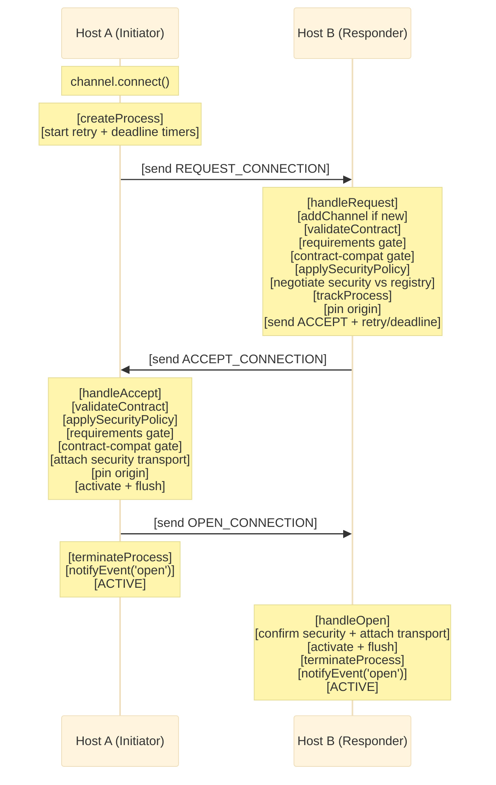
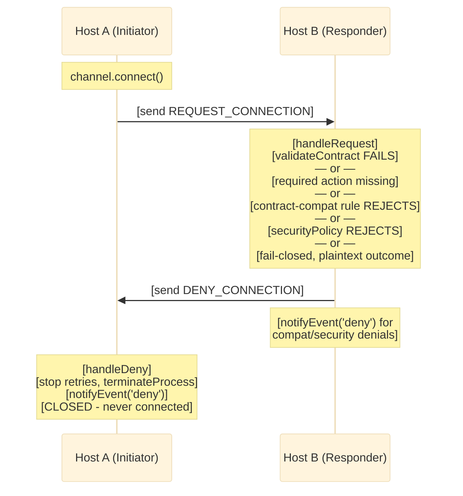
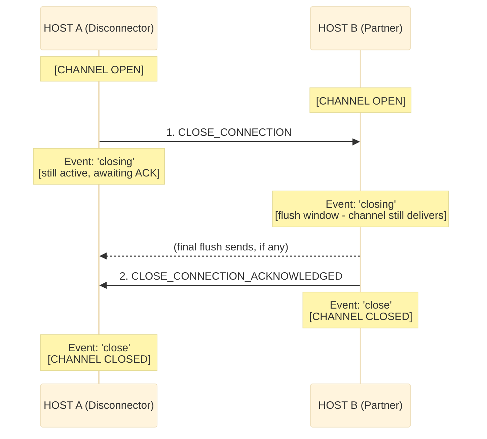
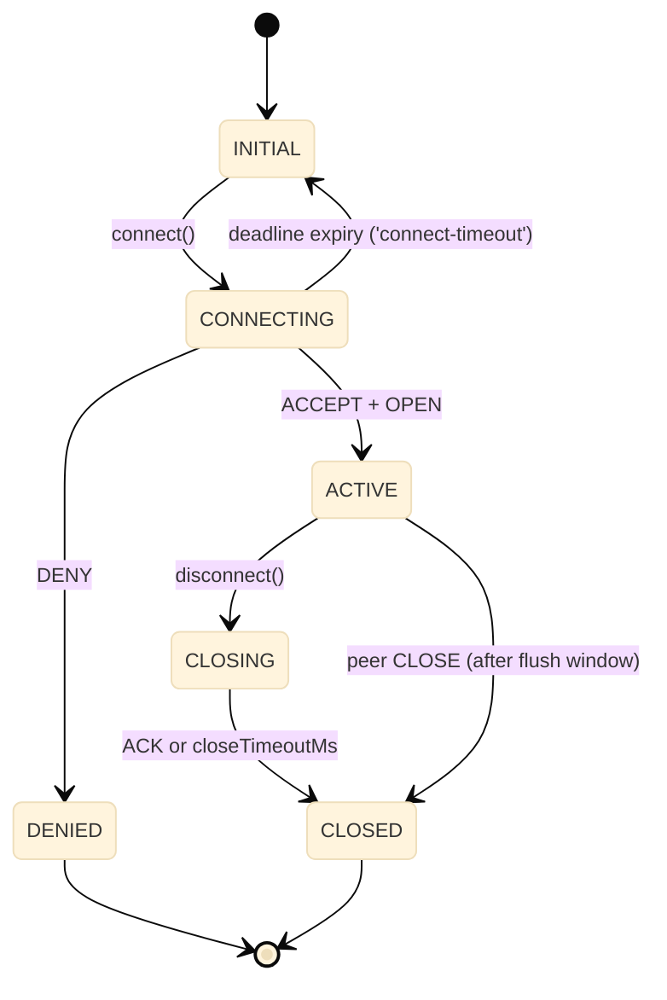
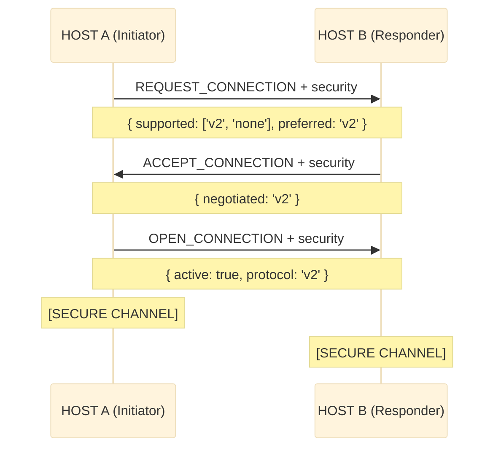
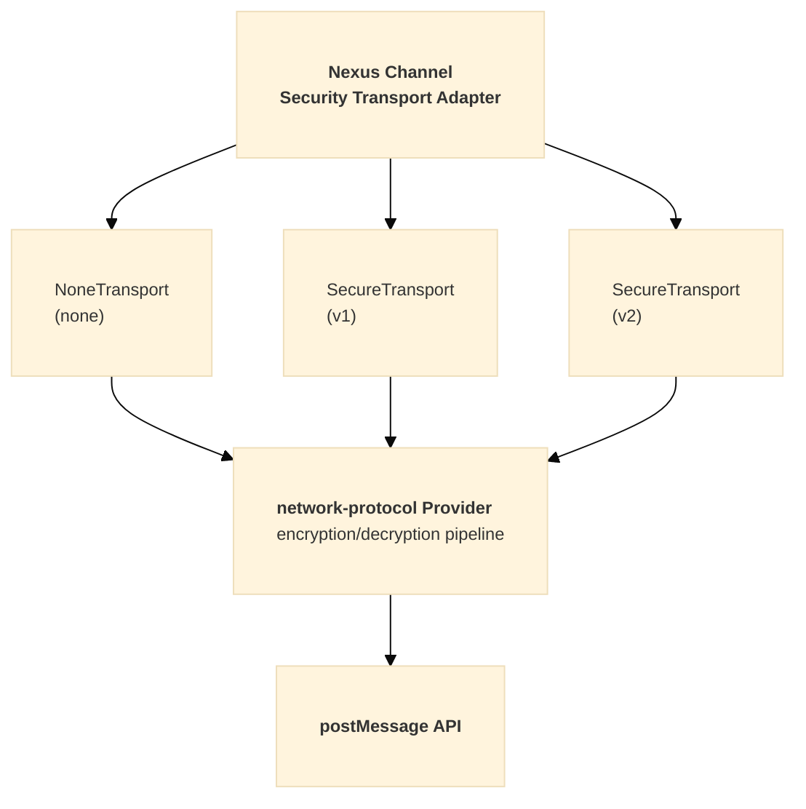

# Nexus Architecture

**Complete Overview of `@hyperfrontend/nexus`**

---

## Overview

`@hyperfrontend/nexus` is a cross-window communication library designed for micro-frontend architectures. It implements a TCP-like connection protocol over the browser's `postMessage` API, providing secure, contract-validated messaging between browser contexts (iframes, windows, and web workers).

### Target Use Cases

1. **Micro-frontend communication** — Shell applications coordinating multiple micro-apps
2. **Iframe integration** — Secure bidirectional messaging with embedded content
3. **Multi-window applications** — Communication between browser windows/tabs
4. **Plugin architectures** — Host-to-plugin communication with contract enforcement

---

## Table of Contents

1. [Architecture Overview](#architecture-overview)
2. [Design Philosophy](#design-philosophy)
3. [Module Organization](#module-organization)
4. [Core Concepts](#core-concepts)
5. [Protocol Design](#protocol-design)
6. [Handler Reference](#handler-reference)
7. [Event System](#event-system)
8. [Logging System](#logging-system)
9. [Security Model](#security-model)
10. [Internal Dependencies](#internal-dependencies)
11. [Integration Points](#integration-points)
12. [Public API Surface](#public-api-surface)
13. [Links](#links)

---

## Architecture Overview



---

## Design Philosophy

The library follows **functional programming principles** with factory-based architecture.

### Key Design Decisions

| Aspect               | Implementation                        | Rationale                                                  |
| -------------------- | ------------------------------------- | ---------------------------------------------------------- |
| **State Management** | Closure-based encapsulation           | True information hiding, prevents external mutation        |
| **Factory Pattern**  | `createBroker()`, `createChannel()`   | Testable, composable, no class inheritance complexity      |
| **Registry**         | Instance-based with WeakMap/Map       | O(1) lookups, memory-efficient, multiple brokers supported |
| **Process Tracking** | UUID-based ProcessManager             | Clean lifecycle management for in-flight connections       |
| **Router Pattern**   | Handler registry keyed by action type | Single responsibility, extensible protocol                 |
| **Immutability**     | `Object.freeze()`, spread patterns    | Predictable state transitions                              |

### Notable Patterns

- **Functional Core, Imperative Shell** — Pure logic in core, side effects at boundaries
- **Handler Registry** — Extensible protocol handling
- **WeakMap for Window References** — Prevents memory leaks
- **Immutable State Updates** — Predictable state transitions

---

## Module Organization

The library is organized into logical modules by responsibility:

| Module       | Responsibility                                     |
| ------------ | -------------------------------------------------- |
| **Broker**   | Central message coordinator, channel management    |
| **Channel**  | Bidirectional communication endpoints, lifecycle   |
| **Security** | Origin filtering, protocol negotiation, encryption |
| **Filters**  | Event and message filtering utilities              |
| **Schema**   | JSON Schema validation for contracts               |

---

## Core Concepts

### 1. Broker (`BrokerHandle`)

The broker is the central coordinator that:

- Manages multiple channels
- Listens for incoming `postMessage` events
- Routes messages to appropriate handlers
- Enforces security policies

```typescript
interface BrokerHandle {
  readonly id: string
  readonly name: string
  readonly contract: IChannelContract
  readonly settings: BrokerSettings
  readonly channels: ReadonlyArray<ChannelJSON>
  readonly acceptedActionTypes: readonly string[]
  readonly logger: Logger

  addChannel(name: string, target: Window, settings?: Record<string, unknown>): ChannelHandle
  getChannel(reference: string | Window): ChannelHandle | null
  removeChannel(reference: string | Window): void
  setSecurityPolicy(policy: SecurityPolicy): BrokerHandle
  extendContract(contract: IChannelContract): BrokerHandle
  toJSON(): Record<string, unknown>

  // Security protocol management
  registerProtocol(version: SecurityProtocolVersion, provider: unknown): BrokerHandle
  unregisterProtocol(version: SecurityProtocolVersion): BrokerHandle
  hasProtocol(version: SecurityProtocolVersion): boolean
  getSupportedProtocols(): SecurityProtocolVersion[]
}
```

### 2. Channel (`ChannelHandle`)

A channel represents a communication endpoint to another window:

```typescript
interface ChannelHandle {
  readonly id: string
  readonly name: string
  readonly target: Window

  // State queries
  isActive(): boolean
  toJSON(): ChannelJSON

  // Lifecycle
  connect(): void
  disconnect(notify?: boolean): void
  cancel(notify?: boolean): void
  destroy(notify?: boolean): void

  // Communication
  send(type: string, data?: unknown): void

  // Subscriptions
  on(handler: EventHandler): () => void
  on<E extends ChannelEvent>(event: E, handler: EventCallbackMap[E]): () => void
  onMessage(handler: MessageHandler): () => void
}
```

### 3. Contract (`IChannelContract`)

Contracts define the messaging agreement between parties:

```typescript
interface IChannelContract {
  emitted: IActionDescription[] // Message types this party sends
  accepted: IActionDescription[] // Message types this party receives
  version?: string // Optional version announcement crossed during the handshake
}

interface IActionDescription {
  type: string // Message type identifier
  description?: string // Human-readable description
  schema?: object // Optional JSON Schema for validation
  required?: boolean // Accepted entries only: deny the connection unless the peer emits this type
}
```

Contracts are exchanged during the handshake. Unknown inbound types are dropped and logged; only `accepted` entries flagged `required` gate the connection (the peer must emit them), so additive contract evolution is non-breaking in both directions. See [Contract Compatibility](#contract-compatibility) for the full gating rules, including the optional `version` announcement and the channel-supplied `contractCompat` rule.

### 4. Actions (Protocol Messages)

The protocol defines 11 action types for connection lifecycle:

| Action Type                      | Purpose                     |
| -------------------------------- | --------------------------- |
| `REQUEST_CONNECTION`             | Initiate connection (SYN)   |
| `ACCEPT_CONNECTION`              | Accept connection (SYN-ACK) |
| `OPEN_CONNECTION`                | Confirm connection (ACK)    |
| `DENY_CONNECTION`                | Reject connection (RST)     |
| `CANCEL_CONNECTION`              | Cancel pending connection   |
| `CANCEL_CONNECTION_ACKNOWLEDGED` | Acknowledge cancellation    |
| `CLOSE_CONNECTION`               | Graceful disconnect         |
| `CLOSE_CONNECTION_ACKNOWLEDGED`  | Acknowledge disconnect      |
| `DESTROY_CONNECTION`             | Force disconnect            |
| `NEW_MESSAGE`                    | User data transmission      |
| `INVALID_REQUEST`                | Protocol violation          |

---

## Protocol Design

### Three-Way Handshake

Nexus implements a TCP-like handshake for reliable connection establishment:



Initiation is symmetric — either side may `connect()` first, and simultaneous requests (glare) resolve by broker-id tie-break (the lower id yields and answers as responder). Pending REQUEST/ACCEPT frames are re-sent every `requestRetryMs` (default 500 ms) until answered; all three handshake messages are idempotent under replay. A handshake that stays unanswered past `connectTimeoutMs` (default 10 000 ms) fires `connect-timeout` and leaves the channel inactive, reconnectable, with queued messages retained. Each side pins the counterpart's origin during the handshake; subsequent sends target the pin and mismatched inbound origins are dropped. A channel can also be pre-pinned via the `origin` setting before the first message leaves.

**Internal Sequence:**



### Contract Compatibility

Both sides exchange contracts during the handshake. Vocabulary differences never gate the connection — only `accepted` entries flagged `required: true` do, and each must appear in the counterpart's `emitted` list or the connection is denied with `Incompatible contract: missing required actions …`. This keeps additive contract evolution non-breaking in both directions:

| Situation                               | Fatal? | Handling                                              |
| --------------------------------------- | ------ | ----------------------------------------------------- |
| Peer emits a type outside my vocabulary | No     | Dropped and logged at receive                         |
| I accept a type the peer never emits    | No     | Nothing — dormant vocabulary                          |
| I emit a type the peer does not accept  | No     | Peer drops it; the peer's own `required` flags decide |
| I require an input the peer never emits | Yes    | Connection denied at handshake time                   |

A contract may also carry an optional `version` string. Nexus attaches no semantics to it — supply a `contractCompat` rule in the channel settings to decide whether two contracts may interoperate:

```typescript
const channel = broker.addChannel('partner', partnerWindow, {
  contractCompat: (own, peer) =>
    own.version === peer.version ? { compatible: true } : { compatible: false, reason: `${own.version} does not match ${peer.version}` },
})
```

The rule runs at the same handshake gate as the required-actions check, on whichever side holds it, receiving the local contract and the counterpart's. On the responder (REQUEST time) an incompatible result sends DENY with the rule's reason and `reason: 'incompatible-contract'`, so the `deny` event fires on both the denying responder and the denied initiator. On the initiator (ACCEPT time) an incompatible result aborts the handshake: the initiator fires its own `deny` event with the same reason and sends CANCEL to the counterpart, which observes a `cancel`, not a `deny`.

### Denial Flow

When a connection is rejected during REQUEST handling:



The DENY frame carries a human-readable `error` and, for the contract-compatibility and fail-closed security gates, a machine-readable `reason` (`'incompatible-contract'` or `'security-unavailable'`). Those two gates also fire the denial locally on the responder as a `deny` event — once per handshake process: the initiator retries REQUEST while pending, and each retry is answered with another DENY frame without re-notifying the responder's subscribers. On the initiator, `handleDeny` stops the request retries and removes the tracked process, so duplicate DENY frames are no-ops and the `deny` event fires once.

### Cancellation Flow

Either party can cancel before the connection completes: CANCEL_CONNECTION is answered with CANCEL_CONNECTION_ACKNOWLEDGED, and both sides fire the `cancel` event. The initiator-side gates that run at ACCEPT time (invalid contract, missing required actions, security policy, contract compatibility, fail-closed security) also abort through this verb — the aborting initiator sends CANCEL to the counterpart, and only the compat and fail-closed security gates additionally fire a local `deny` with their reasons.

### Graceful Disconnection



The polite close is a flush-then-confirm exchange. The disconnector posts CLOSE, fires
`closing` (`{ initiatedLocally: true }`), and stays active so the partner's final sends
still deliver; its single `close` fires only when the acknowledgement arrives — or when
`closeTimeoutMs` (default 2 s) expires, so an unresponsive partner cannot hold the channel
open. The partner fires `closing` (`{ initiatedLocally: false }`) while the channel still
delivers — subscribers may synchronously send final messages, which arrive before the
acknowledgement — then acknowledges, deactivates, and fires its single `close`. New sends
issued after a close was proposed queue for the next connection instead of racing the CLOSE.
Simultaneous polite closes (close glare) acknowledge each other and still fire exactly one
`closing` and one `close` per side. `destroy()` remains the immediate, unacknowledged
teardown.

### State Transitions



---

## Handler Reference

Each protocol action is processed by a dedicated handler. All handlers receive the broker state, channel registry, process manager, and incoming message.

| Handler                    | Responsibilities                                                                                                                                                                                                                                                                                                                   |
| -------------------------- | ---------------------------------------------------------------------------------------------------------------------------------------------------------------------------------------------------------------------------------------------------------------------------------------------------------------------------------- |
| `handleRequest`            | Enforce origin pin, resolve glare/reload, validate contract + requirements + compat rule, apply policy, negotiate security against the protocol registry (deny fail-closed plaintext outcomes, firing the local 'deny' once per process), track process, pin origin, send ACCEPT with retry/deadline (or schedule until connect()) |
| `handleAccept`             | Resolve by process or source window, enforce origin pin, validate contract + requirements + compat rule, apply policy, attach the security transport before the queue flushes (abort fail-closed plaintext outcomes via CANCEL + local 'deny'), activate + flush, send OPEN confirming the security outcome, notify 'open'         |
| `handleOpen`               | Apply the initiator's security confirmation (attach transport before flush, refuse fail-closed plaintext outcomes), activate from the pending accept, flush queue, terminate process, notify 'open' (responder side)                                                                                                               |
| `handleDeny`               | Abandon the pending request (stop retrying), terminate process, notify 'deny' with error context                                                                                                                                                                                                                                   |
| `handleCancel`             | Cancel channel, send CANCEL_ACK, notify 'cancel'                                                                                                                                                                                                                                                                                   |
| `handleCancelAcknowledged` | Terminate process, notify 'cancel' (initiator side)                                                                                                                                                                                                                                                                                |
| `handleClose`              | Notify 'closing' (flush window, channel still active), send CLOSE_ACK, then deactivate and notify a single 'close'                                                                                                                                                                                                                 |
| `handleCloseAcknowledged`  | Complete the initiator's polite close: deactivate, terminate process, notify its single 'close' (ignores stray acks for channels not closing)                                                                                                                                                                                      |
| `handleMessage`            | Validate payload, forward to subscribers via `notifyMessage()`                                                                                                                                                                                                                                                                     |
| `handleDestroy`            | Force-destroy connection, clean up resources                                                                                                                                                                                                                                                                                       |
| `handleInvalid`            | Log invalid requests, optionally notify sender — see [handle-invalid.ts](https://github.com/AndrewRedican/hyperfrontend/blob/main/libs/nexus/src/broker/routing/handle-invalid.ts)                                                                                                                                                 |

---

## Event System

Channels emit lifecycle events to subscribers. Each event has a specific trigger and payload structure.

### Lifecycle Events

| Event               | Trigger                                           | Payload                         |
| ------------------- | ------------------------------------------------- | ------------------------------- |
| `'open'`            | Connection successfully established               | `{ origin, contract }`          |
| `'closing'`         | Polite close proposed; channel still delivers     | `{ initiatedLocally: boolean }` |
| `'close'`           | Close completed (fires once per side)             | `{ notify: boolean }`           |
| `'cancel'`          | Pending connection cancelled                      | `{ notify: boolean }`           |
| `'deny'`            | Connection request rejected (either side's gates) | `{ error?, reason?, origin?}`   |
| `'invalid'`         | Protocol violation or unexpected-origin drop      | `{ error, action? }`            |
| `'connect-timeout'` | Handshake deadline expired with no answer         | `{ elapsedMs }`                 |

The `deny` payload's optional `reason` is machine-readable: `'incompatible-contract'` (a `contractCompat` rule rejected the pair) or `'security-unavailable'` (a fail-closed channel could not obtain an encrypted transport). The `invalid` event fires with `{ error, action? }` for unexpected-origin drops, and with `{ reason, origin }` when the counterpart reports an INVALID_REQUEST frame.

### Connection Outcomes

A connection attempt ends in one of four distinct ways, each with its own event:

| Event             | A session existed? | Deliberate? | Who decided           | Wire evidence of a peer | Natural reaction         |
| ----------------- | ------------------ | ----------- | --------------------- | ----------------------- | ------------------------ |
| `close`           | Yes                | Yes         | Either side           | Yes (CLOSE/ACK)         | Handle disconnect        |
| `cancel`          | No                 | Yes         | Either side           | Yes (CANCEL verb)       | Accept abandonment       |
| `deny`            | No                 | Yes         | A gate, with a reason | Yes (DENY + reason)     | Fix the integration      |
| `connect-timeout` | No                 | No          | Nobody — silence      | None                    | Fallback UI, retry later |

### Security Events

| Event            | Payload                     | Description                                            |
| ---------------- | --------------------------- | ------------------------------------------------------ |
| `security-ready` | `{ protocol, active }`      | An encrypted security transport attached and confirmed |
| `security-error` | `{ message, code, cause? }` | Security transport or pipeline operation failed        |

The `ChannelEvent` union also declares `'security-negotiated'` (payload `{ protocol, isPreferred }`) for subscribers, but the current handshake does not emit it — the negotiated outcome surfaces through `security-ready` instead.

### Event Subscription

```typescript
// Subscribe to a specific event (recommended)
channel.on('open', (data) => console.log('Opened:', data.origin))
channel.on('close', (data) => console.log('Closed'))
channel.on('security-ready', (data) => console.log(`Secure channel using ${data.protocol}`))

// Subscribe to all events (for generic handling)
channel.on((event, data) => {
  switch (event) {
    case 'open':
      console.log(`Connected to ${data.origin}`)
      break
    case 'close':
      console.log('Connection closed')
      break
  }
})

// Use filter utilities for advanced composition
import { openFilter, closeFilter } from '@hyperfrontend/nexus'

channel.on(openFilter((data) => console.log('Opened:', data.origin)))
channel.on(closeFilter((data) => console.log('Closed')))
```

---

## Logging System

Nexus provides a configurable logging system that routes all internal output through a `Logger` interface from `@hyperfrontend/logging`.

### Logger Interface

```typescript
interface Logger {
  error(...args: unknown[]): void
  warn(...args: unknown[]): void
  log(...args: unknown[]): void
  info(...args: unknown[]): void
  debug(...args: unknown[]): void
  setLogLevel(level: LogLevel): void
  getLogLevel(): LogLevel
}

type LogLevel = 'error' | 'warn' | 'log' | 'info' | 'debug' | 'none'
```

### Logger Flow

1. **Broker initialization** — `createBroker()` creates or adopts a logger based on `settings.logLevel` and `settings.logger`
2. **Channel inheritance** — Channels created via `broker.addChannel()` inherit the broker's logger
3. **RoutingContext** — All routing handlers receive the logger via `RoutingContext`

### RoutingContext

All routing handlers receive a `RoutingContext` object containing shared dependencies:

```typescript
interface RoutingContext {
  readonly state: BrokerState // Immutable broker state snapshot
  readonly registry: Registry // Channel registry for lookups
  readonly processManager: ProcessManager // Tracks handshake processes
  readonly actions: ActionCreators // Factory functions for protocol actions
  readonly logger: Logger // Logger instance for this broker
  readonly getSupportedProtocols: () => readonly SecurityProtocolVersion[] // Registry-sourced negotiable protocols
  readonly getProtocol: (id: SecurityProtocolVersion) => unknown // Provider lookup for a negotiated protocol
  readonly routeAction: (event: MessageEvent<IAction>) => void // Re-enters the handler map (decrypted actions)
}
```

This pattern:

- Eliminates parameter proliferation across handlers
- Makes testing straightforward (mock the context)
- Provides clean access to logger without prop drilling

### Structured Logging Utilities

| Utility     | Purpose                         | Output Format                                 |
| ----------- | ------------------------------- | --------------------------------------------- |
| `logAction` | Protocol action tracing         | `[nexus] Action <direction>: <type> <action>` |
| `logEvent`  | Channel lifecycle event logging | `[nexus] Channel event: <event> <data>`       |

### createLogger Factory

```typescript
import { createLogger, type NexusLoggerOptions } from '@hyperfrontend/nexus'

interface NexusLoggerOptions {
  level?: LogLevel // Default: 'error'
  prefix?: string // Default: '[nexus]'
  customLogger?: Logger // Use this logger directly if provided
}

const logger = createLogger({ level: 'debug', prefix: '[app]' })
```

### Custom Logger Injection

Verbosity is controlled with the `logLevel` setting; a custom logger (Winston, Pino, etc.) can be injected for production:

```typescript
const broker = createBroker({
  name: 'production-broker',
  contract,
  settings: {
    logger: {
      error: (...args) => myLogger.error(args.join(' ')),
      warn: (...args) => myLogger.warn(args.join(' ')),
      log: (...args) => myLogger.info(args.join(' ')),
      info: (...args) => myLogger.info(args.join(' ')),
      debug: (...args) => myLogger.debug(args.join(' ')),
      setLogLevel: () => {},
      getLogLevel: () => 'info',
    },
  },
})
```

Channels inherit the broker's logger; it is exposed via `broker.logger`.

---

## Security Model

Nexus provides a multi-layered security approach:

### Layer 1: Origin Filtering

Basic origin-based access control, applied to every inbound message before routing. A non-empty `whitelist` takes precedence over the `blacklist`:

```typescript
const broker = createBroker({
  settings: {
    whitelist: ['https://trusted.com'],
    blacklist: ['https://malicious.com'],
  },
})
```

During the handshake each side additionally pins the counterpart's concrete origin; inbound frames from any other origin are dropped and surfaced as `invalid`.

### Layer 2: Security Policy

Custom programmatic validation, applied while handling REQUEST and ACCEPT. A rejected request is answered with DENY_CONNECTION:

```typescript
broker.setSecurityPolicy((event: MessageEvent) => {
  return event.origin.endsWith('.mycompany.com')
})
```

### Layer 3: Contract Validation

Contracts gate the handshake (structure validation, the required-actions check, and any `contractCompat` rule) and filter product traffic: inbound messages are validated for envelope shape and dropped when their type is not in the channel's `accepted` list. Per-action `schema` fields travel with the contract but nexus does not evaluate them against message payloads — payload-schema enforcement is left to the consuming layer (`@hyperfrontend/features` validates payloads against the sender's `emitted` and the receiver's `accepted` schemas on both ends):

```typescript
const contract: IChannelContract = {
  emitted: [
    {
      type: 'USER_DATA',
      schema: {
        type: 'object',
        properties: {
          userId: { type: 'string' },
          email: { type: 'string', format: 'email' },
        },
        required: ['userId'],
      },
    },
  ],
  accepted: [{ type: 'ACK' }],
}
```

### Layer 4: Transport Security (Optional)

End-to-end encryption via `@hyperfrontend/network-protocol`:

| Protocol | Description                                 | Use Case             |
| -------- | ------------------------------------------- | -------------------- |
| `none`   | Passthrough, no encryption                  | Trusted environments |
| `v1`     | Obfuscation-first with dynamic key exchange | Basic protection     |
| `v2`     | Pre-shared key with dynamic key rotation    | High security        |

#### Security Negotiation Flow

Negotiation is registry-sourced: each broker holds a protocol registry, filled via `broker.registerProtocol(version, provider)` or the `settings.security.protocols` bag, and a channel opts in with `security: { protocol: ... }`. The initiator advertises its supported protocols in REQUEST_CONNECTION; the responder picks the first initiator preference its own registry supports (falling back to `'none'`), answers it in ACCEPT_CONNECTION, and the initiator confirms the final outcome in OPEN_CONNECTION:



Both ends attach their security transport before the outbound queue flushes, so product traffic — including sends queued before the handshake — leaves as `Uint8Array` ciphertext while the handshake actions themselves stay plaintext. Channels fire `security-ready` once an encrypted transport attaches. A confirmed protocol with no locally registered provider degrades the outcome to plaintext with a warning.

#### Fail-Open and Fail-Closed Modes

Negotiation **fails open** by default: when the handshake cannot deliver an encrypted transport (the counterpart predates security, offers no common protocol, or the negotiated provider is missing), the channel falls back to plaintext with a warning. Setting `security: { protocol: ..., mode: 'fail-closed' }` refuses that outcome instead — the connection is denied before it opens, with a `deny` event carrying `reason: 'security-unavailable'` (the responder denies at REQUEST time; the initiator aborts at ACCEPT time via CANCEL plus a local `deny`; the responder refuses a plaintext OPEN confirmation the same way).

#### Security Transport Architecture



#### Configuration Examples

The registered provider satisfies the `SecurityProvider` shape — a per-channel wire-pipeline factory plus the protocol instance factory. `@hyperfrontend/network-protocol`'s `createChannel` and protocol factories satisfy it directly, and `createSecurityTransport` plus the `SecurityTransport`/`SecurityProvider` types keep the seam public for other implementations:

```typescript
import { createChannel as createWireChannel } from '@hyperfrontend/network-protocol/browser/channel'
import { createProtocol as createV2Protocol } from '@hyperfrontend/network-protocol/browser/v2'

// Register a provider at broker level
broker.registerProtocol('v2', {
  createChannel: createWireChannel,
  protocolProvider: createV2Protocol(broker.logger, 'pre-shared-key'),
})

// Opt a channel into negotiation
const channel = broker.addChannel('secure', targetWindow, {
  security: {
    protocol: 'v2',
    sharedKey: 'channel-specific-key',
    mode: 'fail-closed',
  },
})

// Protocol registry API
broker.hasProtocol('v2') // true
broker.getSupportedProtocols() // ['v2', 'none']
broker.unregisterProtocol('v2') // Remove provider
```

---

## Internal Dependencies

### Hyperfrontend Libraries

- `@hyperfrontend/data-utils`
- `@hyperfrontend/immutable-api-utils`
- `@hyperfrontend/json-utils`
- `@hyperfrontend/logging`
- `@hyperfrontend/random-generator-utils`

### Optional Integration

- `@hyperfrontend/network-protocol` (optional peer dependency) — For transport-level security (v1/v2 protocols)

---

## Integration Points

### With Other Hyperfrontend Libraries

| Library                                 | Integration                                |
| --------------------------------------- | ------------------------------------------ |
| `@hyperfrontend/network-protocol`       | Optional transport security                |
| `@hyperfrontend/logging`                | Logging infrastructure                     |
| `@hyperfrontend/random-generator-utils` | UUID generation                            |
| `@hyperfrontend/json-utils`             | JSON Schema validation of protocol shapes  |
| `@hyperfrontend/immutable-api-utils`    | Immutable built-in wrappers                |
| `@hyperfrontend/data-utils`             | Type inspection for deep-freeze and guards |

### With External Systems

- **Micro-frontend frameworks** — Module federation, single-spa
- **Web workers** — Worker-to-main thread communication
- **Service workers** — Offline-capable messaging
- **Electron** — Main-renderer process communication

---

## Public API Surface

### Exports from `@hyperfrontend/nexus`

```typescript
// Core factories
export { createBroker } from './broker/factory'
export { createChannel } from './channel/factory'
export { mergeContracts } from './setup/merge-contracts'
export { createSecurityTransport } from './security/transport/factory'
export { broker as defaultBroker } from './singleton'
export { DEFAULT_CONTRACT } from './constants/default-contract'

// Broker types
export type { BrokerHandle, BrokerConfig, BrokerSettings, BrokerState, SecurityPolicy }

// Channel types
export type { ChannelHandle, ChannelJSON, IChannelSettings, IChannelConfig }

// Contract types
export type { IChannelContract, IActionDescription }
export type { ContractCompat, ContractCompatibility, ContractCompatible, ContractIncompatible }

// Message types
export type { IMessage, MessageEnvelope }

// Event types
export type { ChannelEvent, EventData, OpenEventData, CloseEventData, ... }

// Action types
export type { IAction, ActionType }

// Security types
export type { SecurityProtocolVersion, SecurityProvider, SecurityTransport, SecurityTransportConfig, ... }

// Filter utilities
export { openFilter, closeFilter, cancelFilter, denyFilter, invalidFilter, createEventFilter }
export { byType, compose, createMessageFilter }
export type { MessageFilter, MessagePredicate, MessageHandler, EventHandler }

// Logging
export { createLogger, logAction, logEvent }
export type { Logger, LogLevel, NexusLoggerOptions }
```

---

## Links

- [README.md](https://github.com/AndrewRedican/hyperfrontend/blob/main/libs/nexus/README.md) — consumer-facing overview, installation, and quick start
- [Documentation site](https://www.hyperfrontend.dev/docs/libraries/nexus/) — published guides and API reference
