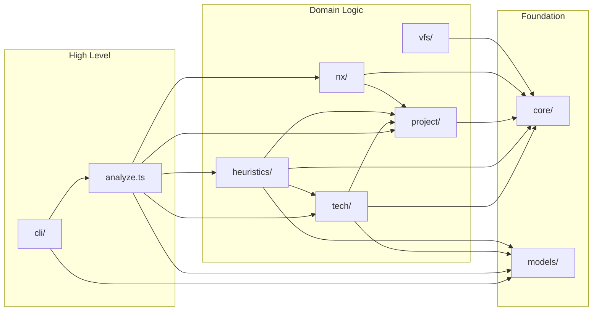
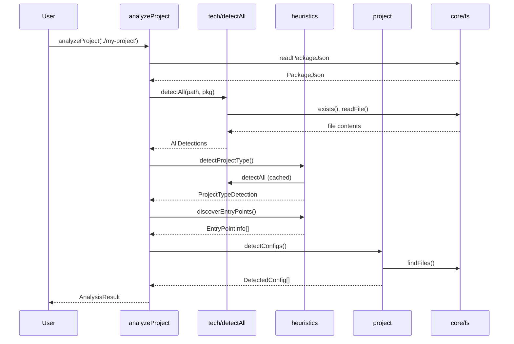
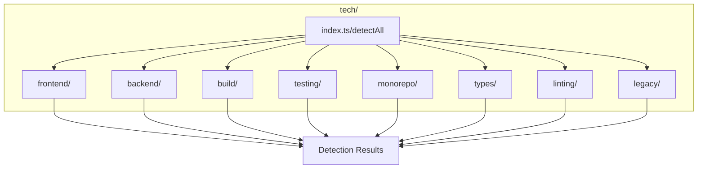
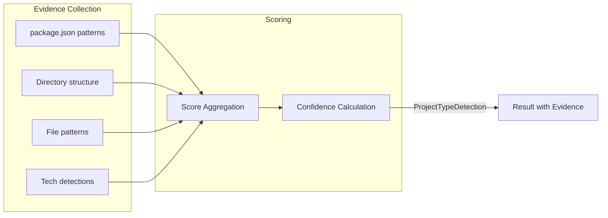
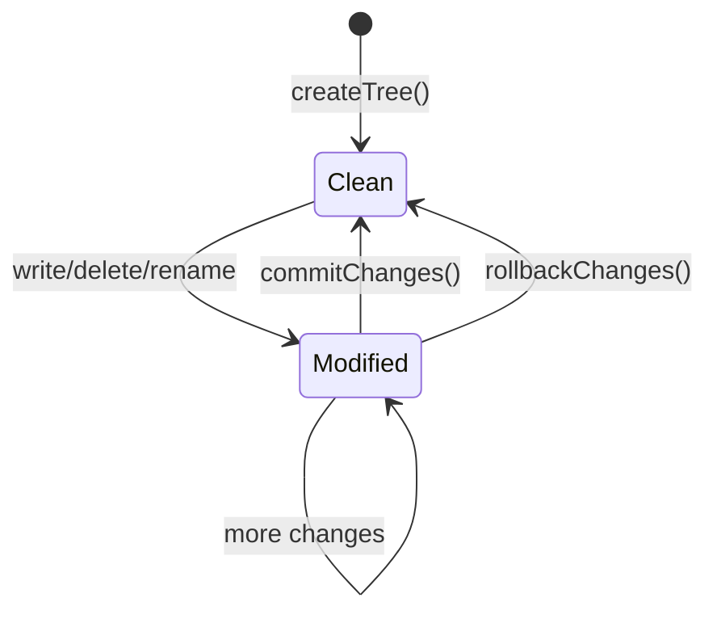
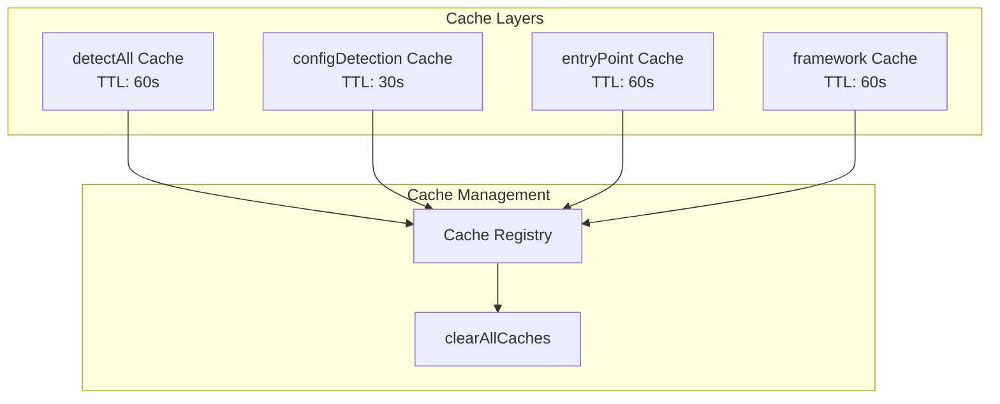
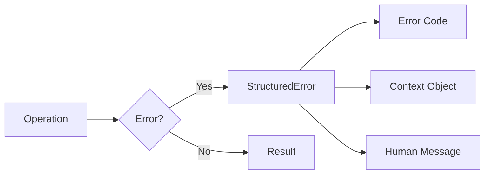
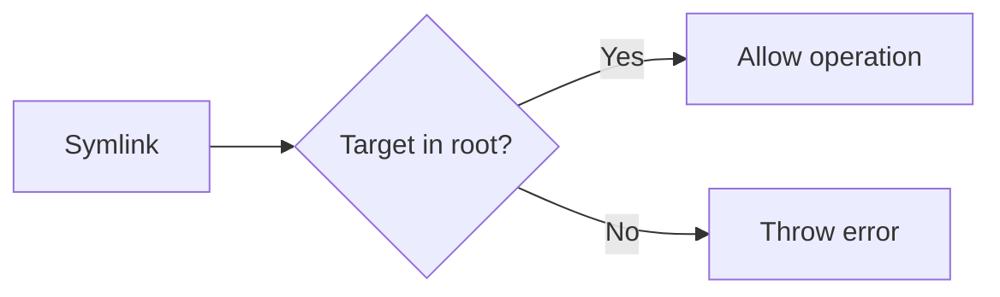

# Architecture

This document describes the architecture of `@hyperfrontend/project-scope`, a comprehensive library for analyzing JavaScript/TypeScript project structure, technology stack, and dependencies.

## Overview



## Module Structure

```
libs/project-scope/src/
├── analyze.ts           # Main entry point (analyzeProject)
├── index.ts             # Public exports
├── cli/                 # Command-line interface
├── core/                # Foundation utilities
├── heuristics/          # Intelligent detection algorithms
├── models/              # TypeScript types and interfaces
├── nx/                  # NX workspace integration
├── project/             # Project structure analysis
├── tech/                # Technology stack detection
└── vfs/                 # Virtual file system
```

## Data Flow

### Analysis Pipeline



## Core Components

### 1. Analysis Engine (`analyze.ts`)

The main entry point that orchestrates all detection modules:

```typescript
function analyzeProject(projectPath: string, options?: AnalyzeOptions): AnalysisResult
```

**Responsibilities:**

- Coordinate all detection modules
- Aggregate results into unified structure
- Handle options for selective analysis
- Track analysis metadata (timing, version)

### 2. Technology Detection (`tech/`)

Detects frameworks, build tools, and testing frameworks:



**Design Patterns:**

- Each detector implements a common interface
- Results include confidence scores (0-100)
- Detection sources are tracked for transparency
- Caching with 60-second TTL

### 3. Heuristics (`heuristics/`)

Intelligent detection using multiple signals:



**Key Characteristics:**

- Multi-signal analysis for accuracy
- Evidence tracking for explainability
- Confidence scoring for reliability indication
- Caching for performance

### 4. Virtual File System (`vfs/`)

Transactional file operations:



**Properties:**

- All changes buffered in memory
- Atomic commit or rollback
- Path traversal protection
- Symlink security validation

### 5. Core Utilities (`core/`)

Foundation layer providing:

| Component   | Purpose                                 |
| ----------- | --------------------------------------- |
| `fs/`       | Safe file system operations             |
| `path/`     | Cross-platform path manipulation        |
| `logger.ts` | Scoped logging with secret sanitization |
| `cache.ts`  | In-memory caching with TTL              |
| `errors/`   | Structured error creation               |
| `patterns/` | ReDoS-safe glob matching                |
| `encoding/` | File encoding detection                 |
| `platform/` | OS detection                            |

## Caching Strategy



**Cache Characteristics:**

- Function-specific TTLs based on volatility
- Size limits prevent memory issues
- Skip-cache option for fresh results
- Global clear for testing

## Error Handling



**Error Types:**

- `FS_NOT_FOUND` - File/directory not found
- `FS_READ_ERROR` - Read operation failed
- `FS_WRITE_ERROR` - Write operation failed
- `FS_PARSE_ERROR` - JSON/config parse failure
- `CONFIG_NOT_FOUND` - Configuration not found
- `VALIDATION_ERROR` - Invalid input

## Security Considerations

### Path Traversal Prevention

```typescript
// VFS normalizes and validates all paths
tree.read('../../../etc/passwd') // Throws: Path escapes tree root
```

### Symlink Security



### Secret Sanitization

```typescript
// Logger automatically redacts sensitive keys
logger.debug('Config loaded', { apiKey: 'secret123' })
// Output: [scope] Config loaded {"apiKey":"[REDACTED]"}
```

Sensitive key patterns: `token`, `key`, `password`, `secret`, `credential`, `auth`, `bearer`, `api_key`, `private`, `passphrase`

### ReDoS Protection

Glob matching uses character-by-character iteration instead of regex to prevent Regular Expression Denial of Service attacks.

## Extension Points

### Adding a New Framework Detector

```typescript
// tech/frontend/my-framework.ts
import type { FrameworkDetector } from './types'

export const myFrameworkDetector: FrameworkDetector = {
  id: 'my-framework',
  name: 'MyFramework',
  category: 'frontend',
  detect(projectPath, packageJson) {
    // Detection logic
    return {
      id: 'my-framework',
      name: 'MyFramework',
      confidence: 80,
      detectedFrom: [{ type: 'package.json', field: 'dependencies.my-framework' }],
    }
  },
}

// Register in tech/frontend/index.ts
export const frameworkDetectors = [..., myFrameworkDetector]
```

### Adding a New CLI Command

```typescript
// cli/commands/my-command.ts
import type { Command } from '../types'

export const myCommandDef: Command = {
  name: 'my-command',
  description: 'Does something useful',
  execute(args, globalOptions) {
    // Command logic
    return { exitCode: 0 }
  },
  getHelp() {
    return 'Usage: project-scope my-command [options]'
  },
}

// Register in cli/run.ts
const commands = { ..., 'my-command': myCommandDef }
```

## Performance Characteristics

| Operation               | Typical Time | Caching       |
| ----------------------- | ------------ | ------------- |
| `analyzeProject` (full) | 50-200ms     | Per-component |
| `detectAll`             | 20-50ms      | 60s TTL       |
| `detectConfigs`         | 10-30ms      | 30s TTL       |
| `buildDependencyGraph`  | 100-500ms    | None          |
| `findFiles`             | 10-100ms     | None          |
