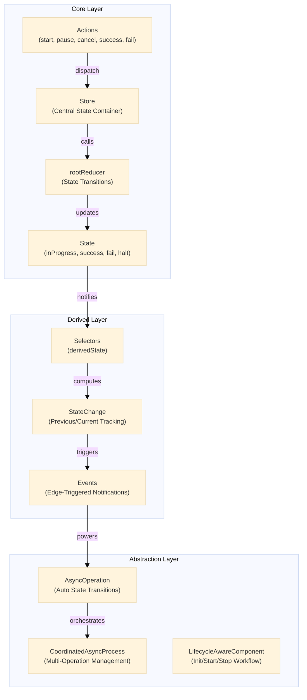
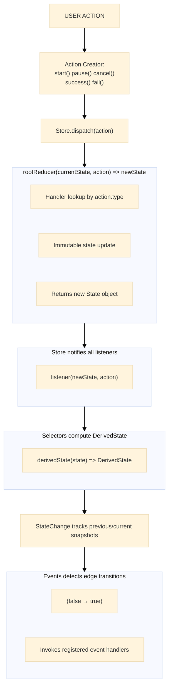
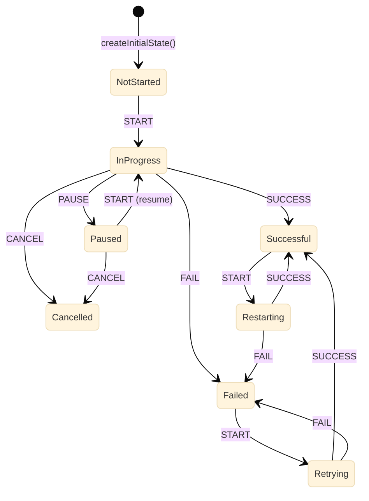

# Architecture

This document provides a technical deep dive into the `@hyperfrontend/state-machine` library architecture.

## System Overview



## Data Flow



## Module Layers

The library is organized into logical layers:

| Layer                       | Components                              |
| --------------------------- | --------------------------------------- |
| **Core Primitives**         | Store, Actions, Reducer                 |
| **Derived Computation**     | Selectors, StateChange                  |
| **Reactive System**         | Events                                  |
| **High-level Abstractions** | AsyncOperation, LifecycleAwareComponent |

## Core Components

### Store

The central state container implementing the observer pattern.

```typescript
class Store {
  private state = rootReducer(void 0, { type: '' })
  private listeners = new Set<Listener>()

  readonly dispatch = (action: Action): void => {
    this.state = rootReducer(this.state, action)
    this.listeners.forEach((listener) => listener(this.state, action))
  }

  readonly getState = (): State => ({ ...this.state })

  readonly subscribe = (listener: Listener): (() => void) => {
    this.listeners.add(listener)
    return () => this.listeners.delete(listener)
  }
}
```

**Design decisions**:

- `getState()` returns shallow copy to prevent external mutation
- Set-based listeners for O(1) add/remove operations
- Subscribe returns cleanup function (React/RxJS convention)
- Initial state via `rootReducer(void 0, { type: '' })`

### Action Creators

Actions follow the Flux Standard Action pattern:

```typescript
export const start = <T = void>(payload?: T) => ({ type: types.START, payload })
export const cancel = <T = void>(payload?: T) => ({ type: types.CANCEL, payload })
export const pause = <T = void>(payload?: T) => ({ type: types.PAUSE, payload })
export const success = <T = void>(payload?: T) => ({ type: types.SUCCESS, payload })
export const fail = (error?: Error | string | any) => ({ type: types.FAIL, error })
```

**Action types**:

- `'process started'` - START
- `'process completed successfully'` - SUCCESS
- `'process failed'` - FAIL
- `'process paused'` - PAUSE
- `'process cancelled'` - CANCEL

### Root Reducer

Pure function with handler lookup table:

```typescript
const handlers: Handlers = {
  [ActionTypes.START]: (state) => ({ ...state, inProgress: true }),
  [ActionTypes.PAUSE]: (state) => ({ ...state, halt: true }),
  [ActionTypes.CANCEL]: (state) => ({ ...state, inProgress: false, halt: true }),
  [ActionTypes.SUCCESS]: (state) => ({
    ...state,
    inProgress: false,
    success: true,
    fail: false,
    halt: false,
  }),
  [ActionTypes.FAIL]: (state, action) => ({
    ...state,
    inProgress: false,
    success: false,
    fail: true,
    halt: false,
    error: action.error,
  }),
}

export const rootReducer = (state = createInitialState(), action: Action): State => {
  const handler = handlers[action.type as keyof Handlers]
  return handler ? handler(state, action as any) : state
}
```

### State Model

**Core State** (4 boolean flags):

```typescript
interface State {
  inProgress: boolean
  success: boolean
  fail: boolean
  halt: boolean
}
```

**Initial State**:

```typescript
{
  inProgress: false,
  success: false,
  fail: false,
  halt: false
}
```

### State Selectors

10 derived states computed from 4 core flags:

```typescript
export const notStarted = (state) => !state.inProgress && !state.success && !state.fail
export const inProgress = (state) => state.inProgress
export const done = (state) => !state.inProgress && (state.success || state.fail)
export const successful = (state) => !state.inProgress && state.success && !state.fail
export const failed = (state) => !state.inProgress && !state.success && state.fail
export const retrying = (state) => state.inProgress && !state.success && state.fail
export const restarting = (state) => state.inProgress && state.success && !state.fail
export const halted = (state) => state.halt
export const paused = (state) => state.inProgress && state.halt
export const cancelled = (state) => !state.inProgress && state.halt && !state.success && !state.fail
```

**Derived state logic table**:

| State      | inProgress | success    | fail       | halt  | Description                 |
| ---------- | ---------- | ---------- | ---------- | ----- | --------------------------- |
| notStarted | false      | false      | false      | any   | Never executed              |
| inProgress | true       | any        | any        | false | Currently executing         |
| done       | false      | true/false | true/false | false | Completed (success or fail) |
| successful | false      | true       | false      | false | Completed successfully      |
| failed     | false      | false      | true       | false | Completed with failure      |
| retrying   | true       | false      | true       | false | Re-executing after failure  |
| restarting | true       | true       | false      | false | Re-executing after success  |
| halted     | any        | any        | any        | true  | Halt flag set               |
| paused     | true       | any        | any        | true  | Mid-execution halt          |
| cancelled  | false      | false      | false      | true  | Aborted before completion   |

### Event System

Edge-triggered events that fire only on `false → true` transitions:

```typescript
class Events {
  private readonly store = new Store()
  private readonly change = new StateChange()
  private readonly eventHandlers = new Set<[Event, EventHandler]>()

  constructor() {
    this.store.subscribe((state) => {
      this.change.addItem(derivedState(state)).triggerCallbacks()
    })
    this.change.onStateChange(this.onStateChange)
  }

  private readonly onStateChange = () => {
    const isActivated = (selector: StateStatusDeriver): boolean => {
      const prev = selector(this.change.previous as DerivedState)
      const curr = selector(this.change.current as DerivedState)
      return !prev && curr // Edge detection: false → true
    }

    const onActivated = (selector: StateStatusDeriver, eventName: Event) => {
      if (!isActivated(selector)) return
      this.eventHandlers.forEach(([event, handler]) => {
        if (event === eventName) handler(event, this.change.current, this.change.previous)
      })
    }

    // Trigger events for each derived state
    onActivated((s) => s.notStarted, event.NotStarted)
    onActivated((s) => s.inProgress, event.InProgress)
    // ... etc for all events
  }
}
```

## State Transitions

### State Machine Diagram



### Transition Table

| Current State | Action  | Next State | Core State Changes                                           |
| ------------- | ------- | ---------- | ------------------------------------------------------------ |
| notStarted    | START   | inProgress | `inProgress: true`                                           |
| inProgress    | SUCCESS | successful | `inProgress: false, success: true, fail: false, halt: false` |
| inProgress    | FAIL    | failed     | `inProgress: false, success: false, fail: true, halt: false` |
| inProgress    | PAUSE   | paused     | `halt: true` (keeps inProgress)                              |
| inProgress    | CANCEL  | cancelled  | `inProgress: false, halt: true`                              |
| successful    | START   | restarting | `inProgress: true` (keeps success=true)                      |
| failed        | START   | retrying   | `inProgress: true` (keeps fail=true)                         |
| paused        | START   | inProgress | `halt: false` (keeps inProgress)                             |
| paused        | CANCEL  | cancelled  | `inProgress: false, halt: true`                              |

## Advanced Abstractions

### AsyncOperation

Wraps async functions with automatic state management:

```typescript
class AsyncOperation {
  private events: Events

  constructor(private process: AsyncProcess) {
    this.events = new Events()
  }

  readonly start = async (): Promise<void> => {
    this.events.dispatch(actions.start())
    try {
      await this.process()
      this.events.dispatch(actions.success())
    } catch (error) {
      this.events.dispatch(actions.fail(error))
    }
  }

  readonly pause = () => this.events.dispatch(actions.pause())
  readonly cancel = () => this.events.dispatch(actions.cancel())
  readonly on = (event: Event, handler: EventHandler) => this.events.on(event, handler)
}
```

### CoordinatedAsyncProcess

Manages multiple async operations:

```typescript
class CoordinatedAsyncProcess {
  private asyncOperations: AsyncOperation[] = []

  readonly registerProcess = (process: AsyncProcess): this => {
    this.asyncOperations.push(new AsyncOperation(process))
    return this
  }

  readonly startAll = () => Promise.all(this.asyncOperations.map((op) => op.start()))
  readonly cancelAll = () => this.asyncOperations.forEach((op) => op.cancel())
  readonly pauseAll = () => this.asyncOperations.forEach((op) => op.pause())
}
```

### LifecycleAwareComponent

Abstract class for components with initialization workflows:

```typescript
abstract class LifecycleAwareComponent {
  private _initializing = false
  private _ready = false
  private _starting = false
  private _stopping = false
  private _active = false

  // Protected setters trigger callbacks only on actual state change
  protected setInitializing(value: boolean) {
    if (this._initializing === value) return
    this._initializing = value
    this.initializingCallbacks.call(value)
  }

  // Callback registration with immediate invocation if state already active
  public onReadyStatusChange(callback: StatusCallback): this {
    this.readyCallbacks.add(callback)
    if (this._ready) callback(true)
    return this
  }

  // Abstract methods for subclass implementation
  protected abstract init: Process<any>
  public abstract start: Process<any>
  public abstract stop: Process<any>
}
```

**Lifecycle states**: initializing → ready → starting → active → stopping → inactive

## Design Patterns

| Pattern                               | Implementation                                         |
| ------------------------------------- | ------------------------------------------------------ |
| **Flux/Redux**                        | Unidirectional data flow with Store, Actions, Reducers |
| **Observer**                          | Store subscribers, Event handlers, CallStack callbacks |
| **Factory**                           | `createInitialState()`, `callStack()`                  |
| **Template Method**                   | `LifecycleAwareComponent` abstract class               |
| **Facade**                            | `AsyncOperation` wraps Events + Store                  |
| **Strategy**                          | Handler lookup table in reducer                        |
| **Decorator**                         | `AsyncOperation` wraps async functions                 |
| **Sliding Window**                    | `StateChange` tracks previous/current state            |
| **Functional Core, Imperative Shell** | Pure reducer/selectors, imperative Store/Events        |

## Type System

### Core Types

```typescript
// Core State
interface State {
  inProgress: boolean
  success: boolean
  fail: boolean
  halt: boolean
}

// Derived State
interface DerivedState {
  notStarted: boolean
  inProgress: boolean
  done: boolean
  successful: boolean
  failed: boolean
  retrying: boolean
  restarting: boolean
  halted: boolean
  paused: boolean
  cancelled: boolean
}

// Actions
interface Action {
  type: string
}

// Selectors
type StateStatusDeriver = (state: State) => boolean
type StateDeriver = (state: State) => DerivedState

// Events
const event = {
  NotStarted: 'notStarted',
  InProgress: 'inProgress',
  Done: 'done',
  Successful: 'successful',
  Failed: 'failed',
  Retrying: 'retrying',
  Restarting: 'restarting',
  Paused: 'paused',
  Cancelled: 'cancelled',
} as const
type Event = (typeof event)[keyof typeof event]
```

## File Structure

```
src/
├── actions/
│   ├── actions.ts          # Action creators
│   └── actions.types.ts    # Action type constants
├── async-operation/
│   └── async-operation.ts  # AsyncOperation class
├── call-stack/
│   └── call-stack.ts       # CallStack utility
├── coordinated-async-operation/
│   └── coordinated-async-operation.ts
├── events/
│   └── events.ts           # Events class
├── lifecycle-aware-component/
│   └── lifecycle-aware-component.ts
├── models/
│   └── models.ts           # TypeScript interfaces
├── reducer/
│   └── reducer.ts          # rootReducer
├── selectors/
│   └── selectors.ts        # Derived state selectors
├── state/
│   └── state.ts            # createInitialState
├── state-change/
│   └── state-change.ts     # StateChange tracker
└── store/
    └── store.ts            # Store class
```
