# Architecture

This document describes the internal architecture of `@hyperfrontend/versioning`. For usage examples and quick start guides, see the main [README.md](./README.md).

## Table of Contents

- [Design Principles](#design-principles)
- [Module Composition](#module-composition)
- [Data Flow](#data-flow)
- [Core Types](#core-types)
- [Security Architecture](#security-architecture)
- [Module Details](#module-details)

---

## Design Principles

### 1. Purely Functional Architecture

All operations are implemented as pure functions. State is never mutated—instead, new objects are returned from each operation.

```typescript
// ✅ Pure function - returns new object
function incrementVersion(version: ParsedVersion, type: ReleaseType): ParsedVersion

// ❌ Never mutate - this pattern does not exist in this library
function updateVersion(version: ParsedVersion, type: ReleaseType): void
```

### 2. Factory Functions Over Classes

All complex objects are created via factory functions rather than class constructors. This simplifies testing, enables tree-shaking, and avoids `this` binding issues.

```typescript
// Factory function pattern used throughout
const context = createFlowContext({ workspaceRoot, projectName })
const client = createGitClient({ tree, workspaceRoot })
```

### 3. State Machine Parsing

All parsing uses character-by-character state machines with O(n) complexity, ensuring predictable performance regardless of input patterns.

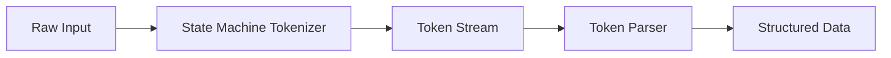

### 4. Explicit Error Handling

Functions return discriminated unions or throw typed errors. No silent failures.

```typescript
type ParseResult<T> = { success: true; value: T } | { success: false; error: ParseError }
```

### 5. Composition Over Configuration

Complex operations are built by composing simple functions rather than through configuration objects with many options.

---

## Module Composition

The library is organized into seven focused modules that compose together:

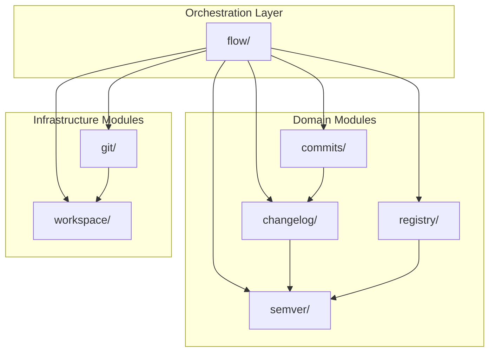

### Module Hierarchy

| Layer          | Modules                                          | Responsibility                     |
| -------------- | ------------------------------------------------ | ---------------------------------- |
| Orchestration  | `flow/`                                          | Version release workflow execution |
| Domain         | `changelog/`, `commits/`, `semver/`, `registry/` | Core versioning logic              |
| Infrastructure | `git/`, `workspace/`                             | File system and git operations     |

---

## Data Flow

### Version Release Flow

The primary use case—releasing a new version—flows through multiple modules:

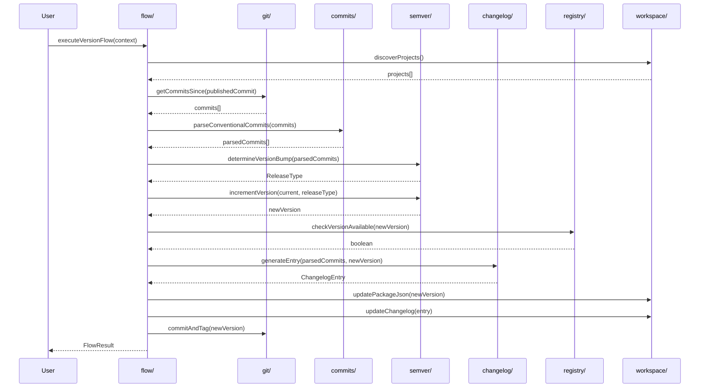

### Changelog Parsing Pipeline

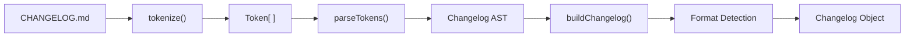

### Conventional Commit Parsing

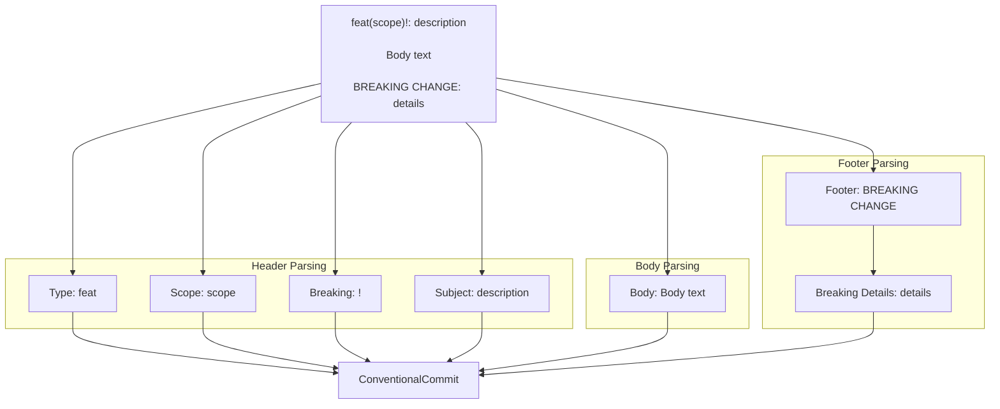

### Commit Classification Pipeline

When generating changelogs for monorepo projects, commits must be classified to determine which project(s) they belong to:

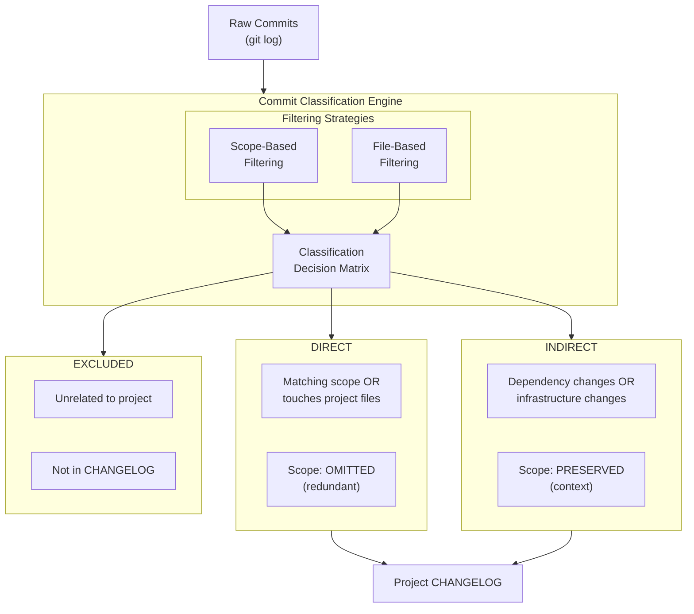

---

## Core Types

### Central Type Relationships

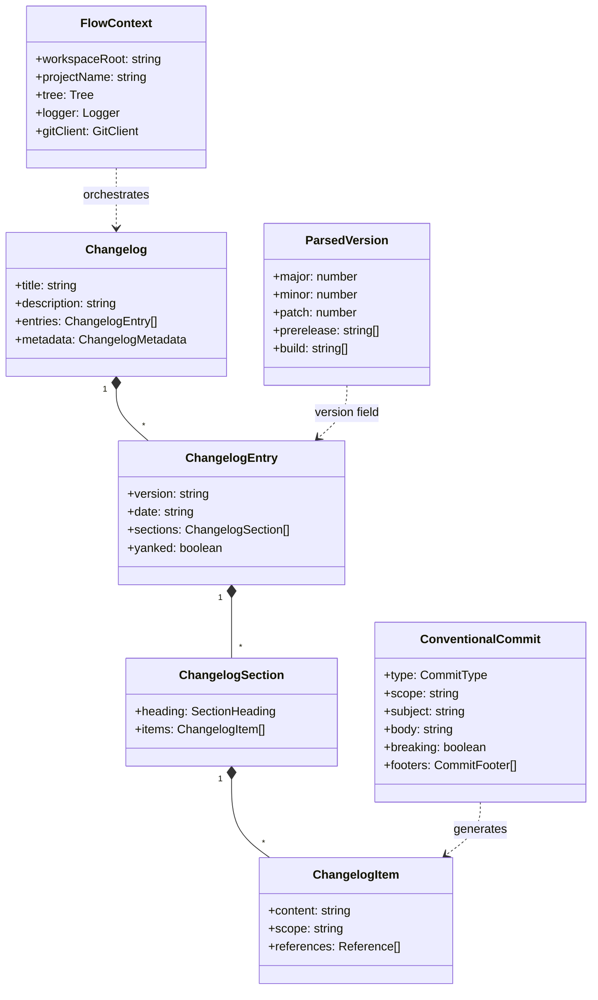

### Type Categories

| Category  | Types                                                              | Location     |
| --------- | ------------------------------------------------------------------ | ------------ |
| Changelog | `Changelog`, `ChangelogEntry`, `ChangelogSection`, `ChangelogItem` | `changelog/` |
| Commits   | `ConventionalCommit`, `CommitType`, `CommitFooter`                 | `commits/`   |
| Semver    | `ParsedVersion`, `ReleaseType`, `PreReleaseType`                   | `semver/`    |
| Git       | `GitClient`, `GitCommit`, `GitTag`, `GitLogEntry`                  | `git/`       |
| Registry  | `RegistryClient`, `PackageInfo`, `VersionInfo`                     | `registry/`  |
| Workspace | `Project`, `Workspace`, `PackageJson`                              | `workspace/` |
| Flow      | `FlowContext`, `FlowStep`, `FlowResult`, `FlowError`               | `flow/`      |

---

## Security Architecture

### Input Validation

All entry points validate input before processing:

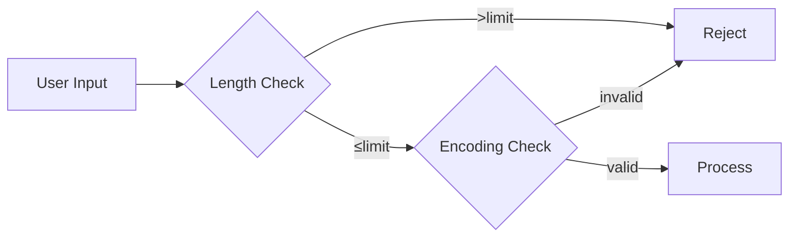

### Input Limits

| Input Type     | Maximum Length | Rationale                         |
| -------------- | -------------- | --------------------------------- |
| Commit message | 10,000 chars   | No legitimate commit exceeds this |
| Changelog file | 1 MB           | Prevents memory exhaustion        |
| Version string | 256 chars      | Per semver spec limits            |
| Package name   | 214 chars      | Per npm spec                      |

State-machine parsing ensures O(n) complexity for all inputs, providing predictable performance regardless of content patterns.

---

## Module Details

### changelog/

**Purpose:** Parse, manipulate, and serialize CHANGELOG.md files.

**Key Components:**

- `tokenize/` - Character-by-character markdown tokenizer
- `parse/` - Token-to-AST parser
- `format/` - Format detection (Keep a Changelog, Conventional, etc.)
- `render/` - AST-to-markdown serializer

**Architecture:**

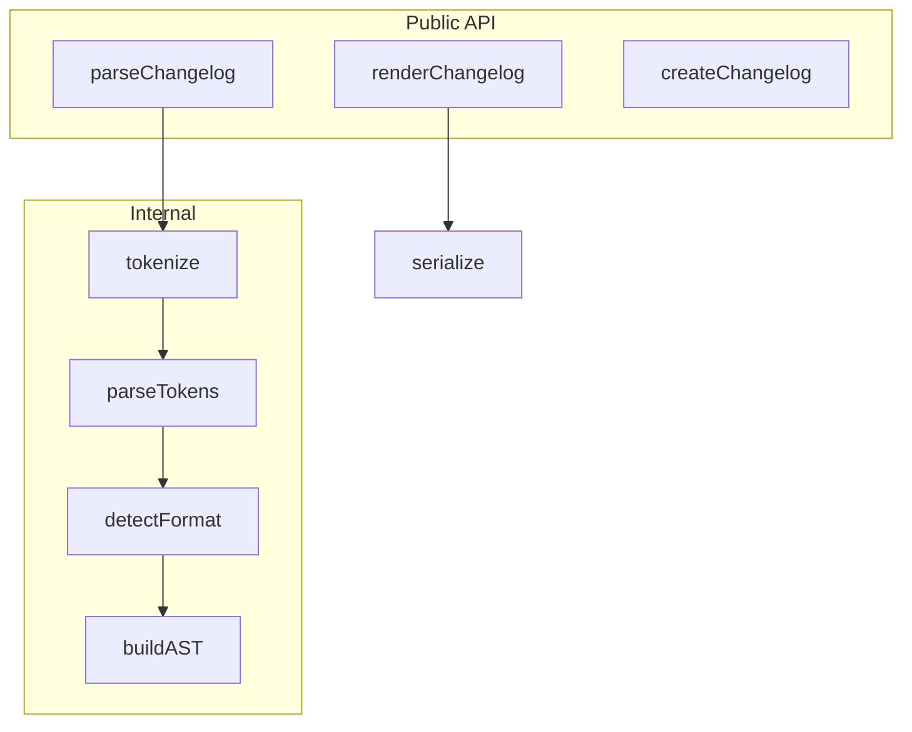

📖 [Full changelog/ documentation](./src/changelog/README.md)

---

### commits/

**Purpose:** Parse conventional commit messages into structured data.

**Key Components:**

- `parse/` - Commit message parser
- `types/` - Type definitions and constants
- `validate/` - Commit validation utilities

**Architecture:**

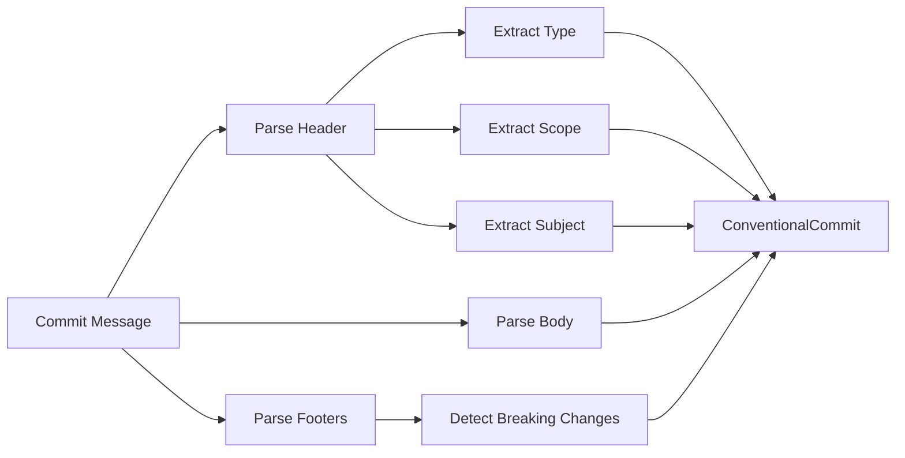

📖 [Full commits/ documentation](./src/commits/README.md)

---

### semver/

**Purpose:** Parse, compare, and manipulate semantic versions.

**Key Components:**

- `parse/` - Version string parser
- `compare/` - Version comparison functions
- `increment/` - Version bumping logic
- `range/` - Version range utilities

**Architecture:**

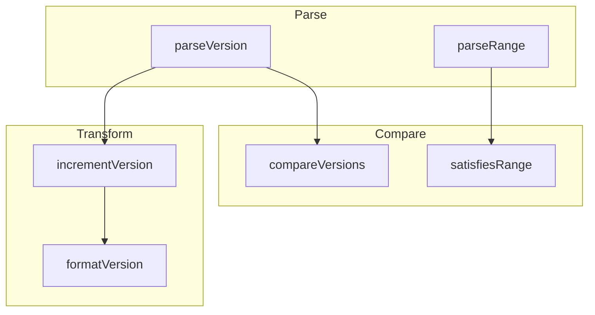

📖 [Full semver/ documentation](./src/semver/README.md)

---

### registry/

**Purpose:** Query npm registry for package and version information.

**Key Components:**

- `client/` - Registry client factory
- `fetch/` - HTTP fetch utilities
- `parse/` - Registry response parsers

**Architecture:**

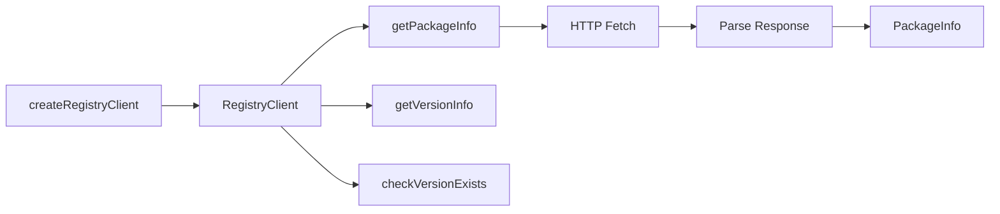

📖 [Full registry/ documentation](./src/registry/README.md)

---

### git/

**Purpose:** Git operations abstraction layer.

**Key Components:**

- `client/` - Git client factory
- `log/` - Commit history parsing
- `tag/` - Tag operations
- `branch/` - Branch operations
- `diff/` - Diff parsing

**Architecture:**

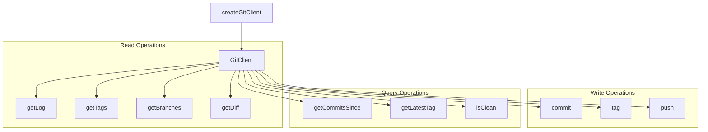

📖 [Full git/ documentation](./src/git/README.md)

---

### workspace/

**Purpose:** Workspace and project discovery, package.json manipulation.

**Key Components:**

- `discover/` - Project discovery
- `package-json/` - Package.json read/write
- `project/` - Project configuration
- `nx/` - Nx workspace integration

**Architecture:**

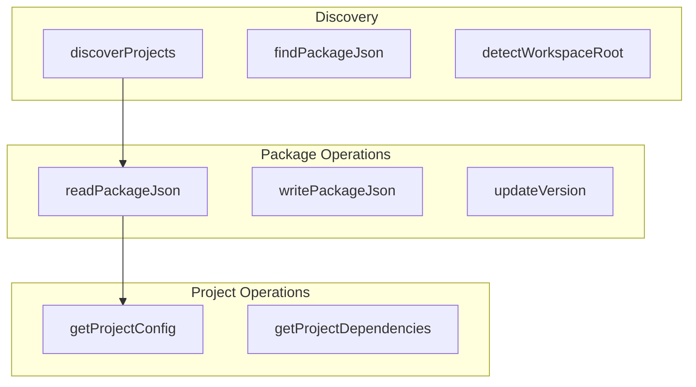

📖 [Full workspace/ documentation](./src/workspace/README.md)

---

### flow/

**Purpose:** Orchestrate version release workflows.

**Key Components:**

- `context/` - Flow context factory
- `steps/` - Individual flow steps
- `execute/` - Flow execution engine
- `validate/` - Pre-flight validation

**Architecture:**

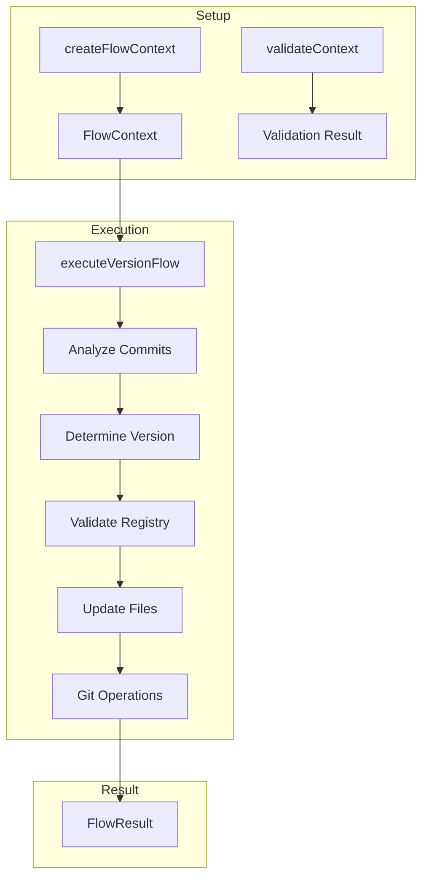

📖 [Full flow/ documentation](./src/flow/README.md)

---

## Further Reading

- [Main README](./README.md) - Installation and quick start
- [Module Documentation](./src/) - Per-module README files
- [Contributing Guide](../../CONTRIBUTING.md) - Development setup
- [Security Policy](../../SECURITY.md) - Vulnerability reporting
