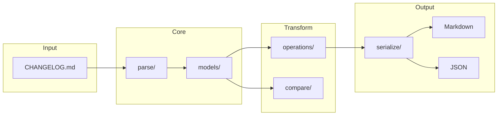
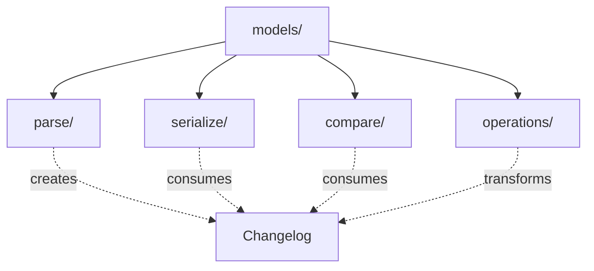
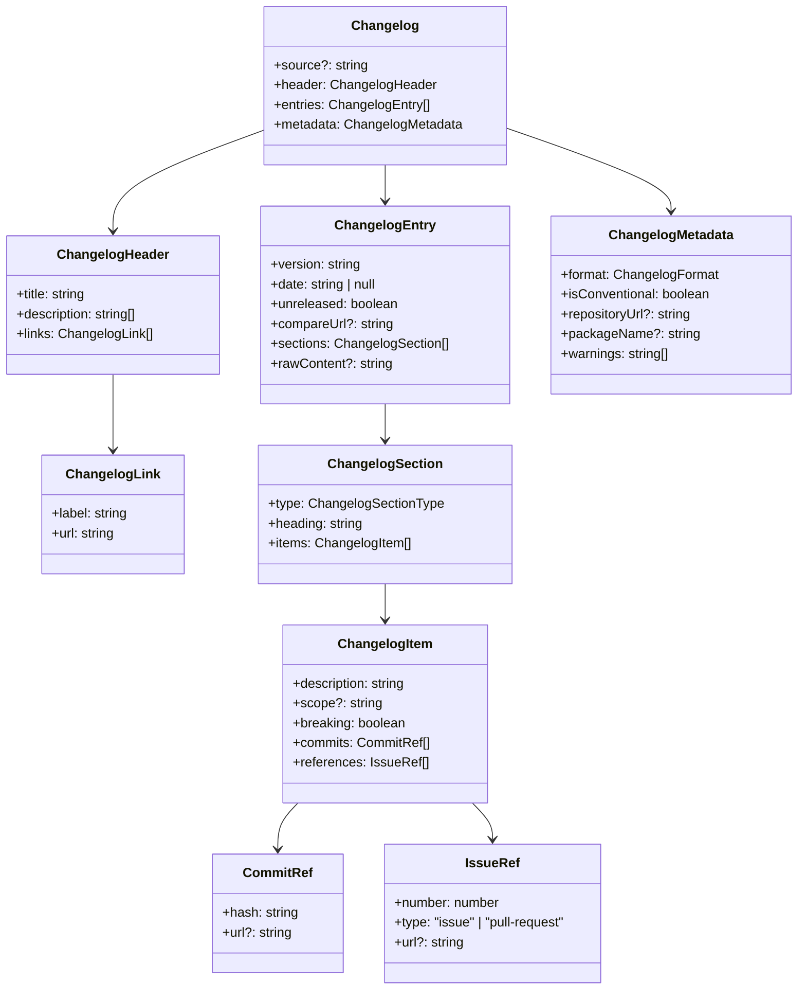
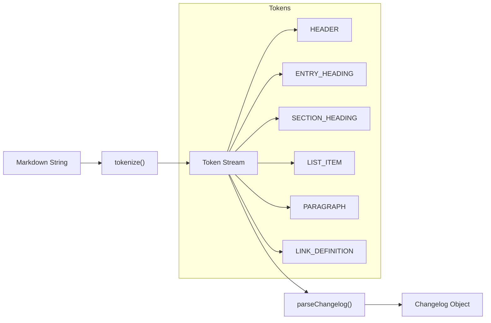
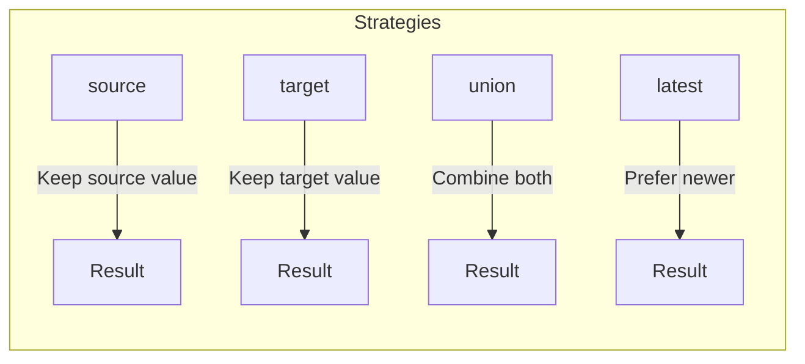

# Changelog Module

The changelog module provides comprehensive parsing, manipulation, and serialization of CHANGELOG.md files.

## Architecture Overview



### Module Dependencies



## Data Model



## Parse Pipeline



## Section Types

The module recognizes these standard changelog section types:

| Type            | Common Headings            |
| --------------- | -------------------------- |
| `breaking`      | Breaking Changes, BREAKING |
| `features`      | Features, Added, New       |
| `fixes`         | Bug Fixes, Fixed           |
| `performance`   | Performance, Perf          |
| `documentation` | Documentation, Docs        |
| `deprecations`  | Deprecated                 |
| `refactoring`   | Refactored, Refactor       |
| `tests`         | Tests, Testing             |
| `build`         | Build, Dependencies        |
| `ci`            | CI, Continuous Integration |
| `chores`        | Chores, Misc               |
| `other`         | Other (fallback)           |

## Usage Examples

### Parsing a Changelog

```typescript
import { parseChangelog } from '@hyperfrontend/versioning'

const markdown = `
# Changelog

## [1.0.0] - 2024-01-15

### Features
- Initial release
`

const changelog = parseChangelog(markdown)
```

### Creating a Changelog Programmatically

```typescript
import { createChangelog, createChangelogEntry, createChangelogSection, createChangelogItem } from '@hyperfrontend/versioning'

const changelog = createChangelog({
  header: { title: '# Changelog', description: [], links: [] },
  entries: [
    createChangelogEntry('1.0.0', {
      date: '2024-01-15',
      sections: [createChangelogSection('features', 'Features', [createChangelogItem('Initial release')])],
    }),
  ],
  metadata: { format: 'keep-a-changelog', isConventional: false, warnings: [] },
})
```

### Serializing to Markdown

```typescript
import { serializeChangelog } from '@hyperfrontend/versioning'

const markdown = serializeChangelog(changelog, {
  includeScope: true,
  useAsterisks: false,
})
```

### Comparing Changelogs

```typescript
import { isChangelogEqual, diffChangelogs } from '@hyperfrontend/versioning'

const areEqual = isChangelogEqual(changelog1, changelog2)
const diff = diffChangelogs(changelog1, changelog2)
```

### Filtering Entries

```typescript
import { filterByVersionRange, filterBreakingChanges } from '@hyperfrontend/versioning'

const recent = filterByVersionRange(changelog, '1.0.0', '2.0.0')
const breaking = filterBreakingChanges(changelog)
```

### Merging Changelogs

```typescript
import { mergeChangelogs } from '@hyperfrontend/versioning'

const result = mergeChangelogs(source, target, {
  entryStrategy: 'union',
  sectionStrategy: 'union',
  itemStrategy: 'union',
})
```

### Transforming Entries

```typescript
import { transformEntries, sortEntries, compact } from '@hyperfrontend/versioning'

const updated = transformEntries(changelog, (entry) => ({
  ...entry,
  date: entry.date ?? new Date().toISOString().split('T')[0],
}))

const sorted = sortEntries(updated)
const cleaned = compact(sorted)
```

## Merge Strategies



| Strategy | Entry Behavior        | Section Behavior   | Item Behavior          |
| -------- | --------------------- | ------------------ | ---------------------- |
| `source` | Use source entry      | Use source section | Use source item        |
| `target` | Use target entry      | Use target section | Use target item        |
| `union`  | Include both (unique) | Combine sections   | Combine items          |
| `latest` | Use newer entry       | Merge by type      | Replace by description |

## Design Principles

1. **Immutability**: All operations return new objects; inputs are never mutated
2. **No Regex**: Character-by-character parsing to prevent ReDoS vulnerabilities
3. **Functional**: Pure functions without class-based state
4. **Lossless**: Round-trip parsing preserves original formatting where possible
5. **Type-Safe**: Full TypeScript support with strict typing

## See Also

- [semver/](../semver/README.md) — Version parsing and comparison
- [commits/](../commits/README.md) — Generates changelog entries from commits
- [flow/](../flow/README.md) — Orchestrates changelog generation
- [workspace/](../workspace/README.md) — Discovers changelog files
- [Main README](../../README.md) — Package overview and quick start
- [ARCHITECTURE.md](../../ARCHITECTURE.md) — Design principles and data flow
