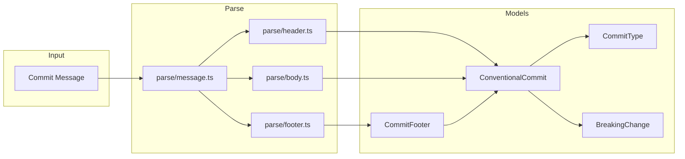

# commits/

Conventional commit parsing and models.

## Overview

Parsing and models for the [Conventional Commits](https://www.conventionalcommits.org/en/v1.0.0/) specification. Uses state-machine tokenization for predictable O(n) performance.



## API

### Models

| Export               | Description                                            | Implementation                              |
| -------------------- | ------------------------------------------------------ | ------------------------------------------- |
| `ConventionalCommit` | Parsed commit with type, scope, subject, body, footers | [conventional.ts](./models/conventional.ts) |
| `CommitFooter`       | Footer trailer with key, value, and separator          | [conventional.ts](./models/conventional.ts) |
| `CommitType`         | Standard types: feat, fix, docs, style, refactor, etc. | [commit-type.ts](./models/commit-type.ts)   |
| `BreakingChange`     | Breaking change info with source and description       | [breaking.ts](./models/breaking.ts)         |

### Factories

| Function                      | Description                           | Implementation                              |
| ----------------------------- | ------------------------------------- | ------------------------------------------- |
| `createConventionalCommit()`  | Create a commit from type and subject | [conventional.ts](./models/conventional.ts) |
| `createCommitFooter()`        | Create a footer trailer               | [conventional.ts](./models/conventional.ts) |
| `createBreakingFromSubject()` | Create breaking change from `!`       | [breaking.ts](./models/breaking.ts)         |
| `createBreakingFromFooter()`  | Create breaking change from footer    | [breaking.ts](./models/breaking.ts)         |
| `createNonBreaking()`         | Create non-breaking indicator         | [breaking.ts](./models/breaking.ts)         |

### Parsing

| Function                    | Description                                  | Implementation                   |
| --------------------------- | -------------------------------------------- | -------------------------------- |
| `parseConventionalCommit()` | Parse complete commit message                | [message.ts](./parse/message.ts) |
| `isConventionalCommit()`    | Check if message follows conventional format | [message.ts](./parse/message.ts) |
| `parseHeader()`             | Parse header line (type, scope, subject)     | [header.ts](./parse/header.ts)   |
| `parseBody()`               | Parse body section                           | [body.ts](./parse/body.ts)       |
| `parseFooters()`            | Parse footer trailers                        | [footer.ts](./parse/footer.ts)   |

### Commit Types

| Function           | Description                      | Implementation                            |
| ------------------ | -------------------------------- | ----------------------------------------- |
| `isStandardType()` | Check if type is standard        | [commit-type.ts](./models/commit-type.ts) |
| `isReleaseType()`  | Check if type triggers a release | [commit-type.ts](./models/commit-type.ts) |
| `getSemverBump()`  | Get semver bump level for type   | [commit-type.ts](./models/commit-type.ts) |

| Constant        | Description                             | Implementation                            |
| --------------- | --------------------------------------- | ----------------------------------------- |
| `COMMIT_TYPES`  | Map of standard types with descriptions | [commit-type.ts](./models/commit-type.ts) |
| `RELEASE_TYPES` | Types that trigger releases             | [commit-type.ts](./models/commit-type.ts) |
| `MINOR_TYPES`   | Types that trigger minor bumps          | [commit-type.ts](./models/commit-type.ts) |
| `PATCH_TYPES`   | Types that trigger patch bumps          | [commit-type.ts](./models/commit-type.ts) |

### Utilities

| Function          | Description                            | Implementation                             |
| ----------------- | -------------------------------------- | ------------------------------------------ |
| `replaceChar()`   | Replace all occurrences of a character | [replace-char.ts](./utils/replace-char.ts) |
| `hyphenToSpace()` | Normalize hyphenated keys to spaces    | [replace-char.ts](./utils/replace-char.ts) |

## Usage Examples

### Parsing Commits

```typescript
import { parseConventionalCommit, isConventionalCommit } from '@hyperfrontend/versioning'

// Parse a commit message
const commit = parseConventionalCommit('feat(api): add user endpoint')
console.log(commit.type) // 'feat'
console.log(commit.scope) // 'api'
console.log(commit.subject) // 'add user endpoint'

// Check format before parsing
if (isConventionalCommit(message)) {
  const parsed = parseConventionalCommit(message)
}
```

### Breaking Changes

```typescript
import { parseConventionalCommit } from '@hyperfrontend/versioning'

// Breaking change via !
const breaking1 = parseConventionalCommit('feat!: remove deprecated API')
console.log(breaking1.breaking) // true

// Breaking change via footer
const breaking2 = parseConventionalCommit(`fix: update signature

BREAKING CHANGE: The return type is now a Promise`)
console.log(breaking2.breaking) // true
console.log(breaking2.breakingDescription) // 'The return type is now a Promise'
```

### Body and Footers

```typescript
import { parseConventionalCommit } from '@hyperfrontend/versioning'

const commit = parseConventionalCommit(`feat(core): add validation

This adds input validation to all public methods.
Invalid inputs now throw descriptive errors.

Refs: ABC-123
Closes #456`)

console.log(commit.body)
// 'This adds input validation to all public methods.\nInvalid inputs now throw descriptive errors.'

console.log(commit.footers)
// [
//   { key: 'Refs', value: 'ABC-123', separator: ':' },
//   { key: 'Closes', value: '456', separator: ' #' }
// ]
```

### Creating Commits

```typescript
import { createConventionalCommit, createCommitFooter } from '@hyperfrontend/versioning'

const commit = createConventionalCommit('feat', 'add feature', {
  scope: 'api',
  body: 'Detailed description',
  footers: [createCommitFooter('Refs', 'ABC-123'), createCommitFooter('Closes', '456', ' #')],
  breaking: true,
})

console.log(commit.raw)
// 'feat(api)!: add feature\n\nDetailed description\n\nRefs: ABC-123\nCloses #456'
```

### Semver Integration

```typescript
import { parseConventionalCommit, getSemverBump } from '@hyperfrontend/versioning'

const commit = parseConventionalCommit('feat: add feature')
const bump = getSemverBump(commit.type, commit.breaking)
console.log(bump) // 'minor'

const breaking = parseConventionalCommit('fix!: change API')
const breakingBump = getSemverBump(breaking.type, breaking.breaking)
console.log(breakingBump) // 'major'
```

## Conventional Commits Format

```
<type>[optional scope][!]: <description>

[optional body]

[optional footer(s)]
```

### Header

- **type**: Describes the category of change (feat, fix, docs, etc.)
- **scope**: Optional context in parentheses (api, core, cli)
- **!**: Optional breaking change indicator
- **description**: Short summary of the change

### Body

Free-form text separated from header by a blank line. Can span multiple paragraphs.

### Footers

Token-based trailers in `key: value` or `key #value` format:

```
Refs: ABC-123
Fixes #456
BREAKING CHANGE: API signature changed
```

## Directory Structure

```
commits/
├── index.ts              # Public exports
├── parse/                # Message parsing
│   ├── header.ts         # Header line parsing
│   ├── body.ts           # Body section parsing
│   ├── footer.ts         # Footer trailer parsing
│   └── message.ts        # Full message orchestration
├── models/               # Data structures
│   ├── conventional.ts   # ConventionalCommit type & factories
│   ├── commit-type.ts    # CommitType, bump mappings
│   └── breaking.ts       # BreakingChange type & factories
└── utils/                # Utilities
    └── replace-char.ts   # Character replacement helpers
```

## Security

- **No regex**: All parsing uses character-by-character iteration
- **Input limits**: 10KB maximum message length enforced
- **ReDoS safe**: No regular expressions means no catastrophic backtracking

## See Also

- [changelog/](../changelog/README.md) — Generates entries from commits
- [flow/](../flow/README.md) — Analyzes commits to determine version bumps
- [semver/](../semver/README.md) — Version bumping based on commit types
- [Main README](../../README.md) — Package overview and quick start
- [ARCHITECTURE.md](../../ARCHITECTURE.md) — Design principles and data flow
