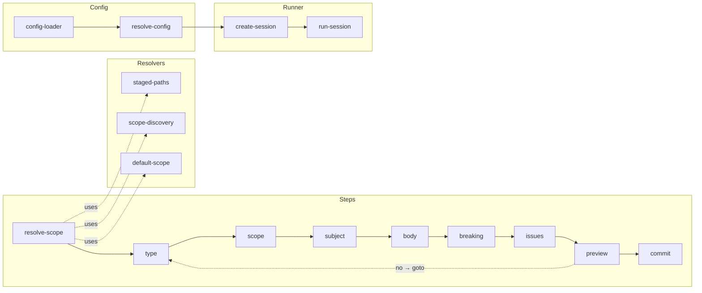

# author/

Interactive commit authoring session.

## Overview

Step-sequenced session that accumulates a conventional commit draft
field-by-field (type → scope → subject → body → breaking → issues), renders
a preview, and (by default) executes `git commit`. Each step is a small
pure-ish function operating over a shared [`SessionContext`](https://www.hyperfrontend.dev/docs/libraries/versioning/commits/author/#api-SessionContext); the runner
walks the list, honors [`goto`](https://www.hyperfrontend.dev/docs/libraries/versioning/commits/author/#api-goto) jumps (used by the preview's
"commit this message? no" restart), and surfaces Ctrl-C as a [`cancelled`](https://www.hyperfrontend.dev/docs/libraries/versioning/commits/author/#api-cancelled)
outcome.



## API

| Export                                                                                                                     | Description                                                                                                                                                                                                                                                                                                                                                                                                                                                                                                                                                                                                                                                                                                                                                                                                                                                                                                                                                                      |
| -------------------------------------------------------------------------------------------------------------------------- | -------------------------------------------------------------------------------------------------------------------------------------------------------------------------------------------------------------------------------------------------------------------------------------------------------------------------------------------------------------------------------------------------------------------------------------------------------------------------------------------------------------------------------------------------------------------------------------------------------------------------------------------------------------------------------------------------------------------------------------------------------------------------------------------------------------------------------------------------------------------------------------------------------------------------------------------------------------------------------- |
| [`createAuthorSession`](https://www.hyperfrontend.dev/docs/libraries/versioning/commits/author/#api-createAuthorSession)   | Build a session from a partial config (steps default to [`conventionalPreset`](https://www.hyperfrontend.dev/docs/libraries/versioning/commits/author/#api-conventionalPreset))                                                                                                                                                                                                                                                                                                                                                                                                                                                                                                                                                                                                                                                                                                                                                                                                  |
| [`runAuthorSession`](https://www.hyperfrontend.dev/docs/libraries/versioning/commits/author/#api-runAuthorSession)         | Execute the session; returns `{ status: 'committed' \| 'cancelled', message? }`                                                                                                                                                                                                                                                                                                                                                                                                                                                                                                                                                                                                                                                                                                                                                                                                                                                                                                  |
| [`loadCommitConfig`](https://www.hyperfrontend.dev/docs/libraries/versioning/commits/author/#api-loadCommitConfig)         | Discover `commit.config.{js,mjs,cjs}` upward from [`cwd`](https://www.hyperfrontend.dev/docs/libraries/versioning/commits/author/#api-LoadCommitConfigOptions-prop-cwd)                                                                                                                                                                                                                                                                                                                                                                                                                                                                                                                                                                                                                                                                                                                                                                                                          |
| [`resolveSessionConfig`](https://www.hyperfrontend.dev/docs/libraries/versioning/commits/author/#api-resolveSessionConfig) | Overlay a partial config on the built-in defaults                                                                                                                                                                                                                                                                                                                                                                                                                                                                                                                                                                                                                                                                                                                                                                                                                                                                                                                                |
| [`conventionalPreset`](https://www.hyperfrontend.dev/docs/libraries/versioning/commits/author/#api-conventionalPreset)     | Default ordered step list (D8)                                                                                                                                                                                                                                                                                                                                                                                                                                                                                                                                                                                                                                                                                                                                                                                                                                                                                                                                                   |
| Individual steps                                                                                                           | [`resolveScopeStep`](https://www.hyperfrontend.dev/docs/libraries/versioning/commits/author/#api-resolveScopeStep), [`typeStep`](https://www.hyperfrontend.dev/docs/libraries/versioning/commits/author/#api-typeStep), [`scopeStep`](https://www.hyperfrontend.dev/docs/libraries/versioning/commits/author/#api-scopeStep), [`subjectStep`](https://www.hyperfrontend.dev/docs/libraries/versioning/commits/author/#api-subjectStep), [`bodyStep`](https://www.hyperfrontend.dev/docs/libraries/versioning/commits/author/#api-bodyStep), [`breakingStep`](https://www.hyperfrontend.dev/docs/libraries/versioning/commits/author/#api-breakingStep), [`issuesStep`](https://www.hyperfrontend.dev/docs/libraries/versioning/commits/author/#api-issuesStep), [`previewStep`](https://www.hyperfrontend.dev/docs/libraries/versioning/commits/author/#api-previewStep), [`commitStep`](https://www.hyperfrontend.dev/docs/libraries/versioning/commits/author/#api-commitStep) |
| [`SessionConfig`](https://www.hyperfrontend.dev/docs/libraries/versioning/commits/author/#api-SessionConfig)               | Fully resolved config type consumed by the runner                                                                                                                                                                                                                                                                                                                                                                                                                                                                                                                                                                                                                                                                                                                                                                                                                                                                                                                                |
| [`SessionContext`](https://www.hyperfrontend.dev/docs/libraries/versioning/commits/author/#api-SessionContext)             | Mutable container threaded through every step                                                                                                                                                                                                                                                                                                                                                                                                                                                                                                                                                                                                                                                                                                                                                                                                                                                                                                                                    |

## Configuration

The `commit.config.{js,mjs,cjs}` file exports a [`PartialSessionConfig`](https://www.hyperfrontend.dev/docs/libraries/versioning/commits/author/#api-PartialSessionConfig):

```javascript
// commit.config.cjs
module.exports = {
  types: [
    { name: 'feat', description: 'A new feature' },
    { name: 'fix', description: 'A bug fix' },
  ],
  scopeMulti: false,
  scopeOptional: false,
  // Filter discovered projects; receives { path, name } per candidate
  scopeFilter: ({ path }) => !path.includes('/__fixtures__/'),
  headerMaxLength: 72,
  // Ruleset reused by the `cl` validator bin and the preview step
  validateRuleset: {
    'type-enum': ['error', { types: ['feat', 'fix', 'docs', 'chore'] }],
    'subject-empty': ['error'],
    'header-max-length': ['warn', { maxLength: 72 }],
    'imperative-mood': ['warn'],
  },
  skipCommit: false,
}
```

Key fields:

| Field                                                                                                                               | Behaviour                                                                                                                                                                                                                                                                                  |
| ----------------------------------------------------------------------------------------------------------------------------------- | ------------------------------------------------------------------------------------------------------------------------------------------------------------------------------------------------------------------------------------------------------------------------------------------ |
| [`types`](https://www.hyperfrontend.dev/docs/libraries/versioning/commits/author/#api-SessionConfig-prop-types)                     | Conventional types shown in the `type` step (falls back to the 11-entry Conventional list)                                                                                                                                                                                                 |
| [`scopeFilter`](https://www.hyperfrontend.dev/docs/libraries/versioning/commits/author/#api-SessionConfig-prop-scopeFilter)         | Exclude discovered projects from the scope picker by [`path`](https://www.hyperfrontend.dev/docs/libraries/versioning/commits/author/#api-ScopeFilterContext-prop-path)/[`name`](https://www.hyperfrontend.dev/docs/libraries/versioning/commits/author/#api-ScopeFilterContext-prop-name) |
| [`headerMaxLength`](https://www.hyperfrontend.dev/docs/libraries/versioning/commits/author/#api-SessionConfig-prop-headerMaxLength) | Drives the live countdown in the [`subject`](https://www.hyperfrontend.dev/docs/libraries/versioning/commits/author/#api-subjectStep) step (green → yellow → red); `null` disables                                                                                                         |
| [`validateRuleset`](https://www.hyperfrontend.dev/docs/libraries/versioning/commits/author/#api-SessionConfig-prop-validateRuleset) | Shared with [`cl`](https://github.com/AndrewRedican/hyperfrontend/blob/main/libs/versioning/src/bin/cl.ts) and the preview step; see `commits/validate` presets                                                                                                                            |
| [`skipCommit`](https://www.hyperfrontend.dev/docs/libraries/versioning/commits/author/#api-SessionConfig-prop-skipCommit)           | When true, the session returns the formatted message without touching the git index                                                                                                                                                                                                        |
| [`commitExecutor`](https://www.hyperfrontend.dev/docs/libraries/versioning/commits/author/#api-SessionConfig-prop-commitExecutor)   | Inject a custom executor (e.g. signed commits, alternate cwd) instead of the default                                                                                                                                                                                                       |

Resolution:

1. `--config <path>` override (relative paths resolve against [`cwd`](https://www.hyperfrontend.dev/docs/libraries/versioning/commits/author/#api-LoadCommitConfigOptions-prop-cwd))
2. Walk upward from [`cwd`](https://www.hyperfrontend.dev/docs/libraries/versioning/commits/author/#api-LoadCommitConfigOptions-prop-cwd) looking for one of `commit.config.{js,mjs,cjs}`
3. Stop at a workspace boundary (`.git/`, `pnpm-workspace.yaml`)

## Usage

```typescript
import { createAuthorSession, runAuthorSession } from '@hyperfrontend/versioning/commits/author'

const session = createAuthorSession({ config: { skipCommit: false } })
const outcome = await runAuthorSession(session)

if (outcome.status === 'committed') {
  console.log('Committed:', outcome.message)
} else {
  console.error('Cancelled:', outcome.error?.message ?? '<user abort>')
  process.exit(130)
}
```

## Design Decisions

- **D8**: Step order: `resolve-scope → type → scope → subject → body → breaking → issues → preview → commit`
- **D15c**: Commit execution is default-on; inject [`skipCommit`](https://www.hyperfrontend.dev/docs/libraries/versioning/commits/author/#api-SessionConfig-prop-skipCommit) / [`commitExecutor`](https://www.hyperfrontend.dev/docs/libraries/versioning/commits/author/#api-SessionConfig-prop-commitExecutor) to override
- **D17a**: Config file lives at workspace root (not in `package.json`)
- **E1a**: Empty staging refuses with an error; bins translate that to a non-zero exit code
