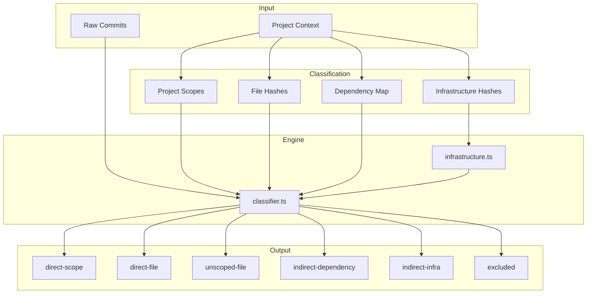

# classify/

Commit classification engine for monorepo changelog attribution.

## Overview

This module provides intelligent commit classification for monorepo versioning. It determines whether a commit should appear in a project's changelog and how its scope should be displayed based on multiple attribution sources.



## Commit Sources

| Source                | Description                            | Included | Scope Display |
| --------------------- | -------------------------------------- | -------- | ------------- |
| `direct-scope`        | Scope matches project                  | ✅       | Omitted       |
| `direct-file`         | Files touched in project               | ✅       | Preserved     |
| `unscoped-file`       | No scope, but touched project files    | ✅       | None          |
| `indirect-dependency` | Commit to a dependency package         | ✅       | Preserved     |
| `indirect-infra`      | Commit to build/tooling infrastructure | ✅       | Preserved     |
| `unscoped-global`     | No scope, no project files touched     | ❌       | N/A           |
| `excluded`            | Does not relate to project             | ❌       | N/A           |

## Usage Examples

### Basic Classification

```typescript
import { classifyCommits, createClassificationContext, deriveProjectScopes } from '@hyperfrontend/versioning'

// Create context with project info
const context = createClassificationContext({
  projectScopes: deriveProjectScopes('lib-cryptography'),
  fileCommitHashes: new Set(['abc123', 'def456']), // From git log --path
})

// Classify commits
const result = classifyCommits(commits, context)

// Access results
console.log(result.included.length) // Commits for changelog
console.log(result.summary) // Statistics
```

### With Dependency Tracking

```typescript
import { classifyCommits, createClassificationContext, deriveProjectScopes } from '@hyperfrontend/versioning'

const context = createClassificationContext({
  projectScopes: deriveProjectScopes('lib-app'),
  fileCommitHashes: new Set(['abc123']),
  // Track dependency changes
  dependencyCommitMap: new Map([
    ['lib-utils', new Set(['xyz789'])],
    ['lib-core', new Set(['uvw456'])],
  ]),
})

const result = classifyCommits(commits, context)

// Commits to lib-utils and lib-core appear as indirect-dependency
result.included.filter((c) => c.source === 'indirect-dependency')
```

### With Infrastructure Detection

```typescript
import {
  classifyCommits,
  createClassificationContext,
  deriveProjectScopes,
  scopeMatcher,
  scopePrefixMatcher,
  anyOf,
} from '@hyperfrontend/versioning'

const context = createClassificationContext({
  projectScopes: deriveProjectScopes('lib-app'),
  fileCommitHashes: new Set(['abc123']),
  // Track infrastructure commits
  infrastructureCommitHashes: new Set(['infra789']),
})

// Or use composable matchers for scope-based detection
const infraMatcher = anyOf(scopeMatcher(['ci', 'build']), scopePrefixMatcher(['tool-']))
```

### Converting to Changelog Format

```typescript
import { classifyCommits, toChangelogCommit, filterIncluded } from '@hyperfrontend/versioning'

const result = classifyCommits(commits, context)

// Get changelog-ready commits with scope rules applied
const changelogCommits = filterIncluded(result).map(toChangelogCommit)

// direct-scope commits have scope omitted (redundant)
// indirect commits have scope preserved (provides context)
```

## Scope Display Rules

The classification engine applies intelligent scope display rules:

| Source                | Original Scope     | Displayed Scope | Rationale                        |
| --------------------- | ------------------ | --------------- | -------------------------------- |
| `direct-scope`        | `lib-cryptography` | (omitted)       | Redundant in project's CHANGELOG |
| `direct-file`         | `lib-other`        | `lib-other`     | Informative context              |
| `indirect-dependency` | `lib-utils`        | `lib-utils`     | Shows dependency chain           |
| `indirect-infra`      | `tool-package`     | `tool-package`  | Shows infrastructure source      |

## Filtering Strategies

Three strategies are supported via the flow configuration:

| Strategy     | Description                        | Use Case                |
| ------------ | ---------------------------------- | ----------------------- |
| `hybrid`     | Scope matching + file validation   | Default, most accurate  |
| `scope-only` | Trust scope completely             | Disciplined teams, fast |
| `file-only`  | Ignore scopes, use file paths only | Non-scoped repositories |
| `inferred`   | Auto-detect from commit history    | External codebases      |

## Configuration

Classification is configured via `ScopeFilteringConfig` in the flow:

```typescript
import { createVersionFlow } from '@hyperfrontend/versioning'

const flow = createVersionFlow('conventional', {
  scopeFiltering: {
    strategy: 'hybrid', // default
    includeScopes: ['shared-utils'], // extra scopes to include
    excludeScopes: ['release', 'deps'], // default exclusions
    trackDependencyChanges: true, // enable Phase 4
    infrastructure: {
      paths: ['tools/', '.github/'],
      scopes: ['ci', 'build'],
    },
  },
})
```

## Design Principles

1. **Accuracy over speed**: Multi-source validation ensures correct attribution
2. **Opt-in behavior**: Dependency and infrastructure tracking are explicit
3. **Graceful degradation**: Missing context results in conservative classification
4. **Transparency**: Classification source is preserved for auditing
