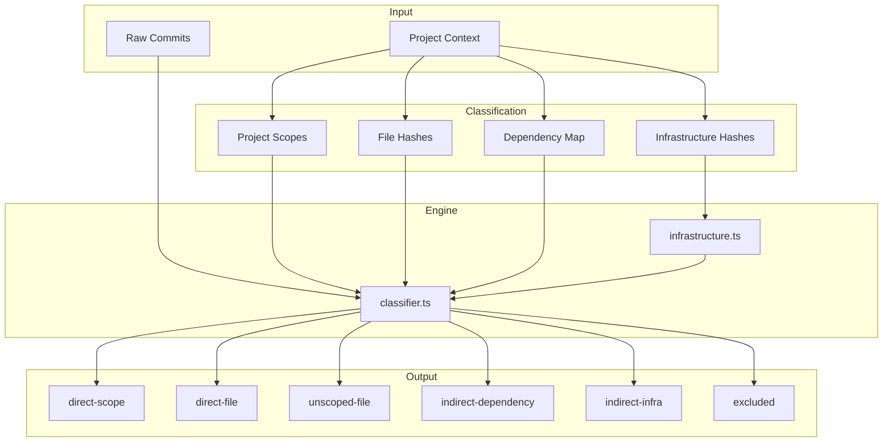

# classify/

Commit classification engine for monorepo changelog attribution.

## Overview

This module provides intelligent commit classification for monorepo versioning. It determines whether a commit should appear in a project's changelog and how its scope should be displayed based on multiple attribution sources.



## Commit Sources

| Source                | Description                            | Included | Scope Display |
| --------------------- | -------------------------------------- | -------- | ------------- |
| `direct-scope`        | Scope matches project                  | ✅       | Omitted       |
| `direct-file`         | Files touched in project               | ✅       | Preserved     |
| `unscoped-file`       | No scope, but touched project files    | ✅       | None          |
| `indirect-dependency` | Commit to a dependency package         | ✅       | Preserved     |
| `indirect-infra`      | Commit to build/tooling infrastructure | ✅       | Preserved     |
| `unscoped-global`     | No scope, no project files touched     | ❌       | N/A           |
| `excluded`            | Does not relate to project             | ❌       | N/A           |

## API

### Models

| Export                  | Description                                 | Implementation           |
| ----------------------- | ------------------------------------------- | ------------------------ |
| `CommitSource`          | Classification source type                  | [models.ts](./models.ts) |
| `ClassifiedCommit`      | Commit with classification metadata         | [models.ts](./models.ts) |
| `ClassificationContext` | Context for classification (scopes, hashes) | [models.ts](./models.ts) |
| `ClassificationResult`  | Result with included/excluded commits       | [models.ts](./models.ts) |
| `ClassificationSummary` | Statistics about classification             | [models.ts](./models.ts) |

### Classification Functions

| Function                        | Description                              | Implementation                   |
| ------------------------------- | ---------------------------------------- | -------------------------------- |
| `classifyCommit(commit, ctx)`   | Classify a single commit                 | [classifier.ts](./classifier.ts) |
| `classifyCommits(commits, ctx)` | Classify multiple commits                | [classifier.ts](./classifier.ts) |
| `createClassificationContext()` | Create classification context            | [classifier.ts](./classifier.ts) |
| `toChangelogCommit(classified)` | Convert to changelog format              | [classifier.ts](./classifier.ts) |
| `filterIncluded(result)`        | Filter to only included commits          | [classifier.ts](./classifier.ts) |
| `extractConventionalCommits()`  | Extract conventional commits from result | [classifier.ts](./classifier.ts) |

### Project Scopes

| Function                | Description                            | Implementation                           |
| ----------------------- | -------------------------------------- | ---------------------------------------- |
| `deriveProjectScopes()` | Generate scope variations for matching | [project-scopes.ts](./project-scopes.ts) |
| `scopeMatchesProject()` | Check if scope matches project         | [project-scopes.ts](./project-scopes.ts) |
| `scopeIsExcluded()`     | Check if scope is excluded             | [project-scopes.ts](./project-scopes.ts) |

| Constant                   | Description                                     | Implementation                           |
| -------------------------- | ----------------------------------------------- | ---------------------------------------- |
| `DEFAULT_EXCLUDE_SCOPES`   | Default scopes to exclude (`release`, `deps`)   | [project-scopes.ts](./project-scopes.ts) |
| `DEFAULT_PROJECT_PREFIXES` | Default project prefixes (`lib-`, `app-`, etc.) | [project-scopes.ts](./project-scopes.ts) |

### Infrastructure Matchers

| Function                       | Description                           | Implementation                           |
| ------------------------------ | ------------------------------------- | ---------------------------------------- |
| `scopeMatcher(scopes)`         | Match exact scopes                    | [infrastructure.ts](./infrastructure.ts) |
| `scopePrefixMatcher(prefixes)` | Match scope prefixes (e.g., `tool-*`) | [infrastructure.ts](./infrastructure.ts) |
| `scopeRegexMatcher(pattern)`   | Regex-based scope matching            | [infrastructure.ts](./infrastructure.ts) |
| `messageMatcher(patterns)`     | Match commit message content          | [infrastructure.ts](./infrastructure.ts) |
| `anyOf(...matchers)`           | OR composition                        | [infrastructure.ts](./infrastructure.ts) |
| `allOf(...matchers)`           | AND composition                       | [infrastructure.ts](./infrastructure.ts) |
| `not(matcher)`                 | Negation                              | [infrastructure.ts](./infrastructure.ts) |
| `buildInfrastructureMatcher()` | Build matcher from config             | [infrastructure.ts](./infrastructure.ts) |
| `evaluateInfrastructure()`     | Evaluate if commit is infrastructure  | [infrastructure.ts](./infrastructure.ts) |

| Constant                      | Description                              | Implementation                           |
| ----------------------------- | ---------------------------------------- | ---------------------------------------- |
| `CI_SCOPE_MATCHER`            | Matches ci, cd, build, pipeline, etc.    | [infrastructure.ts](./infrastructure.ts) |
| `TOOLING_SCOPE_MATCHER`       | Matches tooling, workspace, monorepo, nx | [infrastructure.ts](./infrastructure.ts) |
| `TOOL_PREFIX_MATCHER`         | Matches tool-\* prefixed scopes          | [infrastructure.ts](./infrastructure.ts) |
| `DEFAULT_INFRA_SCOPE_MATCHER` | Combined CI + tooling + tool-prefix      | [infrastructure.ts](./infrastructure.ts) |

## Usage Examples

### Basic Classification

```typescript
import { classifyCommits, createClassificationContext, deriveProjectScopes } from '@hyperfrontend/versioning'

// Create context with project info
const context = createClassificationContext({
  projectScopes: deriveProjectScopes('lib-cryptography'),
  fileCommitHashes: new Set(['abc123', 'def456']), // From git log --path
})

// Classify commits
const result = classifyCommits(commits, context)

// Access results
console.log(result.included.length) // Commits for changelog
console.log(result.summary) // Statistics
```

### With Dependency Tracking

```typescript
import { classifyCommits, createClassificationContext, deriveProjectScopes } from '@hyperfrontend/versioning'

const context = createClassificationContext({
  projectScopes: deriveProjectScopes('lib-app'),
  fileCommitHashes: new Set(['abc123']),
  // Track dependency changes
  dependencyCommitMap: new Map([
    ['lib-utils', new Set(['xyz789'])],
    ['lib-core', new Set(['uvw456'])],
  ]),
})

const result = classifyCommits(commits, context)

// Commits to lib-utils and lib-core appear as indirect-dependency
result.included.filter((c) => c.source === 'indirect-dependency')
```

### With Infrastructure Detection

```typescript
import {
  classifyCommits,
  createClassificationContext,
  deriveProjectScopes,
  scopeMatcher,
  scopePrefixMatcher,
  anyOf,
} from '@hyperfrontend/versioning'

const context = createClassificationContext({
  projectScopes: deriveProjectScopes('lib-app'),
  fileCommitHashes: new Set(['abc123']),
  // Track infrastructure commits
  infrastructureCommitHashes: new Set(['infra789']),
})

// Or use composable matchers for scope-based detection
const infraMatcher = anyOf(scopeMatcher(['ci', 'build']), scopePrefixMatcher(['tool-']))
```

### Converting to Changelog Format

```typescript
import { classifyCommits, toChangelogCommit, filterIncluded } from '@hyperfrontend/versioning'

const result = classifyCommits(commits, context)

// Get changelog-ready commits with scope rules applied
const changelogCommits = filterIncluded(result).map(toChangelogCommit)

// direct-scope commits have scope omitted (redundant)
// indirect commits have scope preserved (provides context)
```

## Scope Display Rules

The classification engine applies intelligent scope display rules:

| Source                | Original Scope     | Displayed Scope | Rationale                        |
| --------------------- | ------------------ | --------------- | -------------------------------- |
| `direct-scope`        | `lib-cryptography` | (omitted)       | Redundant in project's CHANGELOG |
| `direct-file`         | `lib-other`        | `lib-other`     | Informative context              |
| `indirect-dependency` | `lib-utils`        | `lib-utils`     | Shows dependency chain           |
| `indirect-infra`      | `tool-package`     | `tool-package`  | Shows infrastructure source      |

## Filtering Strategies

Three strategies are supported via the flow configuration:

| Strategy     | Description                        | Use Case                |
| ------------ | ---------------------------------- | ----------------------- |
| `hybrid`     | Scope matching + file validation   | Default, most accurate  |
| `scope-only` | Trust scope completely             | Disciplined teams, fast |
| `file-only`  | Ignore scopes, use file paths only | Non-scoped repositories |
| `inferred`   | Auto-detect from commit history    | External codebases      |

## Configuration

Classification is configured via `ScopeFilteringConfig` in the flow:

```typescript
import { createVersionFlow } from '@hyperfrontend/versioning'

const flow = createVersionFlow('conventional', {
  scopeFiltering: {
    strategy: 'hybrid', // default
    includeScopes: ['shared-utils'], // extra scopes to include
    excludeScopes: ['release', 'deps'], // default exclusions
    trackDependencyChanges: true, // enable Phase 4
    infrastructure: {
      paths: ['tools/', '.github/'],
      scopes: ['ci', 'build'],
    },
  },
})
```

## Design Principles

1. **Accuracy over speed**: Multi-source validation ensures correct attribution
2. **Opt-in behavior**: Dependency and infrastructure tracking are explicit
3. **Graceful degradation**: Missing context results in conservative classification
4. **Transparency**: Classification source is preserved for auditing
