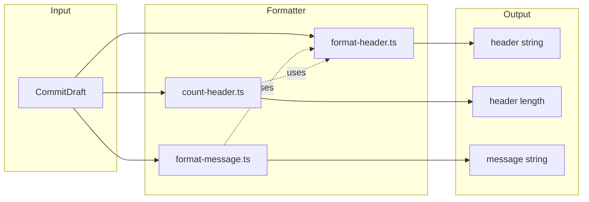

# format/

Pure formatter for commit drafts.

## Overview

Renders a `CommitDraft` (the partial, in-progress shape of a
`ConventionalCommit`) into the exact message string that will land in
`.git/COMMIT_EDITMSG`. Used by the authoring session's preview step and by
the live 72-character countdown in the subject step.



## API

| Export                              | Description                                                 | Implementation                           |
| ----------------------------------- | ----------------------------------------------------------- | ---------------------------------------- |
| `CommitDraft`                       | Partial shape of `ConventionalCommit` used while authoring  | [models/draft.ts](./models/draft.ts)     |
| `toDraft(commit)`                   | Promotes a parsed `ConventionalCommit` to an editable draft | [models/draft.ts](./models/draft.ts)     |
| `formatHeader(draft)`               | Builds the `type(scope)!: subject` header                   | [format-header.ts](./format-header.ts)   |
| `countHeaderLength(draft, subject)` | Counts the header length using an explicit subject override | [count-header.ts](./count-header.ts)     |
| `formatCommitMessage(draft)`        | Renders the full message (header + body + footers)          | [format-message.ts](./format-message.ts) |

## Behavior

- **Missing fields render empty.** Drafts accumulate field-by-field, so the
  formatter tolerates any combination of absent values rather than throwing.
  `formatHeader({ type: 'fix' })` returns `'fix: '`.
- **Multi-scope joins with `,`.** Matches the parser format —
  `scope: ['a', 'b']` → `(a,b)`.
- **Breaking marker precedes the colon.** `breaking: true` adds `!` after
  the (optional) scope: `feat(core)!: subject`.
- **`BREAKING CHANGE:` footer is synthesized** when `breaking` and
  `breakingDescription` are set and no existing `BREAKING CHANGE` /
  `BREAKING-CHANGE` footer is present. The synthesized footer goes at the
  top of the footer block.
- **Footer separators are respected verbatim.** `':'` prints as `: `; `' #'`
  prints as ` #` (no injected space).

## Usage

### Render a finished message

```typescript
import { formatCommitMessage } from '@hyperfrontend/versioning/commits/format'

formatCommitMessage({
  type: 'feat',
  scope: ['versioning', 'questions'],
  subject: 'add x',
  breaking: true,
  breakingDescription: 'removed Y',
  footers: [{ key: 'Closes', value: '#1', separator: ':' }],
})
// => 'feat(versioning,questions)!: add x\n\nBREAKING CHANGE: removed Y\nCloses: #1'
```

### Drive a live header countdown

```typescript
import { countHeaderLength } from '@hyperfrontend/versioning/commits/format'

const remaining = 72 - countHeaderLength({ type: 'feat', scope: ['core'] }, userInput)
```

### Edit an existing commit

```typescript
import { parseConventionalCommit } from '@hyperfrontend/versioning'
import { toDraft, formatCommitMessage } from '@hyperfrontend/versioning/commits/format'

const draft = toDraft(parseConventionalCommit('feat: add login'))
formatCommitMessage({ ...draft, subject: 'add sso login' })
// => 'feat: add sso login'
```

## See Also

- [../README.md](../README.md) — Parsing primitives that this formatter mirrors
- [../validate/README.md](../validate/README.md) — Rule engine that consumes the same draft shape
