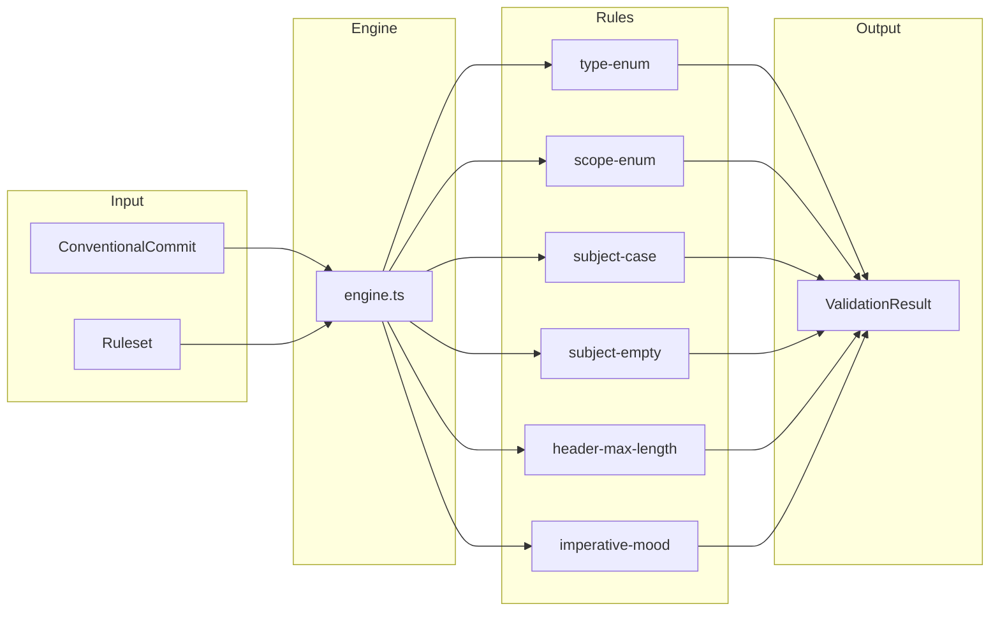

# validate/

Pure rule engine for commit-message validation.

## Overview

Runs a configurable ruleset over a parsed `ConventionalCommit` and returns a structured `ValidationResult` containing warn-level and error-level messages. Mirrors the semantics of `@commitlint/config-conventional`'s baseline but is bundled with `@hyperfrontend/versioning` and TTY-free.

The same engine powers three consumers:

1. Inline step validators during interactive authoring (`commits/author/`).
2. Preview-step warnings that render before the user confirms a commit.
3. The out-of-band `cl` bin wired into `.git/hooks/commit-msg`.



## API

### Core

| Export                          | Description                                | Implementation                               |
| ------------------------------- | ------------------------------------------ | -------------------------------------------- |
| `validateCommit(commit, rs)`    | Runs a ruleset against a parsed commit     | [engine.ts](./engine.ts)                     |
| `validateCommitWithRules()`     | Same, with a caller-supplied rule registry | [engine.ts](./engine.ts)                     |
| `validateCommitMessage(raw,rs)` | Parses a raw message then runs the engine  | [validate-message.ts](./validate-message.ts) |
| `BUILT_IN_RULES`                | Registry of built-in rules by name         | [engine.ts](./engine.ts)                     |

### Models

| Export             | Description                                          | Implementation                           |
| ------------------ | ---------------------------------------------------- | ---------------------------------------- |
| `Rule<TOptions>`   | Rule definition — inspects a commit, returns strings | [models/rule.ts](./models/rule.ts)       |
| `RuleContext`      | Level + resolved options passed to each rule         | [models/rule.ts](./models/rule.ts)       |
| `RuleLevel`        | `'off' \| 'warn' \| 'error'`                         | [models/rule.ts](./models/rule.ts)       |
| `RuleMessage`      | Severity-tagged violation                            | [models/rule.ts](./models/rule.ts)       |
| `RuleResult`       | Aggregate of `RuleMessage[]`                         | [models/rule.ts](./models/rule.ts)       |
| `Ruleset`          | Map of rule name → `[level, options?]`               | [models/ruleset.ts](./models/ruleset.ts) |
| `ValidationResult` | Aggregated outcome with warnings and errors          | [models/ruleset.ts](./models/ruleset.ts) |

### Built-in Rules

| Rule                | Default | Options shape                           | Implementation                                             |
| ------------------- | ------- | --------------------------------------- | ---------------------------------------------------------- |
| `type-enum`         | error   | `{ types: readonly string[] }`          | [rules/type-enum.ts](./rules/type-enum.ts)                 |
| `scope-enum`        | off     | `{ scopes: readonly string[] }`         | [rules/scope-enum.ts](./rules/scope-enum.ts)               |
| `subject-empty`     | error   | —                                       | [rules/subject-empty.ts](./rules/subject-empty.ts)         |
| `subject-case`      | off     | `{ cases: readonly SubjectCase[] }`     | [rules/subject-case.ts](./rules/subject-case.ts)           |
| `header-max-length` | warn    | `{ maxLength: number \| null }`         | [rules/header-max-length.ts](./rules/header-max-length.ts) |
| `imperative-mood`   | warn    | `{ wordlist?: Record<string, string> }` | [rules/imperative-mood.ts](./rules/imperative-mood.ts)     |

### Presets

| Export               | Description                                                    | Implementation                                       |
| -------------------- | -------------------------------------------------------------- | ---------------------------------------------------- |
| `conventionalPreset` | Commitlint-equivalent baseline ruleset                         | [presets/conventional.ts](./presets/conventional.ts) |
| `CONVENTIONAL_TYPES` | Default list of Conventional Commit types (`feat`, `fix`, ...) | [presets/conventional.ts](./presets/conventional.ts) |

## Usage

### Validate a parsed commit

```typescript
import { parseConventionalCommit, validateCommit, conventionalPreset } from '@hyperfrontend/versioning'

const commit = parseConventionalCommit('feat: add login')
const result = validateCommit(commit, conventionalPreset)

result.valid // true
result.warnings // []
result.errors // []
```

### Validate a raw message (for the `cl` bin)

```typescript
import { validateCommitMessage, conventionalPreset } from '@hyperfrontend/versioning'

const result = validateCommitMessage('feat: added login', conventionalPreset)

result.valid // true — `imperative-mood` is a warning, not an error
result.warnings // [{ level: 'warn', ruleName: 'imperative-mood', message: '...' }]
```

### Extend the preset

```typescript
import type { Ruleset } from '@hyperfrontend/versioning'
import { conventionalPreset } from '@hyperfrontend/versioning'

const dogfoodRuleset: Ruleset = {
  ...conventionalPreset,
  'subject-case': ['off'],
  'header-max-length': ['warn', { maxLength: 72 }],
}
```

## Authoring New Rules

1. Create `rules/<name>.ts` exporting a `Rule<YourOptions>` whose `check()` returns a list of violation strings.
2. Register it in `rules/index.ts` and in `BUILT_IN_RULES` inside [engine.ts](./engine.ts).
3. Write a colocated `.spec.ts` covering: happy path, each failure branch, the `off`/empty-options pass-through paths.
4. If it should ship in the default preset, add it to [presets/conventional.ts](./presets/conventional.ts).

The engine is intentionally dumb about rule semantics — rules own both the check and the message wording. Keep messages specific enough to act on (`'type must be one of [feat, fix] but was "wip"'`, not `'invalid type'`).

## See Also

- [../README.md](../README.md) — Parsing primitives this engine consumes
- [../../../commit-authoring-consolidation-plan.md](../../../../../roadmap/commit-authoring-consolidation-plan.md) — The migration plan this module is part of
