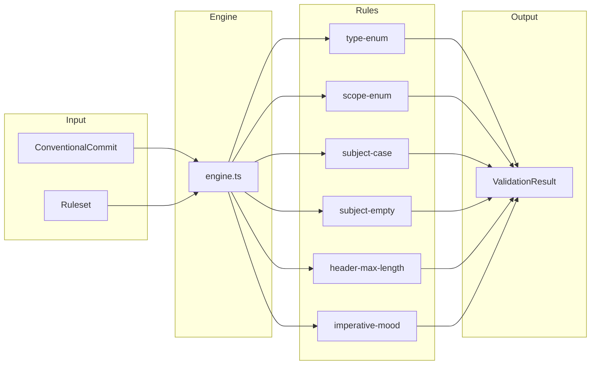

# validate/

Pure rule engine for commit-message validation.

## Overview

Runs a configurable ruleset over a parsed `ConventionalCommit` and returns a structured `ValidationResult` containing warn-level and error-level messages. Mirrors the semantics of `@commitlint/config-conventional`'s baseline but is bundled with `@hyperfrontend/versioning` and TTY-free.

The same engine powers three consumers:

1. Inline step validators during interactive authoring (`commits/author/`).
2. Preview-step warnings that render before the user confirms a commit.
3. The out-of-band `cl` bin wired into `.git/hooks/commit-msg`.



## Usage

### Validate a parsed commit

```typescript
import { parseConventionalCommit, validateCommit, conventionalPreset } from '@hyperfrontend/versioning'

const commit = parseConventionalCommit('feat: add login')
const result = validateCommit(commit, conventionalPreset)

result.valid // true
result.warnings // []
result.errors // []
```

### Validate a raw message (for the `cl` bin)

```typescript
import { validateCommitMessage, conventionalPreset } from '@hyperfrontend/versioning'

const result = validateCommitMessage('feat: added login', conventionalPreset)

result.valid // true — `imperative-mood` is a warning, not an error
result.warnings // [{ level: 'warn', ruleName: 'imperative-mood', message: '...' }]
```

### Extend the preset

```typescript
import type { Ruleset } from '@hyperfrontend/versioning'
import { conventionalPreset } from '@hyperfrontend/versioning'

const dogfoodRuleset: Ruleset = {
  ...conventionalPreset,
  'subject-case': ['off'],
  'header-max-length': ['warn', { maxLength: 72 }],
}
```

## Authoring New Rules

1. Create `rules/<name>.ts` exporting a `Rule<YourOptions>` whose `check()` returns a list of violation strings.
2. Register it in `rules/index.ts` and in `BUILT_IN_RULES` inside [engine.ts](./engine.ts).
3. Write a colocated `.spec.ts` covering: happy path, each failure branch, the `off`/empty-options pass-through paths.
4. If it should ship in the default preset, add it to [presets/conventional.ts](./presets/conventional.ts).

The engine is intentionally dumb about rule semantics: rules own both the check and the message wording. Keep messages specific enough to act on (`'type must be one of [feat, fix] but was "wip"'`, not `'invalid type'`).

## See Also

- [../README.md](../README.md): Parsing primitives this engine consumes
