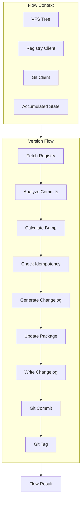
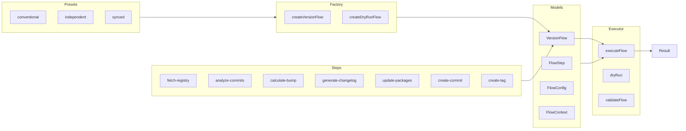
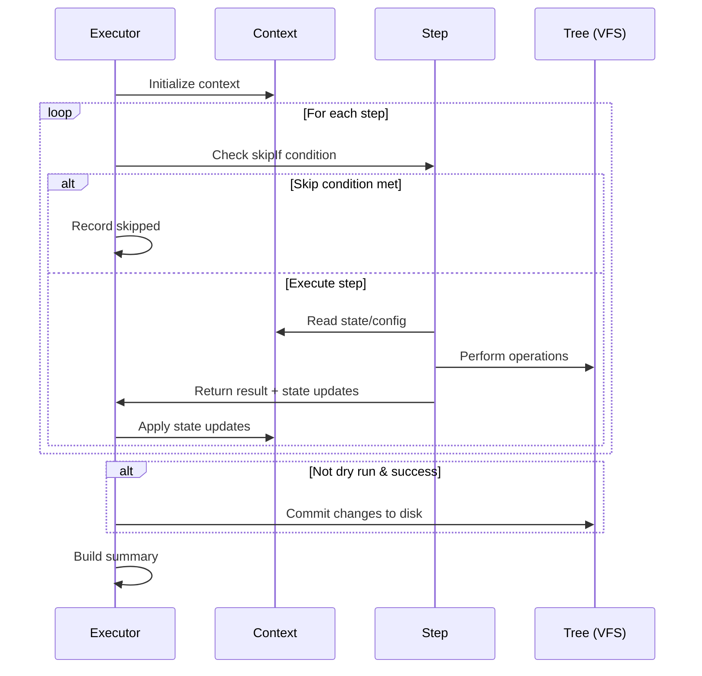

# flow/

Composable versioning workflow system for orchestrating release operations.

## Overview

This module provides a declarative flow execution engine for versioning workflows. Flows are sequences of steps that perform operations like fetching registry versions, analyzing commits, calculating bumps, generating changelogs, and creating git commits/tags.



## Architecture



## Execution Options

### FlowExecutionOptions

| Option              | Default     | Description                               |
| ------------------- | ----------- | ----------------------------------------- |
| `showDiff`          | `false`     | Preview changes before committing to VFS  |
| `diffFormat`        | `'unified'` | Diff format: `'unified'` or `'simple'`    |
| `rollbackOnFailure` | `false`     | Discard all VFS changes if any step fails |

### WriteChangelogStepOptions

| Option            | Default | Description                                                     |
| ----------------- | ------- | --------------------------------------------------------------- |
| `backupChangelog` | `false` | Backup existing changelog before writing (uses `tree.rename()`) |

## Usage

### Basic Execution

```typescript
import { createConventionalFlow, executeFlow } from '@hyperfrontend/versioning/flow'

const flow = createConventionalFlow({ dryRun: true })
const result = await executeFlow(flow, 'lib-utils', '/workspace')

console.log(result.summary)
// "Flow success in 234ms: 8 completed, 0 skipped, 0 failed. Version: 1.2.3 → 1.3.0"
```

### Custom Flow

```typescript
import {
  createFlow,
  createFetchRegistryStep,
  createAnalyzeCommitsStep,
  createCalculateBumpStep,
  executeFlow,
} from '@hyperfrontend/versioning/flow'

const minimalFlow = createFlow('minimal', 'Minimal Flow', [
  createFetchRegistryStep(),
  createAnalyzeCommitsStep(),
  createCalculateBumpStep(),
])

const result = await executeFlow(minimalFlow, 'lib-utils', '/workspace', {
  dryRun: true,
})
```

### Custom Step

```typescript
import { createStep, addStep, createConventionalFlow } from '@hyperfrontend/versioning/flow'

const notifyStep = createStep(
  'notify',
  'Send Notification',
  async (ctx) => {
    const { state } = ctx
    console.log(`Released ${state.nextVersion}`)
    return { status: 'success', message: 'Notification sent' }
  },
  { dependsOn: ['create-commit'] }
)

let flow = createConventionalFlow()
flow = addStep(flow, notifyStep)
```

## Flow Execution Lifecycle



## Configuration

| Option                | Type       | Default                               | Description                                      |
| --------------------- | ---------- | ------------------------------------- | ------------------------------------------------ |
| `preset`              | `string`   | `'conventional'`                      | Flow preset name                                 |
| `releaseTypes`        | `string[]` | `['feat', 'fix', 'perf', 'revert']`   | Types that trigger releases                      |
| `minorTypes`          | `string[]` | `['feat']`                            | Types that trigger minor bumps                   |
| `patchTypes`          | `string[]` | `['fix', 'perf', 'revert']`           | Types that trigger patch bumps                   |
| `skipGit`             | `boolean`  | `false`                               | Skip git operations                              |
| `skipTag`             | `boolean`  | `true`                                | Skip tag creation                                |
| `skipChangelog`       | `boolean`  | `false`                               | Skip changelog update                            |
| `dryRun`              | `boolean`  | `false`                               | Preview without changes                          |
| `commitMessage`       | `string`   | `'chore(${projectName}): release...'` | Commit message template                          |
| `tagFormat`           | `string`   | `'${projectName}@${version}'`         | Tag name template                                |
| `trackDeps`           | `boolean`  | `false`                               | Track dependency bumps                           |
| `releaseBranch`       | `string`   | `'main'`                              | Allowed release branch                           |
| `firstReleaseVersion` | `string`   | `'0.1.0'`                             | Initial version for new packages                 |
| `releaseAs`           | `string`   | `undefined`                           | Force bump type: 'major', 'minor', or 'patch'    |
| `maxCommitFallback`   | `number`   | `500`                                 | Max commits to analyze when no base available    |
| `repository`          | `*`        | `undefined`                           | Repository config for compare URLs (see below)   |
| `changelogFileName`   | `string`   | `'CHANGELOG.md'`                      | Custom changelog filename                        |
| `commitTypeToSection` | `object`   | `undefined`                           | Custom commit type → section mapping (see below) |

### Repository Configuration

The `repository` option controls compare URL generation in changelog entries:

```typescript
// Auto-detect from package.json or git remote
createVersionFlow('conventional', { repository: 'inferred' })

// Disable compare URLs
createVersionFlow('conventional', { repository: 'disabled' })

// Explicit configuration
createVersionFlow('conventional', {
  repository: {
    mode: 'explicit',
    repository: {
      platform: 'github',
      baseUrl: 'https://github.com/owner/repo',
    },
  },
})

// Inferred with custom order
createVersionFlow('conventional', {
  repository: {
    mode: 'inferred',
    inferenceOrder: ['git-remote', 'package-json'], // Try git first
  },
})
```

When repository is resolved, changelog entries include compare URLs:

```markdown
## [1.2.0](https://github.com/owner/repo/compare/v1.1.0...v1.2.0) - 2026-03-17
```

### Commit Type to Section Mapping

The `commitTypeToSection` option customizes how commit types map to changelog sections:

```typescript
createVersionFlow('conventional', {
  commitTypeToSection: {
    // Override default mapping
    chore: 'other',

    // Add custom commit type
    wip: 'other',

    // Exclude type from changelog
    docs: null,
  },
})
```

Default mapping:

| Commit Type | Section         |
| ----------- | --------------- |
| `feat`      | `features`      |
| `fix`       | `fixes`         |
| `perf`      | `performance`   |
| `docs`      | `documentation` |
| `refactor`  | `refactoring`   |
| `revert`    | `other`         |
| `build`     | `build`         |
| `ci`        | `ci`            |
| `test`      | `tests`         |
| `chore`     | `chores`        |
| `style`     | `other`         |

Unmapped types fall back to `chores`. Use `null` to exclude a type entirely.

## Step Dependencies

Steps can declare dependencies using `dependsOn`:

```typescript
const tagStep = createStep('create-tag', 'Create Tag', execute, {
  dependsOn: ['create-commit'], // Only runs after create-commit succeeds
})
```

The executor respects dependencies and skips steps when dependencies fail.

## Error Handling

Steps can use `continueOnError` to allow the flow to continue:

```typescript
const optionalStep = createStep('optional', 'Optional Step', execute, {
  continueOnError: true, // Flow continues even if this fails
})
```

Flow results include detailed step-by-step outcomes:

```typescript
const result = await executeFlow(flow, project, root)

for (const step of result.steps) {
  console.log(`${step.stepName}: ${step.status}`)
  if (step.error) {
    console.error(step.error.message)
  }
}
```

## See Also

- [commits/](../commits/README.md): Commit parsing for analyze-commits step
- [semver/](../semver/README.md): Version bumping for calculate-bump step
- [changelog/](../changelog/README.md): Changelog generation step
- [git/](../git/README.md): Git operations for commit/tag steps
- [registry/](../registry/README.md): Registry queries for fetch-registry step
- [workspace/](../workspace/README.md): Workspace operations for batch flows
- [Main README](../../README.md): Package overview and quick start
- [ARCHITECTURE.md](../../ARCHITECTURE.md): Design principles and data flow
