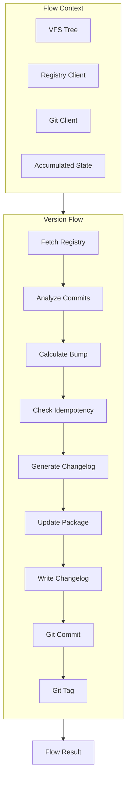
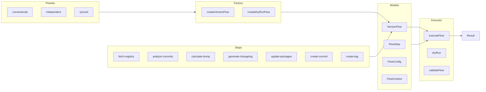
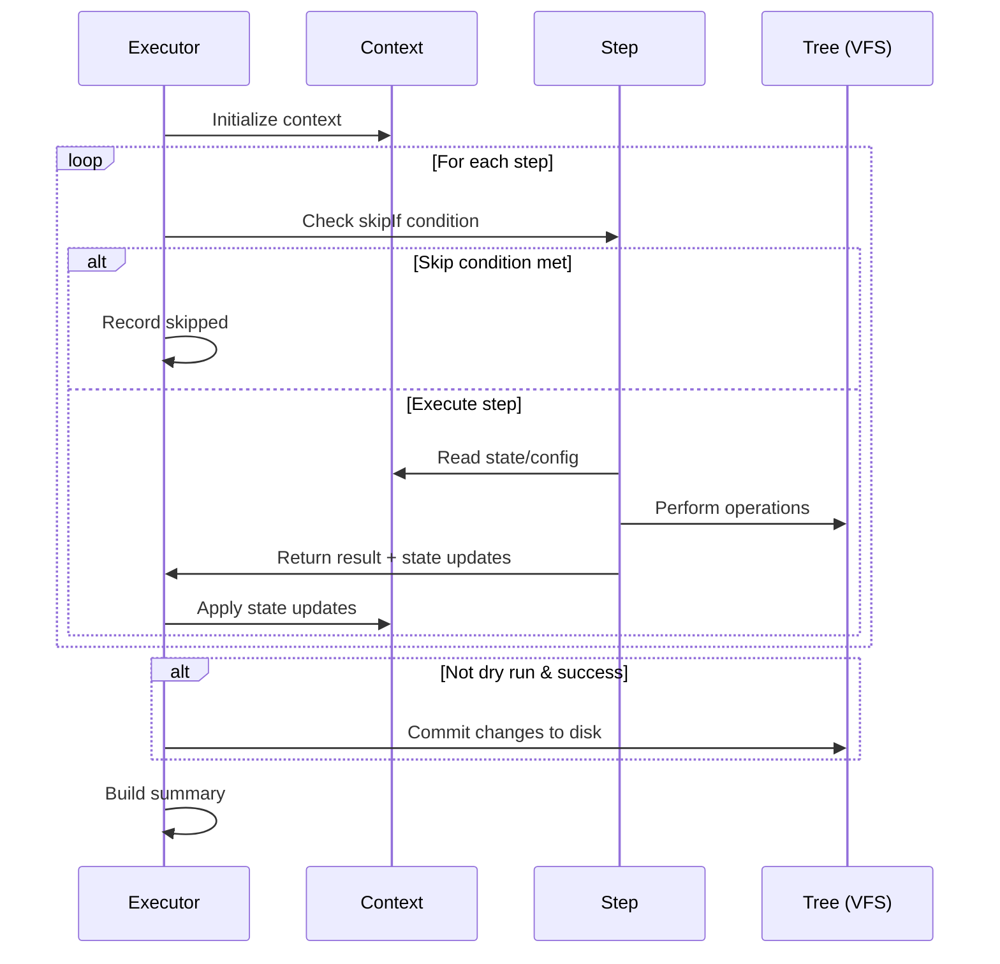

# flow/

Composable versioning workflow system for orchestrating release operations.

## Overview

This module provides a declarative flow execution engine for versioning workflows. Flows are sequences of steps that perform operations like fetching registry versions, analyzing commits, calculating bumps, generating changelogs, and creating git commits/tags.



## Architecture



## Execution Options

### FlowExecutionOptions

| Option                                                                                                                         | Default     | Description                               |
| ------------------------------------------------------------------------------------------------------------------------------ | ----------- | ----------------------------------------- |
| [`showDiff`](https://www.hyperfrontend.dev/docs/libraries/versioning/flow/#api-ExecuteOptions-prop-showDiff)                   | `false`     | Preview changes before committing to VFS  |
| [`diffFormat`](https://www.hyperfrontend.dev/docs/libraries/versioning/flow/#api-ExecuteOptions-prop-diffFormat)               | `'unified'` | Diff format: `'unified'` or `'simple'`    |
| [`rollbackOnFailure`](https://www.hyperfrontend.dev/docs/libraries/versioning/flow/#api-ExecuteOptions-prop-rollbackOnFailure) | `false`     | Discard all VFS changes if any step fails |

### WriteChangelogStepOptions

| Option                                                                                                                        | Default | Description                                                     |
| ----------------------------------------------------------------------------------------------------------------------------- | ------- | --------------------------------------------------------------- |
| [`backupChangelog`](https://www.hyperfrontend.dev/docs/libraries/versioning/flow/models/#api-FlowConfig-prop-backupChangelog) | `false` | Backup existing changelog before writing (uses `tree.rename()`) |

## Usage

### Basic Execution

```typescript
import { createConventionalFlow, executeFlow } from '@hyperfrontend/versioning/flow'

const flow = createConventionalFlow({ dryRun: true })
const result = await executeFlow(flow, 'lib-utils', '/workspace')

console.log(result.summary)
// "Flow success in 234ms: 8 completed, 0 skipped, 0 failed. Version: 1.2.3 → 1.3.0"
```

### Custom Flow

```typescript
import {
  createFlow,
  createFetchRegistryStep,
  createAnalyzeCommitsStep,
  createCalculateBumpStep,
  executeFlow,
} from '@hyperfrontend/versioning/flow'

const minimalFlow = createFlow('minimal', 'Minimal Flow', [
  createFetchRegistryStep(),
  createAnalyzeCommitsStep(),
  createCalculateBumpStep(),
])

const result = await executeFlow(minimalFlow, 'lib-utils', '/workspace', {
  dryRun: true,
})
```

### Custom Step

```typescript
import { createStep, addStep, createConventionalFlow } from '@hyperfrontend/versioning/flow'

const notifyStep = createStep(
  'notify',
  'Send Notification',
  async (ctx) => {
    const { state } = ctx
    console.log(`Released ${state.nextVersion}`)
    return { status: 'success', message: 'Notification sent' }
  },
  { dependsOn: ['create-commit'] }
)

let flow = createConventionalFlow()
flow = addStep(flow, notifyStep)
```

## Flow Execution Lifecycle



## Configuration

| Option                                                                                                                                | Type       | Default                               | Description                                      |
| ------------------------------------------------------------------------------------------------------------------------------------- | ---------- | ------------------------------------- | ------------------------------------------------ |
| [`preset`](https://www.hyperfrontend.dev/docs/libraries/versioning/flow/#api-FlowConfig-prop-preset)                                  | `string`   | `'conventional'`                      | Flow preset name                                 |
| [`releaseTypes`](https://www.hyperfrontend.dev/docs/libraries/versioning/flow/models/#api-FlowConfig-prop-releaseTypes)               | `string[]` | `['feat', 'fix', 'perf', 'revert']`   | Types that trigger releases                      |
| [`minorTypes`](https://www.hyperfrontend.dev/docs/libraries/versioning/flow/models/#api-FlowConfig-prop-minorTypes)                   | `string[]` | `['feat']`                            | Types that trigger minor bumps                   |
| [`patchTypes`](https://www.hyperfrontend.dev/docs/libraries/versioning/flow/models/#api-FlowConfig-prop-patchTypes)                   | `string[]` | `['fix', 'perf', 'revert']`           | Types that trigger patch bumps                   |
| [`skipGit`](https://www.hyperfrontend.dev/docs/libraries/versioning/flow/models/#api-FlowConfig-prop-skipGit)                         | `boolean`  | `false`                               | Skip git operations                              |
| [`skipTag`](https://www.hyperfrontend.dev/docs/libraries/versioning/flow/models/#api-FlowConfig-prop-skipTag)                         | `boolean`  | `true`                                | Skip tag creation                                |
| [`skipChangelog`](https://www.hyperfrontend.dev/docs/libraries/versioning/flow/models/#api-FlowConfig-prop-skipChangelog)             | `boolean`  | `false`                               | Skip changelog update                            |
| [`dryRun`](https://www.hyperfrontend.dev/docs/libraries/versioning/flow/#api-dryRun)                                                  | `boolean`  | `false`                               | Preview without changes                          |
| [`commitMessage`](https://www.hyperfrontend.dev/docs/libraries/versioning/flow/models/#api-FlowConfig-prop-commitMessage)             | `string`   | `'chore(${projectName}): release...'` | Commit message template                          |
| [`tagFormat`](https://www.hyperfrontend.dev/docs/libraries/versioning/flow/models/#api-FlowConfig-prop-tagFormat)                     | `string`   | `'${projectName}@${version}'`         | Tag name template                                |
| [`trackDeps`](https://www.hyperfrontend.dev/docs/libraries/versioning/flow/models/#api-FlowConfig-prop-trackDeps)                     | `boolean`  | `false`                               | Track dependency bumps                           |
| [`releaseBranch`](https://www.hyperfrontend.dev/docs/libraries/versioning/flow/models/#api-FlowConfig-prop-releaseBranch)             | `string`   | `'main'`                              | Allowed release branch                           |
| [`firstReleaseVersion`](https://www.hyperfrontend.dev/docs/libraries/versioning/flow/models/#api-FlowConfig-prop-firstReleaseVersion) | `string`   | `'0.1.0'`                             | Initial version for new packages                 |
| [`releaseAs`](https://www.hyperfrontend.dev/docs/libraries/versioning/flow/models/#api-FlowConfig-prop-releaseAs)                     | `string`   | `undefined`                           | Force bump type: 'major', 'minor', or 'patch'    |
| [`maxCommitFallback`](https://www.hyperfrontend.dev/docs/libraries/versioning/flow/models/#api-FlowConfig-prop-maxCommitFallback)     | `number`   | `500`                                 | Max commits to analyze when no base available    |
| [`repository`](https://www.hyperfrontend.dev/docs/libraries/versioning/flow/#api-FlowConfig-prop-repository)                          | `*`        | `undefined`                           | Repository config for compare URLs (see below)   |
| [`changelogFileName`](https://www.hyperfrontend.dev/docs/libraries/versioning/flow/models/#api-FlowConfig-prop-changelogFileName)     | `string`   | `'CHANGELOG.md'`                      | Custom changelog filename                        |
| [`commitTypeToSection`](https://www.hyperfrontend.dev/docs/libraries/versioning/flow/models/#api-FlowConfig-prop-commitTypeToSection) | `object`   | `undefined`                           | Custom commit type → section mapping (see below) |

### Repository Configuration

The [`repository`](https://www.hyperfrontend.dev/docs/libraries/versioning/flow/#api-FlowConfig-prop-repository) option controls compare URL generation in changelog entries:

```typescript
// Auto-detect from package.json or git remote
createVersionFlow('conventional', { repository: 'inferred' })

// Disable compare URLs
createVersionFlow('conventional', { repository: 'disabled' })

// Explicit configuration
createVersionFlow('conventional', {
  repository: {
    mode: 'explicit',
    repository: {
      platform: 'github',
      baseUrl: 'https://github.com/owner/repo',
    },
  },
})

// Inferred with custom order
createVersionFlow('conventional', {
  repository: {
    mode: 'inferred',
    inferenceOrder: ['git-remote', 'package-json'], // Try git first
  },
})
```

When repository is resolved, changelog entries include compare URLs:

```markdown
## [1.2.0](https://github.com/owner/repo/compare/v1.1.0...v1.2.0) - 2026-03-17
```

### Commit Type to Section Mapping

The [`commitTypeToSection`](https://www.hyperfrontend.dev/docs/libraries/versioning/flow/models/#api-FlowConfig-prop-commitTypeToSection) option customizes how commit types map to changelog sections:

```typescript
createVersionFlow('conventional', {
  commitTypeToSection: {
    // Override default mapping
    chore: 'other',

    // Add custom commit type
    wip: 'other',

    // Exclude type from changelog
    docs: null,
  },
})
```

Default mapping:

| Commit Type                                                                                                    | Section                                                                                                             |
| -------------------------------------------------------------------------------------------------------------- | ------------------------------------------------------------------------------------------------------------------- |
| [`feat`](https://www.hyperfrontend.dev/docs/libraries/versioning/flow/#api-DEFAULT_COMMIT_TYPE_TO_SECTION)     | [`features`](https://www.hyperfrontend.dev/docs/libraries/versioning/flow/#api-DEFAULT_COMMIT_TYPE_TO_SECTION)      |
| [`fix`](https://www.hyperfrontend.dev/docs/libraries/versioning/flow/#api-DEFAULT_COMMIT_TYPE_TO_SECTION)      | [`fixes`](https://www.hyperfrontend.dev/docs/libraries/versioning/flow/#api-DEFAULT_COMMIT_TYPE_TO_SECTION)         |
| [`perf`](https://www.hyperfrontend.dev/docs/libraries/versioning/flow/#api-DEFAULT_COMMIT_TYPE_TO_SECTION)     | `performance`                                                                                                       |
| [`docs`](https://www.hyperfrontend.dev/docs/libraries/versioning/flow/#api-DEFAULT_COMMIT_TYPE_TO_SECTION)     | [`documentation`](https://www.hyperfrontend.dev/docs/libraries/versioning/flow/#api-DEFAULT_COMMIT_TYPE_TO_SECTION) |
| [`refactor`](https://www.hyperfrontend.dev/docs/libraries/versioning/flow/#api-DEFAULT_COMMIT_TYPE_TO_SECTION) | [`refactoring`](https://www.hyperfrontend.dev/docs/libraries/versioning/flow/#api-DEFAULT_COMMIT_TYPE_TO_SECTION)   |
| [`revert`](https://www.hyperfrontend.dev/docs/libraries/versioning/flow/#api-DEFAULT_COMMIT_TYPE_TO_SECTION)   | [`other`](https://www.hyperfrontend.dev/docs/libraries/versioning/flow/#api-DEFAULT_COMMIT_TYPE_TO_SECTION)         |
| [`build`](https://www.hyperfrontend.dev/docs/libraries/versioning/flow/#api-DEFAULT_COMMIT_TYPE_TO_SECTION)    | [`build`](https://www.hyperfrontend.dev/docs/libraries/versioning/flow/#api-DEFAULT_COMMIT_TYPE_TO_SECTION)         |
| [`ci`](https://www.hyperfrontend.dev/docs/libraries/versioning/flow/#api-DEFAULT_COMMIT_TYPE_TO_SECTION)       | [`ci`](https://www.hyperfrontend.dev/docs/libraries/versioning/flow/#api-DEFAULT_COMMIT_TYPE_TO_SECTION)            |
| [`test`](https://www.hyperfrontend.dev/docs/libraries/versioning/flow/#api-DEFAULT_COMMIT_TYPE_TO_SECTION)     | [`tests`](https://www.hyperfrontend.dev/docs/libraries/versioning/flow/#api-DEFAULT_COMMIT_TYPE_TO_SECTION)         |
| [`chore`](https://www.hyperfrontend.dev/docs/libraries/versioning/flow/#api-DEFAULT_COMMIT_TYPE_TO_SECTION)    | [`chores`](https://www.hyperfrontend.dev/docs/libraries/versioning/flow/#api-DEFAULT_COMMIT_TYPE_TO_SECTION)        |
| `style`                                                                                                        | [`other`](https://www.hyperfrontend.dev/docs/libraries/versioning/flow/#api-DEFAULT_COMMIT_TYPE_TO_SECTION)         |

Unmapped types fall back to [`chores`](https://www.hyperfrontend.dev/docs/libraries/versioning/flow/#api-DEFAULT_COMMIT_TYPE_TO_SECTION). Use `null` to exclude a type entirely.

## Step Dependencies

Steps can declare dependencies using [`dependsOn`](https://www.hyperfrontend.dev/docs/libraries/versioning/workspace/models/#api-dependsOn):

```typescript
const tagStep = createStep('create-tag', 'Create Tag', execute, {
  dependsOn: ['create-commit'], // Only runs after create-commit succeeds
})
```

The executor respects dependencies and skips steps when dependencies fail.

## Error Handling

Steps can use [`continueOnError`](https://www.hyperfrontend.dev/docs/libraries/versioning/flow/models/#api-FlowStep-prop-continueOnError) to allow the flow to continue:

```typescript
const optionalStep = createStep('optional', 'Optional Step', execute, {
  continueOnError: true, // Flow continues even if this fails
})
```

Flow results include detailed step-by-step outcomes:

```typescript
const result = await executeFlow(flow, project, root)

for (const step of result.steps) {
  console.log(`${step.stepName}: ${step.status}`)
  if (step.error) {
    console.error(step.error.message)
  }
}
```

## See Also

- [commits/](../commits/README.md): Commit parsing for analyze-commits step
- [semver/](../semver/README.md): Version bumping for calculate-bump step
- [changelog/](../changelog/README.md): Changelog generation step
- [git/](../git/README.md): Git operations for commit/tag steps
- [registry/](../registry/README.md): Registry queries for fetch-registry step
- [workspace/](../workspace/README.md): Workspace operations for batch flows
- [Main README](../../README.md): Package overview and quick start
- [ARCHITECTURE.md](../../ARCHITECTURE.md): Design principles and data flow
