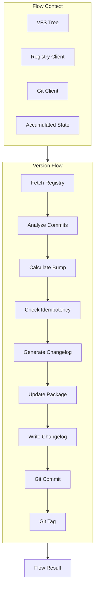
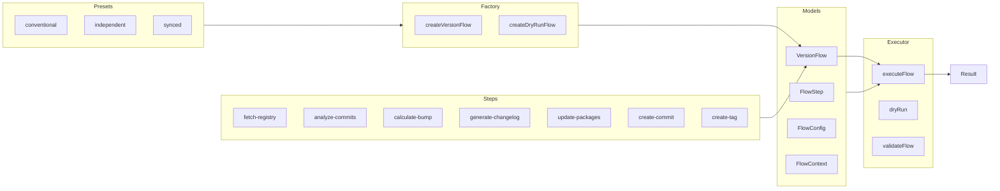
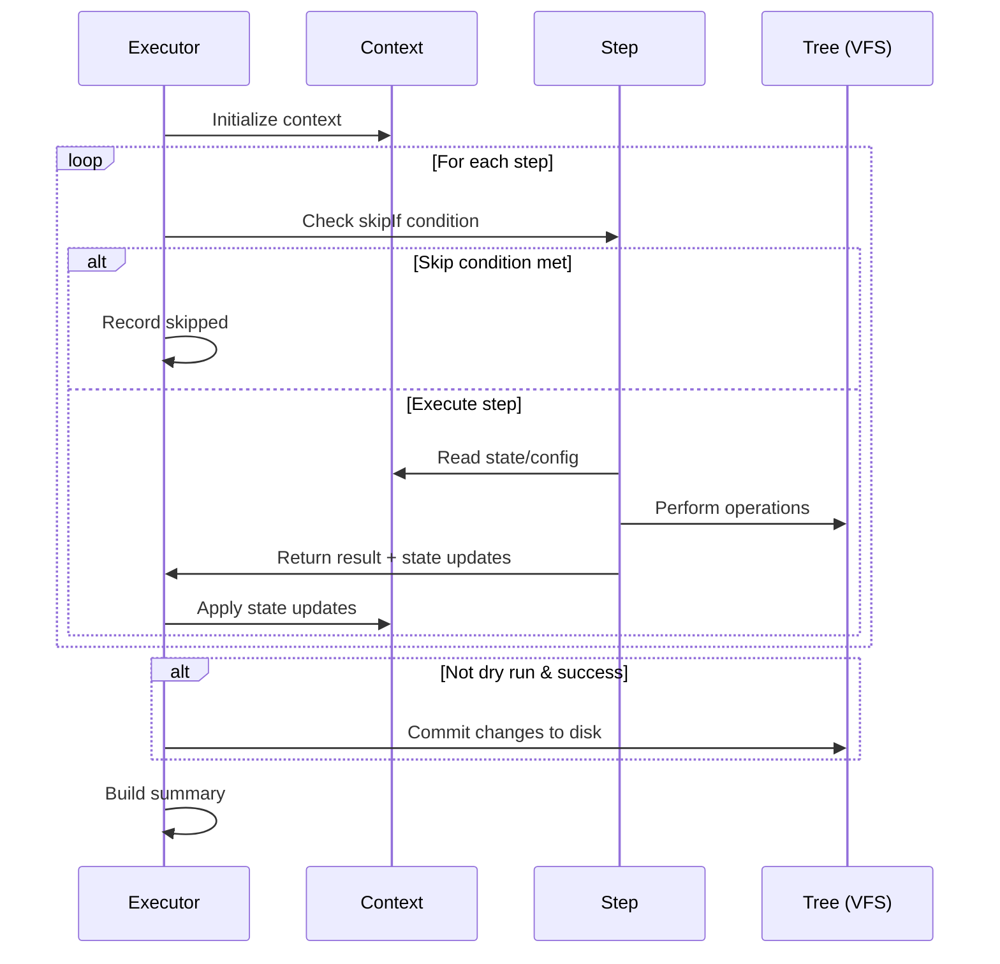

# flow/

Composable versioning workflow system for orchestrating release operations.

## Overview

This module provides a declarative flow execution engine for versioning workflows. Flows are sequences of steps that perform operations like fetching registry versions, analyzing commits, calculating bumps, generating changelogs, and creating git commits/tags.



## Architecture



## API

### Factory

| Function                          | Description                           | Implementation             |
| --------------------------------- | ------------------------------------- | -------------------------- |
| `createVersionFlow(preset, cfg?)` | Create a flow from a preset           | [factory.ts](./factory.ts) |
| `createDryRunFlow(preset, cfg?)`  | Create a dry-run flow                 | [factory.ts](./factory.ts) |
| `getAvailablePresets()`           | List available presets                | [factory.ts](./factory.ts) |
| `getPresetDescription(preset)`    | Get human-readable preset description | [factory.ts](./factory.ts) |

### Presets

| Preset         | Description                                     | Implementation                               |
| -------------- | ----------------------------------------------- | -------------------------------------------- |
| `conventional` | Standard conventional commits workflow          | [conventional.ts](./presets/conventional.ts) |
| `independent`  | Independent versioning with dependency tracking | [independent.ts](./presets/independent.ts)   |
| `synced`       | All packages share the same version             | [synced.ts](./presets/synced.ts)             |

### Executor

| Function                                 | Description                    | Implementation                      |
| ---------------------------------------- | ------------------------------ | ----------------------------------- |
| `executeFlow(flow, project, root, opts)` | Execute a flow                 | [execute.ts](./executor/execute.ts) |
| `dryRun(flow, project, root, opts)`      | Execute without making changes | [execute.ts](./executor/execute.ts) |
| `validateFlow(flow)`                     | Validate flow structure        | [execute.ts](./executor/execute.ts) |

### Models

| Type             | Description                                      | Implementation                |
| ---------------- | ------------------------------------------------ | ----------------------------- |
| `VersionFlow`    | Complete flow definition with steps and config   | [flow.ts](./models/flow.ts)   |
| `FlowStep`       | Single step with execute function and conditions | [step.ts](./models/step.ts)   |
| `FlowConfig`     | Flow configuration options                       | [types.ts](./models/types.ts) |
| `FlowContext`    | Execution context with services and state        | [types.ts](./models/types.ts) |
| `FlowState`      | Accumulated state during execution               | [types.ts](./models/types.ts) |
| `FlowResult`     | Execution result with status and step results    | [types.ts](./models/types.ts) |
| `FlowStepResult` | Individual step execution result                 | [types.ts](./models/types.ts) |

### Step Factories

| Function                          | Description                           | Implementation                                         |
| --------------------------------- | ------------------------------------- | ------------------------------------------------------ |
| `createFetchRegistryStep()`       | Fetch published version from registry | [fetch-registry.ts](./steps/fetch-registry.ts)         |
| `createResolveRepositoryStep()`   | Resolve repository for compare URLs   | [resolve-repository.ts](./steps/resolve-repository.ts) |
| `createAnalyzeCommitsStep()`      | Parse commits since last release      | [analyze-commits.ts](./steps/analyze-commits.ts)       |
| `createCalculateBumpStep()`       | Calculate version bump type           | [calculate-bump.ts](./steps/calculate-bump.ts)         |
| `createCheckIdempotencyStep()`    | Skip if version already published     | [fetch-registry.ts](./steps/fetch-registry.ts)         |
| `createGenerateChangelogStep()`   | Generate changelog entry              | [generate-changelog.ts](./steps/generate-changelog.ts) |
| `createWriteChangelogStep()`      | Write changelog to file               | [generate-changelog.ts](./steps/generate-changelog.ts) |
| `createUpdatePackageStep()`       | Update package.json version           | [update-packages.ts](./steps/update-packages.ts)       |
| `createCascadeDependenciesStep()` | Update dependent package versions     | [update-packages.ts](./steps/update-packages.ts)       |
| `createGitCommitStep()`           | Create version commit                 | [create-commit.ts](./steps/create-commit.ts)           |
| `createTagStep()`                 | Create git tag                        | [create-tag.ts](./steps/create-tag.ts)                 |
| `createPushTagStep()`             | Push tag to remote                    | [create-tag.ts](./steps/create-tag.ts)                 |

### Flow Manipulation

| Function                                 | Description                 | Implementation              |
| ---------------------------------------- | --------------------------- | --------------------------- |
| `createFlow(id, name, steps, opts?)`     | Create custom flow          | [flow.ts](./models/flow.ts) |
| `createStep(id, name, execute, opts?)`   | Create custom step          | [step.ts](./models/step.ts) |
| `addStep(flow, step)`                    | Append step to flow         | [flow.ts](./models/flow.ts) |
| `removeStep(flow, stepId)`               | Remove step by ID           | [flow.ts](./models/flow.ts) |
| `insertStep(flow, step, index)`          | Insert step at position     | [flow.ts](./models/flow.ts) |
| `insertStepAfter(flow, step, afterId)`   | Insert after specific step  | [flow.ts](./models/flow.ts) |
| `insertStepBefore(flow, step, beforeId)` | Insert before specific step | [flow.ts](./models/flow.ts) |
| `replaceStep(flow, stepId, newStep)`     | Replace step by ID          | [flow.ts](./models/flow.ts) |
| `withConfig(flow, config)`               | Update flow configuration   | [flow.ts](./models/flow.ts) |
| `getStep(flow, stepId)`                  | Get step by ID              | [flow.ts](./models/flow.ts) |
| `hasStep(flow, stepId)`                  | Check if step exists        | [flow.ts](./models/flow.ts) |

## Usage

### Basic Execution

```typescript
import { createConventionalFlow, executeFlow } from '@hyperfrontend/versioning/flow'

const flow = createConventionalFlow({ dryRun: true })
const result = await executeFlow(flow, 'lib-utils', '/workspace')

console.log(result.summary)
// "Flow success in 234ms: 8 completed, 0 skipped, 0 failed. Version: 1.2.3 → 1.3.0"
```

### Custom Flow

```typescript
import {
  createFlow,
  createFetchRegistryStep,
  createAnalyzeCommitsStep,
  createCalculateBumpStep,
  executeFlow,
} from '@hyperfrontend/versioning/flow'

const minimalFlow = createFlow('minimal', 'Minimal Flow', [
  createFetchRegistryStep(),
  createAnalyzeCommitsStep(),
  createCalculateBumpStep(),
])

const result = await executeFlow(minimalFlow, 'lib-utils', '/workspace', {
  dryRun: true,
})
```

### Custom Step

```typescript
import { createStep, addStep, createConventionalFlow } from '@hyperfrontend/versioning/flow'

const notifyStep = createStep(
  'notify',
  'Send Notification',
  async (ctx) => {
    const { state } = ctx
    console.log(`Released ${state.nextVersion}`)
    return { status: 'success', message: 'Notification sent' }
  },
  { dependsOn: ['create-commit'] }
)

let flow = createConventionalFlow()
flow = addStep(flow, notifyStep)
```

## Flow Execution Lifecycle



## Configuration

| Option                | Type       | Default                               | Description                                    |
| --------------------- | ---------- | ------------------------------------- | ---------------------------------------------- |
| `preset`              | `string`   | `'conventional'`                      | Flow preset name                               |
| `releaseTypes`        | `string[]` | `['feat', 'fix', 'perf', 'revert']`   | Types that trigger releases                    |
| `minorTypes`          | `string[]` | `['feat']`                            | Types that trigger minor bumps                 |
| `patchTypes`          | `string[]` | `['fix', 'perf', 'revert']`           | Types that trigger patch bumps                 |
| `skipGit`             | `boolean`  | `false`                               | Skip git operations                            |
| `skipTag`             | `boolean`  | `true`                                | Skip tag creation                              |
| `skipChangelog`       | `boolean`  | `false`                               | Skip changelog update                          |
| `dryRun`              | `boolean`  | `false`                               | Preview without changes                        |
| `commitMessage`       | `string`   | `'chore(${projectName}): release...'` | Commit message template                        |
| `tagFormat`           | `string`   | `'${projectName}@${version}'`         | Tag name template                              |
| `trackDeps`           | `boolean`  | `false`                               | Track dependency bumps                         |
| `releaseBranch`       | `string`   | `'main'`                              | Allowed release branch                         |
| `firstReleaseVersion` | `string`   | `'0.1.0'`                             | Initial version for new packages               |
| `releaseAs`           | `string`   | `undefined`                           | Force bump type: 'major', 'minor', or 'patch'  |
| `maxCommitFallback`   | `number`   | `500`                                 | Max commits to analyze when no base available  |
| `repository`          | `*`        | `undefined`                           | Repository config for compare URLs (see below) |
| `changelogFileName`   | `string`   | `'CHANGELOG.md'`                      | Custom changelog filename                      |

### Repository Configuration

The `repository` option controls compare URL generation in changelog entries:

```typescript
// Auto-detect from package.json or git remote
createVersionFlow('conventional', { repository: 'inferred' })

// Disable compare URLs
createVersionFlow('conventional', { repository: 'disabled' })

// Explicit configuration
createVersionFlow('conventional', {
  repository: {
    mode: 'explicit',
    repository: {
      platform: 'github',
      baseUrl: 'https://github.com/owner/repo',
    },
  },
})

// Inferred with custom order
createVersionFlow('conventional', {
  repository: {
    mode: 'inferred',
    inferenceOrder: ['git-remote', 'package-json'], // Try git first
  },
})
```

When repository is resolved, changelog entries include compare URLs:

```markdown
## [1.2.0](https://github.com/owner/repo/compare/v1.1.0...v1.2.0) - 2026-03-17
```

## Step Dependencies

Steps can declare dependencies using `dependsOn`:

```typescript
const tagStep = createStep('create-tag', 'Create Tag', execute, {
  dependsOn: ['create-commit'], // Only runs after create-commit succeeds
})
```

The executor respects dependencies and skips steps when dependencies fail.

## Error Handling

Steps can use `continueOnError` to allow the flow to continue:

```typescript
const optionalStep = createStep('optional', 'Optional Step', execute, {
  continueOnError: true, // Flow continues even if this fails
})
```

Flow results include detailed step-by-step outcomes:

```typescript
const result = await executeFlow(flow, project, root)

for (const step of result.steps) {
  console.log(`${step.stepName}: ${step.status}`)
  if (step.error) {
    console.error(step.error.message)
  }
}
```

## Directory Structure

```
flow/
├── index.ts              # Public exports
├── factory.ts            # Flow factory functions
├── flow.spec.ts          # Flow integration tests
├── models/               # Data structures
│   ├── flow.ts           # VersionFlow type & factory
│   ├── step.ts           # FlowStep type & factory
│   └── types.ts          # FlowConfig, FlowContext, FlowState
├── executor/             # Flow execution
│   └── execute.ts        # executeFlow, dryRun, validateFlow
├── presets/              # Built-in flow presets
│   ├── conventional.ts   # Standard conventional commits flow
│   ├── independent.ts    # Independent versioning flow
│   └── synced.ts         # Synchronized versioning flow
├── steps/                # Step implementations
│   ├── fetch-registry.ts # Query package registry
│   ├── analyze-commits.ts # Parse commit history
│   ├── calculate-bump.ts  # Determine version bump
│   ├── generate-changelog.ts # Create changelog entry
│   ├── update-packages.ts   # Update package.json
│   ├── create-commit.ts     # Create git commit
│   └── create-tag.ts        # Create git tag
└── utils/                # Flow utilities
    └── interpolate.ts    # Template string interpolation
```

## See Also

- [commits/](../commits/README.md) — Commit parsing for analyze-commits step
- [semver/](../semver/README.md) — Version bumping for calculate-bump step
- [changelog/](../changelog/README.md) — Changelog generation step
- [git/](../git/README.md) — Git operations for commit/tag steps
- [registry/](../registry/README.md) — Registry queries for fetch-registry step
- [workspace/](../workspace/README.md) — Workspace operations for batch flows
- [Main README](../../README.md) — Package overview and quick start
- [ARCHITECTURE.md](../../ARCHITECTURE.md) — Design principles and data flow
