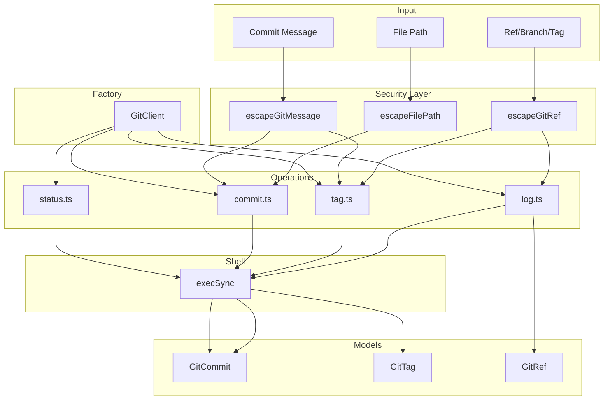

# git/

Git operations for versioning workflows with secure command execution.

## Overview

This module provides a complete interface for git operations needed in versioning workflows: querying commit history, managing tags, staging files, and inspecting repository status. All command arguments are validated character-by-character to prevent command injection attacks.



## API

### Models

| Export             | Description                                             | Implementation                      |
| ------------------ | ------------------------------------------------------- | ----------------------------------- |
| `GitCommit`        | Commit with hash, author, date, subject, body, refs     | [commit.ts](./models/commit.ts)     |
| `GitTag`           | Tag with name, commitHash, type (lightweight/annotated) | [tag.ts](./models/tag.ts)           |
| `GitTagType`       | `'lightweight' \| 'annotated'`                          | [tag.ts](./models/tag.ts)           |
| `GitRef`           | Reference with fullName, name, type, commitHash         | [ref.ts](./models/ref.ts)           |
| `GitRefType`       | `'branch' \| 'tag' \| 'remote' \| 'head' \| 'stash'`    | [ref.ts](./models/ref.ts)           |
| `RepositoryStatus` | Full repository status with branch, staged, modified    | [status.ts](./operations/status.ts) |
| `FileStatus`       | `'added' \| 'modified' \| 'deleted' \| 'renamed' ...`   | [status.ts](./operations/status.ts) |
| `FileStatusEntry`  | File path with its status                               | [status.ts](./operations/status.ts) |

### Model Factories

| Function                 | Description                        | Implementation                  |
| ------------------------ | ---------------------------------- | ------------------------------- |
| `createGitCommit(opts)`  | Create a GitCommit object          | [commit.ts](./models/commit.ts) |
| `createLightweightTag()` | Create a lightweight tag           | [tag.ts](./models/tag.ts)       |
| `createAnnotatedTag()`   | Create an annotated tag            | [tag.ts](./models/tag.ts)       |
| `createGitRef(opts)`     | Create a GitRef from full ref name | [ref.ts](./models/ref.ts)       |

### Model Utilities

| Function                 | Description                                    | Implementation                  |
| ------------------------ | ---------------------------------------------- | ------------------------------- |
| `getShortHash(hash)`     | Get 7-character abbreviated hash               | [commit.ts](./models/commit.ts) |
| `isSameCommit(a, b)`     | Compare commits by hash                        | [commit.ts](./models/commit.ts) |
| `isMergeCommit(commit)`  | Check if commit has multiple parents           | [commit.ts](./models/commit.ts) |
| `isRootCommit(commit)`   | Check if commit has no parents                 | [commit.ts](./models/commit.ts) |
| `extractScope(subject)`  | Extract scope from conventional commit         | [commit.ts](./models/commit.ts) |
| `extractType(subject)`   | Extract type from conventional commit          | [commit.ts](./models/commit.ts) |
| `isAnnotatedTag(tag)`    | Check if tag is annotated                      | [tag.ts](./models/tag.ts)       |
| `isLightweightTag(tag)`  | Check if tag is lightweight                    | [tag.ts](./models/tag.ts)       |
| `extractVersionFromTag`  | Extract version string from tag name           | [tag.ts](./models/tag.ts)       |
| `extractPackageFromTag`  | Extract package name from tag name             | [tag.ts](./models/tag.ts)       |
| `buildTagName(pkg, ver)` | Build tag name from package and version        | [tag.ts](./models/tag.ts)       |
| `compareTagsByVersion`   | Compare tags by extracted version (descending) | [tag.ts](./models/tag.ts)       |
| `isBranchRef(ref)`       | Check if ref is a branch                       | [ref.ts](./models/ref.ts)       |
| `isTagRef(ref)`          | Check if ref is a tag                          | [ref.ts](./models/ref.ts)       |
| `isRemoteRef(ref)`       | Check if ref is a remote tracking branch       | [ref.ts](./models/ref.ts)       |
| `isHeadRef(ref)`         | Check if ref is HEAD                           | [ref.ts](./models/ref.ts)       |
| `buildRefName(type, n)`  | Build full ref name from type and short name   | [ref.ts](./models/ref.ts)       |
| `filterRefsByType()`     | Filter refs by type                            | [ref.ts](./models/ref.ts)       |
| `filterRefsByRemote()`   | Filter refs by remote name                     | [ref.ts](./models/ref.ts)       |

### Git Client Factory

| Export                      | Description                        | Implementation             |
| --------------------------- | ---------------------------------- | -------------------------- |
| `createGitClient(config?)`  | Create unified git client          | [factory.ts](./factory.ts) |
| `GitClient`                 | Interface with all git operations  | [factory.ts](./factory.ts) |
| `GitClientConfig`           | Config: cwd, timeout, throwOnError | [factory.ts](./factory.ts) |
| `DEFAULT_GIT_CLIENT_CONFIG` | Default configuration values       | [factory.ts](./factory.ts) |

### Log Operations

| Function              | Description                  | Implementation                |
| --------------------- | ---------------------------- | ----------------------------- |
| `getCommitLog(opts)`  | Get commit history           | [log.ts](./operations/log.ts) |
| `getCommitsBetween()` | Get commits between two refs | [log.ts](./operations/log.ts) |
| `getCommitsSince()`   | Get commits since a ref      | [log.ts](./operations/log.ts) |
| `getCommit(hash)`     | Get single commit by hash    | [log.ts](./operations/log.ts) |
| `commitExists(hash)`  | Check if commit exists       | [log.ts](./operations/log.ts) |

### Tag Operations

| Function              | Description                         | Implementation                                |
| --------------------- | ----------------------------------- | --------------------------------------------- |
| `getTags(opts)`       | List all tags                       | [query-tags.ts](./operations/query-tags.ts)   |
| `getTag(name)`        | Get single tag by name              | [query-tags.ts](./operations/query-tags.ts)   |
| `createTag(name)`     | Create a new tag                    | [manage-tags.ts](./operations/manage-tags.ts) |
| `deleteTag(name)`     | Delete a tag                        | [manage-tags.ts](./operations/manage-tags.ts) |
| `tagExists(name)`     | Check if tag exists                 | [query-tags.ts](./operations/query-tags.ts)   |
| `getLatestTag()`      | Get most recent tag by version      | [query-tags.ts](./operations/query-tags.ts)   |
| `getTagsForPackage()` | Get tags matching a package pattern | [query-tags.ts](./operations/query-tags.ts)   |
| `pushTag(name)`       | Push tag to remote                  | [manage-tags.ts](./operations/manage-tags.ts) |

### Commit Operations

| Function               | Description                  | Implementation                            |
| ---------------------- | ---------------------------- | ----------------------------------------- |
| `commit(message)`      | Create a commit with message | [commit.ts](./operations/commit.ts)       |
| `stage(files)`         | Stage files for commit       | [stage.ts](./operations/stage.ts)         |
| `unstage(files)`       | Unstage files                | [stage.ts](./operations/stage.ts)         |
| `stageAll()`           | Stage all changes            | [stage.ts](./operations/stage.ts)         |
| `amendCommit()`        | Amend the last commit        | [commit.ts](./operations/commit.ts)       |
| `createEmptyCommit()`  | Create an empty commit       | [commit.ts](./operations/commit.ts)       |
| `getHead()`            | Get HEAD commit hash         | [head-info.ts](./operations/head-info.ts) |
| `getCurrentBranch()`   | Get current branch name      | [head-info.ts](./operations/head-info.ts) |
| `hasStagedChanges()`   | Check for staged changes     | [stage.ts](./operations/stage.ts)         |
| `hasUnstagedChanges()` | Check for unstaged changes   | [stage.ts](./operations/stage.ts)         |
| `hasUntrackedFiles()`  | Check for untracked files    | [head-info.ts](./operations/head-info.ts) |
| `discardChanges()`     | Discard uncommitted changes  | [stage.ts](./operations/stage.ts)         |
| `discardAllChanges()`  | Discard and unstage all      | [stage.ts](./operations/stage.ts)         |

### Status Operations

| Function              | Description                       | Implementation                            |
| --------------------- | --------------------------------- | ----------------------------------------- |
| `getStatus()`         | Get full repository status        | [status.ts](./operations/status.ts)       |
| `isClean()`           | Check if working tree is clean    | [status.ts](./operations/status.ts)       |
| `isGitRepository()`   | Check if path is a git repository | [status.ts](./operations/status.ts)       |
| `getRepositoryRoot()` | Get repository root path          | [status.ts](./operations/status.ts)       |
| `getHeadHash()`       | Get HEAD commit hash              | [head-info.ts](./operations/head-info.ts) |
| `getHeadShortHash()`  | Get abbreviated HEAD hash         | [head-info.ts](./operations/head-info.ts) |
| `hasConflicts()`      | Check for merge conflicts         | [status.ts](./operations/status.ts)       |
| `getAheadCount()`     | Get commits ahead of upstream     | [status.ts](./operations/status.ts)       |
| `getBehindCount()`    | Get commits behind upstream       | [status.ts](./operations/status.ts)       |
| `needsPush()`         | Check if push is needed           | [status.ts](./operations/status.ts)       |
| `needsPull()`         | Check if pull is needed           | [status.ts](./operations/status.ts)       |
| `getStagedFiles()`    | Get list of staged files          | [status.ts](./operations/status.ts)       |
| `getModifiedFiles()`  | Get list of modified files        | [status.ts](./operations/status.ts)       |
| `getUntrackedFiles()` | Get list of untracked files       | [status.ts](./operations/status.ts)       |

### Security Utilities

| Function                | Description                                  | Implementation             |
| ----------------------- | -------------------------------------------- | -------------------------- |
| `escapeGitRef(ref)`     | Validate ref for safe shell use              | [factory.ts](./factory.ts) |
| `escapeGitPath(path)`   | Validate path for safe shell use             | [factory.ts](./factory.ts) |
| `escapeGitArg(arg)`     | Validate generic argument for safe shell use | [factory.ts](./factory.ts) |
| `escapeFilePath(path)`  | Validate file path for safe shell use        | [factory.ts](./factory.ts) |
| `escapeAuthor(author)`  | Validate author string for safe shell use    | [factory.ts](./factory.ts) |
| `escapeGitTagPattern()` | Validate tag pattern for safe shell use      | [factory.ts](./factory.ts) |
| `escapeGitMessage()`    | Escape message for safe shell use            | [factory.ts](./factory.ts) |

## Usage Examples

### Using GitClient (Recommended)

```typescript
import { createGitClient } from '@hyperfrontend/versioning'

const git = createGitClient({ cwd: '/path/to/repo' })

// Get recent commits
const commits = git.getCommitLog({ maxCount: 10 })

// Get commits since last release
const newCommits = git.getCommitsSince('v1.0.0')

// Check repository state
if (git.isClean()) {
  // Create a tag
  git.createTag('v1.1.0', { message: 'Release v1.1.0' })
}
```

### Standalone Operations

```typescript
import { getCommitsBetween, getTags, getLatestTag, commit, stage } from '@hyperfrontend/versioning'

// Get commits between tags
const commits = getCommitsBetween('v1.0.0', 'v2.0.0')
console.log(`${commits.length} commits between releases`)

// Find latest version tag
const latest = getLatestTag({ pattern: '@scope/pkg@' })
console.log(`Latest: ${latest?.name}`)

// Stage and commit
stage(['package.json', 'CHANGELOG.md'])
commit('chore: release v1.1.0')
```

### Working with Tags

```typescript
import { extractVersionFromTag, extractPackageFromTag, buildTagName, getTagsForPackage } from '@hyperfrontend/versioning'

// Parse tag names
extractVersionFromTag('v1.2.3') // '1.2.3'
extractVersionFromTag('@scope/pkg@1.0.0') // '1.0.0'

extractPackageFromTag('@scope/pkg@1.0.0') // '@scope/pkg'
extractPackageFromTag('utils@1.2.3') // 'utils'

// Build tag names
buildTagName('@scope/pkg', '2.0.0') // '@scope/pkg@2.0.0'
buildTagName('lib', '1.0.0', '${package}-v${version}') // 'lib-v1.0.0'

// Get all tags for a package
const tags = getTagsForPackage('@hyperfrontend/versioning')
```

### Working with Commits

```typescript
import { createGitCommit, isMergeCommit, extractType, extractScope } from '@hyperfrontend/versioning'

// Parse conventional commits
const subject = 'feat(lib-versioning): add git operations'
extractType(subject) // 'feat'
extractScope(subject) // 'lib-versioning'

// Check commit characteristics
if (isMergeCommit(commit)) {
  console.log('Skipping merge commit')
}
```

## Security

All user input undergoes character-by-character validation before being used in shell commands:

- **No regex**: Eliminates ReDoS vulnerabilities
- **Allowlist validation**: Only permitted characters pass through
- **Length limits**: Prevents memory exhaustion attacks
- **No shell interpolation**: Arguments are validated, not escaped-and-quoted

### Allowed Characters by Function

| Function              | Allowed Characters                |
| --------------------- | --------------------------------- |
| `escapeGitRef`        | `a-z A-Z 0-9 / - _ . @ ~ ^ { }`   |
| `escapeGitPath`       | `a-z A-Z 0-9 / - _ . (space)`     |
| `escapeFilePath`      | `a-z A-Z 0-9 / - _ . (space)`     |
| `escapeAuthor`        | `a-z A-Z 0-9 - _ . @ < > (space)` |
| `escapeGitTagPattern` | `a-z A-Z 0-9 / - _ . @ *`         |

### Maximum Input Lengths

| Input Type     | Max Length |
| -------------- | ---------- |
| Git reference  | 256        |
| File path      | 4096       |
| Author string  | 512        |
| Commit message | 10000      |
| Tag pattern    | 256        |

## Directory Structure

```
git/
├── index.ts              # Public exports
├── factory.ts            # GitClient factory
├── models/               # Data structures
│   ├── commit.ts         # GitCommit type & factories
│   ├── tag.ts            # GitTag type & factories
│   └── ref.ts            # GitRef type & factories
└── operations/           # Git command wrappers
    ├── log.ts            # Commit log queries
    ├── query-tags.ts     # Tag listing & queries
    ├── manage-tags.ts    # Tag create/delete/push
    ├── commit.ts         # Commit creation
    ├── stage.ts          # File staging
    ├── status.ts         # Repository status
    └── head-info.ts      # HEAD information
```

## See Also

- [workspace/](../workspace/README.md) — Uses git for version coordination
- [flow/](../flow/README.md) — Orchestrates git commit/tag operations
- [commits/](../commits/README.md) — Parses conventional commit messages
- [Main README](../../README.md) — Package overview and quick start
- [ARCHITECTURE.md](../../ARCHITECTURE.md) — Design principles and data flow
