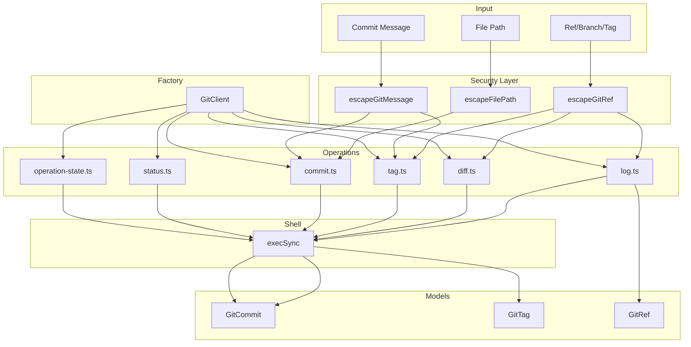

# git/

Git operations for versioning workflows with secure command execution.

## Overview

This module provides a complete interface for git operations needed in versioning workflows: querying commit history, managing tags, staging files, and inspecting repository status. All command arguments are validated character-by-character to prevent command injection attacks.



## Usage Examples

### Using GitClient (Recommended)

```typescript
import { createGitClient } from '@hyperfrontend/versioning'

const git = createGitClient({ cwd: '/path/to/repo' })

// Get recent commits
const commits = git.getCommitLog({ maxCount: 10 })

// Get commits since last release
const newCommits = git.getCommitsSince('v1.0.0')

// Get files changed between refs
const changedFiles = git.getChangedFilesBetween('origin/main', 'HEAD')
const changesWithStatus = git.getChangedFilesBetweenWithStatus('v1.0.0', 'v2.0.0')

// Get commit with file details
const commitWithFiles = git.getCommitWithFiles('abc1234')
if (commitWithFiles) {
  for (const file of commitWithFiles.files) {
    console.log(`${file.status}: ${file.path}`)
  }
}

// Check repository state
if (git.isClean()) {
  // Create a tag
  git.createTag('v1.1.0', { message: 'Release v1.1.0' })
}

// Check for in-progress operations before committing
const state = git.getOperationState()
if (state.inProgress) {
  console.warn(`Cannot proceed: git ${state.reason} in progress`)
}
```

### Standalone Operations

```typescript
import {
  getCommitsBetween,
  getTags,
  getLatestTag,
  commit,
  stage,
  getChangedFilesBetween,
  getChangedFilesBetweenWithStatus,
  getCommitWithFiles,
} from '@hyperfrontend/versioning'

// Get commits between tags
const commits = getCommitsBetween('v1.0.0', 'v2.0.0')
console.log(`${commits.length} commits between releases`)

// Get files changed since main
const changedFiles = getChangedFilesBetween('origin/main', 'HEAD')
console.log(`${changedFiles.length} files changed`)

// Get files with status information
const changes = getChangedFilesBetweenWithStatus('v1.0.0', 'v2.0.0')
const added = changes.filter((c) => c.status === 'added')
const deleted = changes.filter((c) => c.status === 'deleted')
console.log(`${added.length} added, ${deleted.length} deleted`)

// Get commit with file details for changelog attribution
const commitWithFiles = getCommitWithFiles('abc1234')
if (commitWithFiles) {
  console.log(`${commitWithFiles.subject} touched ${commitWithFiles.files.length} files`)
}

// Find latest version tag
const latest = getLatestTag({ pattern: '@scope/pkg@' })
console.log(`Latest: ${latest?.name}`)

// Stage and commit
stage(['package.json', 'CHANGELOG.md'])
commit('chore: release v1.1.0')
```

### Working with Tags

```typescript
import { extractVersionFromTag, extractPackageFromTag, buildTagName, getTagsForPackage } from '@hyperfrontend/versioning'

// Parse tag names
extractVersionFromTag('v1.2.3') // '1.2.3'
extractVersionFromTag('@scope/pkg@1.0.0') // '1.0.0'

extractPackageFromTag('@scope/pkg@1.0.0') // '@scope/pkg'
extractPackageFromTag('utils@1.2.3') // 'utils'

// Build tag names
buildTagName('@scope/pkg', '2.0.0') // '@scope/pkg@2.0.0'
buildTagName('lib', '1.0.0', '${package}-v${version}') // 'lib-v1.0.0'

// Get all tags for a package
const tags = getTagsForPackage('@hyperfrontend/versioning')
```

### Working with Commits

```typescript
import { createGitCommit, isMergeCommit, extractType, extractScope } from '@hyperfrontend/versioning'

// Parse conventional commits
const subject = 'feat(lib-versioning): add git operations'
extractType(subject) // 'feat'
extractScope(subject) // 'lib-versioning'

// Check commit characteristics
if (isMergeCommit(commit)) {
  console.log('Skipping merge commit')
}
```

## Security

All user input undergoes character-by-character validation before being used in shell commands:

- **No regex**: Eliminates ReDoS vulnerabilities
- **Allowlist validation**: Only permitted characters pass through
- **Length limits**: Prevents memory exhaustion attacks
- **No shell interpolation**: Arguments are validated, not escaped-and-quoted

### Allowed Characters by Function

| Function              | Allowed Characters                |
| --------------------- | --------------------------------- |
| `escapeGitRef`        | `a-z A-Z 0-9 / - _ . @ ~ ^ { }`   |
| `escapeGitPath`       | `a-z A-Z 0-9 / - _ . (space)`     |
| `escapeFilePath`      | `a-z A-Z 0-9 / - _ . (space)`     |
| `escapeAuthor`        | `a-z A-Z 0-9 - _ . @ < > (space)` |
| `escapeGitTagPattern` | `a-z A-Z 0-9 / - _ . @ *`         |

### Maximum Input Lengths

| Input Type     | Max Length |
| -------------- | ---------- |
| Git reference  | 256        |
| File path      | 4096       |
| Author string  | 512        |
| Commit message | 10000      |
| Tag pattern    | 256        |

## See Also

- [workspace/](../workspace/README.md): Uses git for version coordination
- [flow/](../flow/README.md): Orchestrates git commit/tag operations
- [commits/](../commits/README.md): Parses conventional commit messages
- [Main README](../../README.md): Package overview and quick start
- [ARCHITECTURE.md](../../ARCHITECTURE.md): Design principles and data flow
