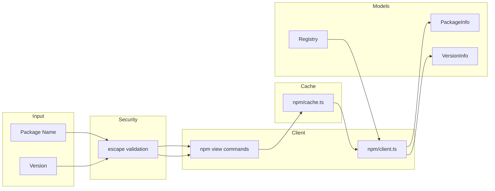

# registry/

Package registry abstractions for querying npm and other package registries.

## Overview

Unified interface for querying package registries with in-memory caching. Validates all user inputs before shell execution to prevent injection attacks.



## Usage Examples

### Querying npm Registry

```typescript
import { createNpmRegistry } from '@hyperfrontend/versioning'

const registry = createNpmRegistry()

// Get latest version
const latest = await registry.getLatestVersion('@hyperfrontend/utils')
console.log(latest) // '1.2.3'

// Check if version is published
const exists = await registry.isVersionPublished('lodash', '4.17.21')
console.log(exists) // true

// Get full package info
const info = await registry.getPackageInfo('typescript')
console.log(info?.versions) // ['4.0.0', '4.1.0', ...]
console.log(info?.latestVersion) // '5.4.0'
```

### Using the Factory

```typescript
import { createRegistry } from '@hyperfrontend/versioning'

// Create registry by type
const registry = createRegistry('npm', {
  timeout: 5000,
  cacheTtl: 30000,
})

const versions = await registry.listVersions('react')
```

### Custom Cache Configuration

```typescript
import { createNpmRegistry } from '@hyperfrontend/versioning'

// 5 minute cache, 30 second timeout
const registry = createNpmRegistry({
  cacheTtl: 300000,
  timeout: 30000,
})
```

### Version-Specific Information

```typescript
import { createNpmRegistry } from '@hyperfrontend/versioning'

const registry = createNpmRegistry()
const versionInfo = await registry.getVersionInfo('lodash', '4.17.21')

console.log(versionInfo?.publishedAt) // '2021-02-20T15:42:16.891Z'
console.log(versionInfo?.dependencies) // { ... }
console.log(versionInfo?.engines) // { node: '>=0.10.0' }
```

## Security

### Input Validation

All package names and versions are validated character-by-character before being used in shell commands:

- **Package names**: Only `a-z`, `A-Z`, `0-9`, `@`, `/`, `-`, `_`, `.` allowed
- **Versions**: Only `0-9`, `a-z`, `A-Z`, `.`, `-`, `+` allowed
- **Length limits**: Package names max 214 chars, versions max 256 chars

Invalid characters throw descriptive errors:

```typescript
import { escapePackageName } from '@hyperfrontend/versioning'

escapePackageName('lodash') // 'lodash'
escapePackageName('@scope/pkg') // '@scope/pkg'
escapePackageName('pkg; rm -rf /') // throws Error
```

### Caching

Responses are cached in memory to reduce registry load:

- Default TTL: 60 seconds
- Expired entries are cleaned up on access
- Cache can be configured per-client

## See Also

- [semver/](../semver/README.md): Version parsing for registry queries
- [flow/](../flow/README.md): Fetches registry versions in workflows
- [workspace/](../workspace/README.md): Package discovery and metadata
- [Main README](../../README.md): Package overview and quick start
- [ARCHITECTURE.md](../../ARCHITECTURE.md): Design principles and data flow
