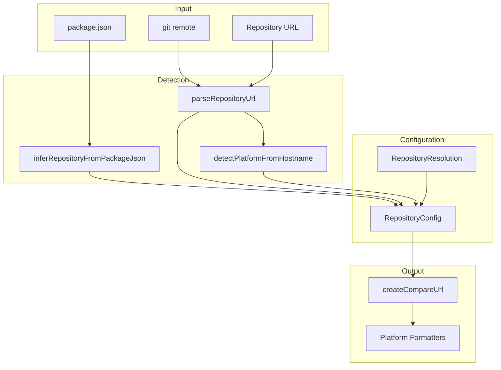

# repository/

Repository detection and compare URL generation for changelog entries.

## Overview

This module handles repository configuration for generating compare URLs in changelog entries. It supports automatic detection from package.json or git remotes, with built-in formatters for GitHub, GitLab, Bitbucket, and Azure DevOps.



## API

### Models

| Export                      | Description                                     | Implementation                                        |
| --------------------------- | ----------------------------------------------- | ----------------------------------------------------- |
| `RepositoryPlatform`        | Platform type: github, gitlab, bitbucket, etc.  | [platform.ts](./models/platform.ts)                   |
| `KnownPlatform`             | Platforms with built-in compare URL formatters  | [platform.ts](./models/platform.ts)                   |
| `RepositoryConfig`          | Repository configuration with platform and URL  | [repository-config.ts](./models/repository-config.ts) |
| `CompareUrlFormatter`       | Custom function to format compare URLs          | [repository-config.ts](./models/repository-config.ts) |
| `RepositoryResolution`      | Resolution config: disabled, inferred, explicit | [resolution.ts](./models/resolution.ts)               |
| `RepositoryResolutionMode`  | `'disabled' \| 'inferred' \| 'explicit'`        | [resolution.ts](./models/resolution.ts)               |
| `RepositoryInferenceSource` | `'package-json' \| 'git-remote'`                | [resolution.ts](./models/resolution.ts)               |

### Model Factories

| Function                     | Description                            | Implementation                                        |
| ---------------------------- | -------------------------------------- | ----------------------------------------------------- |
| `createRepositoryConfig()`   | Create a RepositoryConfig              | [repository-config.ts](./models/repository-config.ts) |
| `createDisabledResolution()` | Create disabled resolution (no URLs)   | [resolution.ts](./models/resolution.ts)               |
| `createExplicitResolution()` | Create explicit resolution with config | [resolution.ts](./models/resolution.ts)               |
| `createInferredResolution()` | Create inferred resolution             | [resolution.ts](./models/resolution.ts)               |

### Model Utilities

| Function                       | Description                              | Implementation                                        |
| ------------------------------ | ---------------------------------------- | ----------------------------------------------------- |
| `isKnownPlatform(platform)`    | Check if platform has built-in formatter | [platform.ts](./models/platform.ts)                   |
| `detectPlatformFromHostname()` | Detect platform from hostname            | [platform.ts](./models/platform.ts)                   |
| `isRepositoryConfig(value)`    | Type guard for RepositoryConfig          | [repository-config.ts](./models/repository-config.ts) |
| `isRepositoryResolution()`     | Type guard for RepositoryResolution      | [resolution.ts](./models/resolution.ts)               |

### Parse Functions

| Function                           | Description                              | Implementation                             |
| ---------------------------------- | ---------------------------------------- | ------------------------------------------ |
| `parseRepositoryUrl(url)`          | Parse git URL to platform and base URL   | [url.ts](./parse/url.ts)                   |
| `createRepositoryConfigFromUrl()`  | Create config directly from URL          | [url.ts](./parse/url.ts)                   |
| `inferRepositoryFromPackageJson()` | Infer config from package.json path      | [package-json.ts](./parse/package-json.ts) |
| `extractRepositoryUrl(pkg)`        | Extract URL from package.json repository | [package-json.ts](./parse/package-json.ts) |

### URL Functions

| Function             | Description                       | Implementation                 |
| -------------------- | --------------------------------- | ------------------------------ |
| `createCompareUrl()` | Generate compare URL for two tags | [compare.ts](./url/compare.ts) |

## Supported Platforms

| Platform     | Compare URL Format                                    |
| ------------ | ----------------------------------------------------- |
| GitHub       | `{baseUrl}/compare/{fromTag}...{toTag}`               |
| GitLab       | `{baseUrl}/-/compare/{fromTag}...{toTag}`             |
| Bitbucket    | `{baseUrl}/compare/{toTag}..{fromTag}` (reversed)     |
| Azure DevOps | `{baseUrl}?version=GT{toTag}&compareVersion=GT{from}` |

## Usage Examples

### Parse Repository URL

```typescript
import { parseRepositoryUrl } from '@hyperfrontend/versioning/repository/parse'

// HTTPS URLs
parseRepositoryUrl('https://github.com/owner/repo')
// → { platform: 'github', baseUrl: 'https://github.com/owner/repo' }

// SSH URLs
parseRepositoryUrl('git@github.com:owner/repo.git')
// → { platform: 'github', baseUrl: 'https://github.com/owner/repo' }

// GitLab with subgroups
parseRepositoryUrl('https://gitlab.com/group/subgroup/project')
// → { platform: 'gitlab', baseUrl: 'https://gitlab.com/group/subgroup/project' }
```

### Generate Compare URL

```typescript
import { createRepositoryConfig } from '@hyperfrontend/versioning/repository'
import { createCompareUrl } from '@hyperfrontend/versioning/repository/url'

const repo = createRepositoryConfig({
  platform: 'github',
  baseUrl: 'https://github.com/owner/repo',
})

createCompareUrl({ repository: repo, fromTag: 'v1.0.0', toTag: 'v1.1.0' })
// → 'https://github.com/owner/repo/compare/v1.0.0...v1.1.0'
```

### Custom Platform Formatter

```typescript
import { createRepositoryConfig } from '@hyperfrontend/versioning/repository'

const repo = createRepositoryConfig({
  platform: 'custom',
  baseUrl: 'https://my-git.internal/repo',
  formatCompareUrl: (from, to) => `https://my-git.internal/diff/${from}/${to}`,
})
```

### Flow Integration

The repository module integrates with the versioning flow via the `repository` config option:

```typescript
import { createVersionFlow } from '@hyperfrontend/versioning/flow'

// Auto-detect from package.json or git remote
const flow = createVersionFlow('conventional', {
  repository: 'inferred',
})

// Explicit configuration
const flow2 = createVersionFlow('conventional', {
  repository: {
    mode: 'explicit',
    repository: {
      platform: 'github',
      baseUrl: 'https://github.com/owner/repo',
    },
  },
})

// Disable compare URLs
const flow3 = createVersionFlow('conventional', {
  repository: 'disabled',
})
```

## Constants

| Export                    | Value                            | Description                     |
| ------------------------- | -------------------------------- | ------------------------------- |
| `PLATFORM_HOSTNAMES`      | Map of hostnames to platforms    | Known platform hostname mapping |
| `DEFAULT_INFERENCE_ORDER` | `['package-json', 'git-remote']` | Default inference source order  |
